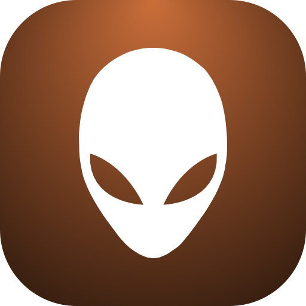
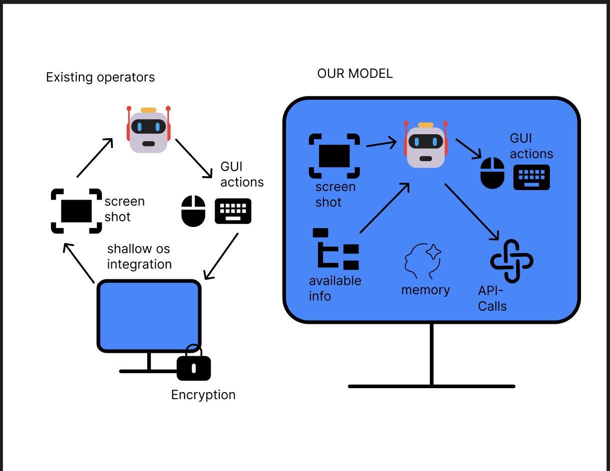
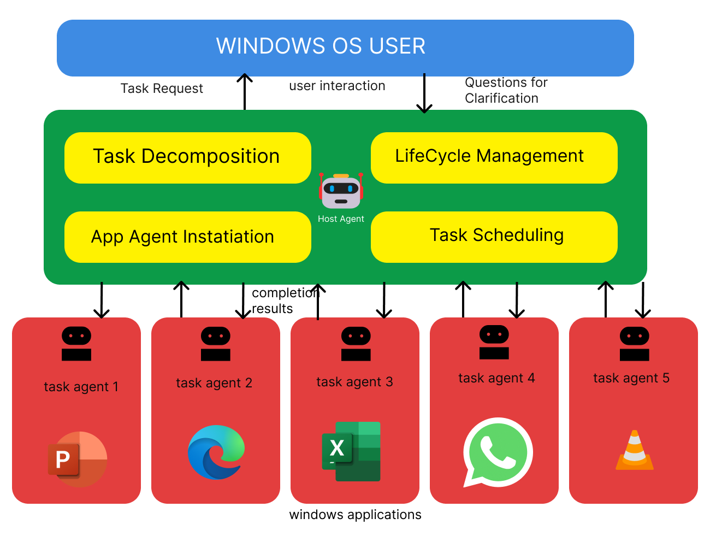

<!-- markdownlint-disable MD033 MD041 -->

<h1 align="center">
  <b>Alien²</b>  :&nbsp;The&nbsp;Desktop&nbsp;AgentOS
</h1>
<p align="center">
  <em>Turn natural‑language requests into automatic, reliable, multi‑application workflows on Windows, beyond UI-Focused.</em>
</p>


<div align="center">

[](https://arxiv.org/abs/2504.14603)&ensp;
&ensp;
[](https://opensource.org/licenses/MIT)&ensp;
[](https://microsoft.github.io/Alien/)&ensp;
[](https://www.youtube.com/watch?v=QT_OhygMVXU)&ensp;
<!-- [](https://twitter.com/intent/follow?screen_name=Alien_Agent) -->
<!-- &ensp; -->

</div>

<p align="center">
  <strong>⬆️ Looking for Alien³ (Multi-Device cluster)?</strong>
  <a href="../README.md">🌌 Back to Alien³ Main README</a>
</p>

</div>

<!-- **Alien** is a **UI-Focused** multi-agent framework to fulfill user requests on **Windows OS** by seamlessly navigating and operating within individual or spanning multiple applications. -->

<h1 align="center">
     
</h1>

---

## ✨ Key Capabilities
<div align="center">

| [Deep OS Integration](https://microsoft.github.io/Alien)  | Picture‑in‑Picture Desktop *(coming soon)* | [Hybrid GUI + API Actions](https://microsoft.github.io/Alien/automator/overview) |
|---------------------|-------------------------------------------|---------------------------|
| Combines Windows UIA, Win32 and WinCOM for first‑class control detection and native commands. | Automation runs in a sandboxed virtual desktop so you can keep using your main screen. | Chooses native APIs when available, falls back to clicks/keystrokes when not—fast *and* robust. |

| [Speculative Multi‑Action](https://microsoft.github.io/Alien/advanced_usage/multi_action) | [Continuous Knowledge Substrate](https://microsoft.github.io/Alien/advanced_usage/reinforce_appagent/overview/) | [UIA + Visual Control Detection](https://microsoft.github.io/Alien/advanced_usage/control_detection/hybrid_detection) |
|--------------------------|--------------------------------|--------------------------------|
| Bundles several predicted steps into one LLM call, validated live—up to **51 % fewer** queries. | Mixes docs, Bing search, user demos and execution traces via RAG for agents that learn over time. | Detects standard *and* custom controls with a hybrid UIA + vision pipeline. |

</div>

*See the [documentation](https://microsoft.github.io/Alien/) for full details.*

---

## 📢 News
- 📅 2025-04-19: Version **v2.0.0** Released! We’re excited to announce the release the **Alien²**! Alien² is a major upgrade to the original Alien, featuring with enhanced capabilities. It introduces the **AgentOS** concept, enabling seamless integration of multiple agents for complex tasks. Please check our [new technical report](https://arxiv.org/pdf/2504.14603) for more details.
- 📅 ...
- 📅 2024-02-14: Our [technical report](https://arxiv.org/abs/2402.07939) for Alien is online!
- 📅 2024-02-10: The first version of Alien is released on GitHub🎈.

---

## 🏗️ Architecture overview
<p align="center">
  
</p>


Alien² operates as a **Desktop AgentOS**, encompassing a multi-agent framework that includes:

1. **HostAgent** – Parses the natural‑language goal, launches the necessary applications, spins up / coordinates AppAgents, and steers a global finite‑state machine (FSM).  
2. **AppAgents** – One per application; each runs a ReAct loop with multimodal perception, hybrid control detection, retrieval‑augmented knowledge, and the **Puppeteer** executor that chooses between GUI actions and native APIs.  
3. **Knowledge Substrate** – Blends offline documentation, online search, demonstrations, and execution traces into a vector store that is retrieved on‑the‑fly at inference.  
4. **Speculative Executor** – Slashes LLM latency by predicting batches of likely actions and validating them against live UIA state in a single shot.  
5. **Picture‑in‑Picture Desktop** *(coming soon)* – Runs the agent in an isolated virtual desktop so your main workspace and input devices remain untouched.

For a deep dive see our [technical report](https://arxiv.org/pdf/2504.14603) or the [docs site](https://microsoft.github.io/Alien).

---

## 🌐 Media Coverage 

Alien sightings have garnered attention from various media outlets, including:
- [Microsoft's Alien abducts traditional user interfaces for a smarter Windows experience](https://the-decoder.com/microsofts-Alien-abducts-traditional-user-interfaces-for-a-smarter-windows-experience/)
- [🚀 Alien & GPT-4-V: Sit back and relax, mientras GPT lo hace todo🌌](https://www.linkedin.com/posts/gutierrezfrancois_ai-Alien-microsoft-activity-7176819900399652865-pLoo?utm_source=share&utm_medium=member_desktop)
- [The AI PC - The Future of Computers? - Microsoft Alien](https://www.youtube.com/watch?v=1k4LcffCq3E)
- [Microsoft発のオープンソース版「Alien」登場！　Windowsを自動操縦するAIエージェントを試す](https://internet.watch.impress.co.jp/docs/column/shimizu/1570581.html)
- ...

These sources provide insights into the evolving landscape of technology and the implications of Alien phenomena on various platforms.

---

## 🚀 Three‑minute Quickstart


### 🛠️ Step 1: Installation
Alien requires **Python >= 3.10** running on **Windows OS >= 10**. It can be installed by running the following command:
```powershell
# [optional to create conda environment]
# conda create -n Alien python=3.10
# conda activate Alien

# clone the repository
git clone https://github.com/microsoft/Alien.git
cd Alien
# install the requirements
pip install -r requirements.txt
# If you want to use the Qwen as your LLMs, uncomment the related libs.
```

### ⚙️ Step 2: Configure the LLMs

> **📢 New Configuration System (Recommended)**  
> Alien² now uses a **new modular config system** located in `config/Alien/` with auto-discovery and type validation. While the legacy `Alien/config/config.yaml` is still supported for backward compatibility, we strongly recommend migrating to the new system for better maintainability.

#### **Option 1: New Config System (Recommended)**

The new config files are organized in `config/Alien/` with separate YAML files for different components:

```powershell
# Copy template to create your agent config file (contains API keys)
copy config\Alien\agents.yaml.template config\Alien\agents.yaml
notepad config\Alien\agents.yaml   # Edit your LLM API credentials
```

**Directory Structure:**
```
config/Alien/
├── agents.yaml.template     # Template: Agent configs (HOST_AGENT, APP_AGENT) - COPY & EDIT THIS
├── agents.yaml              # Your agent configs with API keys (DO NOT commit to git)
├── rag.yaml                 # RAG and knowledge settings (default values, edit if needed)
├── system.yaml              # System settings (default values, edit if needed)
├── mcp.yaml                 # MCP integration settings (default values, edit if needed)
└── ...                      # Other modular configs with defaults
```

> 📝 **Note**: Only `agents.yaml` contains sensitive information (API keys). Other config files have default values and only need editing if you want to customize settings.

**Migration Benefits:**
- ✅ **Type Safety**: Automatic validation with Pydantic schemas
- ✅ **Auto-Discovery**: No manual config loading needed
- ✅ **Modular**: Separate concerns into individual files
- ✅ **IDE Support**: Better autocomplete and error detection

**Using the New Config in Code:**
```python
from config.config_loader import get_Alien_config

# Modern approach (type-safe, validated)
config = get_Alien_config()
api_type = config.get("HOST_AGENT", "API_TYPE")

# Legacy approach still works (for backward compatibility)
# from Alien.config import Config
# configs = Config.get_instance().config_data
```

#### **Option 2: Legacy Config (Backward Compatible)**

For existing users, the old config path still works:

```powershell
copy Alien\config\config.yaml.template Alien\config\config.yaml
notepad Alien\config\config.yaml   # paste your key & endpoint
```

> ⚠️ **Note**: If both old and new configs exist, the new config in `config/Alien/` takes precedence. A warning will be displayed during startup.

#### OpenAI Configuration

**New Config (`config/Alien/agents.yaml`):**
```yaml
HOST_AGENT:
  VISUAL_MODE: true
  API_TYPE: "openai"
  API_BASE: "https://api.openai.com/v1/chat/completions"
  API_KEY: "sk-YOUR_KEY_HERE"  # Replace with your actual API key
  API_VERSION: "2025-02-01-preview"
  API_MODEL: "gpt-4o"

APP_AGENT:
  VISUAL_MODE: true
  API_TYPE: "openai"
  API_BASE: "https://api.openai.com/v1/chat/completions"
  API_KEY: "sk-YOUR_KEY_HERE"  # Replace with your actual API key
  API_VERSION: "2025-02-01-preview"
  API_MODEL: "gpt-4o"
```

**Legacy Config (`Alien/config/config.yaml`):**
```yaml
VISUAL_MODE: True, # Whether to use the visual mode
API_TYPE: "openai" , # The API type, "openai" for the OpenAI API.  
API_BASE: "https://api.openai.com/v1/chat/completions", # The the OpenAI API endpoint.
API_KEY: "sk-",  # The OpenAI API key, begin with sk-
API_VERSION: "2024-02-15-preview", # "2024-02-15-preview" by default
API_MODEL: "gpt-4o",  # The only OpenAI model
```

#### Azure OpenAI (AOAI) Configuration

**New Config (`config/Alien/agents.yaml`):**
```yaml
HOST_AGENT:
  VISUAL_MODE: true
  API_TYPE: "aoai"
  API_BASE: "https://YOUR_RESOURCE.openai.azure.com"
  API_KEY: "YOUR_AOAI_KEY"
  API_VERSION: "2024-02-15-preview"
  API_MODEL: "gpt-4o"
  API_DEPLOYMENT_ID: "YOUR_DEPLOYMENT_ID"

APP_AGENT:
  VISUAL_MODE: true
  API_TYPE: "aoai"
  API_BASE: "https://YOUR_RESOURCE.openai.azure.com"
  API_KEY: "YOUR_AOAI_KEY"
  API_VERSION: "2024-02-15-preview"
  API_MODEL: "gpt-4o"
  API_DEPLOYMENT_ID: "YOUR_DEPLOYMENT_ID"
```

**Legacy Config (`Alien/config/config.yaml`):**
```yaml
VISUAL_MODE: True, # Whether to use the visual mode
API_TYPE: "aoai" , # The API type, "aoai" for the Azure OpenAI.  
API_BASE: "YOUR_ENDPOINT", #  The AOAI API address. Format: https://{your-resource-name}.openai.azure.com
API_KEY: "YOUR_KEY",  # The aoai API key
API_VERSION: "2024-02-15-preview", # "2024-02-15-preview" by default
API_MODEL: "gpt-4o",  # The only OpenAI model
API_DEPLOYMENT_ID: "YOUR_AOAI_DEPLOYMENT", # The deployment id for the AOAI API
```

> Need Qwen, Gemini, non‑visual GPT‑4, or even **OpenAI CUA Operator** as a AppAgent? See the [model guide](https://microsoft.github.io/Alien/supported_models/overview/).

### 📔 Step 3: Additional Setting for RAG (optional).

If you want to enhance Alien's ability with external knowledge, you can optionally configure it with an external database for retrieval augmented generation (RAG).

**For New Config System**: Edit `config/Alien/rag.yaml` (already exists with default values)  
**For Legacy Config**: Edit `Alien/config/config.yaml`

We provide the following options for RAG to enhance Alien's capabilities:
- [Offline Help Document](https://microsoft.github.io/Alien/advanced_usage/reinforce_appagent/learning_from_help_document/) Enable Alien to retrieve information from offline help documents.
- [Online Bing Search Engine](https://microsoft.github.io/Alien/advanced_usage/reinforce_appagent/learning_from_bing_search/): Enhance Alien's capabilities by utilizing the most up-to-date online search results.
- [Self-Experience](https://microsoft.github.io/Alien/advanced_usage/reinforce_appagent/experience_learning/): Save task completion trajectories into Alien's memory for future reference.
- [User-Demonstration](https://microsoft.github.io/Alien/advanced_usage/reinforce_appagent/learning_from_demonstration/): Boost Alien's capabilities through user demonstration.

**Example RAG config (`config/Alien/rag.yaml`):**
```yaml
# Enable Bing search
RAG_ONLINE_SEARCH: True
BING_API_KEY: "YOUR_BING_API_KEY"  # Get from https://www.microsoft.com/en-us/bing/apis

# Enable experience learning
RAG_EXPERIENCE: True
```

Consult their respective documentation for more information on how to configure these settings.


### 🎉 Step 4: Start Alien

#### ⌨️ You can execute the following on your Windows command Line (CLI):

```powershell
# assume you are in the cloned Alien folder
python -m Alien --task <your_task_name>
```

This will start the Alien process and you can interact with it through the command line interface. 
If everything goes well, you will see the following message:

```powershell
Welcome to use Alien🛸, A UI-focused Agent for Windows OS Interaction. 
 _   _  _____   ___
| | | ||  ___| / _ \
| | | || |_   | | | |
| |_| ||  _|  | |_| |
 \___/ |_|     \___/
Please enter your request to be completed🛸:
```

Alternatively, you can also directly invoke Alien with a specific task and request by using the following command:

```powershell
python -m Alien --task <your_task_name> -r "<your_request>"
```


###  Step 5 🎥: Execution Logs 

You can find the screenshots taken and request & response logs in the following folder:
```
./Alien/logs/<your_task_name>/
```
You may use them to debug, replay, or analyze the agent output.


## ❓Get help 
* Please first check our our documentation [here](https://microsoft.github.io/Alien/).
* ❔GitHub Issues (prefered)
* For other communications, please contact [Alien-agent@microsoft.com](mailto:Alien-agent@microsoft.com).

---

## 🔄 Migrating to the New Config System

If you're upgrading from an older version of Alien that used `Alien/config/config.yaml`, we provide an **automated conversion tool** that intelligently transforms your legacy monolithic config into the new modular structure.

### ⚡ Automatic Conversion (Recommended)

**One-command conversion with format transformation:**

```powershell
# Interactive conversion with automatic backup
python -m Alien.tools.convert_config

# Preview changes first (dry run)
python -m Alien.tools.convert_config --dry-run

# Force conversion without confirmation
python -m Alien.tools.convert_config --force
```

**What the conversion tool does:**
- ✅ **Splits** monolithic `config.yaml` into modular files (agents.yaml, rag.yaml, system.yaml)
- ✅ **Converts** flow-style YAML (with braces `{}`) to standard block-style YAML
- ✅ **Maps** legacy file names (e.g., `agent_mcp.yaml` → `mcp.yaml`, `config_prices.yaml` → `prices.yaml`)
- ✅ **Preserves** all configuration values (verified by unit tests)
- ✅ **Creates** timestamped backup before conversion
- ✅ **Validates** output files are parseable YAML
- ✅ **Provides** rollback instructions if needed

**Example output:**
```
🔧 Config Conversion

Converting configurations...
Processing: Alien\config\config.yaml
Processing: Alien\config\agent_mcp.yaml
Processing: Alien\config\config_prices.yaml
Skipping: Alien\config\config_dev.yaml (environment-specific, use --env=dev)

✓ Wrote: config\Alien\agents.yaml (6 keys)
✓ Wrote: config\Alien\rag.yaml (11 keys)
✓ Wrote: config\Alien\system.yaml (6 keys)
✓ Wrote: config\Alien\mcp.yaml (5 keys)
✓ Wrote: config\Alien\prices.yaml (1 keys)

✨ Conversion Complete!
```

**Conversion Details:**

| Legacy File | → | New File(s) | Transformation |
|-------------|---|-------------|----------------|
| `config.yaml` (monolithic) | → | `agents.yaml` + `rag.yaml` + `system.yaml` | Smart field splitting |
| `agent_mcp.yaml` | → | `mcp.yaml` | Rename + format conversion |
| `config_prices.yaml` | → | `prices.yaml` | Rename + format conversion |
| `config_dev.yaml` | → | (kept separate, use `--env=dev`) | Environment-specific |

**Format Conversion:**
```yaml
# Old format (flow-style with braces)
HOST_AGENT: { API_TYPE: "azure_ad", API_KEY: "...", VISUAL_MODE: True }

# New format (block-style with indentation)
HOST_AGENT:
  API_TYPE: azure_ad
  API_KEY: YOUR_KEY
  VISUAL_MODE: true
```

### 🛠️ Manual Migration Steps

If you prefer manual migration or want to understand what the conversion tool does:

1. **Copy the template file** to create your agent config:
   ```powershell
   copy config\Alien\agents.yaml.template config\Alien\agents.yaml
   ```

2. **Transfer your API credentials** from old config to new:
   
   **From** `Alien/config/config.yaml`:
   ```yaml
   HOST_AGENT: { API_TYPE: "azure_ad", API_KEY: "YOUR_KEY", ... }
   ```
   
   **To** `config/Alien/agents.yaml`:
   ```yaml
   HOST_AGENT:
     API_TYPE: azure_ad
     API_KEY: YOUR_KEY
     # ... copy other fields
   ```

3. **Other configs use defaults** - Files like `rag.yaml`, `system.yaml`, `mcp.yaml` already exist with sensible defaults. Only edit them if you want to customize settings (e.g., enable Bing search, change RAG settings).

4. **Verify the conversion** works:
   ```powershell
   # Test that new config loads correctly
   python -c "from config.config_loader import get_Alien_config; print('Config loaded:', len(get_Alien_config()), 'keys')"
   ```

### ⚙️ Backward Compatibility

- ✅ Old config path `Alien/config/config.yaml` **still works**
- ✅ Old code using `Config.get_instance().config_data` **still works**
- ✅ Gradual migration supported - both systems can coexist temporarily
- ⚠️ **Recommended**: After conversion, keep legacy config as backup until verified

### 📚 Detailed Migration Guide

For complete migration details including code examples, testing procedures, rollback instructions, and configuration file mapping, see:

**📖 [Complete Migration Documentation](https://microsoft.github.io/Alien/configuration/system/migration/)**

---

## 📊 Evaluation

Alien² is rigorously benchmarked on two publicly‑available live‑task suites:

| Benchmark | Scope | Documents |
|-----------|-------|-------|
| [**Windows Agent Arena (WAA)**](https://github.com/nice-mee/WindowsAgentArena) | 154 real Windows tasks across 15 applications (Office, Edge, File Explorer, VS Code, …) | <https://microsoft.github.io/Alien/benchmark/windows_agent_arena/> |
| [**OSWorld (Windows)**](https://github.com/nice-mee/WindowsAgentArena/tree/2020-qqtcg/osworld) | 49 cross‑application tasks that mix Office 365, browser and system utilities | <https://microsoft.github.io/Alien/benchmark/osworld> |

The integration of these benchmarks into Alien² is in separate repositories. Please follow the above documents for more details.

---


## 📚 Citation

If you build on this work, please cite our the AgentOS framework:

**Alien² – The Desktop AgentOS (2025)**  
<https://arxiv.org/abs/2504.14603>
```bibtex
@article{zhang2025Alien-Unis,
  title   = {{Alien-Unis: The Desktop AgentOS}},
  author  = {Zhang, Chaoyun and Huang, He and Ni, Chiming and Mu, Jian and Qin, Si and He, Shilin and Wang, Lu and Yang, Fangkai and Zhao, Pu and Du, Chao and Li, Liqun and Kang, Yu and Jiang, Zhao and Zheng, Suzhen and Wang, Rujia and Qian, Jiaxu and Ma, Minghua and Lou, Jian-Guang and Lin, Qingwei and Rajmohan, Saravan and Zhang, Dongmei},
  journal = {arXiv preprint arXiv:2504.14603},
  year    = {2025}
}
```

**Alien – A UI‑Focused Agent for Windows OS Interaction (2024)**  
<https://arxiv.org/abs/2402.07939>
```bibtex
@article{zhang2024Alien,
  title   = {{Alien: A UI-Focused Agent for Windows OS Interaction}},
  author  = {Zhang, Chaoyun and Li, Liqun and He, Shilin and Zhang, Xu and Qiao, Bo and Qin, Si and Ma, Minghua and Kang, Yu and Lin, Qingwei and Rajmohan, Saravan and Zhang, Dongmei and Zhang, Qi},
  journal = {arXiv preprint arXiv:2402.07939},
  year    = {2024}
}
```


---

## 📝 Roadmap

The Alien² team is actively working on the following features and improvements:

- [ ] **Picture‑in‑Picture Mode** – In development  
- [x] **AgentOS‑as‑a‑Service** – Completed and will be available in the next release  
- [ ] **Auto‑Debugging Toolkit** – In development  
- [x] **Integration with MCP** – Completed and integrated into the framework


---

## 🎨 Related Projects
- **TaskWeaver** — a code‑first LLM agent for data analytics: <https://github.com/microsoft/TaskWeaver>  
- **LLM‑Brained GUI Agents: A Survey**: <https://arxiv.org/abs/2411.18279> • [GitHub](https://github.com/vyokky/LLM-Brained-GUI-Agents-Survey) • [Interactive site](https://vyokky.github.io/LLM-Brained-GUI-Agents-Survey/)

---


## ⚠️ Disclaimer
By choosing to run the provided code, you acknowledge and agree to the following terms and conditions regarding the functionality and data handling practices in [DISCLAIMER.md](../DISCLAIMER.md)


##  Trademarks

This project may contain trademarks or logos for projects, products, or services. Authorized use of Microsoft 
trademarks or logos is subject to and must follow 
[Microsoft's Trademark & Brand Guidelines](https://www.microsoft.com/en-us/legal/intellectualproperty/trademarks/usage/general).
Use of Microsoft trademarks or logos in modified versions of this project must not cause confusion or imply Microsoft sponsorship.
Any use of third-party trademarks or logos are subject to those third-party's policies.


---

## ⚖️ License
This repository is released under the [MIT License](LICENSE) (SPDX‑Identifier: MIT).  
See [DISCLAIMER.md](DISCLAIMER.md) for privacy & safety notices.

---

<p align="center"><sub>© Microsoft 2025 • Alien² is an open‑source project, not an official Windows feature.</sub></p>

