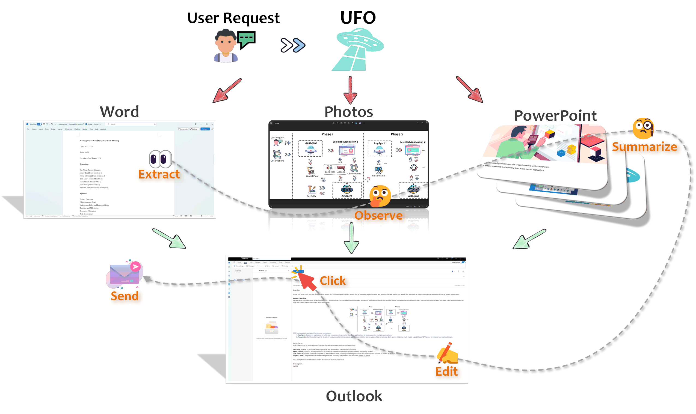
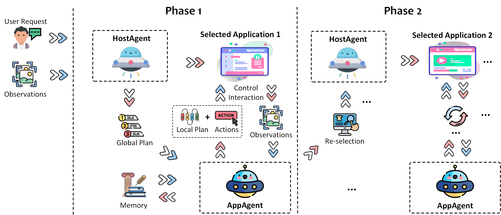

<h1 align="center">
    <b>Alien</b> : A <b>U</b>I-<b>Fo</b>cused Agent for Windows OS Interaction
</h1>


**Alien** is a **UI-Focused** multi-agent framework to fulfill user requests on **Windows OS** by seamlessly navigating and operating within individual or spanning multiple applications.

<h1 align="center">
     
</h1>


## 🕌 Framework
<b>Alien</b>  operates as a multi-agent framework, encompassing:
- <b>HostAgent 🤖</b>, tasked with choosing an application for fulfilling user requests. This agent may also switch to a different application when a request spans multiple applications, and the task is partially completed in the preceding application. 
- <b>AppAgent 👾</b>, responsible for iteratively executing actions on the selected applications until the task is successfully concluded within a specific application. 
- <b>Application Automator 🎮</b>, is tasked with translating actions from HostAgent and AppAgent into interactions with the application and through UI controls, native APIs or AI tools. Check out more details [here](https://github.com/DEVELOPER-DEEVEN/alien-project/automator/overview/).

Both agents leverage the multi-modal capabilities of GPT-4V(o) to comprehend the application UI and fulfill the user's request. For more details, please consult our technical report and documentation.
<h1 align="center">
     
</h1>


#


## 💥 Highlights

- [x] **First Windows Agent** - Alien is the pioneering agent framework capable of translating user requests in natural language into actionable operations on Windows OS.
- [x] **Agent as an Expert** - Alien is enhanced by Retrieval Augmented Generation (RAG) from heterogeneous sources, including offline help documents, online search engines, and human demonstrations, making the agent an application "expert".
- [x] **Rich Skill Set** - Alien is equipped with a diverse set of skills to support comprehensive automation, such as mouse, keyboard, native API, and "Copilot".
- [x] **Interactive Mode** - Alien facilitates multiple sub-requests from users within the same session, enabling the seamless completion of complex tasks.
- [x] **Agent Customization** - Alien allows users to customize their own agents by providing additional information. The agent will proactively query users for details when necessary to better tailor its behavior.
- [x] **Scalable AppAgent Creation** - Alien offers extensibility, allowing users and app developers to create their own AppAgents in an easy and scalable way.


## ✨ Getting Started


### 🛠️ Step 1: Installation
Alien requires **Python >= 3.10** running on **Windows OS >= 10**. It can be installed by running the following command:
```bash
# [optional to create conda environment]
# conda create -n Alien python=3.10
# conda activate Alien

# clone the repository
git clone https://github.com/DEVELOPER-DEEVEN/alien-project
cd Alien
# install the requirements
pip install -r requirements.txt
# If you want to use the Qwen as your LLMs, uncomment the related libs.
```

### ⚙️ Step 2: Configure the LLMs
Before running Alien, you need to provide your LLM configurations **individually for HostAgent and AppAgent**. You can create your own config file `Alien/config/config.yaml`, by copying the `Alien/config/config.yaml.template` and editing config for **HOST_AGENT** and **APP_AGENT** as follows: 


#### OpenAI
```bash
VISUAL_MODE: True, # Whether to use the visual mode
API_TYPE: "openai" , # The API type, "openai" for the OpenAI API.  
API_BASE: "https://api.openai.com/v1/chat/completions", # The the OpenAI API endpoint.
API_KEY: "sk-",  # The OpenAI API key, begin with sk-
API_VERSION: "2024-02-15-preview", # "2024-02-15-preview" by default
API_MODEL: "gpt-4-vision-preview",  # The only OpenAI model
```

#### Azure OpenAI (AOAI)
```bash
VISUAL_MODE: True, # Whether to use the visual mode
API_TYPE: "aoai" , # The API type, "aoai" for the Azure OpenAI.  
API_BASE: "YOUR_ENDPOINT", #  The AOAI API address. Format: https://{your-resource-name}.openai.azure.com
API_KEY: "YOUR_KEY",  # The aoai API key
API_VERSION: "2024-02-15-preview", # "2024-02-15-preview" by default
API_MODEL: "gpt-4-vision-preview",  # The only OpenAI model
API_DEPLOYMENT_ID: "YOUR_AOAI_DEPLOYMENT", # The deployment id for the AOAI API
```
You can also non-visial model (e.g., GPT-4) for each agent, by setting `VISUAL_MODE: False` and proper `API_MODEL` (openai) and `API_DEPLOYMENT_ID` (aoai). You can also optionally set an backup LLM engine in the field of `BACKUP_AGENT` if the above engines failed during the inference.


####  Non-Visual Model Configuration
You can utilize non-visual models (e.g., GPT-4) for each agent by configuring the following settings in the `config.yaml` file:

- ```VISUAL_MODE: False # To enable non-visual mode.```
- Specify the appropriate `API_MODEL` (OpenAI) and `API_DEPLOYMENT_ID` (AOAI) for each agent.

Optionally, you can set a backup language model (LLM) engine in the `BACKUP_AGENT` field to handle cases where the primary engines fail during inference. Ensure you configure these settings accurately to leverage non-visual models effectively.

#### NOTE 💡 
Alien also supports other LLMs and advanced configurations, such as customize your own model, please check the [documents](https://github.com/DEVELOPER-DEEVEN/alien-project/supported_models/overview/) for more details. Because of the limitations of model input, a lite version of the prompt is provided to allow users to experience it, which is configured in `config_dev.yaml`.

### 📔 Step 3: Additional Setting for RAG (optional).
If you want to enhance Alien's ability with external knowledge, you can optionally configure it with an external database for retrieval augmented generation (RAG) in the `Alien/config/config.yaml` file. 

We provide the following options for RAG to enhance Alien's capabilities:
- [Offline Help Document](https://github.com/DEVELOPER-DEEVEN/alien-project/advanced_usage/reinforce_appagent/learning_from_help_document/) Enable Alien to retrieve information from offline help documents.
- [Online Bing Search Engine](https://github.com/DEVELOPER-DEEVEN/alien-project/advanced_usage/reinforce_appagent/learning_from_bing_search/): Enhance Alien's capabilities by utilizing the most up-to-date online search results.
- [Self-Experience](https://github.com/DEVELOPER-DEEVEN/alien-project/advanced_usage/reinforce_appagent/experience_learning/): Save task completion trajectories into Alien's memory for future reference.
- [User-Demonstration](https://github.com/DEVELOPER-DEEVEN/alien-project/advanced_usage/reinforce_appagent/learning_from_demonstration/): Boost Alien's capabilities through user demonstration.

Consult their respective documentation for more information on how to configure these settings.

<!-- #### RAG from Offline Help Document
Before enabling this function, you need to create an offline indexer for your help document. Please refer to the [README](./learner/README.md) to learn how to create an offline vectored database for retrieval. You can enable this function by setting the following configuration:
```bash
## RAG Configuration for the offline docs
RAG_OFFLINE_DOCS: True  # Whether to use the offline RAG.
RAG_OFFLINE_DOCS_RETRIEVED_TOPK: 1  # The topk for the offline retrieved documents
```
Adjust `RAG_OFFLINE_DOCS_RETRIEVED_TOPK` to optimize performance.


####  RAG from Online Bing Search Engine
Enhance Alien's ability by utilizing the most up-to-date online search results! To use this function, you need to obtain a Bing search API key. Activate this feature by setting the following configuration:
```bash
## RAG Configuration for the Bing search
BING_API_KEY: "YOUR_BING_SEARCH_API_KEY"  # The Bing search API key
RAG_ONLINE_SEARCH: True  # Whether to use the online search for the RAG.
RAG_ONLINE_SEARCH_TOPK: 5  # The topk for the online search
RAG_ONLINE_RETRIEVED_TOPK: 1 # The topk for the online retrieved documents
```
Adjust `RAG_ONLINE_SEARCH_TOPK` and `RAG_ONLINE_RETRIEVED_TOPK` to get better performance.


#### RAG from Self-Demonstration
Save task completion trajectories into Alien's memory for future reference. This can improve its future success rates based on its previous experiences!

After completing a task, you'll see the following message:
```
Would you like to save the current conversation flow for future reference by the agent?
[Y] for yes, any other key for no.
```
Press `Y` to save it into its memory and enable memory retrieval via the following configuration:
```bash
## RAG Configuration for experience
RAG_EXPERIENCE: True  # Whether to use the RAG from its self-experience.
RAG_EXPERIENCE_RETRIEVED_TOPK: 5  # The topk for the offline retrieved documents
```

#### RAG from User-Demonstration
Boost Alien's capabilities through user demonstration! Utilize Microsoft Steps Recorder to record step-by-step processes for achieving specific tasks. With a simple command processed by the record_processor (refer to the [README](./record_processor/README.md)), Alien can store these trajectories in its memory for future reference, enhancing its learning from user interactions.

You can enable this function by setting the following configuration:
```bash
## RAG Configuration for demonstration
RAG_DEMONSTRATION: True  # Whether to use the RAG from its user demonstration.
RAG_DEMONSTRATION_RETRIEVED_TOPK: 5  # The topk for the demonstration examples.
``` -->


### 🎉 Step 4: Start Alien

#### ⌨️ You can execute the following on your Windows command Line (CLI):

```bash
# assume you are in the cloned Alien folder
python -m Alien --task <your_task_name>
```

This will start the Alien process and you can interact with it through the command line interface. 
If everything goes well, you will see the following message:

```bash
Welcome to use Alien🛸, A UI-focused Agent for Windows OS Interaction. 
ALIEN ACTIVE
Please enter your request to be completed🛸:
```
#### ⚠️Reminder:  ####
- Before Alien executing your request, please make sure the targeted applications are active on the system.
- The GPT-V accepts screenshots of your desktop and application GUI as input. Please ensure that no sensitive or confidential information is visible or captured during the execution process. For further information, refer to [DISCLAIMER.md](./DISCLAIMER.md).


###  Step 5 🎥: Execution Logs 

You can find the screenshots taken and request & response logs in the following folder:
```
./Alien/logs/<your_task_name>/
```
You may use them to debug, replay, or analyze the agent output.


## ❓Get help 
* Please first check our our documentation [here](https://github.com/DEVELOPER-DEEVEN/alien-project/).
* ❔GitHub Issues (prefered)
* For other communications, please contact [Alien-agent@microsoft.com](mailto:Alien-agent@microsoft.com).
---


<!-- ## 🎬 Demo Examples

We present two demo videos that complete user request on Windows OS using Alien. For more case study, please consult our [technical report](https://arxiv.org/abs/2402.07939).

#### 1️⃣🗑️ Example 1: Deleting all notes on a PowerPoint presentation.
In this example, we will demonstrate how to efficiently use Alien to delete all notes on a PowerPoint presentation with just a few simple steps. Explore this functionality to enhance your productivity and work smarter, not harder!


https://github.com/DEVELOPER-DEEVEN/Alien/assets/11352048/cf60c643-04f7-4180-9a55-5fb240627834


#### 2️⃣📧 Example 2: Composing an email using text from multiple sources.
In this example, we will demonstrate how to utilize Alien to extract text from Word documents, describe an image, compose an email, and send it seamlessly. Enjoy the versatility and efficiency of cross-application experiences with Alien!


https://github.com/DEVELOPER-DEEVEN/Alien/assets/11352048/aa41ad47-fae7-4334-8e0b-ba71c4fc32e0 -->


## 📊 Evaluation

Please consult the [WindowsBench](https://arxiv.org/pdf/2402.07939.pdf) provided in Section A of the Appendix within our technical report. Here are some tips (and requirements) to aid in completing your request:

- Prior to Alien execution of your request, ensure that the targeted application is active (though it may be minimized).
- Please note that the output of GPT-V may not consistently align with the same request. If unsuccessful with your initial attempt, consider trying again.


## 📝 Todo List
- [x] RAG enhanced Alien.
- [x] Support more control using Win32 API.
- [x] [Documentation](https://github.com/DEVELOPER-DEEVEN/alien-project/).
- [ ] Support local host GUI interaction model.
- [ ] Chatbox GUI for Alien.


## ⚠️ Disclaimer
By choosing to run the provided code, you acknowledge and agree to the following terms and conditions regarding the functionality and data handling practices in [DISCLAIMER.md](./DISCLAIMER.md)


##  Trademarks

This project may contain trademarks or logos for projects, products, or services. Authorized use of Microsoft 
trademarks or logos is subject to and must follow 
[Microsoft's Trademark & Brand Guidelines](https://www.microsoft.com/en-us/legal/intellectualproperty/trademarks/usage/general).
Use of Microsoft trademarks or logos in modified versions of this project must not cause confusion or imply Microsoft sponsorship.
Any use of third-party trademarks or logos are subject to those third-party's policies.
