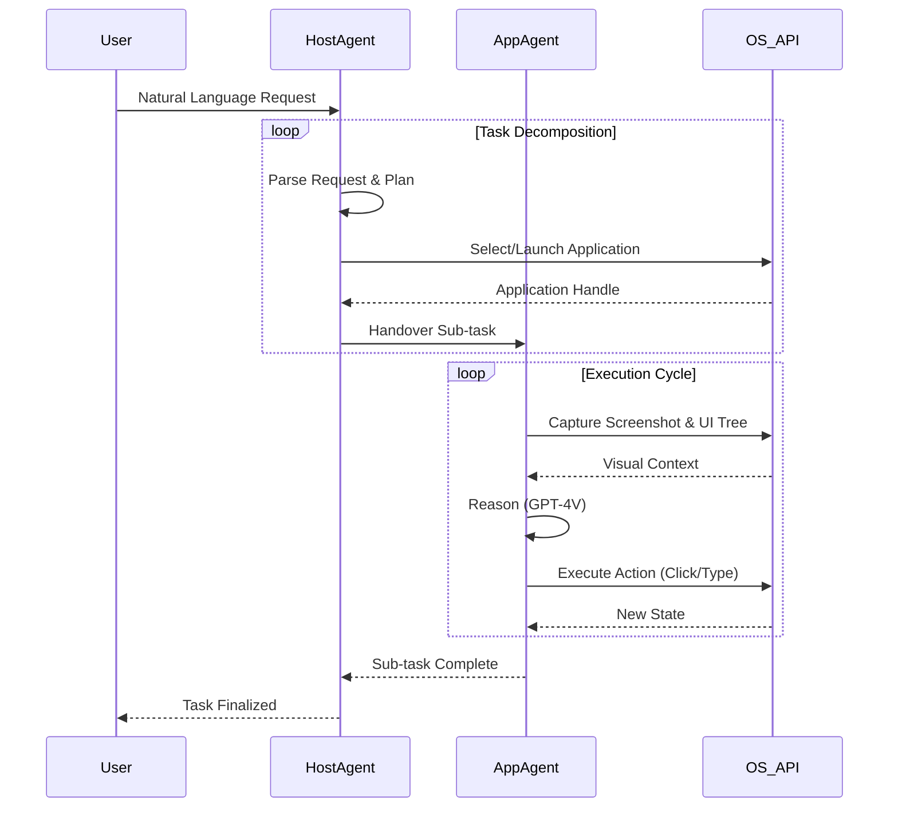

# ALIEN2: Advanced Large Intelligent Environment Network
## A Framework for Autonomous Desktop Automation

[](https://opensource.org/licenses/MIT)
[](https://www.python.org/downloads/)
[]()
[]()

**Architect & Lead Developer: Deeven Seru**

---

## 📑 Table of Contents

1.  [Executive Summary](#executive-summary)
2.  [System Architecture](#system-architecture)
    *   [Dual-Agent Topology](#dual-agent-topology)
    *   [Control Interaction Loop](#control-interaction-loop)
3.  [Core Capabilities](#core-capabilities)
4.  [Technical Specifications](#technical-specifications)
5.  [Installation & Deployment](#installation--deployment)
6.  [Configuration Framework](#configuration-framework)
7.  [Usage Guidelines](#usage-guidelines)
8.  [Roadmap](#roadmap)
9.  [License & Attribution](#license--attribution)

---

## 1. Executive Summary

ALIEN2 represents a paradigm shift in Human-Computer Interaction (HCI) by introducing a **Large Action Model (LAM)** framework capable of autonomous desktop navigation. Unlike traditional Robotic Process Automation (RPA) which relies on brittle, pre-programmed scripts, ALIEN2 leverages the reasoning capabilities of Multimodal Large Language Models (MLLMs) to dynamically perceive, plan, and execute tasks within the Windows Operating System.

The project addresses the fundamental challenge of grounding natural language intent into low-level UI control signals. By synthesizing visual perception (GPT-4V) with rigorous state-machine logic, ALIEN2 achieves high-fidelity automation across heterogeneous applications without requiring specialized APIs.

---

## 2. System Architecture

The ALIEN2 framework is built upon a **Dual-Agent Architecture**, decoupling high-level task orchestration from application-specific execution. This separation of concerns ensures scalability and robustness.

### Dual-Agent Topology

The system comprises two specialized agent types:

1.  **HostAgent (The Orchestrator)**:
    *   **Role**: Global task planner and application lifecycle manager.
    *   **Responsibility**: Decomposes the user's root request into a Directed Acyclic Graph (DAG) of sub-tasks. It determines *which* application is required to fulfill a sub-task and handles app switching/launching.
    *   **Scope**: System-wide (Desktop, Taskbar, Start Menu).

2.  **AppAgent (The Operator)**:
    *   **Role**: Local execution unit.
    *   **Responsibility**: Executes atomic interactions within a specific application window. It utilizes a Retrieve-Augmented Generation (RAG) substrate to recall app-specific usage patterns.
    *   **Scope**: Application-specific (e.g., Microsoft Word, Google Chrome).

### Control Interaction Loop

The execution flow follows a rigorous **Observation-Thought-Action (OTA)** cycle:



---

## 3. Core Capabilities

### 🧠 Visual Reasoning Engine
ALIEN2 does not rely solely on DOM-like accessibility trees (UIA). It employs a vision-first approach, taking screenshots of the active window and annotating them with set-of-marks (SoM) coordinates. This allows the agent to interact with custom UI controls (e.g., canvas elements, remote desktops) that are invisible to standard inspection tools.

### 🛡️ Interactive Safety
To mitigate the risks associated with autonomous control, ALIEN2 implements a "Human-in-the-Loop" safety protocol.
*   **Confirmation Gates**: Critical actions (delete, send, publish) trigger a user confirmation prompt.
*   **Safe Mode**: A configuration toggle that forces approval for *every* write operation.

### 📚 Continuous Learning (RAG)
The system improves over time through two mechanisms:
1.  **Offline Knowledge**: Ingestion of help documentation into a vector database.
2.  **Online Experience**: Recording execution traces. Successful strategies are indexed and retrieved when similar tasks are encountered, reducing latency and cost.

---

## 4. Technical Specifications

| Component | Specification |
| :--- | :--- |
| **Operating System** | Windows 10 (Build 19041+) / Windows 11 |
| **Language** | Python 3.10+ |
| **Inference Backend** | OpenAI (GPT-4o, GPT-4V), Azure OpenAI, Gemini Pro 1.5 |
| **Context Window** | Dynamic (Token budget managed via sliding window) |
| **UI Automation** | `pywinauto` + `UIAutomationCore.dll` |
| **Vector DB** | FAISS / ChromaDB (for RAG) |

---

## 5. Installation & Deployment

### Prerequisites
*   **Git**: Version Control.
*   **Python**: Interpreter (ensure added to PATH).
*   **API Credentials**: Valid keys for your chosen LLM provider.

### Setup Procedure

**1. Clone Repository**
```bash
git clone https://github.com/deevenseru/alien-project.git
cd alien-project
```

**2. Virtual Environment (Recommended)**
```bash
python -m venv .venv
# Activate:
# Windows: .venv\Scripts\activate
# Mac/Linux: source .venv/bin/activate
```

**3. Dependency Installation**
```bash
pip install -r requirements.txt
```

---

## 6. Configuration Framework

Configuration is managed via a hierarchical YAML system located in `alien/config/`.

| File | Purpose |
| :--- | :--- |
| `config.yaml` | System-wide settings (paths, timeouts, logging). |
| `agents.yaml` | Agent-specific logic (LLM parameters, prompt paths). |

**Quick Start Configuration:**
1.  Navigate to `alien/config/`.
2.  Duplicate `agents.yaml.template` to `agents.yaml`.
3.  Populate your credentials:

```yaml
HOST_AGENT:
  API_TYPE: "openai"
  API_KEY: "sk-..."
  API_MODEL: "gpt-4o"

APP_AGENT:
  API_TYPE: "openai"
  API_KEY: "sk-..."
  API_MODEL: "gpt-4-turbo"
```

---

## 7. Usage Guidelines

### Command Line Interface (CLI)
The CLI is the primary entry point for headless execution.

**Syntax:**
```bash
python -m alien --task "<YOUR_COMMAND>" [OPTIONS]
```

**Examples:**
*   *Data Retrieval*: `python -m alien --task "Open Chrome, go to finance.yahoo.com, and save the price of MSFT to a text file."`
*   *System Maintenance*: `python -m alien --task "Clean up all temp files in the Downloads folder older than 7 days."`

### Interactive Session
Launch without arguments to enter the REPL mode, allowing for multi-turn conversation and iterative task refinement.

```bash
python -m alien
```

---

## 8. Roadmap

*   **v2.1**: Enhanced Linux Support via X11 forwarding.
*   **v3.0**: "Swarm" Support – Hierarchical multi-agent teams.
*   **Security**: Sandbox execution environments for untrusted tasks.

---

## 9. License & Attribution

This project is licensed under the **MIT License**.

**Copyright (c) 2026 Deeven Seru.**
*Architected and developed by Deeven Seru as a comprehensive investigation into Large Action Models.*

For inquiries, please open an issue on the GitHub repository.
