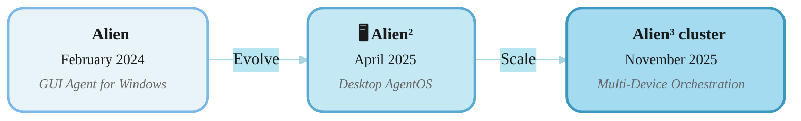

<!-- markdownlint-disable MD033 MD041 -->

<h1 align="center">
  <b>Alien³</b>  : Weaving the Digital Agent cluster
</h1>
<p align="center">
  <em>From Single Device Agent to Multi-Device cluster</em>
</p>


<div align="center">
<a href="https://trendshift.io/repositories/7874" target="_blank"></a>

<br/>

[](https://arxiv.org/abs/2511.11332)&ensp;
[](https://arxiv.org/abs/2504.14603)&ensp;
&ensp;
[](https://opensource.org/licenses/MIT)&ensp;
[](https://microsoft.github.io/Alien/)&ensp;
[](https://www.youtube.com/watch?v=NGrVWGcJL8o)&ensp;


</div>

<p align="center">
  <strong>📚 Quick Links:</strong>
  <a href="./cluster/README.md">🌌 Alien³ README</a> •
  <a href="./Alien/README.md">🖥️ Alien² README</a> •
  <a href="https://microsoft.github.io/Alien/">📖 Full Documentation</a>
</p>

---

## 🎯 Choose Your Path

<table align="center" width="95%">
<tr>
<td width="50%" valign="top">

###  **Alien³ Multi-Device Agent cluster**
<sub>**✨ NEW & RECOMMENDED**</sub>

**Perfect for:**
- 🔗 Cross-device collaboration workflows
- 📊 Complex multi-step automation  
- 🎯 DAG-based task orchestration
- 🌍 Heterogeneous platform integration

**Key Features:**
- **network**: Task decomposition into executable DAGs
- **Dynamic DAG editing** for adaptive workflow evolution
- **Asynchronous execution** with parallel task coordination
- **Unified AIP protocol** for secure agent communication


**📖 [cluster Documentation →](./cluster/README.md)**  
**📖 [cluster Quick Start →](https://microsoft.github.io/Alien/getting_started/quick_start_cluster/)** ⭐ **Online Docs**

</td>
<td width="50%" valign="top">

###  **Alien² Desktop AgentOS**
<sub>**STABLE & BATTLE-TESTED**</sub>

**Perfect for:**
- 💻 Single Windows automation
- ⚡ Quick task execution
- 🎓 Learning agent basics
- 🛠️ Simple workflows

**Key Features:**
- Deep Windows OS integration
- Hybrid GUI + API actions
- Proven reliability
- Easy setup
- Can serve as cluster device agent


**📖 [Alien² Documentation →](./Alien/README.md)**

</td>
</tr>
</table>

---

## 🎬 See Alien³ cluster in Action

Watch how Alien³ cluster orchestrates complex workflows across multiple devices:

<div align="center">
  <a href="https://www.youtube.com/watch?v=NGrVWGcJL8o">
    
  </a>
  <p><em>🎥 Click to watch: Cross-device task orchestration with Alien³ cluster</em></p>
</div>

---

## 🌟 What's New in Alien³?

### Evolution Timeline


```mermaid
%%{init: {'theme':'base', 'themeVariables': { 'primaryColor':'#E8F4F8','primaryTextColor':'#1A1A1A','primaryBorderColor':'#7CB9E8','lineColor':'#A8D5E2','secondaryColor':'#B8E6F0','tertiaryColor':'#D4F1F4','fontSize':'16px','fontFamily':'Segoe UI, Arial, sans-serif'}}}%%
graph LR
    A["<b>🎈 Alien</b><br/><span style='font-size:14px'>February 2024</span><br/><span style='font-size:13px; color:#666'><i>GUI Agent for Windows</i></span>"] 
    B["<b>🖥️ Alien²</b><br/><span style='font-size:14px'>April 2025</span><br/><span style='font-size:13px; color:#666'><i>Desktop AgentOS</i></span>"]
    C["<b>🌌 Alien³ cluster</b><br/><span style='font-size:14px'>November 2025</span><br/><span style='font-size:13px; color:#666'><i>Multi-Device Orchestration</i></span>"]
    
    A -->|Evolve| B
    B -->|Scale| C
    
    style A fill:#E8F4F8,stroke:#7CB9E8,stroke-width:2.5px,color:#1A1A1A,rx:15,ry:15
    style B fill:#C5E8F5,stroke:#5BA8D0,stroke-width:2.5px,color:#1A1A1A,rx:15,ry:15
    style C fill:#A4DBF0,stroke:#3D96BE,stroke-width:2.5px,color:#1A1A1A,rx:15,ry:15
```

### 🚀 Alien³ = **cluster** (Multi-Device Orchestration) + **Alien²** (Device Agent)

Alien³ introduces **cluster**, a revolutionary multi-device orchestration framework that coordinates intelligent agents across heterogeneous platforms. Built on five tightly integrated design principles:

1. **🌟 Declarative Decomposition into Dynamic DAG** - Requests decomposed into structured DAG with TaskStars and dependencies for automated scheduling and runtime rewriting

2. **🔄 Continuous Result-Driven Graph Evolution** - Living network that adapts to execution feedback through controlled rewrites and dynamic adjustments

3. **⚡ Heterogeneous, Asynchronous & Safe Orchestration** - Capability-based device matching with async execution, safe locking, and formally verified correctness

4. **🔌 Unified Agent Interaction Protocol (AIP)** - WebSocket-based secure coordination layer with fault tolerance and automatic reconnection

5. **🛠️ Template-Driven MCP-Empowered Device Agents** - Lightweight toolkit for rapid agent development with MCP integration for tool augmentation

| Aspect | Alien² | Alien³ cluster |
|--------|------|-------------|
| **Architecture** | Single Windows Agent | Multi-Device Orchestration |
| **Task Model** | Sequential ReAct Loop | DAG-based network Workflows |
| **Scope** | Single device, multi-app | Multi-device, cross-platform |
| **Coordination** | HostAgent + AppAgents | networkAgent + TaskOrchestrator |
| **Device Support** | Windows Desktop | Windows, Linux, Android (more coming) |
| **Task Planning** | Application-level | Device-level with dependencies |
| **Execution** | Sequential | Parallel DAG execution |
| **Device Agent Role** | Standalone | Can serve as cluster device agent |
| **Complexity** | Simple to Moderate | Simple to Very Complex |
| **Learning Curve** | Low | Moderate |
| **Cross-Device Collaboration** | ❌ Not Supported | ✅ Core Feature |
| **Setup Difficulty** | ✅ Easy | ⚠️ Moderate |
| **Status** | ✅ LTS (Long-Term Support) | ⚡ Active Development |

### 🎓 Migration Path

**For Alien² Users:**
1. ✅ **Keep using Alien²** – Fully supported, actively maintained
2. 🔄 **Gradual adoption** – cluster can use Alien² as Windows device agent
3. 📈 **Scale up** – Move to cluster when you need multi-device capabilities
4. 📚 **Learning resources** – [Migration Guide](./documents/docs/getting_started/migration_Alien-Unis_to_cluster.md)

---

## ✨ Capabilities at a Glance

### 🌌 cluster Framework – What's Different?

<table>
<tr>
<td width="33%" valign="top">

#### 🌟 network Planning

```
User Request
     ↓
networkAgent
     ↓
  [Task DAG]
   /   |   \
Task1 Task2 Task3
(Win) (Linux)(Mac)
```

**Benefits:**
- Cross-device dependency tracking
- Parallel execution optimization
- Cross-device dataflow management

</td>
<td width="33%" valign="top">

#### 🎯 Device Assignment

```
Selection Criteria
  • Platform
  • Resource
  • Task requirements
  • Performance history
        ↓
  Auto-Assignment
        ↓
  Optimal Devices
```

**Smart Matching:**
- Capability-based selection
- Real-time resource monitoring
- Dynamic reallocation

</td>
<td width="33%" valign="top">

#### 📊 Orchestration

```
Task1 → Running  ✅
Task2 → Pending  ⏸️
Task3 → Running  🔄
        ↓
   Completion
        ↓
   Final Report
```

**Orchestration:**
- Real-time status updates
- Automatic error recovery
- Progress tracking with feedback

</td>
</tr>
</table>

---

### 🪟 Alien² Desktop AgentOS – Core Strengths

Alien² serves dual roles: **standalone Windows automation** and **cluster device agent** for Windows platforms.

<div align="center">

| Feature | Description | Documentation |
|---------|-------------|---------------|
| **Deep OS Integration** | Windows UIA, Win32, WinCOM native control | [Learn More](https://microsoft.github.io/Alien) |
| **Hybrid Actions** | GUI clicks + API calls for optimal performance | [Learn More](https://microsoft.github.io/Alien/automator/overview) |
| **Speculative Multi-Action** | Batch predictions → **51% fewer LLM calls** | [Learn More](https://microsoft.github.io/Alien/advanced_usage/multi_action) |
| **Visual + UIA Detection** | Hybrid control detection for robustness | [Learn More](https://microsoft.github.io/Alien/advanced_usage/control_detection/hybrid_detection) |
| **Knowledge Substrate** | RAG with docs, demos, execution traces | [Learn More](https://microsoft.github.io/Alien/advanced_usage/reinforce_appagent/overview/) |
| **Device Agent Role** | Can serve as Windows executor in cluster orchestration | [Learn More](./cluster/README.md) |

</div>

**As cluster Device Agent:**
- Receives tasks from networkAgent via cluster orchestration layer
- Executes Windows-specific operations using proven Alien² capabilities
- Reports status and results back to TaskOrchestrator
- Participates in cross-device workflows seamlessly

---

## 🚀 Quick Start Guide

Choose your path and follow the detailed setup guide:

<table align="center">
<tr>
<td width="50%" valign="top">

### 🌌 cluster Quick Start

**For cross-device orchestration**

```powershell
# 1. Install
pip install -r requirements.txt

# 2. Configure networkAgent
copy config\cluster\agent.yaml.template config\cluster\agent.yaml
# Edit and add your API keys

# 3. Configure devices
# Edit config\cluster\devices.yaml to register your devices

# 4. Start device agents (with platform flags)
# Windows: Start server + client
# Linux: Start server + MCP servers + client  
# Mobile (Android): Start server + MCP servers + client
# See platform-specific guides for detailed setup

# 5. Launch cluster
python -m cluster --interactive
```

**📖 Complete Guide:**
- [cluster README](./cluster/README.md) – Architecture & concepts
- [Online Quick Start](https://microsoft.github.io/Alien/getting_started/quick_start_cluster/) – Step-by-step tutorial
- [Windows Device Setup](https://microsoft.github.io/Alien/getting_started/quick_start_Alien-Unis/)
- [Linux Device Setup](https://microsoft.github.io/Alien/getting_started/quick_start_linux/)
- [Mobile Device Setup](https://microsoft.github.io/Alien/getting_started/quick_start_mobile/) – Android agent setup
- [Configuration](https://microsoft.github.io/Alien/configuration/system/cluster_devices/) – Device pool configuration

</td>
<td width="50%" valign="top">

### 🪟 Alien² Quick Start

**For Windows automation**

```powershell
# 1. Install
pip install -r requirements.txt

# 2. Configure
copy config\Alien\agents.yaml.template config\Alien\agents.yaml
# Edit and add your API keys

# 3. Run
python -m Alien --task <task_name>
```

**📖 Complete Guide:**
- [Alien² README](./Alien/README.md) – Full documentation
- [Configuration Guide](./Alien/README.md#️-step-2-configure-the-llms) – LLM setup
- [Advanced Features](https://microsoft.github.io/Alien/advanced_usage/overview/) – Multi-action, RAG

</td>
</tr>
</table>

### 📋 Common Configuration

Both frameworks require LLM API configuration. Choose your provider:

<details>
<summary><strong>OpenAI Configuration</strong></summary>

**For cluster (`config/cluster/agent.yaml`):**
```yaml
network_AGENT:
  REASONING_MODEL: false
  API_TYPE: "openai"
  API_BASE: "https://api.openai.com/v1/chat/completions"
  API_KEY: "sk-your-key-here"
  API_MODEL: "gpt-4o"
```

**For Alien² (`config/Alien/agents.yaml`):**
```yaml
VISUAL_MODE: True
API_TYPE: "openai"
API_BASE: "https://api.openai.com/v1/chat/completions"
API_KEY: "sk-your-key-here"
API_MODEL: "gpt-4o"
```

</details>

<details>
<summary><strong>Azure OpenAI Configuration</strong></summary>

**For cluster (`config/cluster/agent.yaml`):**
```yaml
network_AGENT:
  REASONING_MODEL: false
  API_TYPE: "aoai"
  API_BASE: "https://YOUR-RESOURCE.openai.azure.com"
  API_KEY: "your-azure-key"
  API_MODEL: "gpt-4o"
  API_DEPLOYMENT_ID: "your-deployment-id"
```

**For Alien² (`config/Alien/agents.yaml`):**
```yaml
VISUAL_MODE: True
API_TYPE: "aoai"
API_BASE: "https://YOUR-RESOURCE.openai.azure.com"
API_KEY: "your-azure-key"
API_MODEL: "gpt-4o"
API_DEPLOYMENT_ID: "your-deployment-id"
```

</details>

> 💡 **More LLM Options:** See [Model Configuration Guide](https://microsoft.github.io/Alien/supported_models/overview/) for Qwen, Gemini, Claude, and more.

---

## 📚 Documentation Structure

<table>
<tr>
<td width="50%" valign="top">

### 🌌 cluster Documentation

- **[cluster Framework Overview](./cluster/README.md)** ⭐ **Start Here** – Architecture & technical concepts
- **[Quick Start Tutorial](https://microsoft.github.io/Alien/getting_started/quick_start_cluster/)** – Get running in minutes
- **[cluster Client](https://microsoft.github.io/Alien/cluster/client/overview/)** – Device coordination and API
- **[network Agent](https://microsoft.github.io/Alien/cluster/network_agent/overview/)** – Task decomposition and planning
- **[Task Orchestrator](https://microsoft.github.io/Alien/cluster/network_orchestrator/overview/)** – Execution engine
- **[Task network](https://microsoft.github.io/Alien/cluster/network/overview/)** – DAG structure
- **[Agent Registration](https://microsoft.github.io/Alien/cluster/agent_registration/overview/)** – Device registry
- **[Configuration Guide](https://microsoft.github.io/Alien/configuration/system/cluster_devices/)** – Setup and device pools

**📖 Technical Documentation:**
- [AIP Protocol](https://microsoft.github.io/Alien/aip/overview/) – WebSocket messaging
- [Session Management](https://microsoft.github.io/Alien/cluster/session/overview/) – Session lifecycle
- [Visualization](https://microsoft.github.io/Alien/cluster/visualization/overview/) – Real-time monitoring
- [Events & Observers](https://microsoft.github.io/Alien/cluster/core/overview/) – Event system

</td>
<td width="50%" valign="top">

### 🪟 Alien² Documentation

- **[Alien² Overview](./Alien/README.md)** – Desktop AgentOS architecture
- **[Installation](./Alien/README.md#️-step-1-installation)** – Setup & dependencies
- **[Configuration](./Alien/README.md#️-step-2-configure-the-llms)** – LLM & RAG setup
- **[Usage Guide](./Alien/README.md#-step-4-start-Alien)** – Running Alien²
- **[Advanced Features](https://microsoft.github.io/Alien/advanced_usage/overview/)** – Multi-action, RAG, etc.
- **[Automator Guide](https://microsoft.github.io/Alien/automator/overview)** – Hybrid GUI + API
- **[Benchmarks](./Alien/README.md#-evaluation)** – WAA & OSWorld results

**📖 Online Docs:**
- [Complete Documentation](https://microsoft.github.io/Alien/)
- [Model Support](https://microsoft.github.io/Alien/supported_models/overview/)
- [RAG Configuration](https://microsoft.github.io/Alien/advanced_usage/reinforce_appagent/overview/)

</td>
</tr>
</table>


---

## 📢 Latest Updates

### 2025-11 – Alien³ cluster Framework Released 🌌
**Major Research Breakthrough:** Multi-Device Orchestration System

- 🌟 **Declarative DAG Decomposition**: Tasknetwork structure for workflow logic and dependencies
- 🔄 **Dynamic Graph Evolution**: Living network that adapts through controlled rewrites
- 🎯 **Heterogeneous Orchestration**: Safe, asynchronous execution with capability-based device matching
- 🔌 **Unified AIP Protocol**: WebSocket-based secure agent coordination with fault tolerance
- 🛠️ **MCP-Empowered Agent Framework**: Template-driven toolkit for rapid device agent development
- 📄 **Research Paper**: [Alien³: Weaving the Digital Agent cluster](https://arxiv.org/abs/2511.11332)

**Key Features:**
- First multi-device orchestration framework for GUI agents
- Result-driven adaptive execution instead of rigid workflows
- Model Context Protocol (MCP) integration for tool augmentation
- Formally verified correctness and concurrency safety guarantees

### 2025-04 – Alien² v2.0.0
- 📅 Alien² Desktop AgentOS released
- 🏗️ Enhanced architecture with AgentOS concept
- 📄 [Technical Report](https://arxiv.org/pdf/2504.14603) published
- ✅ Entered Long-Term Support (LTS) status

### 2024-02 – Original Alien
- 🎈 First Alien release - UI-Focused agent for Windows
- 📄 [Original Paper](https://arxiv.org/abs/2402.07939)
- 🌍 Wide media coverage and adoption

---


---

## 🌐 Media & Community

**Media Coverage:**
- [微软正式开源Alien²，Windows桌面迈入「AgentOS 时代」](https://www.jiqizhixin.com/articles/2025-05-06-13)
- [Microsoft's Alien: Smarter Windows Experience](https://the-decoder.com/microsofts-Alien-abducts-traditional-user-interfaces-for-a-smarter-windows-experience/)
- [下一代Windows系统曝光](https://baijiahao.baidu.com/s?id=1790938358152188625)
- **[More coverage →](./Alien/README.md#-tracing-the-stars)**

**Community:**
- 💬 [GitHub Discussions](https://github.com/microsoft/Alien/discussions)
- 🐛 [Issue Tracker](https://github.com/microsoft/Alien/issues)
- 📧 Email: [Alien-agent@microsoft.com](mailto:Alien-agent@microsoft.com)
- 📺 [YouTube Channel](https://www.youtube.com/watch?v=QT_OhygMVXU)

---

## 🎨 Related Projects & Research

**Microsoft Research:**
- **[TaskWeaver](https://github.com/microsoft/TaskWeaver)** – Code-first LLM agent framework for data analytics and task automation

**GUI Agent Research:**
- **[LLM-Brained GUI Agents Survey](https://github.com/vyokky/LLM-Brained-GUI-Agents-Survey)** – Comprehensive survey of GUI automation agents
- **[Interactive Survey Site](https://vyokky.github.io/LLM-Brained-GUI-Agents-Survey/)** – Explore latest GUI agent research and developments

**Multi-Agent Systems:**
- **Alien³ cluster** represents a novel approach to multi-device orchestration, introducing the network framework for coordinating heterogeneous agents across platforms
- Builds on multi-agent coordination research while addressing unique challenges of cross-device GUI automation

**Benchmarks:**
- **[Windows Agent Arena (WAA)](https://github.com/nice-mee/WindowsAgentArena)** – Evaluation benchmark for Windows automation agents
- **[OSWorld](https://github.com/nice-mee/WindowsAgentArena/tree/2020-qqtcg/osworld)** – Cross-application task evaluation suite

---

## 💡 FAQ

<details>
<summary><strong>🤔 Should I use cluster or Alien²?</strong></summary>

**Start with Alien²** if:
- You only need Windows automation
- You want quick setup and learning
- Tasks are relatively simple

**Choose cluster** if:
- You need cross-device coordination
- Tasks are complex and multi-step
- You want advanced orchestration
- You're comfortable with active development

**Hybrid approach** if:
- You want best of both worlds
- Some tasks are simple (Alien²), some complex (cluster)
- You're gradually migrating

</details>

<details>
<summary><strong>⚠️ Will Alien² be deprecated?</strong></summary>

**No!** Alien² has entered **Long-Term Support (LTS)** status:
- ✅ Actively maintained
- ✅ Bug fixes and security updates
- ✅ Performance improvements
- ✅ Full community support
- ✅ No plans for deprecation

Alien² is the stable, proven solution for Windows automation.

</details>

<details>
<summary><strong>🔄 How do I migrate from Alien² to cluster?</strong></summary>

Migration is **gradual and optional**:

1. **Phase 1: Learn** – Understand cluster concepts
2. **Phase 2: Experiment** – Try cluster with non-critical tasks
3. **Phase 3: Hybrid** – Use both frameworks
4. **Phase 4: Migrate** – Gradually move complex tasks to cluster

**No forced migration!** Continue using Alien² as long as it meets your needs.

See [Migration Guide](./documents/docs/getting_started/migration_Alien-Unis_to_cluster.md) for details.

</details>

<details>
<summary><strong>🎯 Can cluster do everything Alien² does?</strong></summary>

**Functionally: Yes.** cluster can use Alien² as a Windows device agent.

**Practically: It depends.**
- For **simple Windows tasks**: Alien² standalone is easier and more streamlined
- For **complex workflows**: cluster orchestrates Alien² with other device agents

**Recommendation:** Use the right tool for the job. Alien² can work standalone or as cluster's Windows device agent.

</details>

<details>
<summary><strong>📊 How mature is cluster?</strong></summary>

**Status: Active Development** 🚧

**Stable:**
- ✅ Core architecture
- ✅ DAG orchestration
- ✅ Basic multi-device support
- ✅ Event system

**In Development:**
- 🔨 Advanced device types
- 🔨 Enhanced monitoring
- 🔨 Performance optimization
- 🔨 Extended documentation

**Recommendation:** Great for experimentation and non-critical workflows.

</details>

<details>
<summary><strong>🔧 Can I extend or customize?</strong></summary>

**Both frameworks are highly extensible:**

**Alien²:**
- Custom actions and automators
- Custom knowledge sources (RAG)
- Custom control detectors
- Custom evaluation metrics

**cluster:**
- Custom agents
- Custom device types
- Custom orchestration strategies
- Custom visualization components

See respective documentation for extension guides.

</details>

<details>
<summary><strong>🤝 How can I contribute?</strong></summary>

We welcome contributions to both Alien² and cluster!

**Ways to contribute:**
- 🐛 Report bugs and issues
- 💡 Suggest features and improvements
- 📝 Improve documentation
- 🧪 Add tests and examples
- 🔧 Submit pull requests

See [CONTRIBUTING.md](./CONTRIBUTING.md) for guidelines.

</details>


---

## ⚠️ Disclaimer & License

**Disclaimer:** By using this software, you acknowledge and agree to the terms in [DISCLAIMER.md](./DISCLAIMER.md).

**License:** This project is licensed under the [MIT License](LICENSE).

**Trademarks:** Use of Microsoft trademarks follows [Microsoft's Trademark Guidelines](https://www.microsoft.com/en-us/legal/intellectualproperty/trademarks/usage/general).

---

<div align="center">

## 🚀 Ready to Get Started?

<table>
<tr>
<td align="center" width="50%">

### 🌌 Explore cluster
**Multi-Device Orchestration**

[](./cluster/README.md)

</td>
<td align="center" width="50%">

### 🪟 Try Alien²
**Windows Desktop Agent**

[](./Alien/README.md)

</td>
</tr>
</table>

---

<sub>© Microsoft 2025 | Alien³ is an open-source research project</sub>

<sub>⭐ Star us on GitHub | 🤝 Contribute | 📖 Read the docs | 💬 Join discussions</sub>

</div>

---

<p align="center">
  
  <br>
  <em>From Single Agent to Digital cluster</em>
  <br>
  <strong>Alien³ - Weaving the Future of Intelligent Automation</strong>
</p>
