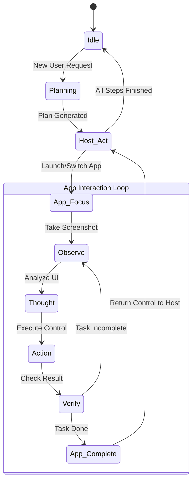

# ALIEN2 Core Engine: The Autonomous Agent Substrate

[](https://opensource.org/licenses/MIT)
[]()
[]()

**Architect: Deeven Seru**

---

## 📑 Table of Contents

1.  [Architectural Overview](#architectural-overview)
2.  [The Dual-Agent System](#the-dual-agent-system)
    *   [HostAgent: The Strategic Planner](#hostagent-the-strategic-planner)
    *   [AppAgent: The Tactical Operator](#appagent-the-tactical-operator)
3.  [State Machine Logic](#state-machine-logic)
4.  [Vision & Perception](#vision--perception)
5.  [Control Interface](#control-interface)
6.  [Developer API](#developer-api)

---

## 1. Architectural Overview

The `alien/` directory contains the kernel of the ALIEN2 framework. It is an implementation of a **proactive logic engine** designed to navigate Operating System GUIs. Unlike standard chatbots that output text, ALIEN2 outputs **control signals** (mouse clicks, keystrokes, API calls).

The engine treats the OS not as a text-interface, but as a visual environment. It parses screenshots using Mutimodal LLMs (like GPT-4V) to build a semantic understanding of the screen, then maps user intent to actionable UI elements.

---

## 2. The Dual-Agent System

To handle long-horizon tasks, we decompose the problem space into two distinct layers of abstraction.

### HostAgent: The Strategic Planner

The **HostAgent** operates at the OS level. It does not know how to "bold text in Word," but it knows how to "Open Word."

**Responsibilities:**
*   **Global Planning**: Breaks down complex requests (e.g., "Summarize this PDF and email it") into sub-tasks (1. Open Reader, 2. Read PDF, 3. Open Outlook, 4. Send Email).
*   **App Lifecycle Management**: Launches, closes, and switches focus between applications.
*   **Context Switching**: Maintains the global state of the workflow.

### AppAgent: The Tactical Operator

The **AppAgent** is instantiated when an application is brought into focus. It is ephemeral and highly specialized.

**Responsibilities:**
*   **Local Action**: Performs atomic interactions (Click button A, Type text B).
*   **UI Parsing**: Analyzes the specific window's control tree.
*   **Error Recovery**: Retries actions if the UI doesn't respond as expected (e.g., handling popups).

---

## 3. State Machine Logic

The agents do not execute blindly; they follow a strict Finite State Machine (FSM) to ensure deterministic behavior.



*   **Observe**: Capture purely visual data (RGB Screenshot) and structural data (UI Tree / Accessibility XML).
*   **Thought**: The LLM processes the observation against the goal. "I see a 'Send' button. My goal is to send email. Therefore, I should click it."
*   **Action**: The thought is translated into a `pywinauto` command: `click_input(coords=(x,y))`.

---

## 4. Vision & Perception

ALIEN2 utilizes a hybrid perception system:

1.  **Set-of-Marks (SoM)**: We overlay numeric tags on every interactive element in the screenshot. The LLM only needs to predict the ID (e.g., "Click #42"), eliminating hallucination of non-existent coordinates.
2.  **Interactive Region Detection**: If the accessibility tree is broken (common in Electron apps), the Vision model infers buttons based on visual cues (borders, shadows, icons).

---

## 5. Control Interface

The engine abstracts Windows API calls into safe primitives.

*   `click(element)`: Simulates a hardware mouse click.
*   `type(text)`: Simulates keyboard input with programmable delay.
*   `scroll(direction)`: Mouse wheel interaction.
*   `inspect()`: Dumps the current visual state for debugging.

---

## 6. Developer API

To extend ALIEN2 with custom agents or logic:

```python
from alien.agents import HostAgent, AppAgent

# Initialize Orchestrator
host = HostAgent(config="config.yaml")

# Manually trigger a task
task_id = "task_001"
plan = host.plan_task("Open Notepad and write 'Hello World'")

# Execute
results = host.execute(plan)
print(f"Execution finished with status: {results.status}")
```

---
*© 2026 Deeven Seru. All Rights Reserved.*
