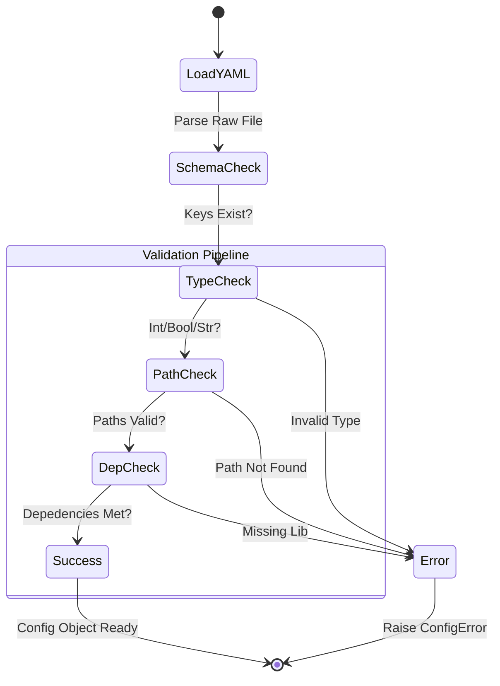

# Configuration Reference Manual

**Architect: Deeven Seru**

---

##  Table of Contents

1.  [Configuration Architecture](#configuration-architecture)
2.  [System Parameters (`config.yaml`)](#system-parameters-configyaml)
3.  [Agent Parameters (`agents.yaml`)](#agent-parameters-agentsyaml)
4.  [Validation Logic](#validation-logic)

---

## 1. Configuration Architecture

ALIEN2 utilizes a separation of concerns for configuration:
*   **Static Configuration**: `config.yaml` handles environment paths, hardware settings, and global timeouts. This rarely changes between runs.
*   **Dynamic Configuration**: `agents.yaml` handles the "intelligence" layer—LLM selection, prompt paths, and temperature settings. This is often tweaked for performance.

The system loads these files at startup using a Singleton `ConfigLoader` pattern, ensuring consistency across threads.

---

## 2. System Parameters (`config.yaml`)

This section details every valid key for the system configuration.

| Parameter | Type | Default | Description |
| :--- | :--- | :--- | :--- |
| `PROJECT_ROOT` | `str` | `.` | The absolute path to the UFO root directory. |
| `LOG_LEVEL` | `str` | `INFO` | Verbosity of the console output (`DEBUG`, `INFO`, `WARNING`, `ERROR`). |
| `MAX_STEPS` | `int` | `50` | Hard limit on the number of actions per task to prevent infinite loops. |
| `SLEEP_TIME` | `float` | `1.0` | Delay (in seconds) between an action execution and the next screenshot capture. Increase for slow UIs. |
| `SAFE_MODE` | `bool` | `True` | If `True`, the user must explicitly approve high-risk actions (delete, send). |
| `VISUAL_MODE` | `bool` | `True` | Enables GPT-4V screenshots. If `False`, relies solely on accessibility text (not recommended). |

---

## 3. Agent Parameters (`agents.yaml`)

Each agent (Host and App) can be configured independently.

### HostAgent Configuration

| Parameter | Type | Description |
| :--- | :--- | :--- |
| `API_TYPE` | `str` | Provider selector: `openai`, `azure`, `gemini`. |
| `API_KEY` | `str` | Your secret API key. |
| `API_MODEL` | `str` | The specific model ID (e.g., `gpt-4o`). |
| `PROMPT_PATH` | `str` | Path to the system prompt template (`alien/prompts/host/system.yaml`). |
| `MAX_TOKENS` | `int` | Output token limit for the planner. |

### AppAgent Configuration

| Parameter | Type | Description |
| :--- | :--- | :--- |
| `RAG_ENABLED` | `bool` | Use the vector database to retrieve past experiences. |
| `RAG_K` | `int` | Number of similar examples to retrieve (Top-K). |
| `BACKUP_MODEL` | `str` | Fallback model if the primary fails (e.g., `gpt-3.5-turbo`). |

---

## 4. Validation Logic

The configuration loader includes a rigorous validation steps:

1.  **Type Checking**: Ensures integers are integers, booleans are booleans.
2.  **Path Verification**: Checks if `PROMPT_PATH` and `PROJECT_ROOT` actually exist on the disk.
3.  **Dependency Check**: If `Visual_Mode` is True, checks if `Pillow` is installed.

If validation fails, the system raises a `ConfigError` with a precise message indicating the malformed key.

---
*© 2026 Deeven Seru. All Rights Reserved.*
