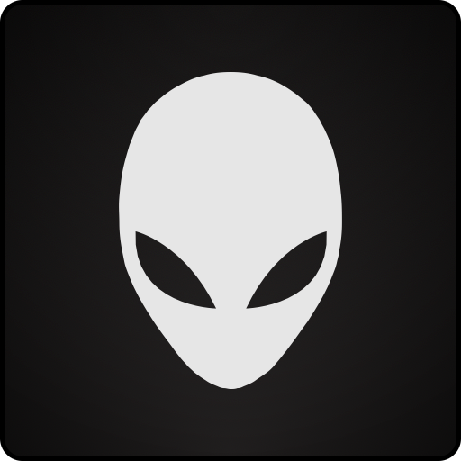
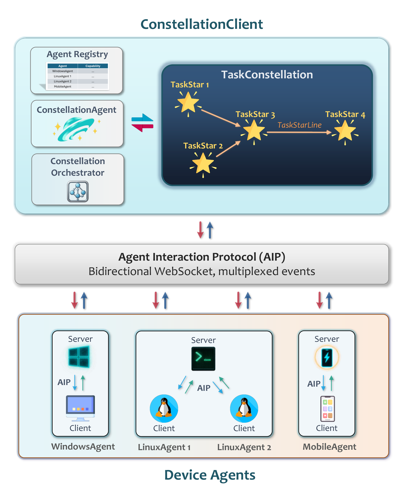
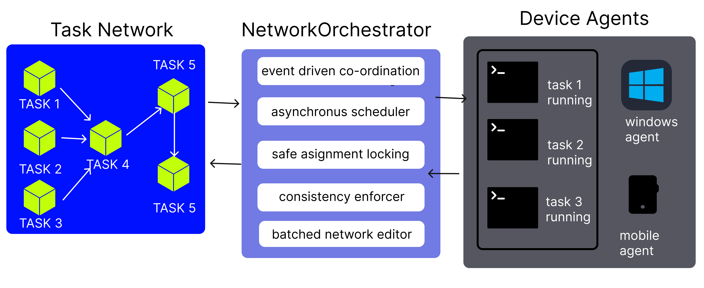

<!-- markdownlint-disable MD033 MD041 -->

<h1 align="center">
  <b>Alien³</b>  : Weaving the Digital Agent cluster
</h1>
<p align="center">
  <em>Cross-Device Orchestration Framework for Ubiquitous Intelligent Automation</em>
</p>


</div>

---

## 🌟 What is Alien³ cluster?

**Alien³ cluster** is a revolutionary **cross-device orchestration framework** that transforms isolated device agents into a unified digital ecosystem. It models complex user requests as **Task networks** — dynamic distributed DAGs where nodes represent executable subtasks and edges capture dependencies across heterogeneous devices.

### 🎯 The Vision

Building truly ubiquitous intelligent agents requires moving beyond single-device automation. Alien³ cluster addresses four fundamental challenges in cross-device agent orchestration:

<table>
<tr>
<td width="50%" valign="top">

**🔄 Asynchronous Parallelism**  
Enabling concurrent task execution across multiple devices while maintaining correctness through event-driven coordination and safe concurrency control

**⚡ Dynamic Adaptation**  
Real-time workflow evolution in response to intermediate results, transient failures, and runtime observations without workflow abortion

</td>
<td width="50%" valign="top">

**🌐 Distributed Coordination**  
Reliable, low-latency communication across heterogeneous devices via WebSocket-based Agent Interaction Protocol with fault tolerance

**🛡️ Safety Guarantees**  
Formal invariants ensuring DAG consistency during concurrent modifications and parallel execution, verified through rigorous proofs

</td>
</tr>
</table>

---

## ✨ Key Innovations

Alien³ cluster realizes cross-device orchestration through five tightly integrated design principles:

---

### 🌟 Declarative Decomposition into Dynamic DAG

User requests are decomposed by the **networkAgent** into a structured DAG of **TaskStars** (nodes) and **TaskStarLines** (edges) encoding workflow logic, dependencies, and device assignments.

**Key Benefits:** Declarative structure for automated scheduling • Runtime introspection • Dynamic rewriting • Cross-device orchestration

<div align="center">
  
</div>

---

<table>
<tr>
<td width="50%" valign="top">

### 🔄 Continuous Result-Driven Graph Evolution

The **Tasknetwork** evolves dynamically in response to execution feedback, intermediate results, and failures through controlled DAG rewrites.

**Adaptation Mechanisms:**
- 🩺 Diagnostic TaskStars for debugging
- 🛡️ Fallback creation for error recovery
- 🔗 Dependency rewiring for optimization
- ✂️ Node pruning after completion

Enables resilient adaptation instead of workflow abortion.

</td>
<td width="50%" valign="top">

### ⚡ Heterogeneous, Asynchronous & Safe Orchestration

Tasks are matched to optimal devices via **AgentProfiles** (OS, hardware, tools) and executed asynchronously in parallel.

**Safety Guarantees:**
- 🔒 Safe assignment locking (no race conditions)
- 📅 Event-driven scheduling (DAG readiness)
- ✅ DAG consistency checks (structural integrity)
- 🔄 Batched edits (atomicity)
- 📐 Formal verification (provable correctness)

Ensures high efficiency with reliability.

</td>
</tr>
<tr>
<td width="50%" valign="top">

### 🔌 Unified Agent Interaction Protocol (AIP)

Persistent **WebSocket-based** protocol providing unified, secure, fault-tolerant communication for the entire agent ecosystem.

**Core Capabilities:**
- 📝 Agent registry with capability profiles
- 🔐 Secure session management
- 📤 Intelligent task routing
- 💓 Health monitoring with heartbeats
- 🔌 Auto-reconnection & retry mechanisms

**Benefits:** Lightweight • Extensible • Fault-tolerant

</td>
<td width="50%" valign="top">

### 🛠️ Template-Driven MCP-Empowered Device Agents

Lightweight **development template** for rapidly building new device agents with **Model Context Protocol (MCP)** integration.

**Development Framework:**
- 📄 Capability declaration (agent profiles)
- 🔗 Environment binding (local systems)
- 🧩 MCP server integration (plug-and-play tools)
- 🔧 Modular design (rapid development)

**MCP Integration:** Tool packages • Cross-platform standardization • Rapid prototyping

Enables platform extension (mobile, web, IoT, embedded).

</td>
</tr>
</table>

<div align="center">
  <br>
  <em>🎯 Together, these designs enable Alien³ to decompose, schedule, execute, and adapt distributed tasks efficiently while maintaining safety and consistency across heterogeneous devices.</em>
</div>

---


## 🏗️ Architecture Overview

<div align="center">
  
  <p><em>Alien³ cluster Layered Architecture — From natural language to distributed execution</em></p>
</div>

### Hierarchical Design

<table>
<tr>
<td width="35%" valign="top">

#### 🎛️ Control Plane

| Component | Role |
|-----------|------|
| **🌐 networkClient** | Global device registry with capability profiles |
| **🖥️ Device Agents** | Local orchestration with unified MCP tools |
| **🔒 Clean Separation** | Global policies & device independence |

</td>
<td width="65%" valign="top">

#### 🔄 Execution Workflow

<div align="center">
  
</div>

</td>
</tr>
</table>

---

## 🚀 Quick Start

### 🛠️ Step 1: Installation

```powershell
# Clone repository
git clone https://github.com/DEVELOPER-DEEVEN/alien-project
cd Alien

# Create environment (recommended)
conda create -n Alien-Group python=3.10
conda activate Alien-Group

# Install dependencies
pip install -r requirements.txt
```

### ⚙️ Step 2: Configure networkAgent LLM

Alien³ cluster uses a **networkAgent** that orchestrates all device agents. Configure its LLM settings:

```powershell
# Create configuration from template
copy config\cluster\agent.yaml.template config\cluster\agent.yaml
notepad config\cluster\agent.yaml
```

**Configuration File Location:**
```
config/cluster/
├── agent.yaml.template    # Template - COPY THIS
├── agent.yaml             # Your config with API keys (DO NOT commit)
└── devices.yaml           # Device pool configuration (Step 4)
```

**OpenAI Configuration:**
```yaml
network_AGENT:
  REASONING_MODEL: false
  API_TYPE: "openai"
  API_BASE: "https://api.openai.com/v1/chat/completions"
  API_KEY: "sk-YOUR_KEY_HERE"
  API_VERSION: "2025-02-01-preview"
  API_MODEL: "gpt-5-chat-20251003"
  # ... (prompt configurations use defaults)
```

**Azure OpenAI Configuration:**
```yaml
network_AGENT:
  REASONING_MODEL: false
  API_TYPE: "aoai"
  API_BASE: "https://YOUR_RESOURCE.openai.azure.com"
  API_KEY: "YOUR_AOAI_KEY"
  API_VERSION: "2024-02-15-preview"
  API_MODEL: "gpt-5-chat-20251003"
  API_DEPLOYMENT_ID: "YOUR_DEPLOYMENT_ID"
  # ... (prompt configurations use defaults)
```

### 🖥️ Step 3: Configure Device Agents

Each device agent (Windows/Linux) needs its own LLM configuration to execute tasks.

```powershell
# Configure device agent LLMs
copy config\Alien\agents.yaml.template config\Alien\agents.yaml
notepad config\Alien\agents.yaml
```

**Configuration File Location:**
```
config/Alien/
├── agents.yaml.template    # Template - COPY THIS
└── agents.yaml             # Device agent LLM config (DO NOT commit)
```

**Example Configuration:**
```yaml
HOST_AGENT:
  VISUAL_MODE: true
  API_TYPE: "openai"  # or "aoai" for Azure OpenAI
  API_BASE: "https://api.openai.com/v1/chat/completions"
  API_KEY: "sk-YOUR_KEY_HERE"
  API_MODEL: "gpt-4o"

APP_AGENT:
  VISUAL_MODE: true
  API_TYPE: "openai"
  API_BASE: "https://api.openai.com/v1/chat/completions"
  API_KEY: "sk-YOUR_KEY_HERE"
  API_MODEL: "gpt-4o"
```

> **💡 Tip:** You can use the same API key and model for both networkAgent (Step 2) and device agents (Step 3).

### 🌐 Step 4: Configure Device Pool

```powershell
# Configure available devices
copy config\cluster\devices.yaml.template config\cluster\devices.yaml
notepad config\cluster\devices.yaml
```

**Example Device Configuration:**
```yaml
devices:
  # Windows Device (Alien²)
  - device_id: "windows_device_1"              # Must match --client-id
    server_url: "ws://localhost:5000/ws"       # Must match server WebSocket URL
    os: "windows"
    capabilities:
      - "desktop_automation"
      - "office_applications"
      - "excel"
      - "word"
      - "outlook"
      - "email"
      - "web_browsing"
    metadata:
      os: "windows"
      version: "11"
      performance: "high"
      installed_apps:
        - "Microsoft Excel"
        - "Microsoft Word"
        - "Microsoft Outlook"
        - "Google Chrome"
      description: "Primary Windows desktop for office automation"
    auto_connect: true
    max_retries: 5

  # Linux Device
  - device_id: "linux_device_1"                # Must match --client-id
    server_url: "ws://localhost:5001/ws"       # Must match server WebSocket URL
    os: "linux"
    capabilities:
      - "server_management"
      - "log_analysis"
      - "file_operations"
      - "database_operations"
    metadata:
      os: "linux"
      performance: "medium"
      logs_file_path: "/var/log/myapp/app.log"
      dev_path: "/home/user/projects/"
      warning_log_pattern: "WARN"
      error_log_pattern: "ERROR|FATAL"
      description: "Development server for backend operations"
    auto_connect: true
    max_retries: 5
```

> **⚠️ Critical: IDs and URLs Must Match**
> - `device_id` **must exactly match** the `--client-id` flag
> - `server_url` **must exactly match** the server WebSocket URL
> - Otherwise, cluster cannot control the device!

### 🖥️ Step 5: Start Device Agents

cluster orchestrates **device agents** that execute tasks on individual machines. You need to start the appropriate device agents based on your needs.

#### Example: Quick Windows Device Setup

**On your Windows machine:**

```powershell
# Terminal 1: Start Alien² Server
python -m Alien.server.app --port 5000

# Terminal 2: Start Alien² Client (connect to server)
python -m Alien.client.client `
  --ws `
  --ws-server ws://localhost:5000/ws `
  --client-id windows_device_1 `
  --platform windows
```

> **⚠️ Important: Platform Flag Required**
> Always include `--platform windows` for Windows devices and `--platform linux` for Linux devices!

#### Example: Quick Linux Device Setup

**On your Linux machine:**

```bash
# Terminal 1: Start Device Agent Server
python -m Alien.server.app --port 5001

# Terminal 2: Start Linux Client (connect to server)
python -m Alien.client.client \
  --ws \
  --ws-server ws://localhost:5001/ws \
  --client-id linux_device_1 \
  --platform linux

# Terminal 3: Start HTTP MCP Server (for Linux tools)
python -m Alien.client.mcp.http_servers.linux_mcp_server
```

**📖 Detailed Setup Instructions:**
- **For Windows devices (Alien²):** See [Alien² as cluster Device](../documents/docs/Alien-Unis/as_cluster_device.md)
- **For Linux devices:** See [Linux as cluster Device](../documents/docs/linux/as_cluster_device.md)

### 🌌 Step 6: Launch cluster Client

#### 🎨 Interactive WebUI Mode (Recommended)

Launch cluster with an interactive web interface for real-time network visualization and monitoring:

```powershell
python -m cluster --webui
```

This will start the cluster server with WebUI and open your browser to the interactive interface:

<div align="center">
  
  <p><em>🎨 cluster WebUI - Interactive network visualization and chat interface</em></p>
</div>

**WebUI Features:**
- 🗣️ **Chat Interface**: Submit requests and interact with networkAgent in real-time
- 📊 **Live DAG Visualization**: Watch task network formation and execution
- 🎯 **Task Status Tracking**: Monitor each TaskStar's progress and completion
- 🔄 **Dynamic Updates**: See network evolution as tasks complete
- 📱 **Responsive Design**: Works on desktop and tablet devices

**Default URL:** `http://localhost:8000` (automatically finds next available port if 8000 is occupied)

---

#### 💬 Interactive Terminal Mode

For command-line interaction:

```powershell
python -m cluster --interactive
```

---

#### ⚡ Direct Request Mode

Execute a single request and exit:

```powershell
python -m cluster --request "Extract data from Excel on Windows, process with Python on Linux, and generate visualization report"
```

---

#### 🔧 Programmatic API

Embed cluster in your Python applications:

```python
from cluster.cluster_client import clusterClient

async def main():
    # Initialize client
    client = clusterClient(session_name="data_pipeline")
    await client.initialize()
    
    # Execute cross-device workflow
    result = await client.process_request(
        "Download sales data, analyze trends, generate executive summary"
    )
    
    # Access network details
    network = client.session.network
    print(f"Tasks executed: {len(network.tasks)}")
    print(f"Devices used: {set(t.assigned_device for t in network.tasks)}")
    
    await client.shutdown()

import asyncio
asyncio.run(main())
```

---

## 🎯 Use Cases

### 🖥️ Software Development & CI/CD

**Request:**  
*"Clone repository on Windows, build Docker image on Linux GPU server, deploy to staging, and run test suite on CI cluster"*

**network Workflow:**
```
Clone (Windows) → Build (Linux GPU) → Deploy (Linux Server) → Test (Linux CI)
```

**Benefit:** Parallel execution reduces pipeline time by 60%

---

### 📊 Data Science Workflows

**Request:**  
*"Fetch dataset from cloud storage, preprocess on Linux workstation, train model on A100 node, visualize results on Windows"*

**network Workflow:**
```
Fetch (Any) → Preprocess (Linux) → Train (Linux GPU) → Visualize (Windows)
```

**Benefit:** Automatic GPU detection and optimal device assignment

---

### 📝 Cross-Platform Document Processing

**Request:**  
*"Extract data from Excel on Windows, process with Python on Linux, generate PDF report, and email summary"*

**network Workflow:**
```
Extract (Windows) → Process (Linux) ┬→ Generate PDF (Windows)
                                      └→ Send Email (Windows)
```

**Benefit:** Parallel report generation and email delivery

---

### 🔬 Distributed System Monitoring

**Request:**  
*"Collect server logs from all Linux machines, analyze for errors, generate alerts, create consolidated report"*

**network Workflow:**
```
┌→ Collect (Linux 1) ┐
├→ Collect (Linux 2) ├→ Analyze (Any) → Report (Windows)
└→ Collect (Linux 3) ┘
```

**Benefit:** Parallel log collection with automatic aggregation

---

## 🌐 System Capabilities

Building on the five design principles, Alien³ cluster delivers powerful capabilities for distributed automation:

<table>
<tr>
<td width="50%" valign="top">

### ⚡ Efficient Parallel Execution
- **Event-driven scheduling** monitors DAG for ready tasks
- **Non-blocking execution** with Python `asyncio`
- **Dynamic task integration** without workflow interruption
- **Result:** Up to 70% reduction in end-to-end latency compared to sequential execution

---

### 🛡️ Formal Safety Guarantees
- **Three formal invariants (I1-I3)** ensure DAG correctness
- **Safe assignment locking** prevents race conditions
- **Acyclicity validation** eliminates circular dependencies
- **State merging** preserves progress during runtime modifications
- **Formally verified** through rigorous mathematical proofs

</td>
<td width="50%" valign="top">

### 🔄 Intelligent Adaptation
- **Dual-mode networkAgent** (creation/editing) with FSM control
- **Result-driven evolution** based on execution feedback
- **LLM-powered reasoning** via ReAct architecture
- **Automatic error recovery** through diagnostic tasks and fallbacks
- **Workflow optimization** via dynamic rewiring and pruning

---

### 👁️ Comprehensive Observability
- **Real-time visualization** of network structure and execution
- **Event-driven updates** via publish-subscribe pattern
- **Rich execution logs** with markdown trajectories
- **Status tracking** for each TaskStar and dependency
- **Interactive WebUI** for monitoring and control

</td>
</tr>
</table>

---

### 🔌 Extensibility & Platform Independence

Alien³ is designed as a **universal orchestration framework** that seamlessly integrates heterogeneous device agents across platforms.

**Multi-Platform Support:**
- 🪟 **Windows** — Desktop automation via Alien²
- 🐧 **Linux** — Server management, DevOps, data processing
- 📱 **Android** — Mobile device automation via MCP
- 🌐 **Web** — Browser-based agents (coming soon)
- 🍎 **macOS** — Desktop automation (coming soon)
- 🤖 **IoT/Embedded** — Edge devices and sensors (coming soon)

**Developer-Friendly:**
- 📦 **Lightweight template** for rapid agent development
- 🧩 **MCP integration** for plug-and-play tool extension
- 📖 **Comprehensive tutorials** and API documentation
- 🔌 **AIP protocol** for seamless ecosystem integration

**📖 Want to build your own device agent?** See our [Creating Custom Device Agents tutorial](../documents/docs/tutorials/creating_device_agent/overview.md) to learn how to extend Alien³ to new platforms.

---

## 📚 Documentation

| Component | Description | Link |
|-----------|-------------|------|
| **cluster Client** | Device coordination and networkClient API | [Learn More](../documents/docs/cluster/client/overview.md) |
| **network Agent** | LLM-driven task decomposition and DAG evolution | [Learn More](../documents/docs/cluster/network_agent/overview.md) |
| **Task Orchestrator** | Asynchronous execution and safety guarantees | [Learn More](../documents/docs/cluster/network_orchestrator/overview.md) |
| **Task network** | DAG structure and network editor | [Learn More](../documents/docs/cluster/network/overview.md) |
| **Agent Registration** | Device registry and agent profiles | [Learn More](../documents/docs/cluster/agent_registration/overview.md) |
| **AIP Protocol** | WebSocket messaging and communication patterns | [Learn More](../documents/docs/aip/overview.md) |
| **Configuration** | Device pools and orchestration policies | [Learn More](../documents/docs/configuration/system/cluster_devices.md) |
| **Creating Device Agents** | Tutorial for building custom device agents | [Learn More](../documents/docs/tutorials/creating_device_agent/overview.md) |

---

## 📊 System Architecture

### Core Components

| Component | Location | Responsibility |
|-----------|----------|----------------|
| **clusterClient** | `cluster/cluster_client.py` | Session management, user interaction |
| **networkClient** | `cluster/client/network_client.py` | Device registry, connection lifecycle |
| **networkAgent** | `cluster/agents/network_agent.py` | DAG synthesis and evolution |
| **TasknetworkOrchestrator** | `cluster/network/orchestrator/` | Asynchronous execution, safety enforcement |
| **Tasknetwork** | `cluster/network/task_network.py` | DAG data structure and validation |
| **DeviceManager** | `cluster/client/device_manager.py` | WebSocket connections, heartbeat monitoring |

### Technology Stack

| Layer | Technologies |
|-------|-------------|
| **Language** | Python 3.10+, asyncio, dataclasses |
| **Communication** | WebSockets, JSON-RPC |
| **LLM** | OpenAI, Azure OpenAI, Gemini, Claude |
| **Tools** | Model Context Protocol (MCP) |
| **Config** | YAML, Pydantic validation |
| **Logging** | Rich console, Markdown trajectories |

---

**Alien² Desktop AgentOS:**
---


## ⚖️ License

Alien³ cluster is released under the [MIT License](../../LICENSE).

See [DISCLAIMER.md](../../DISCLAIMER.md) for privacy and safety notices.

---

<div align="center">
  <p><strong>Transform your distributed devices into a unified digital collective.</strong></p>
  <p><em>Alien³ cluster — Where every device is a star, and every task is a network.</em></p>
  <br>
  <sub>© Microsoft 2025 • Alien³ is an open-source research project</sub>
</div>
