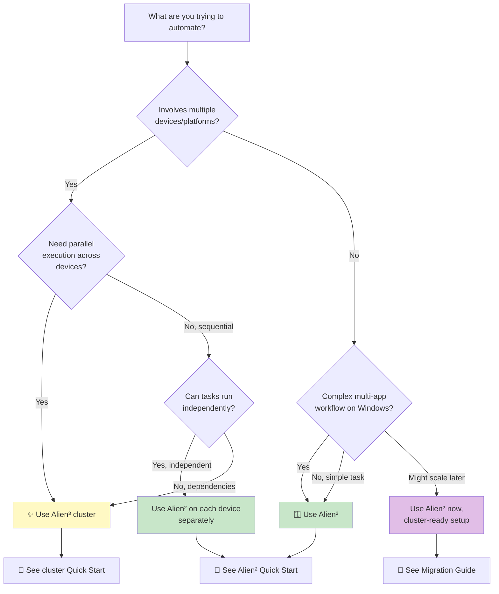

# Choosing Your Path: Alien² or Alien³ cluster?

Not sure which Alien framework to use? This guide will help you make the right choice based on your specific needs.

---

## 🗺️ Quick Decision Tree

Use this interactive flowchart to find the best solution for your use case:



```mermaid
graph TD
    Start[What are you trying to automate?] --> Q1{Involves multiple<br/>devices/platforms?}
    
    Q1 -->|Yes| Q2{Need parallel<br/>execution across<br/>devices?}
    Q1 -->|No| Q3{Complex multi-app<br/>workflow on Windows?}
    
    Q2 -->|Yes| cluster[✨ Use Alien³ cluster]
    Q2 -->|No, sequential| Q4{Can tasks run<br/>independently?}
    
    Q4 -->|Yes, independent| Alien-Unis_Multi[Use Alien² on each device<br/>separately]
    Q4 -->|No, dependencies| cluster
    
    Q3 -->|Yes| Alien-Unis[🪟 Use Alien²]
    Q3 -->|No, simple task| Alien-Unis
    
    Q3 -->|Might scale later| Hybrid[Use Alien² now,<br/>cluster-ready setup]
    
    cluster --> clusterDoc[📖 See cluster Quick Start]
    Alien-Unis --> Alien-UnisDoc[📖 See Alien² Quick Start]
    Alien-Unis_Multi --> Alien-UnisDoc
    Hybrid --> MigrationDoc[📖 See Migration Guide]
    
    style cluster fill:#fff9c4
    style Alien-Unis fill:#c8e6c9
    style Alien-Unis_Multi fill:#c8e6c9
    style Hybrid fill:#e1bee7
    
    click clusterDoc "./getting_started/quick_start_cluster.md"
    click Alien-UnisDoc "./getting_started/quick_start_Alien-Unis.md"
    click MigrationDoc "./getting_started/migration_Alien-Unis_to_cluster.md"
```

---

## 📊 Quick Comparison Matrix

| Dimension | Alien² Desktop AgentOS | Alien³ cluster |
|-----------|---------------------|-------------|
| **Target Scope** | Single Windows desktop | Multiple devices (Windows/Linux/macOS) |
| **Best For** | Simple local automation | Complex cross-device workflows |
| **Setup Complexity** | ⭐ Simple | ⭐⭐⭐ Moderate (requires device pool) |
| **Learning Curve** | ⭐⭐ Easy | ⭐⭐⭐⭐ Advanced |
| **Execution Model** | Sequential multi-app | Parallel DAG orchestration |
| **Network Required** | ❌ No | ✅ Yes (WebSocket between devices) |
| **Parallelism** | Within single device | Across multiple devices |
| **Fault Tolerance** | Retry on same device | Retry + task migration |
| **Typical Latency** | 10-30s (local) | 20-60s (includes orchestration) |
| **Ideal Task Count** | 1-5 steps | 5-20+ steps with dependencies |

**Quick Rule of Thumb:**
- **1 device + simple workflow** → Alien²
- **2+ devices OR complex dependencies** → cluster
- **Not sure?** → Start with Alien², migrate later ([Migration Guide](./getting_started/migration_Alien-Unis_to_cluster.md))

---

## 🎯 Scenario-Based Recommendations

### Scenario 1: Desktop Productivity Automation

**Task:** "Create a weekly report: extract data from Excel, generate charts in PowerPoint, send via Outlook"

**Recommendation:** ✅ **Alien²**

**Why:**
- All applications on one Windows desktop
- Sequential workflow (Excel → PowerPoint → Outlook)
- No cross-device dependencies

**Learn More:** [Alien² Overview](./Alien-Unis/overview.md)

---

### Scenario 2: Development Workflow Automation

**Task:** "Clone repo on my laptop, build Docker image on GPU server, run tests on CI cluster, open results on my desktop"

**Recommendation:** ✅ **Alien³ cluster**

**Why:**
- Spans 3+ devices (laptop, GPU server, CI cluster, desktop)
- Sequential dependencies (clone → build → test → display)
- Requires device coordination and data transfer

**Learn More:** [cluster Overview](./cluster/overview.md)

---

### Scenario 3: Batch Data Processing

**Task:** "Process 100 files: fetch from cloud, clean data, run ML model, save results"

**Recommendation:** **Depends on setup**

| Setup | Recommendation | Why |
|-------|---------------|-----|
| **Single powerful workstation** | ✅ Alien² | All processing on one machine, simpler |
| **Distributed cluster** | ✅ cluster | Parallel processing across nodes, faster |
| **Mix (local + cloud GPU)** | ✅ cluster | Heterogeneous resources |

**Learn More:** 
- [Alien² for Single Device](./getting_started/quick_start_Alien-Unis.md)
- [cluster for Distributed](./getting_started/quick_start_cluster.md)

---

### Scenario 4: Cross-Platform Testing

**Task:** "Test web app on Windows Chrome, Linux Firefox, and macOS Safari"

**Recommendation:** ✅ **Alien³ cluster**

**Why:**
- Requires 3 different OS platforms
- Parallel execution saves time
- Centralized result aggregation

**Learn More:** [cluster Multi-Platform Support](./cluster/overview.md#cross-device-collaboration)

---

### Scenario 5: File Management & Organization

**Task:** "Organize Downloads folder by file type, compress old files, upload to cloud"

**Recommendation:** ✅ **Alien²**

**Why:**
- Single-device local file operations
- No network dependencies
- Simple sequential workflow

**Learn More:** [Alien² Quick Start](./getting_started/quick_start_Alien-Unis.md)

---

### Scenario 6: Multi-Stage Data Pipeline

**Task:** "Collect logs from 5 Linux servers, aggregate on central server, analyze, generate dashboard on Windows"

**Recommendation:** ✅ **Alien³ cluster**

**Why:**
- Multiple source devices (5 Linux servers)
- Parallel log collection (5x faster than sequential)
- Cross-platform (Linux → Windows)
- Complex dependency graph

**Learn More:** [cluster Task network](./cluster/network/overview.md)

---

### Scenario 7: Learning Agent Development

**Task:** "I'm new to agent development and want to learn by building simple automation"

**Recommendation:** ✅ **Alien²**

**Why:**
- Simpler architecture (easier to understand)
- Faster feedback loop (local execution)
- Comprehensive documentation and examples
- Can upgrade to cluster later

**Learn More:** [Alien² Quick Start](./getting_started/quick_start_Alien-Unis.md)

---

### Scenario 8: Enterprise Workflow Integration

**Task:** "Integrate with existing CI/CD pipeline across dev laptops, build servers, and test farms"

**Recommendation:** ✅ **Alien³ cluster**

**Why:**
- Enterprise-scale device coordination
- Fault tolerance with automatic recovery
- Formal safety guarantees for correctness
- Supports heterogeneous infrastructure

**Learn More:** [cluster Architecture](./cluster/overview.md#architecture)

---

## 🔀 Hybrid Approaches

You don't have to choose just one! Here are common hybrid patterns:

### Pattern 1: Alien² as cluster Device

**Setup:** Run Alien² as a cluster device (requires both server and client)

```bash
# Terminal 1: Start Alien² Server on Windows desktop
python -m Alien.server.app --port 5000

# Terminal 2: Start Alien² Client (connect to server)
python -m Alien.client.client --ws --ws-server ws://localhost:5000/ws --client-id my_windows_device --platform windows
```

**Benefits:**
- Keep Alien² for local Windows expertise
- Gain cluster's cross-device orchestration
- Best of both worlds

**Learn More:** [Alien² as cluster Device](./Alien-Unis/as_cluster_device.md)

---

### Pattern 2: Gradual Migration

**Strategy:** Start with Alien² for immediate needs, prepare for cluster expansion

**Phase 1:** Use Alien² standalone
```bash
python -m Alien --task "Your current task"
```

**Phase 2:** Make Alien² cluster-compatible
```yaml
# config/cluster/devices.yaml (prepare in advance)
devices:
  - device_id: "my_windows"
    server_url: "ws://localhost:5000/ws"  # Where Alien client connects to Alien server
    os: "windows"
    capabilities: ["office", "web"]
```

**Phase 3:** Start Alien device agent and connect to cluster
```bash
# Terminal 1: Start Alien Server on your Windows machine
python -m Alien.server.app --port 5000

# Terminal 2: Start Alien Client (connects to Alien server above)
python -m Alien.client.client --ws --ws-server ws://localhost:5000/ws --client-id my_windows --platform windows

# Terminal 3: Start cluster (on control machine, can be same or different)
python -m cluster --request "Cross-device workflow"
```

**Learn More:** [Migration Guide](./getting_started/migration_Alien-Unis_to_cluster.md)

---

### Pattern 3: Domain-Specific Split

**Strategy:** Use different frameworks for different workflow types

| Workflow Type | Framework | Example |
|--------------|-----------|---------|
| **Daily desktop tasks** | Alien² | Email processing, document creation |
| **Development workflows** | cluster | Code build → test → deploy |
| **Data processing** | cluster (if distributed) | Multi-node ML training |
| **Quick automation** | Alien² | One-off tasks |

**Learn More:** [When to Use Which](./getting_started/migration_Alien-Unis_to_cluster.md#when-to-use-which)

---

## 🚫 Common Misconceptions

### Misconception 1: "cluster is always better because it's newer"

**Reality:** Alien² is better for simple single-device tasks due to:
- Lower latency (no network overhead)
- Simpler setup and debugging
- Battle-tested stability

**Use cluster only when you actually need multi-device orchestration.**

---

### Misconception 2: "I need to rewrite everything to migrate to cluster"

**Reality:** Alien² can run as a cluster device with minimal changes:
```bash
# Terminal 1: Start Alien Server
python -m Alien.server.app --port 5000

# Terminal 2: Start Alien Client in WebSocket mode
python -m Alien.client.client --ws --ws-server ws://localhost:5000/ws --client-id my_device --platform windows
```

**Learn More:** [Migration Guide](./getting_started/migration_Alien-Unis_to_cluster.md#option-2-convert-Alien-Unis-instance-to-cluster-device)

---

### Misconception 3: "cluster can't run on a single device"

**Reality:** cluster works perfectly on one device if you need:
- DAG-based workflow planning
- Advanced monitoring and trajectory reports
- Preparation for future multi-device expansion

```yaml
# Single-device cluster setup
devices:
  - device_id: "localhost"
    server_url: "ws://localhost:5005/ws"
```

---

### Misconception 4: "Alien² is deprecated in favor of cluster"

**Reality:** Alien² is actively maintained and recommended for single-device use:
- More efficient for local tasks
- Simpler for beginners
- Core component when used as cluster device

**Both frameworks are complementary, not competing.**

---

## 🎓 Learning Paths

### For Beginners

**Week 1-2: Start with Alien²**
1. [Alien² Quick Start](./getting_started/quick_start_Alien-Unis.md)
2. Build simple automation (file management, email, etc.)
3. Understand HostAgent/AppAgent architecture

**Week 3-4: Explore Advanced Alien²**
4. [Hybrid GUI-API Actions](./Alien-Unis/core_features/hybrid_actions.md)
5. [MCP Server Integration](./mcp/overview.md)
6. [Customization & Learning](./Alien-Unis/advanced_usage/customization.md)

**Week 5+: Graduate to cluster (if needed)**
7. [Migration Guide](./getting_started/migration_Alien-Unis_to_cluster.md)
8. [cluster Quick Start](./getting_started/quick_start_cluster.md)
9. Build cross-device workflows

---

### For Experienced Developers

**Direct to cluster** if you already know you need multi-device:
1. [cluster Quick Start](./getting_started/quick_start_cluster.md)
2. [Task network Concepts](./cluster/network/overview.md)
3. [networkAgent Deep Dive](./cluster/network_agent/overview.md)
4. [Performance Monitoring](./cluster/evaluation/performance_metrics.md)

---

## 📋 Decision Checklist

Still unsure? Answer these questions:

**Q1: Does your workflow involve 2+ physical devices?**

- ✅ Yes → **cluster**
- ❌ No → Continue to Q2

**Q2: Do you need parallel execution across different machines?**

- ✅ Yes → **cluster**
- ❌ No → Continue to Q3

**Q3: Does your workflow have complex dependencies (DAG structure)?**

- ✅ Yes, complex DAG → **cluster**
- ❌ No, simple sequence → Continue to Q4

**Q4: Are you comfortable with distributed systems concepts?**

- ✅ Yes → **cluster** (if any of Q1-Q3 is yes)
- ❌ No → **Alien²** (learn basics first)

**Q5: Do you need cross-platform support (Windows + Linux)?**

- ✅ Yes → **cluster**
- ❌ No, Windows only → **Alien²**

---

**Result:**

- **3+ "cluster" answers** → Use cluster ([Quick Start](./getting_started/quick_start_cluster.md))
- **Mostly "Alien²" answers** → Use Alien² ([Quick Start](./getting_started/quick_start_Alien-Unis.md))
- **Mixed answers** → Start with Alien², keep cluster option open ([Migration Guide](./getting_started/migration_Alien-Unis_to_cluster.md))

---

## 🔗 Next Steps

### If you chose Alien²:
1. 📖 [Alien² Quick Start Guide](./getting_started/quick_start_Alien-Unis.md)
2. 🎯 [Alien² Overview & Architecture](./Alien-Unis/overview.md)
3. 🛠️ [Configuration Guide](./configuration/system/overview.md)

### If you chose cluster:
1. 📖 [cluster Quick Start Guide](./getting_started/quick_start_cluster.md)
2. 🎯 [cluster Overview & Architecture](./cluster/overview.md)
3. 🌟 [Task network Concepts](./cluster/network/overview.md)

### If you're still exploring:
1. 📊 [Detailed Comparison](./getting_started/migration_Alien-Unis_to_cluster.md#when-to-use-which)
2. 🎬 [Demo Video](https://www.youtube.com/watch?v=QT_OhygMVXU)
3. 📄 [Research Paper](https://arxiv.org/abs/2504.14603)

---

## 💡 Pro Tips

!!! tip "Start Simple"
    When in doubt, start with **Alien²**. It's easier to scale up to cluster later than to debug a complex cluster setup when you don't need it.

!!! tip "Hybrid is Valid"
    Don't feel locked into one choice. You can use **Alien² for local tasks** and **cluster for cross-device workflows** simultaneously.

!!! tip "Test Before Committing"
    Try both for a simple workflow to see which feels more natural for your use case:
    ```bash
    # Alien² test
    python -m Alien --task "Create test report"
    
    # cluster test  
    python -m cluster --request "Create test report"
    ```

!!! warning "Network Requirements"
    cluster requires **stable network connectivity** between devices. If your environment has network restrictions, Alien² might be more reliable.

---

## 🤝 Getting Help

- **Documentation:** [https://microsoft.github.io/Alien/](https://microsoft.github.io/Alien/)
- **GitHub Issues:** [https://github.com/microsoft/Alien/issues](https://github.com/microsoft/Alien/issues)
- **Discussions:** [https://github.com/microsoft/Alien/discussions](https://github.com/microsoft/Alien/discussions)

Still have questions? Check the [Migration FAQ](./getting_started/migration_Alien-Unis_to_cluster.md#getting-help) or open a discussion on GitHub!
