# Choosing Your Path: ALIEN² or ALIEN³ Network?

Not sure which ALIEN framework to use? This guide will help you make the right choice based on your specific needs.

---

## 🗺️ Quick Decision Tree

Use this interactive flowchart to find the best solution for your use case:

```mermaid
graph TD
    Start[What are you trying to automate?] --> Q1{Involves multiple<br/>devices/platforms?}
    
    Q1 -->|Yes| Q2{Need parallel<br/>execution across<br/>devices?}
    Q1 -->|No| Q3{Complex multi-app<br/>workflow on Windows?}
    
    Q2 -->|Yes| Network[✨ Use ALIEN³ Network]
    Q2 -->|No, sequential| Q4{Can tasks run<br/>independently?}
    
    Q4 -->|Yes, independent| ALIEN2_Multi[Use ALIEN² on each device<br/>separately]
    Q4 -->|No, dependencies| Network
    
    Q3 -->|Yes| ALIEN2[🪟 Use ALIEN²]
    Q3 -->|No, simple task| ALIEN2
    
    Q3 -->|Might scale later| Hybrid[Use ALIEN² now,<br/>Network-ready setup]
    
    Network --> NetworkDoc[📖 See Network Quick Start]
    ALIEN2 --> ALIEN2Doc[📖 See ALIEN² Quick Start]
    ALIEN2_Multi --> ALIEN2Doc
    Hybrid --> MigrationDoc[📖 See Migration Guide]
    
    style Network fill:#fff9c4
    style ALIEN2 fill:#c8e6c9
    style ALIEN2_Multi fill:#c8e6c9
    style Hybrid fill:#e1bee7
    
    click NetworkDoc "./getting_started/quick_start_network.md"
    click ALIEN2Doc "./getting_started/quick_start_alien2.md"
    click MigrationDoc "./getting_started/migration_alien2_to_network.md"
```




---

## 📊 Quick Comparison Matrix

| Dimension | ALIEN² Desktop AgentOS | ALIEN³ Network |
|-----------|---------------------|-------------|
| **Target Scope** | Single Windows desktop | Multiple devices (Windows/Linux/macOS) |
| **Best For** | Simple local automation | Complex cross-device workflows |
| **Setup Complexity** | ⭐ Simple | ⭐⭐⭐ Moderate (requires device pool) |
| **Learning Curve** | ⭐⭐ Easy | ⭐⭐⭐⭐ Advanced |
| **Execution Model** | Sequential multi-app | Parallel DAG orchestration |
| **Network Required** | ❌ No | ✅ Yes (WebSocket between devices) |
| **Parallelism** | Within single device | Across multiple devices |
| **Fault Tolerance** | Retry on same device | Retry + task migration |
| **Typical Latency** | 10-30s (local) | 20-60s (includes orchestration) |
| **Ideal Task Count** | 1-5 steps | 5-20+ steps with dependencies |

**Quick Rule of Thumb:**
- **1 device + simple workflow** → ALIEN²
- **2+ devices OR complex dependencies** → Network
- **Not sure?** → Start with ALIEN², migrate later ([Migration Guide](./getting_started/migration_alien2_to_network.md))

---

## 🎯 Scenario-Based Recommendations

### Scenario 1: Desktop Productivity Automation

**Task:** "Create a weekly report: extract data from Excel, generate charts in PowerPoint, send via Outlook"

**Recommendation:** ✅ **ALIEN²**

**Why:**
- All applications on one Windows desktop
- Sequential workflow (Excel → PowerPoint → Outlook)
- No cross-device dependencies

**Learn More:** [ALIEN² Overview](./alien2/overview.md)

---

### Scenario 2: Development Workflow Automation

**Task:** "Clone repo on my laptop, build Docker image on GPU server, run tests on CI cluster, open results on my desktop"

**Recommendation:** ✅ **ALIEN³ Network**

**Why:**
- Spans 3+ devices (laptop, GPU server, CI cluster, desktop)
- Sequential dependencies (clone → build → test → display)
- Requires device coordination and data transfer

**Learn More:** [Network Overview](./network/overview.md)

---

### Scenario 3: Batch Data Processing

**Task:** "Process 100 files: fetch from cloud, clean data, run ML model, save results"

**Recommendation:** **Depends on setup**

| Setup | Recommendation | Why |
|-------|---------------|-----|
| **Single powerful workstation** | ✅ ALIEN² | All processing on one machine, simpler |
| **Distributed cluster** | ✅ Network | Parallel processing across nodes, faster |
| **Mix (local + cloud GPU)** | ✅ Network | Heterogeneous resources |

**Learn More:** 
- [ALIEN² for Single Device](./getting_started/quick_start_alien2.md)
- [Network for Distributed](./getting_started/quick_start_network.md)

---

### Scenario 4: Cross-Platform Testing

**Task:** "Test web app on Windows Chrome, Linux Firefox, and macOS Safari"

**Recommendation:** ✅ **ALIEN³ Network**

**Why:**
- Requires 3 different OS platforms
- Parallel execution saves time
- Centralized result aggregation

**Learn More:** [Network Multi-Platform Support](./network/overview.md#cross-device-collaboration)

---

### Scenario 5: File Management & Organization

**Task:** "Organize Downloads folder by file type, compress old files, upload to cloud"

**Recommendation:** ✅ **ALIEN²**

**Why:**
- Single-device local file operations
- No network dependencies
- Simple sequential workflow

**Learn More:** [ALIEN² Quick Start](./getting_started/quick_start_alien2.md)

---

### Scenario 6: Multi-Stage Data Pipeline

**Task:** "Collect logs from 5 Linux servers, aggregate on central server, analyze, generate dashboard on Windows"

**Recommendation:** ✅ **ALIEN³ Network**

**Why:**
- Multiple source devices (5 Linux servers)
- Parallel log collection (5x faster than sequential)
- Cross-platform (Linux → Windows)
- Complex dependency graph

**Learn More:** [Network Task Orion](./network/orion/overview.md)

---

### Scenario 7: Learning Agent Development

**Task:** "I'm new to agent development and want to learn by building simple automation"

**Recommendation:** ✅ **ALIEN²**

**Why:**
- Simpler architecture (easier to understand)
- Faster feedback loop (local execution)
- Comprehensive documentation and examples
- Can upgrade to Network later

**Learn More:** [ALIEN² Quick Start](./getting_started/quick_start_alien2.md)

---

### Scenario 8: Enterprise Workflow Integration

**Task:** "Integrate with existing CI/CD pipeline across dev laptops, build servers, and test farms"

**Recommendation:** ✅ **ALIEN³ Network**

**Why:**
- Enterprise-scale device coordination
- Fault tolerance with automatic recovery
- Formal safety guarantees for correctness
- Supports heterogeneous infrastructure

**Learn More:** [Network Architecture](./network/overview.md#architecture)

---

## 🔀 Hybrid Approaches

You don't have to choose just one! Here are common hybrid patterns:

### Pattern 1: ALIEN² as Network Device

**Setup:** Run ALIEN² as a Network device (requires both server and client)

```bash
# Terminal 1: Start ALIEN² Server on Windows desktop
python -m alien.server.app --port 5000

# Terminal 2: Start ALIEN² Client (connect to server)
python -m alien.client.client --ws --ws-server ws://localhost:5000/ws --client-id my_windows_device --platform windows
```

**Benefits:**
- Keep ALIEN² for local Windows expertise
- Gain Network's cross-device orchestration
- Best of both worlds

**Learn More:** [ALIEN² as Network Device](./alien2/as_network_device.md)

---

### Pattern 2: Gradual Migration

**Strategy:** Start with ALIEN² for immediate needs, prepare for Network expansion

**Phase 1:** Use ALIEN² standalone
```bash
python -m alien --task "Your current task"
```

**Phase 2:** Make ALIEN² Network-compatible
```yaml
# config/network/devices.yaml (prepare in advance)
devices:
  - device_id: "my_windows"
    server_url: "ws://localhost:5000/ws"  # Where ALIEN client connects to ALIEN server
    os: "windows"
    capabilities: ["office", "web"]
```

**Phase 3:** Start ALIEN device agent and connect to Network
```bash
# Terminal 1: Start ALIEN Server on your Windows machine
python -m alien.server.app --port 5000

# Terminal 2: Start ALIEN Client (connects to ALIEN server above)
python -m alien.client.client --ws --ws-server ws://localhost:5000/ws --client-id my_windows --platform windows

# Terminal 3: Start Network (on control machine, can be same or different)
python -m network --request "Cross-device workflow"
```

**Learn More:** [Migration Guide](./getting_started/migration_alien2_to_network.md)

---

### Pattern 3: Domain-Specific Split

**Strategy:** Use different frameworks for different workflow types

| Workflow Type | Framework | Example |
|--------------|-----------|---------|
| **Daily desktop tasks** | ALIEN² | Email processing, document creation |
| **Development workflows** | Network | Code build → test → deploy |
| **Data processing** | Network (if distributed) | Multi-node ML training |
| **Quick automation** | ALIEN² | One-off tasks |

**Learn More:** [When to Use Which](./getting_started/migration_alien2_to_network.md#when-to-use-which)

---

## 🚫 Common Misconceptions

### Misconception 1: "Network is always better because it's newer"

**Reality:** ALIEN² is better for simple single-device tasks due to:
- Lower latency (no network overhead)
- Simpler setup and debugging
- Battle-tested stability

**Use Network only when you actually need multi-device orchestration.**

---

### Misconception 2: "I need to rewrite everything to migrate to Network"

**Reality:** ALIEN² can run as a Network device with minimal changes:
```bash
# Terminal 1: Start ALIEN Server
python -m alien.server.app --port 5000

# Terminal 2: Start ALIEN Client in WebSocket mode
python -m alien.client.client --ws --ws-server ws://localhost:5000/ws --client-id my_device --platform windows
```

**Learn More:** [Migration Guide](./getting_started/migration_alien2_to_network.md#option-2-convert-alien2-instance-to-network-device)

---

### Misconception 3: "Network can't run on a single device"

**Reality:** Network works perfectly on one device if you need:
- DAG-based workflow planning
- Advanced monitoring and trajectory reports
- Preparation for future multi-device expansion

```yaml
# Single-device Network setup
devices:
  - device_id: "localhost"
    server_url: "ws://localhost:5005/ws"
```

---

### Misconception 4: "ALIEN² is deprecated in favor of Network"

**Reality:** ALIEN² is actively maintained and recommended for single-device use:
- More efficient for local tasks
- Simpler for beginners
- Core component when used as Network device

**Both frameworks are complementary, not competing.**

---

## 🎓 Learning Paths

### For Beginners

**Week 1-2: Start with ALIEN²**
1. [ALIEN² Quick Start](./getting_started/quick_start_alien2.md)
2. Build simple automation (file management, email, etc.)
3. Understand HostAgent/AppAgent architecture

**Week 3-4: Explore Advanced ALIEN²**
4. [Hybrid GUI-API Actions](./alien2/core_features/hybrid_actions.md)
5. [MCP Server Integration](./mcp/overview.md)
6. [Customization & Learning](./alien2/advanced_usage/customization.md)

**Week 5+: Graduate to Network (if needed)**
7. [Migration Guide](./getting_started/migration_alien2_to_network.md)
8. [Network Quick Start](./getting_started/quick_start_network.md)
9. Build cross-device workflows

---

### For Experienced Developers

**Direct to Network** if you already know you need multi-device:
1. [Network Quick Start](./getting_started/quick_start_network.md)
2. [Task Orion Concepts](./network/orion/overview.md)
3. [OrionAgent Deep Dive](./network/orion_agent/overview.md)
4. [Performance Monitoring](./network/evaluation/performance_metrics.md)

---

## 📋 Decision Checklist

Still unsure? Answer these questions:

**Q1: Does your workflow involve 2+ physical devices?**

- ✅ Yes → **Network**
- ❌ No → Continue to Q2

**Q2: Do you need parallel execution across different machines?**

- ✅ Yes → **Network**
- ❌ No → Continue to Q3

**Q3: Does your workflow have complex dependencies (DAG structure)?**

- ✅ Yes, complex DAG → **Network**
- ❌ No, simple sequence → Continue to Q4

**Q4: Are you comfortable with distributed systems concepts?**

- ✅ Yes → **Network** (if any of Q1-Q3 is yes)
- ❌ No → **ALIEN²** (learn basics first)

**Q5: Do you need cross-platform support (Windows + Linux)?**

- ✅ Yes → **Network**
- ❌ No, Windows only → **ALIEN²**

---

**Result:**

- **3+ "Network" answers** → Use Network ([Quick Start](./getting_started/quick_start_network.md))
- **Mostly "ALIEN²" answers** → Use ALIEN² ([Quick Start](./getting_started/quick_start_alien2.md))
- **Mixed answers** → Start with ALIEN², keep Network option open ([Migration Guide](./getting_started/migration_alien2_to_network.md))

---

## 🔗 Next Steps

### If you chose ALIEN²:
1. 📖 [ALIEN² Quick Start Guide](./getting_started/quick_start_alien2.md)
2. 🎯 [ALIEN² Overview & Architecture](./alien2/overview.md)
3. 🛠️ [Configuration Guide](./configuration/system/overview.md)

### If you chose Network:
1. 📖 [Network Quick Start Guide](./getting_started/quick_start_network.md)
2. 🎯 [Network Overview & Architecture](./network/overview.md)
3. 🌟 [Task Orion Concepts](./network/orion/overview.md)

### If you're still exploring:
1. 📊 [Detailed Comparison](./getting_started/migration_alien2_to_network.md#when-to-use-which)
2. 🎬 [Demo Video](https://www.youtube.com/watch?v=QT_OhygMVXU)
3. 📄 [Research Paper](https://arxiv.org/abs/2504.14603)

---

## 💡 Pro Tips

!!! tip "Start Simple"
    When in doubt, start with **ALIEN²**. It's easier to scale up to Network later than to debug a complex Network setup when you don't need it.

!!! tip "Hybrid is Valid"
    Don't feel locked into one choice. You can use **ALIEN² for local tasks** and **Network for cross-device workflows** simultaneously.

!!! tip "Test Before Committing"
    Try both for a simple workflow to see which feels more natural for your use case:
    ```bash
    # ALIEN² test
    python -m alien --task "Create test report"
    
    # Network test  
    python -m network --request "Create test report"
    ```

!!! warning "Network Requirements"
    Network requires **stable network connectivity** between devices. If your environment has network restrictions, ALIEN² might be more reliable.

---

## 🤝 Getting Help

- **Documentation:** [https://github.com/DEVELOPER-DEEVEN/alien-project](https://github.com/DEVELOPER-DEEVEN/alien-project)
- **GitHub Issues:** [https://github.com/DEVELOPER-DEEVEN/alien-project/issues](https://github.com/DEVELOPER-DEEVEN/alien-project/issues)
- **Discussions:** [https://github.com/DEVELOPER-DEEVEN/alien-project/discussions](https://github.com/DEVELOPER-DEEVEN/alien-project/discussions)

Still have questions? Check the [Migration FAQ](./getting_started/migration_alien2_to_network.md#getting-help) or open a discussion on GitHub!
