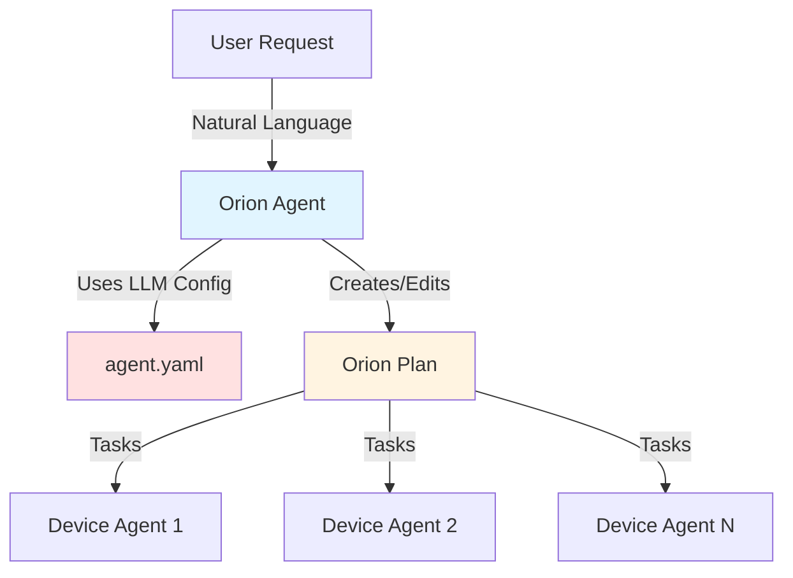

# Network Orion Agent Configuration

**agent.yaml** configures the **Orion Agent** - the AI agent responsible for creating orions (task decomposition) and editing them based on execution results.

---

## Overview

The **agent.yaml** configuration file provides **LLM and API settings** for the Orion Agent. This agent is responsible for:

- **Orion Creation**: Breaking down user requests into device-specific tasks
- **Orion Editing**: Adjusting task plans based on execution results
- **Device Selection**: Choosing appropriate devices for each sub-task
- **Task Orchestration**: Coordinating multi-device workflows

**Configuration Separation:**

- **agent.yaml** - LLM configuration for orion agent (this document)
- **orion.yaml** - Runtime settings for orchestrator ([Network Orion Configuration](./network_orion.md))
- **devices.yaml** - Device definitions ([Network Devices Configuration](./network_devices.md))

**Agent Role in System:**



---

## File Location

**Standard Location:**

```
ALIEN2/
├── config/
│   └── network/
│       ├── agent.yaml              # ← Orion agent config (copy from template)
│       ├── agent.yaml.template     # ← Template for initial setup
│       ├── orion.yaml      # ← Runtime settings
│       └── devices.yaml            # ← Device definitions
```

!!!warning "Setup Required"
    1. Copy `agent.yaml.template` to `agent.yaml`
    2. Fill in your API credentials (API_KEY, AAD_TENANT_ID, etc.)
    3. Never commit `agent.yaml` with real credentials to version control

**Loading in Code:**

```python
from config.config_loader import get_network_config

# Load Network configuration (includes agent settings)
config = get_network_config()

# Access orion agent settings
agent_config = config.orion_agent
reasoning_model = agent_config.reasoning_model
api_type = agent_config.api_type
api_model = agent_config.api_model
```

---

## Configuration Schema

### Complete Schema

```yaml
# Network Orion Agent Configuration

ORION_AGENT:
  # Reasoning
  REASONING_MODEL: bool          # Enable reasoning/chain-of-thought
  
  # API Connection
  API_TYPE: string               # API provider type
  API_BASE: string               # API base URL
  API_KEY: string                # API authentication key
  API_VERSION: string            # API version
  API_MODEL: string              # Model name/deployment
  
  # Azure AD Authentication (for azure_ad API_TYPE)
  AAD_TENANT_ID: string          # Azure AD tenant ID
  AAD_API_SCOPE: string          # API scope name
  AAD_API_SCOPE_BASE: string     # API scope base GUID
  
  # Prompt Configuration
  ORION_CREATION_PROMPT: string         # Path to creation prompt template
  ORION_EDITING_PROMPT: string          # Path to editing prompt template
  ORION_CREATION_EXAMPLE_PROMPT: string # Path to creation examples
  ORION_EDITING_EXAMPLE_PROMPT: string  # Path to editing examples
```

---

## Configuration Fields

### Reasoning Capabilities

| Field | Type | Required | Default | Description |
|-------|------|----------|---------|-------------|
| `REASONING_MODEL` | `bool` | No | `False` | Enable chain-of-thought reasoning for complex planning |

**Example:**

```yaml
ORION_AGENT:
  REASONING_MODEL: False  # Standard LLM response (faster)
```

!!!tip "Reasoning Model"
    Set `REASONING_MODEL: True` for:
    - Complex multi-device workflows
    - Tasks requiring step-by-step planning
    - Debugging orion failures
    
    **Trade-off:** Slower response time, higher token cost

---

### API Connection Settings

| Field | Type | Required | Default | Description |
|-------|------|----------|---------|-------------|
| `API_TYPE` | `string` | Yes | - | API provider: `"openai"`, `"azure"`, `"azure_ad"`, `"aoai"` |
| `API_BASE` | `string` | Yes* | - | API base URL (required for Azure) |
| `API_KEY` | `string` | Yes* | - | API authentication key (required for non-AAD auth) |
| `API_VERSION` | `string` | Yes* | - | API version (required for Azure) |
| `API_MODEL` | `string` | Yes | - | Model name or deployment name |

**Supported API Types:**

| API_TYPE | Provider | Authentication | Example API_BASE |
|----------|----------|----------------|------------------|
| `openai` | OpenAI | API Key | Not required (uses default) |
| `azure` | Azure OpenAI | API Key | `https://your-resource.openai.azure.com/` |
| `azure_ad` | Azure OpenAI | Azure AD (AAD) | `https://your-resource.azure-api.net/` |
| `aoai` | Azure OpenAI (alias) | API Key | `https://your-resource.openai.azure.com/` |

---

#### Example 1: OpenAI Configuration

```yaml
ORION_AGENT:
  API_TYPE: "openai"
  API_KEY: "sk-proj-..."           # Your OpenAI API key
  API_MODEL: "gpt-4o"              # OpenAI model name
  API_VERSION: "2024-02-01"        # Optional for OpenAI
```

---

#### Example 2: Azure OpenAI (API Key Auth)

```yaml
ORION_AGENT:
  API_TYPE: "azure"
  API_BASE: "https://my-resource.openai.azure.com/"
  API_KEY: "abc123..."             # Azure OpenAI API key
  API_VERSION: "2025-02-01-preview"
  API_MODEL: "gpt-4o-deployment"   # Your deployment name
```

---

#### Example 3: Azure OpenAI (Azure AD Auth)

```yaml
ORION_AGENT:
  API_TYPE: "azure_ad"
  API_BASE: "https://cloudgpt-openai.azure-api.net/"
  API_VERSION: "2025-02-01-preview"
  API_MODEL: "gpt-5-chat-20251003"
  
  # Azure AD Configuration
  AAD_TENANT_ID: "72f988bf-86f1-41af-91ab-2d7cd011db47"
  AAD_API_SCOPE: "openai"
  AAD_API_SCOPE_BASE: "feb7b661-cac7-44a8-8dc1-163b63c23df2"
```

!!!warning "Azure AD Authentication"
    When using `API_TYPE: "azure_ad"`:
    - No `API_KEY` needed (uses Azure AD token)
    - Requires `AAD_TENANT_ID`, `AAD_API_SCOPE`, `AAD_API_SCOPE_BASE`
    - User must be authenticated with `az login` or have proper AAD credentials

---

### Azure AD Fields (azure_ad API_TYPE only)

| Field | Type | Required | Description |
|-------|------|----------|-------------|
| `AAD_TENANT_ID` | `string` | Yes* | Azure AD tenant GUID |
| `AAD_API_SCOPE` | `string` | Yes* | API scope identifier (e.g., "openai") |
| `AAD_API_SCOPE_BASE` | `string` | Yes* | API scope base GUID |

*Required only when `API_TYPE: "azure_ad"`

---

### Prompt Configuration Paths

| Field | Type | Required | Default | Description |
|-------|------|----------|---------|-------------|
| `ORION_CREATION_PROMPT` | `string` | Yes | - | Path to orion creation prompt template |
| `ORION_EDITING_PROMPT` | `string` | Yes | - | Path to orion editing prompt template |
| `ORION_CREATION_EXAMPLE_PROMPT` | `string` | Yes | - | Path to creation examples (few-shot learning) |
| `ORION_EDITING_EXAMPLE_PROMPT` | `string` | Yes | - | Path to editing examples (few-shot learning) |

**Default Prompt Paths:**

```yaml
ORION_AGENT:
  ORION_CREATION_PROMPT: "network/prompts/orion/share/orion_creation.yaml"
  ORION_EDITING_PROMPT: "network/prompts/orion/share/orion_editing.yaml"
  ORION_CREATION_EXAMPLE_PROMPT: "network/prompts/orion/examples/orion_creation_example.yaml"
  ORION_EDITING_EXAMPLE_PROMPT: "network/prompts/orion/examples/orion_editing_example.yaml"
```

!!!tip "Custom Prompts"
    You can customize prompts for your use case:
    ```yaml
    ORION_CREATION_PROMPT: "custom_prompts/my_orion_creation.yaml"
    ```

---

## Complete Examples

### Example 1: Production (Azure AD)

```yaml
# Network Orion Agent Configuration - Production
# Uses Azure OpenAI with Azure AD authentication

ORION_AGENT:
  # Capabilities
  REASONING_MODEL: False
  
  # Azure OpenAI (Azure AD Auth)
  API_TYPE: "azure_ad"
  API_BASE: "https://cloudgpt-openai.azure-api.net/"
  API_VERSION: "2025-02-01-preview"
  API_MODEL: "gpt-5-chat-20251003"
  
  # Azure AD Configuration
  AAD_TENANT_ID: "72f988bf-86f1-41af-91ab-2d7cd011db47"
  AAD_API_SCOPE: "openai"
  AAD_API_SCOPE_BASE: "feb7b661-cac7-44a8-8dc1-163b63c23df2"
  
  # Prompt Configurations
  ORION_CREATION_PROMPT: "network/prompts/orion/share/orion_creation.yaml"
  ORION_EDITING_PROMPT: "network/prompts/orion/share/orion_editing.yaml"
  ORION_CREATION_EXAMPLE_PROMPT: "network/prompts/orion/examples/orion_creation_example.yaml"
  ORION_EDITING_EXAMPLE_PROMPT: "network/prompts/orion/examples/orion_editing_example.yaml"
```

---

### Example 2: Development (OpenAI)

```yaml
# Network Orion Agent Configuration - Development
# Uses OpenAI API for quick testing

ORION_AGENT:
  # Capabilities
  REASONING_MODEL: True   # Enable for debugging
  
  # OpenAI API
  API_TYPE: "openai"
  API_KEY: "sk-proj-..."  # Your OpenAI API key (DO NOT COMMIT!)
  API_MODEL: "gpt-4o"
  API_VERSION: "2024-02-01"
  
  # Prompt Configurations (default paths)
  ORION_CREATION_PROMPT: "network/prompts/orion/share/orion_creation.yaml"
  ORION_EDITING_PROMPT: "network/prompts/orion/share/orion_editing.yaml"
  ORION_CREATION_EXAMPLE_PROMPT: "network/prompts/orion/examples/orion_creation_example.yaml"
  ORION_EDITING_EXAMPLE_PROMPT: "network/prompts/orion/examples/orion_editing_example.yaml"
```

---

### Example 3: Azure OpenAI (API Key)

```yaml
# Network Orion Agent Configuration - Azure (API Key Auth)
# Uses Azure OpenAI with API key authentication

ORION_AGENT:
  # Capabilities
  REASONING_MODEL: False
  
  # Azure OpenAI (API Key Auth)
  API_TYPE: "azure"
  API_BASE: "https://my-openai-resource.openai.azure.com/"
  API_KEY: "abc123..."    # Azure OpenAI API key (DO NOT COMMIT!)
  API_VERSION: "2025-02-01-preview"
  API_MODEL: "gpt-4o-deployment-name"
  
  # Prompt Configurations
  ORION_CREATION_PROMPT: "network/prompts/orion/share/orion_creation.yaml"
  ORION_EDITING_PROMPT: "network/prompts/orion/share/orion_editing.yaml"
  ORION_CREATION_EXAMPLE_PROMPT: "network/prompts/orion/examples/orion_creation_example.yaml"
  ORION_EDITING_EXAMPLE_PROMPT: "network/prompts/orion/examples/orion_editing_example.yaml"
```

---

## Security Best Practices

!!!danger "Never Commit Credentials"
    **DO NOT commit `agent.yaml` with real credentials to version control!**
    
    ✅ **Recommended Workflow:**
    ```bash
    # 1. Copy template
    cp config/network/agent.yaml.template config/network/agent.yaml
    
    # 2. Edit agent.yaml with your credentials
    # (This file is .gitignored)
    
    # 3. Commit only the template
    git add config/network/agent.yaml.template
    git commit -m "Update agent template"
    ```

**Use Environment Variables for Sensitive Data:**

```yaml
# In agent.yaml
ORION_AGENT:
  API_KEY: ${NETWORK_API_KEY}  # Read from environment variable
```

```bash
# In your shell
export NETWORK_API_KEY="sk-proj-..."
```

---

## Integration with Other Configurations

The agent configuration works together with other Network configs:

**agent.yaml** (LLM config) + **orion.yaml** (runtime) + **devices.yaml** (devices) → **Complete Network System**

### Complete Initialization Example

```python
from config.config_loader import get_network_config
from network.agents.orion_agent import OrionAgent
from network.client.device_manager import OrionDeviceManager
import yaml

# 1. Load all Network configurations
network_config = get_network_config()

# 2. Initialize Orion Agent with LLM config
agent = OrionAgent(
    reasoning_model=network_config.orion_agent.reasoning_model,
    api_type=network_config.orion_agent.api_type,
    api_base=network_config.orion_agent.api_base,
    api_key=network_config.orion_agent.api_key,
    api_version=network_config.orion_agent.api_version,
    api_model=network_config.orion_agent.api_model
)

# 3. Load orion runtime settings
with open("config/network/orion.yaml", "r") as f:
    orion_config = yaml.safe_load(f)

# 4. Initialize Device Manager with runtime settings
device_manager = OrionDeviceManager(
    task_name=orion_config["ORION_ID"],
    heartbeat_interval=orion_config["HEARTBEAT_INTERVAL"],
    reconnect_delay=orion_config["RECONNECT_DELAY"]
)

# 5. Load and register devices
device_config_path = orion_config["DEVICE_INFO"]
with open(device_config_path, "r") as f:
    devices_config = yaml.safe_load(f)

for device in devices_config["devices"]:
    await device_manager.register_device(**device)

print("✅ Network Orion System Initialized")
print(f"   Agent Model: {network_config.orion_agent.api_model}")
print(f"   Orion ID: {orion_config['ORION_ID']}")
print(f"   Devices: {len(devices_config['devices'])}")
```

---

## Best Practices

**Configuration Best Practices:**

1. **Use Templates for Team Collaboration**
   ```bash
   # Share template, not credentials
   config/network/agent.yaml.template  # ✅ Commit this
   config/network/agent.yaml           # ❌ Never commit this
   ```

2. **Test with OpenAI, Deploy with Azure**
   ```yaml
   # Development: OpenAI (fast iteration)
   API_TYPE: "openai"
   
   # Production: Azure (enterprise features)
   API_TYPE: "azure_ad"
   ```

3. **Use Reasoning Mode Selectively**
   ```yaml
   # For complex workflows
   REASONING_MODEL: True
   
   # For simple tasks
   REASONING_MODEL: False  # Faster
   ```

---

## Related Documentation

| Topic | Document | Description |
|-------|----------|-------------|
| **Orion Runtime** | [Network Orion Configuration](./network_orion.md) | Runtime settings for orchestrator |
| **Device Configuration** | [Network Devices Configuration](./network_devices.md) | Device definitions |
| **System Configuration** | [Configuration Overview](./overview.md) | Overall configuration architecture |

---

## Next Steps

1. **Copy Template**: `cp agent.yaml.template agent.yaml`
2. **Configure Credentials**: Fill in API_KEY or AAD settings
3. **Configure Runtime**: See [Network Orion Configuration](./network_orion.md)
4. **Configure Devices**: See [Network Devices Configuration](./network_devices.md)
5. **Test Orion**: Run Network orchestrator

---

## Source Code References

- **OrionAgent**: `network/agents/orion_agent.py`
- **Configuration Loading**: `config/config_loader.py`
- **Configuration Schemas**: `config/config_schemas.py`
- **Prompt Templates**: `network/prompts/orion/`
