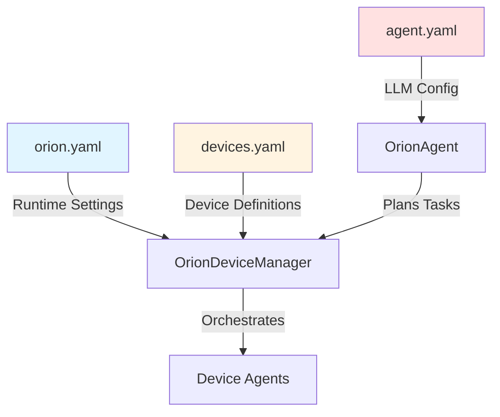
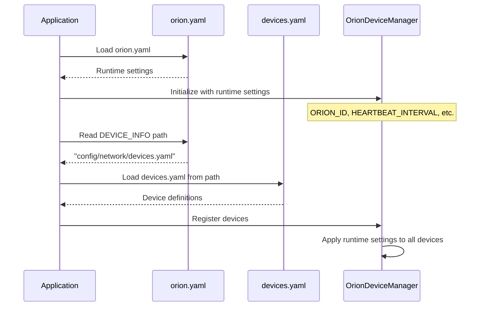

# Network Orion Runtime Configuration

**orion.yaml** defines orion-wide runtime settings that control how the Network orchestrator manages devices, tasks, and logging across the entire orion system.

---

## Overview

The **orion.yaml** configuration file provides **orion-level runtime settings** that apply to the entire Network system. These settings control:

- Orion identification and logging
- Heartbeat and connection management
- Task concurrency and step limits
- Device configuration file path

**Configuration Separation:**

- **orion.yaml** - Runtime settings for the orion orchestrator (this document)
- **devices.yaml** - Individual device definitions ([Network Devices Configuration](./network_devices.md))
- **agent.yaml** - LLM configuration for orion agent ([Network Agent Configuration](./network_agent.md))

**Configuration Relationship:**



---

## File Location

**Standard Location:**

```
ALIEN2/
├── config/
│   └── network/
│       ├── orion.yaml     # ← Runtime settings (this file)
│       ├── devices.yaml           # ← Device definitions
│       └── agent.yaml.template    # ← Agent LLM configuration template
```

**Loading in Code:**

```python
import yaml
from network.client.device_manager import OrionDeviceManager

# Load orion configuration
with open("config/network/orion.yaml", "r", encoding="utf-8") as f:
    config = yaml.safe_load(f)

# Initialize OrionDeviceManager with runtime settings
manager = OrionDeviceManager(
    task_name=config["ORION_ID"],
    heartbeat_interval=config["HEARTBEAT_INTERVAL"],
    reconnect_delay=config["RECONNECT_DELAY"]
)

# Load device configuration from specified path
device_config_path = config["DEVICE_INFO"]
with open(device_config_path, "r", encoding="utf-8") as f:
    devices_config = yaml.safe_load(f)

# Register devices
for device in devices_config["devices"]:
    await manager.register_device(**device)
```

---

## Configuration Schema

### Complete Schema

```yaml
# Network Orion Configuration
# Runtime settings for orion system

# Orion Identity & Logging
ORION_ID: string           # Unique orion identifier
LOG_TO_MARKDOWN: bool              # Save trajectory logs to markdown

# Connection & Health Management
HEARTBEAT_INTERVAL: float          # Heartbeat check interval (seconds)
RECONNECT_DELAY: float             # Reconnection delay (seconds)

# Task & Execution Limits
MAX_CONCURRENT_TASKS: int          # Maximum concurrent tasks
MAX_STEP: int                      # Maximum steps per session

# Device Configuration Reference
DEVICE_INFO: string                # Path to devices.yaml file
```

---

## Configuration Fields

### Orion Identity & Logging

| Field | Type | Required | Default | Description |
|-------|------|----------|---------|-------------|
| `ORION_ID` | `string` | Yes | - | Unique identifier for this orion instance |
| `LOG_TO_MARKDOWN` | `bool` | No | `true` | Whether to save trajectory logs in markdown format |

**Example:**

```yaml
ORION_ID: "production_orion"
LOG_TO_MARKDOWN: true
```

**Orion ID Best Practices:**

Use descriptive names that indicate environment and purpose:
- `production_main` - Main production orion
- `dev_testing` - Development testing orion
- `qa_regression` - QA regression testing orion

---

### Connection & Health Management

| Field | Type | Required | Default | Description |
|-------|------|----------|---------|-------------|
| `HEARTBEAT_INTERVAL` | `float` | No | `30.0` | Interval (in seconds) between heartbeat checks for connected devices |
| `RECONNECT_DELAY` | `float` | No | `5.0` | Delay (in seconds) before attempting to reconnect a failed device |

**Example:**

```yaml
HEARTBEAT_INTERVAL: 30.0  # Check device health every 30 seconds
RECONNECT_DELAY: 5.0      # Wait 5 seconds before reconnecting
```

!!!info "Heartbeat Mechanism"
    The heartbeat system monitors device agent connections:
    - Every `HEARTBEAT_INTERVAL` seconds, the orion checks if devices are responsive
    - If a device fails to respond, it is marked as `FAILED`
    - After `RECONNECT_DELAY` seconds, automatic reconnection is attempted
    - Reconnection continues until `max_retries` is reached (configured per-device in devices.yaml)

**Tuning Guidelines:**

| Environment | HEARTBEAT_INTERVAL | RECONNECT_DELAY | Rationale |
|-------------|-------------------|-----------------|-----------|
| **Production** | 10.0 - 30.0 | 5.0 - 10.0 | Balance responsiveness with network overhead |
| **Development** | 30.0 - 60.0 | 3.0 - 5.0 | Reduce noise during debugging |
| **Testing** | 5.0 - 10.0 | 2.0 - 3.0 | Faster failure detection for tests |

---

### Task & Execution Limits

| Field | Type | Required | Default | Description |
|-------|------|----------|---------|-------------|
| `MAX_CONCURRENT_TASKS` | `int` | No | `6` | Maximum number of tasks that can run concurrently across all devices |
| `MAX_STEP` | `int` | No | `15` | Maximum number of steps allowed per session before termination |

**Example:**

```yaml
MAX_CONCURRENT_TASKS: 6   # Allow 6 tasks to run simultaneously
MAX_STEP: 15              # Limit sessions to 15 steps
```

!!!warning "Concurrency Considerations"
    - **MAX_CONCURRENT_TASKS** controls task queue parallelism across the entire orion
    - Each device can handle 1 task at a time (per device, not global)
    - Example: 6 devices + MAX_CONCURRENT_TASKS=6 → All devices can be busy simultaneously
    - Example: 10 devices + MAX_CONCURRENT_TASKS=4 → Only 4 devices busy at once, 6 idle

**Task Concurrency Calculation:**

```python
# Effective concurrency
effective_concurrency = min(
    num_registered_devices,
    MAX_CONCURRENT_TASKS
)

# Example 1: 3 devices, MAX_CONCURRENT_TASKS=6
# → effective_concurrency = 3 (device-limited)

# Example 2: 10 devices, MAX_CONCURRENT_TASKS=4
# → effective_concurrency = 4 (config-limited)
```

**MAX_STEP Guidelines:**

| Use Case | MAX_STEP | Rationale |
|----------|----------|-----------|
| **Simple Automation** | 5 - 10 | Quick tasks (open app, click button) |
| **Complex Workflows** | 15 - 30 | Multi-step processes (data entry, reporting) |
| **Unrestricted** | 100+ | Research, exploratory tasks |

---

### Device Configuration Reference

| Field | Type | Required | Default | Description |
|-------|------|----------|---------|-------------|
| `DEVICE_INFO` | `string` | Yes | - | Relative or absolute path to `devices.yaml` configuration file |

**Example:**

```yaml
DEVICE_INFO: "config/network/devices.yaml"
```

**Path Resolution:**

- **Relative paths** are resolved from the ALIEN2 project root
- **Absolute paths** are supported for external configuration files
- The loader validates that the file exists and is readable

**Example Paths:**

```yaml
# Relative path (recommended)
DEVICE_INFO: "config/network/devices.yaml"

# Absolute path
DEVICE_INFO: "/etc/alien/network/devices.yaml"

# Different config for testing
DEVICE_INFO: "config/network/devices_test.yaml"
```

---

## Complete Examples

### Example 1: Production Configuration

```yaml
# Network Orion Configuration - Production
# High reliability, moderate concurrency

# Identity & Logging
ORION_ID: "production_main"
LOG_TO_MARKDOWN: true

# Connection & Health
HEARTBEAT_INTERVAL: 15.0   # Fast failure detection
RECONNECT_DELAY: 10.0      # Give devices time to recover

# Task Limits
MAX_CONCURRENT_TASKS: 10   # High concurrency for production load
MAX_STEP: 20               # Allow complex workflows

# Device Configuration
DEVICE_INFO: "config/network/devices.yaml"
```

**Use Case:** Production orion managing office automation across 10+ devices.

---

### Example 2: Development Configuration

```yaml
# Network Orion Configuration - Development
# Relaxed settings for testing and debugging

# Identity & Logging
ORION_ID: "dev_testing"
LOG_TO_MARKDOWN: true

# Connection & Health
HEARTBEAT_INTERVAL: 60.0   # Reduce noise during debugging
RECONNECT_DELAY: 5.0       # Fast reconnects for quick iteration

# Task Limits
MAX_CONCURRENT_TASKS: 3    # Limit concurrency for easier debugging
MAX_STEP: 50               # Allow exploration and experimentation

# Device Configuration
DEVICE_INFO: "config/network/devices_dev.yaml"
```

**Use Case:** Development environment with 2-3 test devices for feature development.

---

### Example 3: Testing/CI Configuration

```yaml
# Network Orion Configuration - CI/CD
# Fast failure detection, limited concurrency

# Identity & Logging
ORION_ID: "ci_regression"
LOG_TO_MARKDOWN: true

# Connection & Health
HEARTBEAT_INTERVAL: 5.0    # Very fast detection for CI
RECONNECT_DELAY: 2.0       # Quick retries in CI environment

# Task Limits
MAX_CONCURRENT_TASKS: 4    # Parallel test execution
MAX_STEP: 15               # Strict limits for regression tests

# Device Configuration
DEVICE_INFO: "config/network/devices_ci.yaml"
```

**Use Case:** Automated testing in CI/CD pipeline with controlled test devices.

---

## Integration with Device Configuration

The orion configuration works together with device configuration:

**orion.yaml (runtime)** + **devices.yaml (device definitions)** → **Complete Orion System**

### Loading Workflow



### Example: Complete Initialization

```python
import yaml
from network.client.device_manager import OrionDeviceManager

# 1. Load orion runtime settings
with open("config/network/orion.yaml", "r", encoding="utf-8") as f:
    orion_config = yaml.safe_load(f)

# 2. Initialize manager with runtime settings
manager = OrionDeviceManager(
    task_name=orion_config["ORION_ID"],
    heartbeat_interval=orion_config["HEARTBEAT_INTERVAL"],
    reconnect_delay=orion_config["RECONNECT_DELAY"]
)

# 3. Load device configuration from path specified in orion.yaml
device_config_path = orion_config["DEVICE_INFO"]
with open(device_config_path, "r", encoding="utf-8") as f:
    devices_config = yaml.safe_load(f)

# 4. Register all devices
for device in devices_config["devices"]:
    await manager.register_device(
        device_id=device["device_id"],
        server_url=device["server_url"],
        os=device.get("os"),
        capabilities=device.get("capabilities", []),
        metadata=device.get("metadata", {}),
        max_retries=device.get("max_retries", 5),
        auto_connect=device.get("auto_connect", True)
    )

print(f"✅ Orion '{orion_config['ORION_ID']}' initialized")
print(f"   Devices registered: {len(devices_config['devices'])}")
print(f"   Max concurrent tasks: {orion_config['MAX_CONCURRENT_TASKS']}")
```

---

## Best Practices

**Configuration Best Practices:**

1. **Use Environment-Specific Configurations**
   ```bash
   config/network/
   ├── orion.yaml           # Base production config
   ├── orion_dev.yaml       # Development overrides
   ├── orion_test.yaml      # Testing overrides
   ```

2. **Tune Heartbeat for Your Network**
   ```yaml
   # Local network - fast heartbeats
   HEARTBEAT_INTERVAL: 10.0
   
   # WAN/Internet - slower heartbeats
   HEARTBEAT_INTERVAL: 60.0
   ```

3. **Match Concurrency to Use Case**
   ```yaml
   # High-throughput automation
   MAX_CONCURRENT_TASKS: 20
   
   # Resource-constrained environment
   MAX_CONCURRENT_TASKS: 3
   ```

4. **Set Reasonable Step Limits**
   ```yaml
   # Prevent runaway sessions
   MAX_STEP: 30
   
   # For debugging (see all steps)
   MAX_STEP: 100
   ```

---

## Related Documentation

| Topic | Document | Description |
|-------|----------|-------------|
| **Device Configuration** | [Network Devices Configuration](./network_devices.md) | Device definitions and capabilities |
| **Agent Configuration** | [Network Agent Configuration](./network_agent.md) | LLM settings for orion agent |
| **Agent Registration** | [Agent Registration Overview](../../network/agent_registration/overview.md) | Registration process and architecture |
| **System Configuration** | [Configuration Overview](./overview.md) | Overall configuration architecture |

---

## Next Steps

1. **Configure Devices**: See [Network Devices Configuration](./network_devices.md)
2. **Configure Agent**: See [Network Agent Configuration](./network_agent.md)
3. **Understand Registration**: Read [Agent Registration Overview](../../network/agent_registration/overview.md)
4. **Run Orion**: Check Network orchestrator documentation

---

## Source Code References

- **OrionDeviceManager**: `network/client/device_manager.py`
- **Configuration Loading**: `config/config_loader.py`
- **Configuration Schemas**: `config/config_schemas.py`
