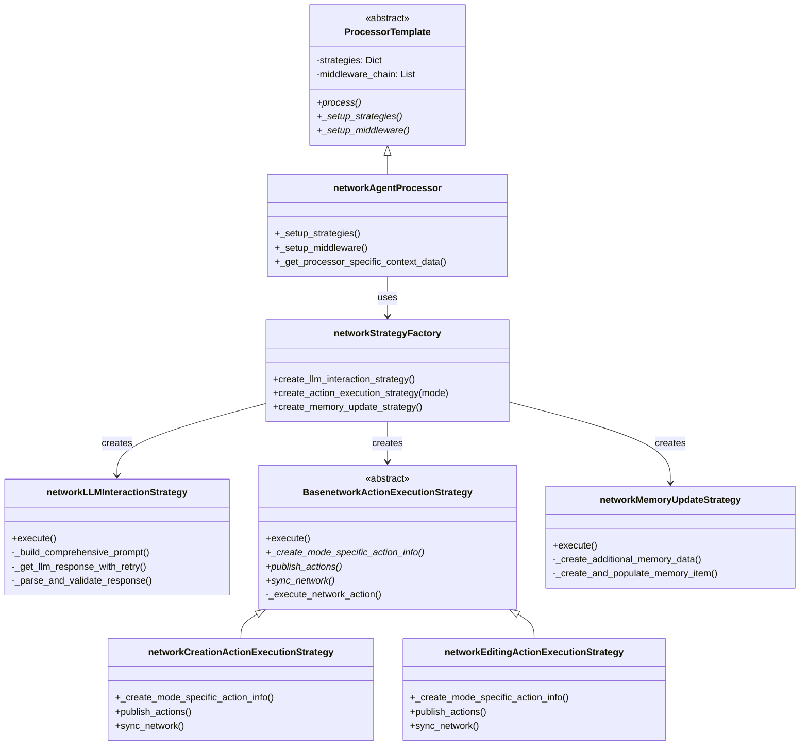
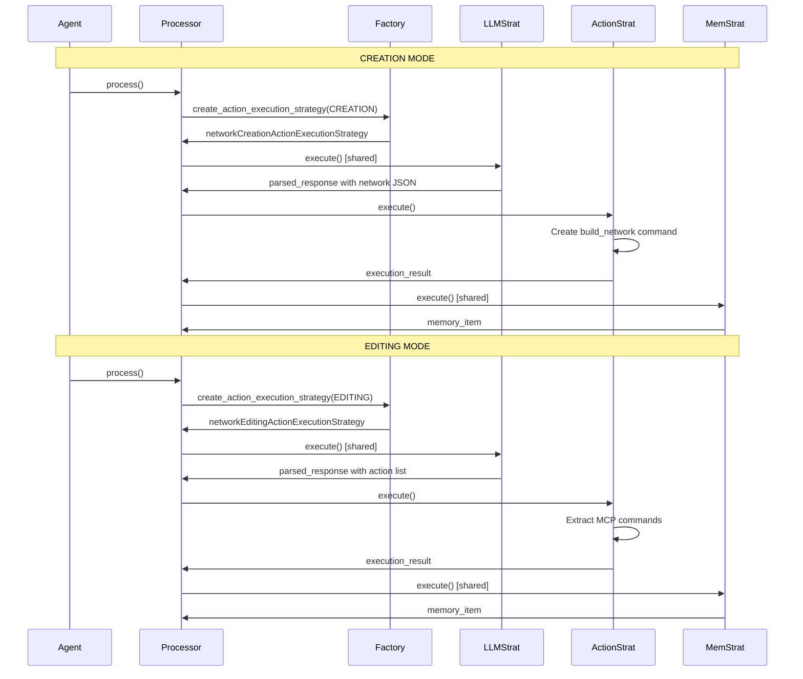

# Processing Strategy Pattern

## Overview

The network Agent employs a sophisticated **multi-phase processing architecture** based on the [`ProcessorTemplate`](../../infrastructure/agents/design/processor.md) framework. The core orchestrator `networkAgentProcessor` assembles different processing strategies for three distinct phases: **LLM Interaction**, **Action Execution**, and **Memory Update**. This modular design separates concerns, enables mode-specific behaviors, and provides robust error handling across the processing pipeline.

The network Agent uses `networkAgentProcessor` as the central orchestrator, which dynamically creates and configures processing strategies based on the weaving mode (CREATION vs. EDITING). This follows the Template Method pattern with Strategy composition.

### Core Architecture



### Processing Phases

| Phase | Strategy | Purpose | Mode-Specific |
|-------|----------|---------|---------------|
| **LLM Interaction** | `networkLLMInteractionStrategy` | Prompt construction, LLM response parsing | ❌ Shared |
| **Action Execution** | `networkCreation/EditingActionExecutionStrategy` | Action generation and execution | ✅ Mode-specific |
| **Memory Update** | `networkMemoryUpdateStrategy` | Memory logging and state tracking | ❌ Shared |

---

## Processor Framework

### networkAgentProcessor

The `networkAgentProcessor` extends `ProcessorTemplate` to orchestrate the entire processing workflow. It assembles strategies based on weaving mode and manages the execution pipeline.

#### Initialization

```python
class networkAgentProcessor(ProcessorTemplate):
    """Enhanced processor for network Agent."""
    
    processor_context_class: Type[networkProcessorContext] = (
        networkProcessorContext
    )
    
    def __init__(
        self,
        agent: "networkAgent",
        global_context: Context
    ) -> None:
        """Initialize with agent and global context."""
        super().__init__(agent, global_context)
```

#### Strategy Assembly

The processor creates appropriate strategies based on weaving mode:

```python
def _setup_strategies(self) -> None:
    """Configure processing strategies using factory pattern."""
    
    # Get weaving mode from context
    weaving_mode = self.global_context.get(ContextNames.WEAVING_MODE)
    
    if not weaving_mode:
        raise ValueError("Weaving mode must be specified in global context")
    
    # Create strategies via factory
    self.strategies[ProcessingPhase.LLM_INTERACTION] = (
        networkStrategyFactory.create_llm_interaction_strategy(
            fail_fast=True,  # LLM interaction failure should trigger recovery
        )
    )
    
    self.strategies[ProcessingPhase.ACTION_EXECUTION] = (
        networkStrategyFactory.create_action_execution_strategy(
            weaving_mode=weaving_mode,
            fail_fast=False,  # Action failures can be handled gracefully
        )
    )
    
    self.strategies[ProcessingPhase.MEMORY_UPDATE] = (
        networkStrategyFactory.create_memory_update_strategy(
            fail_fast=False  # Memory update failures shouldn't stop the process
        )
    )
```

#### Middleware Configuration

```python
def _setup_middleware(self) -> None:
    """Set up enhanced middleware chain with comprehensive monitoring."""
    self.middleware_chain = [
        networkLoggingMiddleware()  # Specialized logging for network Agent
    ]
```

#### Context Management

```python
def _get_processor_specific_context_data(self) -> Dict[str, Any]:
    """Provide network-specific context initialization."""
    
    before_network = self.global_context.get(
        ContextNames.network
    )
    
    return {
        "weaving_mode": self.global_context.get(ContextNames.WEAVING_MODE),
        "device_info": self.global_context.get(ContextNames.DEVICE_INFO),
        "network_before": (
            before_network.to_json() if before_network else None
        ),
    }
```

### Processing Context

The `networkProcessorContext` extends `BasicProcessorContext` with network-specific data:

```python
@dataclass
class networkProcessorContext(BasicProcessorContext):
    """network-specific processor context."""
    
    # Agent metadata
    agent_type: str = "networkAgent"
    weaving_mode: str = "CREATION"
    
    # Device and network state
    device_info: List[Dict] = field(default_factory=list)
    network_before: Optional[str] = None
    network_after: Optional[str] = None
    
    # Action information
    action_info: Optional[ActionCommandInfo] = None
    target: Optional[TargetInfo] = None
    
    # Performance tracking
    llm_cost: float = 0.0
    prompt_tokens: int = 0
    completion_tokens: int = 0
```

---

## Strategy Factory

### networkStrategyFactory

The factory provides centralized strategy creation with mode-aware instantiation.

#### Factory Methods

```python
class networkStrategyFactory:
    """Factory for creating network processing strategies."""
    
    _action_execution_strategies: Dict[WeavingMode, Type[BaseProcessingStrategy]] = {
        WeavingMode.CREATION: networkCreationActionExecutionStrategy,
        WeavingMode.EDITING: networkEditingActionExecutionStrategy,
    }
    
    @classmethod
    def create_llm_interaction_strategy(
        cls,
        fail_fast: bool = True
    ) -> BaseProcessingStrategy:
        """Create LLM interaction strategy (shared across modes)."""
        return networkLLMInteractionStrategy(fail_fast)
    
    @classmethod
    def create_action_execution_strategy(
        cls,
        weaving_mode: WeavingMode,
        fail_fast: bool = False
    ) -> BaseProcessingStrategy:
        """Create mode-specific action execution strategy."""
        
        if weaving_mode not in cls._action_execution_strategies:
            raise ValueError(f"Unsupported mode: {weaving_mode}")
        
        strategy_class = cls._action_execution_strategies[weaving_mode]
        return strategy_class(fail_fast=fail_fast)
    
    @classmethod
    def create_memory_update_strategy(
        cls,
        fail_fast: bool = False
    ) -> BaseProcessingStrategy:
        """Create memory update strategy (shared across modes)."""
        return networkMemoryUpdateStrategy(fail_fast=fail_fast)
```

#### Batch Strategy Creation

```python
@classmethod
def create_all_strategies(
    cls,
    weaving_mode: WeavingMode,
    llm_fail_fast: bool = True,
    action_fail_fast: bool = False,
    memory_fail_fast: bool = False,
) -> Dict[str, BaseProcessingStrategy]:
    """Create all required strategies for a weaving mode."""
    
    return {
        "llm_interaction": cls.create_llm_interaction_strategy(llm_fail_fast),
        "action_execution": cls.create_action_execution_strategy(
            weaving_mode, action_fail_fast
        ),
        "memory_update": cls.create_memory_update_strategy(memory_fail_fast),
    }
```

**Note:** The `create_llm_interaction_strategy()` returns a shared `networkLLMInteractionStrategy` (not mode-specific), as LLM interaction logic is the same across creation and editing modes.

---

## LLM Interaction Strategy

### networkLLMInteractionStrategy

Handles prompt construction, LLM communication, and response parsing. This strategy is **shared across both creation and editing modes**, with mode-specific prompt generation delegated to the agent's prompter.

#### Strategy Execution

```python
@provides(
    "parsed_response",
    "response_text",
    "llm_cost",
    "prompt_message",
    "status",
)
class networkLLMInteractionStrategy(BaseProcessingStrategy):
    """LLM interaction strategy for network Agent."""
    
    async def execute(
        self,
        agent: "networkAgent",
        context: ProcessingContext
    ) -> ProcessingResult:
        """Execute LLM interaction with retry logic."""
        
        try:
            # Extract context
            session_step = context.get_local("session_step", 0)
            device_info = context.get_local("device_info", {})
            network = context.get_global("network")
            request = context.get("request", "")
            
            # Build prompt (delegates to agent's prompter)
            prompt_message = await self._build_comprehensive_prompt(
                agent, device_info, network, request, ...
            )
            
            # Get LLM response with retry
            response_text, llm_cost = await self._get_llm_response_with_retry(
                agent, prompt_message
            )
            
            # Parse and validate
            parsed_response = self._parse_and_validate_response(
                agent, response_text
            )
            
            return ProcessingResult(
                success=True,
                data={
                    "parsed_response": parsed_response,
                    "response_text": response_text,
                    "llm_cost": llm_cost,
                    **parsed_response.model_dump(),
                },
                phase=ProcessingPhase.LLM_INTERACTION,
            )
            
        except Exception as e:
            return self.handle_error(e, ProcessingPhase.LLM_INTERACTION, context)
```

#### Prompt Construction

The strategy delegates mode-specific prompt building to the agent's prompter:

```python
async def _build_comprehensive_prompt(
    self,
    agent: "networkAgent",
    device_info: Dict,
    network: Tasknetwork,
    request: str,
    ...
) -> Dict[str, Any]:
    """Build prompt using agent's mode-specific prompter."""
    
    # Agent's message_constructor uses the appropriate prompter
    # (networkCreationPrompter or networkEditingPrompter)
    prompt_message = agent.message_constructor(
        request=request,
        device_info=device_info,
        network=network
    )
    
    # Log request for debugging
    self._log_request_data(...)
    
    return prompt_message
```

The LLM strategy doesn't implement prompt construction directly. Instead, it calls `agent.message_constructor()`, which delegates to the appropriate prompter based on weaving mode. For details on prompter design, see the [Prompter Framework](../../infrastructure/agents/design/prompter.md). The prompters are responsible for mode-specific prompt formatting.

#### Retry Logic

```python
async def _get_llm_response_with_retry(
    self,
    agent: "networkAgent",
    prompt_message: Dict[str, Any]
) -> tuple[str, float]:
    """Get LLM response with retry for JSON parsing failures."""
    
    max_retries = Alien_config.system.JSON_PARSING_RETRY
    
    for retry_count in range(max_retries):
        try:
            # Get response from LLM
            response_text, cost = await asyncio.get_event_loop().run_in_executor(
                None,
                agent.get_response,
                prompt_message,
                AgentType.network,
                True  # use_backup_engine
            )
            
            # Validate JSON parsing
            agent.response_to_dict(response_text)
            
            return response_text, cost
            
        except Exception as e:
            if retry_count < max_retries - 1:
                self.logger.warning(f"Retry {retry_count + 1}/{max_retries}")
            else:
                raise Exception(f"Failed after {max_retries} attempts: {e}")
```

#### Response Validation

```python
def _parse_and_validate_response(
    self,
    agent: "networkAgent",
    response_text: str
) -> networkAgentResponse:
    """Parse and validate LLM response."""
    
    response_dict = agent.response_to_dict(response_text)
    parsed_response = networkAgentResponse.model_validate(response_dict)
    
    # Validate required fields
    if not parsed_response.thought:
        raise ValueError("Missing 'thought' field")
    if not parsed_response.status:
        raise ValueError("Missing 'status' field")
    
    agent.print_response(parsed_response)
    return parsed_response
```

---

## Action Execution Strategies

### Base Action Execution Strategy

The `BasenetworkActionExecutionStrategy` provides shared logic for action execution, with abstract methods for mode-specific behaviors.

```python
@depends_on("parsed_response")
@provides("execution_result", "action_info", "status")
class BasenetworkActionExecutionStrategy(BaseProcessingStrategy):
    """Base strategy for executing network actions."""
    
    def __init__(self, weaving_mode: WeavingMode, fail_fast: bool = False):
        super().__init__(
            name=f"network_action_execution_{weaving_mode.value}",
            fail_fast=fail_fast
        )
        self.weaving_mode = weaving_mode
    
    async def execute(
        self,
        agent: "networkAgent",
        context: ProcessingContext
    ) -> ProcessingResult:
        """Execute network actions with mode-specific logic."""
        
        parsed_response = context.get_local("parsed_response")
        command_dispatcher = context.global_context.command_dispatcher
        
        # Create mode-specific action info (abstract method)
        action_info = await self._create_mode_specific_action_info(
            agent, parsed_response
        )
        
        # Execute actions via dispatcher
        execution_results = await self._execute_network_action(
            command_dispatcher, action_info
        )
        
        # Sync network state (abstract method)
        self.sync_network(execution_results, context)
        
        # Create action info for memory
        actions = self._create_action_info(action_info, execution_results)
        
        # Publish actions (abstract method)
        action_list_info = ListActionCommandInfo(actions)
        await self.publish_actions(agent, action_list_info)
        
        return ProcessingResult(
            success=True,
            data={
                "execution_result": execution_results,
                "action_info": action_list_info,
                "status": parsed_response.status,
            },
            phase=ProcessingPhase.ACTION_EXECUTION,
        )
    
    @abstractmethod
    async def _create_mode_specific_action_info(
        self, agent, parsed_response
    ) -> ActionCommandInfo | List[ActionCommandInfo]:
        """Must be implemented by subclasses."""
        pass
    
    @abstractmethod
    async def publish_actions(
        self, agent, actions
    ) -> None:
        """Must be implemented by subclasses."""
        pass
    
    @abstractmethod
    def sync_network(self, results, context) -> None:
        """Must be implemented by subclasses."""
        pass
```

#### Shared Action Execution

```python
async def _execute_network_action(
    self,
    command_dispatcher: BasicCommandDispatcher,
    actions: ActionCommandInfo | List[ActionCommandInfo],
) -> List[Result]:
    """Execute actions via command dispatcher."""
    
    if isinstance(actions, ActionCommandInfo):
        actions = [actions]
    
    commands = [
        Command(
            tool_name=action.function,
            parameters=action.arguments or {},
            tool_type="action"
        )
        for action in actions if action.function
    ]
    
    return await command_dispatcher.execute_commands(commands)
```

### Creation Mode Strategy

The `networkCreationActionExecutionStrategy` implements creation-specific action generation.

```python
class networkCreationActionExecutionStrategy(
    BasenetworkActionExecutionStrategy
):
    """Action execution for network creation mode."""
    
    def __init__(self, fail_fast: bool = False):
        super().__init__(weaving_mode=WeavingMode.CREATION, fail_fast=fail_fast)
    
    async def _create_mode_specific_action_info(
        self,
        agent: "networkAgent",
        parsed_response: networkAgentResponse
    ) -> List[ActionCommandInfo]:
        """Create network building action."""
        
        if not parsed_response.network:
            self.logger.warning("No network in response")
            return []
        
        return [
            ActionCommandInfo(
                function=agent._network_creation_tool_name,  # "build_network"
                arguments={"config": parsed_response.network},
            )
        ]
    
    def sync_network(
        self,
        results: List[Result],
        context: ProcessingContext
    ) -> None:
        """Sync newly created network to context."""
        
        network_json = results[0].result if results else None
        if network_json:
            network = Tasknetwork.from_json(network_json)
            context.global_context.set(ContextNames.network, network)
    
    async def publish_actions(
        self, agent, actions: ListActionCommandInfo
    ) -> None:
        """Publish network creation actions as events."""
        # Publishes simplified event for WebUI display
        pass
```

### Editing Mode Strategy

The `networkEditingActionExecutionStrategy` implements editing-specific action extraction and network synchronization.

```python
class networkEditingActionExecutionStrategy(
    BasenetworkActionExecutionStrategy
):
    """Action execution for network editing mode."""
    
    def __init__(self, fail_fast: bool = False):
        super().__init__(weaving_mode=WeavingMode.EDITING, fail_fast=fail_fast)
    
    async def _create_mode_specific_action_info(
        self,
        agent: "networkAgent",
        parsed_response: networkAgentResponse
    ) -> List[ActionCommandInfo]:
        """Extract editing actions from LLM response."""
        
        if parsed_response.action:
            return parsed_response.action
        else:
            return []
    
    def sync_network(
        self,
        results: List[Result],
        context: ProcessingContext
    ) -> None:
        """Sync modified network from MCP tool results."""
        
        # Find last successful result with network data
        network_json = None
        for result in reversed(results):
            if result.status == ResultStatus.SUCCESS and result.result:
                if isinstance(result.result, str):
                    if '"network_id"' in result.result or '"tasks"' in result.result:
                        network_json = result.result
                        break
                elif isinstance(result.result, dict):
                    if "network_id" in result.result or "tasks" in result.result:
                        network_json = result.result
                        break
        
        if network_json:
            if isinstance(network_json, str):
                network = Tasknetwork.from_json(network_json)
            else:
                network = Tasknetwork.from_dict(network_json)
            
            context.global_context.set(ContextNames.network, network)
            self.logger.info(f"Synced network: {network.network_id}")
    
    async def publish_actions(self, agent, actions: ListActionCommandInfo) -> None:
        """Publish editing actions as events for WebUI display."""
        # Publishes detailed action events
        pass
```

---

## Memory Update Strategy

### networkMemoryUpdateStrategy

The memory update strategy is **shared across both modes** and handles comprehensive memory logging.

```python
@depends_on("parsed_response")
@provides("additional_memory", "memory_item", "memory_keys_count")
class networkMemoryUpdateStrategy(BaseProcessingStrategy):
    """Memory update strategy (shared across modes)."""
    
    async def execute(
        self,
        agent: "networkAgent",
        context: ProcessingContext
    ) -> ProcessingResult:
        """Execute comprehensive memory update."""
        
        parsed_response = context.get_local("parsed_response")
        
        # Create additional memory data
        additional_memory = self._create_additional_memory_data(agent, context)
        
        # Create and populate memory item
        memory_item = self._create_and_populate_memory_item(
            parsed_response, additional_memory
        )
        
        # Add to agent memory
        agent.add_memory(memory_item)
        
        # Update structural logs
        self._update_structural_logs(memory_item, context.global_context)
        
        return ProcessingResult(
            success=True,
            data={
                "additional_memory": additional_memory,
                "memory_item": memory_item,
                "memory_keys_count": len(memory_item.to_dict()),
            },
            phase=ProcessingPhase.MEMORY_UPDATE,
        )
```

#### Memory Data Creation

```python
def _create_additional_memory_data(
    self,
    agent: "networkAgent",
    context: ProcessingContext
) -> networkProcessorContext:
    """Create comprehensive memory data from processing context."""
    
    network_context = context.local_context
    
    # Update with current state
    network_context.session_step = context.get_global("SESSION_STEP", 0)
    network_context.round_step = context.get_global("CURRENT_ROUND_STEP", 0)
    network_context.round_num = context.get_global("CURRENT_ROUND_ID", 0)
    network_context.agent_step = agent.step
    
    # Update action information
    action_info = network_context.action_info
    if action_info:
        network_context.action = [info.model_dump() for info in action_info.actions]
        network_context.function_call = [info.function for info in action_info.actions]
        network_context.arguments = [info.arguments for info in action_info.actions]
        
        # Update network_after
        network_after = context.get_global("network")
        if network_after:
            network_context.network_after = network_after.to_json()
    
    return network_context
```

---

## Mode Comparison

### Strategy Differences by Mode

| Aspect | Creation Mode | Editing Mode |
|--------|---------------|--------------|
| **LLM Interaction** | Shared strategy | Shared strategy |
| **Prompt Generation** | `networkCreationPrompter` | `networkEditingPrompter` |
| **Action Generation** | `build_network` with JSON | Extract `action` field from response |
| **Action Execution** | Single bulk creation | Multiple MCP commands |
| **network Sync** | Set from creation result | Extract from last successful MCP result |
| **Action Publishing** | Simplified event for WebUI | Detailed action events for WebUI |
| **Memory Update** | Shared strategy | Shared strategy |

### Processing Pipeline Comparison



---

## Error Handling

### Fail-Fast Configuration

Each strategy can be configured with `fail_fast` to control error propagation:

```python
# LLM failures should trigger recovery
networkStrategyFactory.create_llm_interaction_strategy(
    fail_fast=True
)

# Action failures can be handled gracefully
networkStrategyFactory.create_action_execution_strategy(
    weaving_mode=mode,
    fail_fast=False
)

# Memory failures shouldn't stop the process
networkStrategyFactory.create_memory_update_strategy(
    fail_fast=False
)
```

### Strategy-Level Error Handling

```python
class BaseProcessingStrategy:
    def handle_error(
        self,
        error: Exception,
        phase: ProcessingPhase,
        context: ProcessingContext
    ) -> ProcessingResult:
        """Handle strategy execution errors."""
        
        error_msg = f"{self.name} failed: {str(error)}"
        self.logger.error(error_msg)
        
        if self.fail_fast:
            raise error
        
        return ProcessingResult(
            success=False,
            data={"error": error_msg},
            phase=phase
        )
```

---

## Best Practices

### Strategy Design

1. **Keep strategies focused**: Each strategy handles one processing phase
2. **Use dependencies**: Declare data dependencies with `@depends_on` and `@provides`
3. **Handle errors gracefully**: Configure `fail_fast` appropriately per strategy
4. **Log comprehensively**: Use structured logging for debugging
5. **Validate outputs**: Ensure each strategy produces expected data structures

### Mode Selection

```python
def determine_strategy_mode(network: Optional[Tasknetwork]) -> WeavingMode:
    """Determine appropriate mode based on network state."""
    
    if network is None or len(network.tasks) == 0:
        return WeavingMode.CREATION
    else:
        return WeavingMode.EDITING
```

### Testing Strategies

```python
class TestnetworkStrategies(unittest.TestCase):
    def test_creation_action_strategy(self):
        """Test creation strategy generates build_network action."""
        
        strategy = networkCreationActionExecutionStrategy()
        response = networkAgentResponse(
            network={"tasks": [...], "dependencies": [...]}
        )
        
        actions = await strategy._create_mode_specific_action_info(
            agent, response
        )
        
        self.assertEqual(len(actions), 1)
        self.assertEqual(actions[0].function, "build_network")
    
    def test_editing_action_strategy(self):
        """Test editing strategy extracts actions from response."""
        
        strategy = networkEditingActionExecutionStrategy()
        response = networkAgentResponse(
            action=[
                ActionCommandInfo(function="add_task", arguments={...}),
                ActionCommandInfo(function="add_dependency", arguments={...})
            ]
        )
        
        actions = await strategy._create_mode_specific_action_info(
            agent, response
        )
        
        self.assertEqual(len(actions), 2)
```

---

## Summary

The network Agent's processing strategy pattern provides:

- **Modular Processing**: Three distinct phases (LLM, Action, Memory) with dedicated strategies assembled by `networkAgentProcessor`
- **Mode Flexibility**: Factory-based strategy creation adapts to CREATION vs. EDITING modes
- **Shared Logic**: LLM interaction and memory update strategies are mode-agnostic
- **Targeted Customization**: Only action execution varies by mode (creation builds entire network, editing applies MCP commands)
- **Robust Error Handling**: Per-strategy fail-fast configuration
- **Clean Architecture**: ProcessorTemplate provides the orchestration framework, strategies implement phase-specific logic
- **Testability**: Each strategy can be tested in isolation

This architecture enables the network Agent to handle both initial network creation and subsequent modifications with appropriate processing strategies while maintaining clean separation of concerns. The processor assembles these strategies dynamically based on weaving mode, making the prompters support components rather than the primary focus of the strategy pattern.

## Related Documentation

- [network Agent Overview](overview.md) - Learn about network creation and editing modes
- [network Agent State Machine](state.md) - Understand the state transitions and lifecycle
- [Processor Framework Design](../../infrastructure/agents/design/processor.md) - Deep dive into the ProcessorTemplate architecture
- [Prompter Framework](../../infrastructure/agents/design/prompter.md) - Mode-specific prompt generation framework
- [network Editor MCP Server](../../mcp/servers/network_editor.md) - MCP commands for network manipulation
