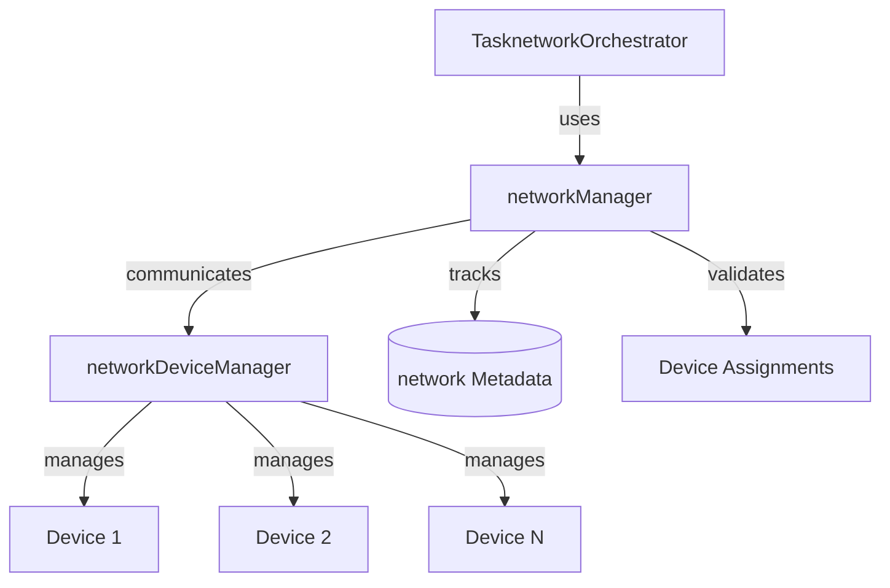

# network Manager

## Overview

The `networkManager` is a companion component to the `TasknetworkOrchestrator` that handles device assignment, resource management, and network lifecycle tracking. While the orchestrator focuses on execution flow and coordination, the manager provides the infrastructure for device operations and state management.

This separation of concerns follows the Single Responsibility Principle: orchestration logic remains independent of device management details.

## Architecture



Learn more about the [orchestrator architecture](overview.md) and [asynchronous scheduling](asynchronous_scheduling.md).

## Core Responsibilities

The networkManager handles four primary responsibilities:

### 1. Device Assignment

Assigns tasks to appropriate devices using configurable strategies:

| Strategy | Description | Use Case |
|----------|-------------|----------|
| Round Robin | Distributes tasks evenly across devices | Load balancing for homogeneous devices |
| Capability Match | Matches task requirements to device capabilities | Heterogeneous device types (Windows, Android, iOS) |
| Load Balance | Assigns to device with lowest current load | Dynamic workload distribution |

### 2. Resource Management

Tracks and manages network resources:

- Device availability and status
- network registration and metadata
- Device utilization statistics
- Assignment validation

### 3. Lifecycle Management

Manages network lifecycle:

- Registration when orchestration begins
- Metadata tracking during execution
- Unregistration after completion
- Status querying

### 4. Validation

Validates device assignments against constraints:

- All tasks have assigned devices
- Assigned devices exist and are connected
- Device capabilities match task requirements

## Device Assignment Strategies

### Round Robin

Distributes tasks cyclically across available devices:

```python
async def _assign_round_robin(
    self,
    network: Tasknetwork,
    available_devices: List[Dict[str, Any]],
    preferences: Optional[Dict[str, str]] = None,
) -> Dict[str, str]:
    """Round robin device assignment strategy."""
    
    assignments = {}
    device_index = 0
    
    for task_id, task in network.tasks.items():
        # Check preferences first
        if preferences and task_id in preferences:
            preferred_device = preferences[task_id]
            if any(d["device_id"] == preferred_device for d in available_devices):
                assignments[task_id] = preferred_device
                continue
        
        # Round robin assignment
        device = available_devices[device_index % len(available_devices)]
        assignments[task_id] = device["device_id"]
        device_index += 1
    
    return assignments
```

**Characteristics:**

- Fairness: Each device gets approximately equal number of tasks
- Simplicity: No complex decision-making
- Overhead: O(N) where N = number of tasks
- Best for: Homogeneous devices with similar capabilities

**Example**:
```python
# 3 devices, 7 tasks
Task 1 → Device A
Task 2 → Device B
Task 3 → Device C
Task 4 → Device A
Task 5 → Device B
Task 6 → Device C
Task 7 → Device A
```

### Capability Match

Matches tasks to devices based on device type and capabilities:

```python
async def _assign_capability_match(
    self,
    network: Tasknetwork,
    available_devices: List[Dict[str, Any]],
    preferences: Optional[Dict[str, str]] = None,
) -> Dict[str, str]:
    """Capability-based device assignment strategy."""
    
    assignments = {}
    
    for task_id, task in network.tasks.items():
        # Check preferences first
        if preferences and task_id in preferences:
            preferred_device = preferences[task_id]
            if any(d["device_id"] == preferred_device for d in available_devices):
                assignments[task_id] = preferred_device
                continue
        
        # Find devices matching task requirements
        matching_devices = []
        
        if task.device_type:
            matching_devices = [
                d for d in available_devices
                if d.get("device_type") == task.device_type.value
            ]
        
        # Fall back to any available device if no matches
        if not matching_devices:
            matching_devices = available_devices
        
        # Choose first matching device
        if matching_devices:
            assignments[task_id] = matching_devices[0]["device_id"]
    
    return assignments
```

**Characteristics:**

- Type-aware: Respects task's `device_type` requirement
- Fallback: Uses any device if no type match found
- Overhead: O(N × D) where N = tasks, D = devices
- Best for: Heterogeneous device ecosystems

**Example**:
```python
# Mixed device types
Task A (requires Windows) → Windows Device 1
Task B (requires Android) → Android Device 1
Task C (requires Windows) → Windows Device 1
Task D (no requirement)   → Any available device
```

### Load Balance

Assigns tasks to minimize device load:

```python
async def _assign_load_balance(
    self,
    network: Tasknetwork,
    available_devices: List[Dict[str, Any]],
    preferences: Optional[Dict[str, str]] = None,
) -> Dict[str, str]:
    """Load-balanced device assignment strategy."""
    
    assignments = {}
    device_load = {d["device_id"]: 0 for d in available_devices}
    
    for task_id, task in network.tasks.items():
        # Check preferences first
        if preferences and task_id in preferences:
            preferred_device = preferences[task_id]
            if any(d["device_id"] == preferred_device for d in available_devices):
                assignments[task_id] = preferred_device
                device_load[preferred_device] += 1
                continue
        
        # Find device with lowest load
        min_load_device = min(device_load.keys(), key=lambda d: device_load[d])
        assignments[task_id] = min_load_device
        device_load[min_load_device] += 1
    
    return assignments
```

**Characteristics:**

- Balanced: Minimizes maximum device load
- Dynamic: Adapts to varying task counts
- Overhead: O(N × log D) with priority queue optimization
- Best for: networks with varying task complexity

**Example**:
```python
# 2 devices, 5 tasks with varying complexity
Task 1 (simple)  → Device A [load: 1]
Task 2 (complex) → Device B [load: 1]
Task 3 (simple)  → Device A [load: 2]
Task 4 (simple)  → Device B [load: 2]
Task 5 (complex) → Device A [load: 3]
```

## network Lifecycle Management

### Registration

Register a network for management:

```python
def register_network(
    self,
    network: Tasknetwork,
    metadata: Optional[Dict[str, Any]] = None,
) -> str:
    """Register a network for management."""
    
    network_id = network.network_id
    self._managed_networks[network_id] = network
    self._network_metadata[network_id] = metadata or {}
    
    if self._logger:
        self._logger.info(
            f"Registered network '{network.name}' ({network_id})"
        )
    
    return network_id
```

**Purpose**: Track active networks and their metadata

**Metadata examples**:
```python
metadata = {
    "user_id": "user123",
    "session_id": "session_456",
    "priority": "high",
    "created_by": "automation_pipeline",
}
```

### Status Querying

Get detailed status of a managed network:

```python
async def get_network_status(
    self, network_id: str
) -> Optional[Dict[str, Any]]:
    """Get detailed status of a managed network."""
    
    network = self._managed_networks.get(network_id)
    if not network:
        return None
    
    metadata = self._network_metadata.get(network_id, {})
    
    return {
        "network_id": network_id,
        "name": network.name,
        "state": network.state.value,
        "statistics": network.get_statistics(),
        "ready_tasks": [task.task_id for task in network.get_ready_tasks()],
        "running_tasks": [task.task_id for task in network.get_running_tasks()],
        "completed_tasks": [task.task_id for task in network.get_completed_tasks()],
        "failed_tasks": [task.task_id for task in network.get_failed_tasks()],
        "metadata": metadata,
    }
```

**Returns**:
```json
{
  "network_id": "network_20251106_143052_a1b2c3d4",
  "name": "Multi-Device Data Collection",
  "state": "executing",
  "statistics": {
    "total_tasks": 10,
    "task_status_counts": {
      "completed": 3,
      "running": 2,
      "pending": 5
    },
    "parallelism_ratio": 2.5
  },
  "ready_tasks": ["task_6", "task_7"],
  "running_tasks": ["task_4", "task_5"],
  "completed_tasks": ["task_1", "task_2", "task_3"],
  "failed_tasks": [],
  "metadata": {
    "user_id": "user123",
    "priority": "high"
  }
}
```

### Unregistration

Remove a network from management:

```python
def unregister_network(self, network_id: str) -> bool:
    """Unregister a network from management."""
    
    if network_id in self._managed_networks:
        network = self._managed_networks[network_id]
        del self._managed_networks[network_id]
        del self._network_metadata[network_id]
        
        if self._logger:
            self._logger.info(
                f"Unregistered network '{network.name}' ({network_id})"
            )
        return True
    
    return False
```

**Purpose**: Clean up resources after orchestration completes

## Device Operations

### Getting Available Devices

Retrieve list of connected devices:

```python
async def get_available_devices(self) -> List[Dict[str, Any]]:
    """Get list of available devices from device manager."""
    
    if not self._device_manager:
        return []
    
    try:
        connected_device_ids = self._device_manager.get_connected_devices()
        devices = []
        
        for device_id in connected_device_ids:
            device_info = self._device_manager.device_registry.get_device_info(
                device_id
            )
            if device_info:
                devices.append({
                    "device_id": device_id,
                    "device_type": getattr(device_info, "device_type", "unknown"),
                    "capabilities": getattr(device_info, "capabilities", []),
                    "status": "connected",
                    "metadata": getattr(device_info, "metadata", {}),
                })
        
        return devices
    except Exception as e:
        if self._logger:
            self._logger.error(f"Failed to get available devices: {e}")
        return []
```

**Returns**:
```python
[
    {
        "device_id": "windows_main",
        "device_type": "windows",
        "capabilities": ["file_ops", "browser", "office"],
        "status": "connected",
        "metadata": {"os_version": "Windows 11"}
    },
    {
        "device_id": "android_pixel",
        "device_type": "android",
        "capabilities": ["touch", "camera", "gps"],
        "status": "connected",
        "metadata": {"android_version": "14"}
    }
]
```

### Device Assignment

Automatically assign devices to all tasks:

```python
async def assign_devices_automatically(
    self,
    network: Tasknetwork,
    strategy: str = "round_robin",
    device_preferences: Optional[Dict[str, str]] = None,
) -> Dict[str, str]:
    """Automatically assign devices to tasks in a network."""
    
    if not self._device_manager:
        raise ValueError("Device manager not available for device assignment")
    
    available_devices = await self._get_available_devices()
    if not available_devices:
        raise ValueError("No available devices for assignment")
    
    if self._logger:
        self._logger.info(
            f"Assigning devices to network '{network.name}' "
            f"using strategy '{strategy}'"
        )
    
    # Select strategy
    if strategy == "round_robin":
        assignments = await self._assign_round_robin(
            network, available_devices, device_preferences
        )
    elif strategy == "capability_match":
        assignments = await self._assign_capability_match(
            network, available_devices, device_preferences
        )
    elif strategy == "load_balance":
        assignments = await self._assign_load_balance(
            network, available_devices, device_preferences
        )
    else:
        raise ValueError(f"Unknown assignment strategy: {strategy}")
    
    # Apply assignments to tasks
    for task_id, device_id in assignments.items():
        task = network.get_task(task_id)
        if task:
            task.target_device_id = device_id
    
    if self._logger:
        self._logger.info(f"Assigned {len(assignments)} tasks to devices")
    
    return assignments
```

### Manual Reassignment

Reassign a single task to a different device:

```python
def reassign_task_device(
    self,
    network: Tasknetwork,
    task_id: str,
    new_device_id: str,
) -> bool:
    """Reassign a task to a different device."""
    
    task = network.get_task(task_id)
    if not task:
        return False
    
    old_device_id = task.target_device_id
    task.target_device_id = new_device_id
    
    if self._logger:
        self._logger.info(
            f"Reassigned task '{task_id}' from device '{old_device_id}' "
            f"to '{new_device_id}'"
        )
    
    return True
```

## Validation

### Assignment Validation

Validate that all tasks have valid device assignments:

```python
def validate_network_assignments(
    self, network: Tasknetwork
) -> tuple[bool, List[str]]:
    """Validate that all tasks have valid device assignments."""
    
    errors = []
    
    for task_id, task in network.tasks.items():
        if not task.target_device_id:
            errors.append(f"Task '{task_id}' has no device assignment")
    
    is_valid = len(errors) == 0
    
    if self._logger:
        if is_valid:
            self._logger.info(
                f"All tasks in network '{network.name}' have "
                f"valid assignments"
            )
        else:
            self._logger.warning(
                f"network '{network.name}' has {len(errors)} "
                f"assignment errors"
            )
    
    return is_valid, errors
```

### Device Information

Get device information for a specific task:

```python
def get_task_device_info(
    self, network: Tasknetwork, task_id: str
) -> Optional[Dict[str, Any]]:
    """Get device information for a specific task."""
    
    task = network.get_task(task_id)
    if not task or not task.target_device_id:
        return None
    
    # Get device info from device manager
    if self._device_manager:
        try:
            device_info = self._device_manager.device_registry.get_device_info(
                task.target_device_id
            )
            if device_info:
                return {
                    "device_id": task.target_device_id,
                    "device_type": getattr(device_info, "device_type", "unknown"),
                    "capabilities": getattr(device_info, "capabilities", []),
                    "metadata": getattr(device_info, "metadata", {}),
                }
        except Exception as e:
            if self._logger:
                self._logger.error(
                    f"Failed to get device info for task '{task_id}': {e}"
                )
    
    return None
```

## Utilization Tracking

### Device Utilization Statistics

Get device utilization across network:

```python
def get_device_utilization(
    self, network: Tasknetwork
) -> Dict[str, int]:
    """Get device utilization statistics for a network."""
    
    utilization = {}
    
    for task in network.tasks.values():
        if task.target_device_id:
            utilization[task.target_device_id] = (
                utilization.get(task.target_device_id, 0) + 1
            )
    
    return utilization
```

**Example output**:
```python
{
    "windows_main": 5,
    "android_pixel": 3,
    "ios_iphone": 2
}
```

### Listing All networks

List all managed networks:

```python
def list_networks(self) -> List[Dict[str, Any]]:
    """List all managed networks with basic information."""
    
    result = []
    for network_id, network in self._managed_networks.items():
        metadata = self._network_metadata.get(network_id, {})
        result.append({
            "network_id": network_id,
            "name": network.name,
            "state": network.state.value,
            "task_count": network.task_count,
            "dependency_count": network.dependency_count,
            "metadata": metadata,
        })
    
    return result
```

## Usage Patterns

### Basic Setup

```python
from cluster.network.orchestrator import networkManager
from cluster.client.device_manager import networkDeviceManager

# Create device manager
device_manager = networkDeviceManager()

# Create network manager
manager = networkManager(device_manager, enable_logging=True)

# Register network
network_id = manager.register_network(
    network,
    metadata={"priority": "high"}
)
```

### Automatic Assignment

```python
# Assign devices using capability matching
assignments = await manager.assign_devices_automatically(
    network,
    strategy="capability_match"
)

print(f"Assigned {len(assignments)} tasks")
```

### With Preferences

```python
# Specify preferred devices for specific tasks
preferences = {
    "critical_task_1": "windows_main",
    "gpu_task_2": "windows_gpu",
}

assignments = await manager.assign_devices_automatically(
    network,
    strategy="load_balance",
    device_preferences=preferences
)
```

### Manual Override

```python
# Reassign specific task
manager.reassign_task_device(
    network,
    task_id="task_5",
    new_device_id="android_backup"
)
```

### Validation

```python
# Validate assignments before orchestration
is_valid, errors = manager.validate_network_assignments(network)

if not is_valid:
    print(f"Validation errors: {errors}")
    # Fix assignments...
```

### Monitoring

```python
# Check network status during execution
status = await manager.get_network_status(network_id)

print(f"State: {status['state']}")
print(f"Running tasks: {len(status['running_tasks'])}")
print(f"Completed tasks: {len(status['completed_tasks'])}")

# Get device utilization
utilization = manager.get_device_utilization(network)
for device_id, task_count in utilization.items():
    print(f"{device_id}: {task_count} tasks")
```

## Integration with Orchestrator

The orchestrator uses the manager internally:

```python
class TasknetworkOrchestrator:
    def __init__(self, device_manager, enable_logging=True):
        self._device_manager = device_manager
        self._network_manager = networkManager(
            device_manager, enable_logging
        )
    
    async def orchestrate_network(self, network, ...):
        # Use manager for assignment
        await self._network_manager.assign_devices_automatically(
            network, assignment_strategy
        )
        
        # Use manager for validation
        is_valid, errors = self._network_manager \
            .validate_network_assignments(network)
        
        if not is_valid:
            raise ValueError(f"Device assignment validation failed: {errors}")
        
        # Continue orchestration...
```

## Related Documentation

- [Overview](overview.md) - Orchestrator architecture and design
- [Asynchronous Scheduling](asynchronous_scheduling.md) - Task execution model
- [Consistency Guarantees](consistency_guarantees.md) - Device assignment validation
- [API Reference](api_reference.md) - Complete API documentation
