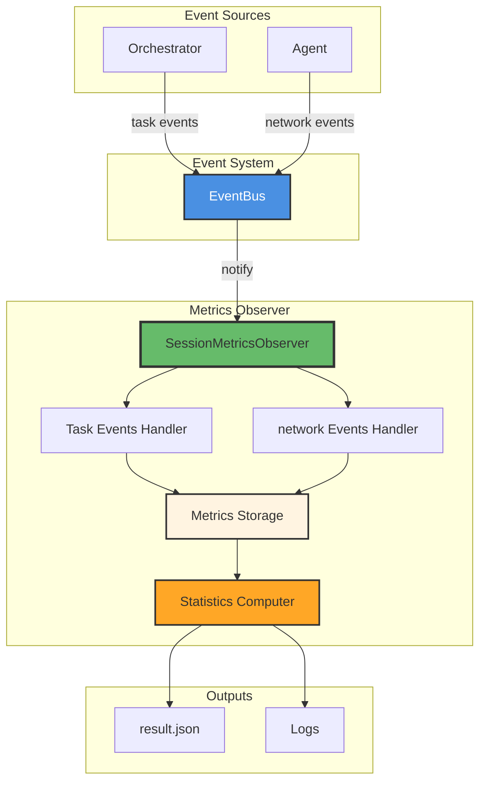
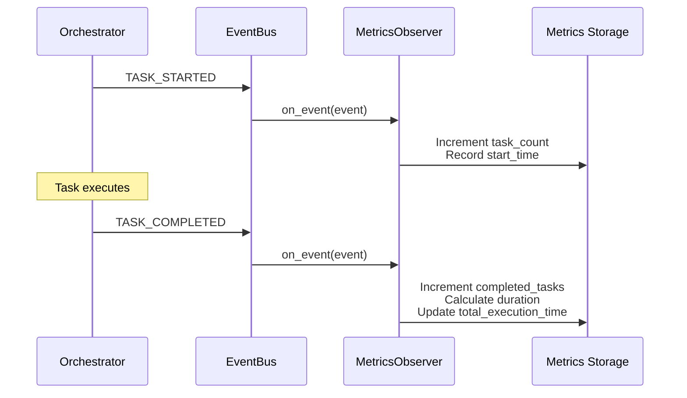

# Session Metrics Observer

The **SessionMetricsObserver** collects comprehensive performance metrics and statistics during network execution. It tracks task execution times, network lifecycle, modifications, and computes detailed statistics for performance analysis.

**Location:** `cluster/session/observers/base_observer.py`

The metrics observer is essential for evaluating cluster performance, identifying bottlenecks, and analyzing network modification patterns for research and optimization.

---

## 🎯 Purpose

The Metrics Observer provides:

1. **Performance Tracking** — Measure task and network execution times
2. **Success Rate Monitoring** — Track completion and failure rates
3. **Modification Analytics** — Monitor network structural changes
4. **Statistical Summaries** — Compute aggregated metrics for analysis

---

## 🏗️ Architecture



---

## 📊 Metrics Collected

The observer collects metrics across three categories:

### Task Metrics

Track individual task execution:

| Metric | Description | Computed |
|--------|-------------|----------|
| **task_count** | Total number of tasks started | Real-time |
| **completed_tasks** | Number of successfully completed tasks | Real-time |
| **failed_tasks** | Number of failed tasks | Real-time |
| **total_execution_time** | Sum of all task execution times | Real-time |
| **task_timings** | Dict mapping task_id → {start, end, duration} | Real-time |
| **success_rate** | completed / total tasks | Computed |
| **failure_rate** | failed / total tasks | Computed |
| **average_task_duration** | Average execution time per task | Computed |
| **min_task_duration** | Fastest task execution time | Computed |
| **max_task_duration** | Slowest task execution time | Computed |

### network Metrics

Monitor network lifecycle:

| Metric | Description | Computed |
|--------|-------------|----------|
| **network_count** | Total networks processed | Real-time |
| **completed_networks** | Successfully completed networks | Real-time |
| **failed_networks** | Failed networks | Real-time |
| **total_network_time** | Total network execution time | Real-time |
| **network_timings** | Dict mapping network_id → timing data | Real-time |
| **network_success_rate** | completed / total networks | Computed |
| **average_network_duration** | Average network execution time | Computed |
| **min_network_duration** | Fastest network | Computed |
| **max_network_duration** | Slowest network | Computed |
| **average_tasks_per_network** | Average number of tasks | Computed |

### Modification Metrics

Track network structural changes:

| Metric | Description | Computed |
|--------|-------------|----------|
| **network_modifications** | Dict mapping network_id → modification list | Real-time |
| **total_modifications** | Total number of modifications | Computed |
| **networks_modified** | Number of networks with modifications | Computed |
| **average_modifications_per_network** | Average modifications per network | Computed |
| **max_modifications_for_single_network** | Most-modified network | Computed |
| **most_modified_network** | ID of most-modified network | Computed |
| **modification_types_breakdown** | Count by modification type | Computed |

---

## 💻 Implementation

### Initialization

```python
from cluster.session.observers import SessionMetricsObserver
import logging

# Create metrics observer
metrics_observer = SessionMetricsObserver(
    session_id="cluster_session_20231113",
    logger=logging.getLogger(__name__)
)

# Subscribe to event bus
from cluster.core.events import get_event_bus
event_bus = get_event_bus()
event_bus.subscribe(metrics_observer)
```

**Constructor Parameters:**

| Parameter | Type | Required | Description |
|-----------|------|----------|-------------|
| `session_id` | `str` | Yes | Unique identifier for the session |
| `logger` | `logging.Logger` | No | Logger instance (creates default if None) |

### Internal Metrics Structure

The observer maintains a comprehensive metrics dictionary:

```python
self.metrics: Dict[str, Any] = {
    "session_id": session_id,
    
    # Task metrics
    "task_count": 0,
    "completed_tasks": 0,
    "failed_tasks": 0,
    "total_execution_time": 0.0,
    "task_timings": {},  # task_id -> {start, end, duration}
    
    # network metrics
    "network_count": 0,
    "completed_networks": 0,
    "failed_networks": 0,
    "total_network_time": 0.0,
    "network_timings": {},  # network_id -> timing data
    
    # Modification tracking
    "network_modifications": {}  # network_id -> [modifications]
}
```

---

## 🔄 Event Processing

### Task Event Handling

The observer tracks task lifecycle events:



**Processing Logic:**

```python
def _handle_task_started(self, event: TaskEvent) -> None:
    """Handle TASK_STARTED event."""
    self.metrics["task_count"] += 1
    self.metrics["task_timings"][event.task_id] = {
        "start": event.timestamp
    }

def _handle_task_completed(self, event: TaskEvent) -> None:
    """Handle TASK_COMPLETED event."""
    self.metrics["completed_tasks"] += 1
    
    if event.task_id in self.metrics["task_timings"]:
        duration = (
            event.timestamp - 
            self.metrics["task_timings"][event.task_id]["start"]
        )
        self.metrics["task_timings"][event.task_id]["duration"] = duration
        self.metrics["task_timings"][event.task_id]["end"] = event.timestamp
        self.metrics["total_execution_time"] += duration

def _handle_task_failed(self, event: TaskEvent) -> None:
    """Handle TASK_FAILED event."""
    self.metrics["failed_tasks"] += 1
    # Also calculate duration for failed tasks
    if event.task_id in self.metrics["task_timings"]:
        duration = (
            event.timestamp - 
            self.metrics["task_timings"][event.task_id]["start"]
        )
        self.metrics["task_timings"][event.task_id]["duration"] = duration
        self.metrics["total_execution_time"] += duration
```

### network Event Handling

Tracks network lifecycle and modifications:

```python
def _handle_network_started(self, event: networkEvent) -> None:
    """Handle network_STARTED event."""
    self.metrics["network_count"] += 1
    network_id = event.network_id
    network = event.data.get("network")
    
    # Store initial statistics
    self.metrics["network_timings"][network_id] = {
        "start_time": event.timestamp,
        "initial_statistics": (
            network.get_statistics() if network else {}
        ),
        "processing_start_time": event.data.get("processing_start_time"),
        "processing_end_time": event.data.get("processing_end_time"),
        "processing_duration": event.data.get("processing_duration"),
    }

def _handle_network_completed(self, event: networkEvent) -> None:
    """Handle network_COMPLETED event."""
    self.metrics["completed_networks"] += 1
    network_id = event.network_id
    network = event.data.get("network")
    
    # Calculate duration and store final statistics
    duration = (
        event.timestamp - 
        self.metrics["network_timings"][network_id]["start_time"]
        if network_id in self.metrics["network_timings"]
        else None
    )
    
    if network_id in self.metrics["network_timings"]:
        self.metrics["network_timings"][network_id].update({
            "end_time": event.timestamp,
            "duration": duration,
            "final_statistics": (
                network.get_statistics() if network else {}
            ),
        })
```

### Modification Tracking

Tracks network structural changes with detailed change detection:

```python
def _handle_network_modified(self, event: networkEvent) -> None:
    """Handle network_MODIFIED event."""
    network_id = event.network_id
    
    # Initialize modifications list if needed
    if network_id not in self.metrics["network_modifications"]:
        self.metrics["network_modifications"][network_id] = []
    
    if hasattr(event, "data") and event.data:
        old_network = event.data.get("old_network")
        new_network = event.data.get("new_network")
        
        # Calculate changes using VisualizationChangeDetector
        changes = None
        if old_network and new_network:
            changes = VisualizationChangeDetector.calculate_network_changes(
                old_network, new_network
            )
        
        # Store modification record
        modification_record = {
            "timestamp": event.timestamp,
            "modification_type": event.data.get("modification_type", "unknown"),
            "on_task_id": event.data.get("on_task_id", []),
            "changes": changes,
            "new_statistics": (
                new_network.get_statistics() if new_network else {}
            ),
            "processing_start_time": event.data.get("processing_start_time"),
            "processing_end_time": event.data.get("processing_end_time"),
            "processing_duration": event.data.get("processing_duration"),
        }
        
        self.metrics["network_modifications"][network_id].append(
            modification_record
        )
```

---

## 📖 API Reference

### Constructor

```python
def __init__(self, session_id: str, logger: Optional[logging.Logger] = None)
```

Initialize the metrics observer.

**Parameters:**

- `session_id` — Unique identifier for the session
- `logger` — Optional logger instance (creates default if None)

### get_metrics()

```python
def get_metrics(self) -> Dict[str, Any]
```

Get collected metrics with computed statistics.

**Returns:**

Dictionary containing:
- All raw metrics (counts, timings, etc.)
- `task_statistics` — Computed task metrics
- `network_statistics` — Computed network metrics
- `modification_statistics` — Computed modification metrics

**Example:**

```python
# After network execution
metrics = metrics_observer.get_metrics()

# Access task statistics
print(f"Total tasks: {metrics['task_statistics']['total_tasks']}")
print(f"Success rate: {metrics['task_statistics']['success_rate']:.2%}")
print(f"Avg duration: {metrics['task_statistics']['average_task_duration']:.2f}s")

# Access network statistics
print(f"Total networks: {metrics['network_statistics']['total_networks']}")
print(f"Avg tasks per network: {metrics['network_statistics']['average_tasks_per_network']:.1f}")

# Access modification statistics
print(f"Total modifications: {metrics['modification_statistics']['total_modifications']}")
print(f"Modification types: {metrics['modification_statistics']['modification_types_breakdown']}")
```

---

## 📊 Computed Statistics

The observer computes three categories of statistics:

### Task Statistics

```python
{
    "total_tasks": 10,
    "completed_tasks": 8,
    "failed_tasks": 2,
    "success_rate": 0.8,
    "failure_rate": 0.2,
    "average_task_duration": 2.5,
    "min_task_duration": 0.5,
    "max_task_duration": 5.2,
    "total_task_execution_time": 25.0
}
```

### network Statistics

```python
{
    "total_networks": 1,
    "completed_networks": 1,
    "failed_networks": 0,
    "success_rate": 1.0,
    "average_network_duration": 30.5,
    "min_network_duration": 30.5,
    "max_network_duration": 30.5,
    "total_network_time": 30.5,
    "average_tasks_per_network": 10.0
}
```

### Modification Statistics

```python
{
    "total_modifications": 3,
    "networks_modified": 1,
    "average_modifications_per_network": 3.0,
    "max_modifications_for_single_network": 3,
    "most_modified_network": "const_123",
    "modifications_per_network": {
        "const_123": 3
    },
    "modification_types_breakdown": {
        "add_tasks": 2,
        "modify_dependencies": 1
    }
}
```

---

## 🔍 Usage Examples

### Example 1: Basic Metrics Collection

```python
import asyncio
from cluster.core.events import get_event_bus
from cluster.session.observers import SessionMetricsObserver

async def collect_metrics():
    """Collect and display metrics for network execution."""
    
    # Create and subscribe metrics observer
    metrics_observer = SessionMetricsObserver(session_id="demo_session")
    event_bus = get_event_bus()
    event_bus.subscribe(metrics_observer)
    
    # Execute network (orchestrator will publish events)
    await orchestrator.execute_network(network)
    
    # Retrieve metrics
    metrics = metrics_observer.get_metrics()
    
    # Display summary
    print("\n=== Execution Summary ===")
    print(f"Session: {metrics['session_id']}")
    print(f"Tasks: {metrics['task_count']} total, "
          f"{metrics['completed_tasks']} completed, "
          f"{metrics['failed_tasks']} failed")
    print(f"Total execution time: {metrics['total_execution_time']:.2f}s")
    
    # Display task statistics
    task_stats = metrics['task_statistics']
    print(f"\nTask Success Rate: {task_stats['success_rate']:.1%}")
    print(f"Average Task Duration: {task_stats['average_task_duration']:.2f}s")
    print(f"Fastest Task: {task_stats['min_task_duration']:.2f}s")
    print(f"Slowest Task: {task_stats['max_task_duration']:.2f}s")
    
    # Clean up
    event_bus.unsubscribe(metrics_observer)

asyncio.run(collect_metrics())
```

### Example 2: Performance Analysis

```python
def analyze_performance(metrics_observer: SessionMetricsObserver):
    """Analyze performance metrics and identify bottlenecks."""
    
    metrics = metrics_observer.get_metrics()
    task_timings = metrics['task_timings']
    
    # Find slowest tasks
    sorted_tasks = sorted(
        task_timings.items(),
        key=lambda x: x[1].get('duration', 0),
        reverse=True
    )
    
    print("\n=== Top 5 Slowest Tasks ===")
    for task_id, timing in sorted_tasks[:5]:
        duration = timing.get('duration', 0)
        print(f"{task_id}: {duration:.2f}s")
    
    # Analyze modification patterns
    mod_stats = metrics['modification_statistics']
    if mod_stats['total_modifications'] > 0:
        print(f"\n=== Modification Analysis ===")
        print(f"Total Modifications: {mod_stats['total_modifications']}")
        print(f"Average per network: "
              f"{mod_stats['average_modifications_per_network']:.1f}")
        print(f"Most Modified: {mod_stats['most_modified_network']}")
        print("\nModification Types:")
        for mod_type, count in mod_stats['modification_types_breakdown'].items():
            print(f"  {mod_type}: {count}")
```

### Example 3: Export Metrics to JSON

```python
import json
from pathlib import Path

def export_metrics(metrics_observer: SessionMetricsObserver, output_path: str):
    """Export metrics to JSON file for analysis."""
    
    metrics = metrics_observer.get_metrics()
    
    # Convert to JSON-serializable format
    output_data = {
        "session_id": metrics["session_id"],
        "task_statistics": metrics["task_statistics"],
        "network_statistics": metrics["network_statistics"],
        "modification_statistics": metrics["modification_statistics"],
        "raw_metrics": {
            "task_count": metrics["task_count"],
            "completed_tasks": metrics["completed_tasks"],
            "failed_tasks": metrics["failed_tasks"],
            "total_execution_time": metrics["total_execution_time"],
            "network_count": metrics["network_count"],
        }
    }
    
    # Write to file
    output_file = Path(output_path)
    output_file.parent.mkdir(parents=True, exist_ok=True)
    
    with open(output_file, 'w') as f:
        json.dump(output_data, f, indent=2)
    
    print(f"Metrics exported to: {output_file}")
```

---

## 🎓 Best Practices

### 1. Session ID Naming

Use descriptive session IDs for easier analysis:

```python
# ✅ Good: Descriptive session ID
session_id = f"cluster_session_{task_type}_{timestamp}"

# ❌ Bad: Generic session ID
session_id = "session_1"
```

### 2. Metrics Export

Export metrics immediately after execution:

```python
try:
    await orchestrator.execute_network(network)
finally:
    # Always export metrics, even if execution failed
    metrics = metrics_observer.get_metrics()
    export_metrics(metrics, "results/metrics.json")
```

### 3. Memory Management

Clear large timing dictionaries for long-running sessions:

```python
# After processing metrics
metrics_observer.metrics["task_timings"].clear()
metrics_observer.metrics["network_timings"].clear()
```

---

## 🔗 Related Documentation

- **[Observer System Overview](overview.md)** — Architecture and design
- **[Event System Core](event_system.md)** — Event types and EventBus

!!! note "Additional Resources"
    For information on network execution and orchestration, see the network orchestrator documentation in `cluster/network/orchestrator/`.

---

## 📋 Summary

The Session Metrics Observer:

- **Collects** comprehensive performance metrics
- **Tracks** task and network execution times
- **Monitors** modification patterns
- **Computes** statistical summaries
- **Exports** data for analysis

This observer is essential for performance evaluation, bottleneck identification, and research analysis of cluster's network execution.
