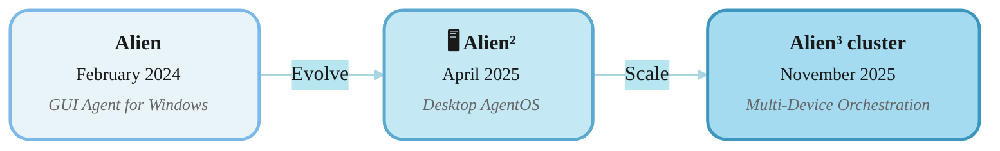

# Welcome to Alien³ Documentation

<div align="center">
  <h1>
    <b>Alien³</b>  : Weaving the Digital Agent cluster
  </h1>
  <p><em>A Multi-Device Orchestration Framework for Cross-Platform Intelligent Automation</em></p>
</div>

[](https://arxiv.org/abs/2511.11332)
[](https://arxiv.org/abs/2504.14603)

[](https://opensource.org/licenses/MIT)
[](https://github.com/DEVELOPER-DEEVEN/Alien)
[](https://www.youtube.com/watch?v=QT_OhygMVXU)


---

<div align="center">
   
</div>


## 📖 About This Documentation

Welcome to the official documentation for **Alien³**, Microsoft's open-source framework for intelligent automation across devices and platforms. Whether you're looking to automate Windows applications or orchestrate complex workflows across multiple devices, this documentation will guide you through every step.

**What you'll find here:**

- 🚀 **[Quick Start Guides](getting_started/quick_start_cluster.md)** – Get up and running in minutes
- 📚 **[Core Concepts](cluster/overview.md)** – Understand the architecture and key components  
- ⚙️ **[Configuration](configuration/system/agents_config.md)** – Set up your agents and models
- 🔧 **[Advanced Features](Alien-Unis/core_features/multi_action.md)** – Deep dive into powerful capabilities
- 💡 **[FAQ](faq.md)** – Common questions and troubleshooting

---

## 🎯 Choose Your Path

Alien³ consists of two complementary frameworks. Choose the one that best fits your needs, or use both together!

| Framework | Best For | Key Strength | Get Started |
|-----------|----------|--------------|-------------|
| **🌌 cluster** <br> <sub>✨ NEW & RECOMMENDED</sub> | Cross-device workflows<br>Complex automation<br>Parallel execution | Multi-device orchestration<br>DAG-based planning<br>Real-time monitoring | [Quick Start →](getting_started/quick_start_cluster.md) |
| **🪟 Alien²** <br> <sub>⚡ STABLE & LTS</sub> | Windows automation<br>Quick tasks<br>Learning basics | Deep Windows integration<br>Hybrid GUI + API<br>Stable & reliable | [Quick Start →](getting_started/quick_start_Alien-Unis.md) |

### 🤔 Decision Guide

| Question | cluster | Alien² |
|----------|:------:|:----:|
| Need cross-device collaboration? | ✅ | ❌ |
| Complex multi-step workflows? | ✅ | ⚠️ Limited |
| Windows-only automation? | ✅ | ✅ Optimized |
| Quick setup & learning? | ⚠️ Moderate | ✅ Easy |
| Stable & reliable? | 🚧 Active Dev | ✅ LTS |

---

## 🌟 What's New in Alien³?

**Alien³ is a scalable, universal cross-device agent framework** that enables you to develop new device agents for different platforms and applications. Through the **Agent Interaction Protocol (AIP)**, custom device agents can seamlessly integrate into Alien³ cluster for coordinated multi-device orchestration.

### Evolution Timeline


```mermaid
%%{init: {'theme':'base', 'themeVariables': { 'primaryColor':'#E8F4F8','primaryTextColor':'#1A1A1A','primaryBorderColor':'#7CB9E8','lineColor':'#A8D5E2','secondaryColor':'#B8E6F0','tertiaryColor':'#D4F1F4','fontSize':'16px','fontFamily':'Segoe UI, Arial, sans-serif'}}}%%
graph LR
    A["<b>🎈 Alien</b><br/><span style='font-size:14px'>February 2024</span><br/><span style='font-size:13px; color:#666'><i>GUI Agent for Windows</i></span>"] 
    B["<b>🖥️ Alien²</b><br/><span style='font-size:14px'>April 2025</span><br/><span style='font-size:13px; color:#666'><i>Desktop AgentOS</i></span>"]
    C["<b>🌌 Alien³ cluster</b><br/><span style='font-size:14px'>November 2025</span><br/><span style='font-size:13px; color:#666'><i>Multi-Device Orchestration</i></span>"]
    
    A -->|Evolve| B
    B -->|Scale| C
    
    style A fill:#E8F4F8,stroke:#7CB9E8,stroke-width:2.5px,color:#1A1A1A,rx:15,ry:15
    style B fill:#C5E8F5,stroke:#5BA8D0,stroke-width:2.5px,color:#1A1A1A,rx:15,ry:15
    style C fill:#A4DBF0,stroke:#3D96BE,stroke-width:2.5px,color:#1A1A1A,rx:15,ry:15
```

### 🚀 Alien³ = **cluster** (Multi-Device Orchestration) + **Alien²** (Device Agent)

Alien³ introduces **cluster**, a revolutionary multi-device orchestration framework that coordinates intelligent agents across heterogeneous platforms. Built on five tightly integrated design principles:

1. **🌟 Declarative Decomposition into Dynamic DAG** - Requests decomposed into structured DAG with TaskStars and dependencies for automated scheduling and runtime rewriting

2. **🔄 Continuous Result-Driven Graph Evolution** - Living network that adapts to execution feedback through controlled rewrites and dynamic adjustments

3. **⚡ Heterogeneous, Asynchronous & Safe Orchestration** - Capability-based device matching with async execution, safe locking, and formally verified correctness

4. **🔌 Unified Agent Interaction Protocol (AIP)** - WebSocket-based secure coordination layer with fault tolerance and automatic reconnection

5. **🛠️ Template-Driven MCP-Empowered Device Agents** - Lightweight toolkit for rapid agent development with MCP integration for tool augmentation

| Aspect | Alien² | Alien³ cluster |
|--------|------|-------------|
| **Architecture** | Single Windows Agent | Multi-Device Orchestration |
| **Task Model** | Sequential ReAct Loop | DAG-based network Workflows |
| **Scope** | Single device, multi-app | Multi-device, cross-platform |
| **Coordination** | HostAgent + AppAgents | networkAgent + TaskOrchestrator |
| **Device Support** | Windows Desktop | Windows, Linux, macOS, Android, Web |
| **Task Planning** | Application-level | Device-level with dependencies |
| **Execution** | Sequential | Parallel DAG execution |
| **Device Agent Role** | Standalone | Can serve as cluster device agent |
| **Complexity** | Simple to Moderate | Simple to Very Complex |
| **Learning Curve** | Low | Moderate |
| **Cross-Device Collaboration** | ❌ Not Supported | ✅ Core Feature |
| **Setup Difficulty** | ✅ Easy | ⚠️ Moderate |
| **Status** | ✅ LTS (Long-Term Support) | ⚡ Active Development |

### 🎓 Migration Path

**For Alien² Users:**
1. ✅ **Keep using Alien²** – Fully supported, actively maintained
2. 🔄 **Gradual adoption** – cluster can use Alien² as Windows device agent
3. 📈 **Scale up** – Move to cluster when you need multi-device capabilities
4. 📚 **Learning resources** – [Migration Guide](./getting_started/migration_Alien-Unis_to_cluster.md)

---

## ✨ Capabilities at a Glance

### 🌌 cluster Framework – What's Different?

#### 🌟 network Planning

```
User Request
     ↓
networkAgent
     ↓
  [Task DAG]
   /   |   \
Task1 Task2 Task3
(Win) (Linux)(Mac)
```

**Benefits:**
- Cross-device dependency tracking
- Parallel execution optimization
- Cross-device dataflow management

#### 🎯 Device Assignment

```
Selection Criteria
  • Platform
  • Resource
  • Task requirements
  • Performance history
        ↓
  Auto-Assignment
        ↓
  Optimal Devices
```

**Smart Matching:**
- Capability-based selection
- Real-time resource monitoring
- Dynamic reallocation

#### 📊 Orchestration

```
Task1 → Running  ✅
Task2 → Pending  ⏸️
Task3 → Running  🔄
        ↓
   Completion
        ↓
   Final Report
```

**Orchestration:**
- Real-time status updates
- Automatic error recovery
- Progress tracking with feedback

---

### 🪟 Alien² Desktop AgentOS – Core Strengths

Alien² serves dual roles: **standalone Windows automation** and **cluster device agent** for Windows platforms.

| Feature | Description | Documentation |
|---------|-------------|---------------|
| **Deep OS Integration** | Windows UIA, Win32, WinCOM native control | [Learn More](Alien-Unis/overview.md) |
| **Hybrid Actions** | GUI clicks + API calls for optimal performance | [Learn More](Alien-Unis/core_features/hybrid_actions.md) |
| **Speculative Multi-Action** | Batch predictions → **51% fewer LLM calls** | [Learn More](Alien-Unis/core_features/multi_action.md) |
| **Visual + UIA Detection** | Hybrid control detection for robustness | [Learn More](Alien-Unis/core_features/control_detection/hybrid_detection.md) |
| **Knowledge Substrate** | RAG with docs, demos, execution traces | [Learn More](Alien-Unis/core_features/knowledge_substrate/overview.md) |
| **Device Agent Role** | Can serve as Windows executor in cluster orchestration | [Learn More](cluster/overview.md) |

**As cluster Device Agent:**
- Receives tasks from networkAgent through cluster orchestration layer
- Executes Windows-specific operations using proven Alien² capabilities
- Reports status and results back to TaskOrchestrator
- Seamlessly participates in cross-device workflows

---

## 🏗️ Architecture

### Alien³ cluster – Multi-Device Orchestration

<div align="center">
  
</div>

| Component | Role |
|-----------|------|
| **networkAgent** | Plans and decomposes tasks into DAG workflows |
| **Tasknetwork** | DAG representation with TaskStar nodes and dependencies |
| **Device Pool Manager** | Matches tasks to capable devices dynamically |
| **TaskOrchestrator** | Coordinates parallel execution and handles data flow |
| **Event System** | Real-time monitoring with observer pattern |

[📖 Learn More →](cluster/overview.md)

### Alien² – Desktop AgentOS

<div align="center">
  
</div>

| Component | Role |
|-----------|------|
| **HostAgent** | Desktop orchestrator, application lifecycle management |
| **AppAgents** | Per-application executors with hybrid GUI–API actions |
| **Knowledge Substrate** | RAG-enhanced learning from docs & execution history |
| **Speculative Executor** | Multi-action prediction for efficiency |

[📖 Learn More →](Alien-Unis/overview.md)

---

## 🚀 Quick Start

Ready to dive in? Follow these guides to get started with your chosen framework:

### 🌌 cluster Quick Start (Multi-Device Orchestration)

Perfect for complex workflows across multiple devices and platforms.

```bash
# 1. Install dependencies
pip install -r requirements.txt

# 2. Configure agents (see detailed guide for API key setup)
copy config\cluster\agent.yaml.template config\cluster\agent.yaml
copy config\Alien\agents.yaml.template config\Alien\agents.yaml

# 3. Start device agents
python -m Alien.server.app --port 5000
python -m Alien.client.client --ws --ws-server ws://localhost:5000/ws --client-id device_1 --platform windows

# 4. Launch cluster
python -m cluster --interactive
```

**📖 [Complete cluster Quick Start Guide →](getting_started/quick_start_cluster.md)**  
**⚙️ [cluster Configuration Details →](configuration/system/cluster_devices.md)**

### 🪟 Alien² Quick Start (Windows Automation)

Perfect for Windows-only automation tasks with quick setup.

```bash
# 1. Install
pip install -r requirements.txt

# 2. Configure (add your API keys)
copy config\Alien\agents.yaml.template config\Alien\agents.yaml

# 3. Run
python -m Alien --task <task_name>
```

**📖 [Complete Alien² Quick Start Guide →](getting_started/quick_start_Alien-Unis.md)**  
**⚙️ [Alien² Configuration Details →](configuration/system/agents_config.md)**

---

## 📚 Documentation Navigation

### 🎯 Getting Started

Start here if you're new to Alien³:

| Guide | Description | Framework |
|-------|-------------|-----------|
| [cluster Quick Start](getting_started/quick_start_cluster.md) | Set up multi-device orchestration in 10 minutes | 🌌 cluster |
| [Alien² Quick Start](getting_started/quick_start_Alien-Unis.md) | Start automating Windows in 5 minutes | 🪟 Alien² |
| [Linux Agent Quick Start](getting_started/quick_start_linux.md) | Automate Linux systems | 🐧 Linux |
| [Mobile Agent Quick Start](getting_started/quick_start_mobile.md) | Automate Android devices via ADB | 📱 Mobile |
| [Choosing Your Path](choose_path.md) | Decision guide for selecting the right framework | Both |

### 🏗️ Core Architecture

Understand how Alien³ works under the hood:

| Topic | Description | Framework |
|-------|-------------|-----------|
| [cluster Overview](cluster/overview.md) | Multi-device orchestration architecture | 🌌 cluster |
| [Alien² Overview](Alien-Unis/overview.md) | Desktop AgentOS architecture and concepts | 🪟 Alien² |
| [Task network](cluster/network/overview.md) | DAG-based workflow representation | 🌌 cluster |
| [networkAgent](cluster/network_agent/overview.md) | Intelligent task planner and decomposer | 🌌 cluster |
| [Task Orchestrator](cluster/network_orchestrator/overview.md) | Execution engine and coordinator | 🌌 cluster |
| [AIP Protocol](aip/overview.md) | Agent communication protocol | 🌌 cluster |

### ⚙️ Configuration & Setup

Configure your agents, models, and environments:

| Topic | Description | Framework |
|-------|-------------|-----------|
| [Agent Configuration](configuration/system/agents_config.md) | LLM and agent settings | Both |
| [cluster Devices](configuration/system/cluster_devices.md) | Device pool and capability management | 🌌 cluster |
| [Model Providers](configuration/models/overview.md) | Supported LLMs (OpenAI, Azure, Qwen, etc.) | Both |

### 🎓 Tutorials & Examples

Learn through practical examples in the documentation:

| Topic | Description | Framework |
|-------|-------------|-----------|
| [Creating App Agents](tutorials/creating_app_agent/overview.md) | Build custom application agents | 🪟 Alien² |
| [Multi-Action Prediction](Alien-Unis/core_features/multi_action.md) | Efficient batch predictions | 🪟 Alien² |
| [Knowledge Substrate](Alien-Unis/core_features/knowledge_substrate/overview.md) | RAG-enhanced learning | 🪟 Alien² |

### 🔧 Advanced Topics

Deep dive into powerful features:

| Topic | Description | Framework |
|-------|-------------|-----------|
| [Multi-Action Prediction](Alien-Unis/core_features/multi_action.md) | Batch actions for 51% fewer LLM calls | 🪟 Alien² |
| [Hybrid Detection](Alien-Unis/core_features/control_detection/hybrid_detection.md) | Visual + UIA control detection | 🪟 Alien² |
| [Knowledge Substrate](Alien-Unis/core_features/knowledge_substrate/overview.md) | RAG-enhanced learning | 🪟 Alien² |
| [network Agent](cluster/network_agent/overview.md) | Task planning and decomposition | 🌌 cluster |
| [Task Orchestrator](cluster/network_orchestrator/overview.md) | Execution coordination | 🌌 cluster |

### 🛠️ Development & Extension

Customize and extend Alien³:

| Topic | Description |
|-------|-------------|
| [Project Structure](project_directory_structure.md) | Understand the codebase layout |
| [Creating Custom Device Agents](tutorials/creating_device_agent/overview.md) | Build device agents for new platforms (mobile, web, IoT, etc.) |
| [Creating App Agents](tutorials/creating_app_agent/overview.md) | Build custom application agents |
| [Contributing Guide](about/CONTRIBUTING.md) | How to contribute to Alien³ |

### ❓ Support & Troubleshooting

Get help when you need it:

| Resource | What You'll Find |
|----------|------------------|
| [FAQ](faq.md) | Common questions and answers |
| [GitHub Discussions](https://github.com/DEVELOPER-DEEVEN/Alien/discussions) | Community Q&A |
| [GitHub Issues](https://github.com/DEVELOPER-DEEVEN/Alien/issues) | Bug reports and feature requests |

---

## 📊 Feature Matrix

| Feature | Alien² Desktop AgentOS | Alien³ cluster | Winner |
|---------|:--------------------:|:-----------:|:------:|
| **Windows Automation** | ⭐⭐⭐⭐⭐ Optimized | ⭐⭐⭐⭐ Supported | Alien² |
| **Cross-Device Tasks** | ❌ Not supported | ⭐⭐⭐⭐⭐ Core feature | cluster |
| **Setup Complexity** | ⭐⭐⭐⭐⭐ Very easy | ⭐⭐⭐ Moderate | Alien² |
| **Learning Curve** | ⭐⭐⭐⭐⭐ Gentle | ⭐⭐⭐ Moderate | Alien² |
| **Task Complexity** | ⭐⭐⭐ Good | ⭐⭐⭐⭐⭐ Excellent | cluster |
| **Parallel Execution** | ❌ Sequential | ⭐⭐⭐⭐⭐ Native DAG | cluster |
| **Stability** | ⭐⭐⭐⭐⭐ Stable | ⭐⭐⭐ Active dev | Alien² |
| **Monitoring Tools** | ⭐⭐⭐ Logs | ⭐⭐⭐⭐⭐ Real-time viz | cluster |
| **API Flexibility** | ⭐⭐⭐ Good | ⭐⭐⭐⭐⭐ Extensive | cluster |

---

## 🎯 Use Cases & Examples

Explore what you can build with Alien³:

### 🌌 cluster Use Cases (Cross-Device)

Perfect for complex, multi-device workflows:

- **Cross-Platform Data Pipelines**: Extract from Windows Excel → Process on Linux → Visualize on Mac
- **Distributed Testing**: Run tests on Windows → Deploy to Linux → Update mobile app
- **Multi-Device Monitoring**: Collect logs from multiple devices → Aggregate centrally
- **Complex Automation**: Orchestrate workflows across heterogeneous platforms

### 🪟 Alien² Use Cases (Windows)

Perfect for Windows automation and rapid task execution:

- **Office Automation**: Excel/Word/PowerPoint report generation and data processing
- **Web Automation**: Browser-based research, form filling, data extraction
- **File Management**: Organize, rename, convert files based on rules
- **System Tasks**: Windows configuration, software installation, backups

---

## 🌐 Community & Resources

### 📺 Media & Videos

Check out our official deep dive of Alien on [YouTube](https://www.youtube.com/watch?v=QT_OhygMVXU).

### Media Coverage:


### 💬 Get Help & Connect
- **📖 Documentation**: You're here! Browse the navigation above
- **💬 Discussions**: [GitHub Discussions](https://github.com/DEVELOPER-DEEVEN/Alien/discussions)
- **🐛 Issues**: [GitHub Issues](https://github.com/DEVELOPER-DEEVEN/Alien/issues)
- **📧 Email**: [Alien-agent@microsoft.com](mailto:Alien-agent@microsoft.com)

### 🎨 Related Projects
- **[TaskWeaver](https://github.com/DEVELOPER-DEEVEN/TaskWeaver)** – Code-first LLM agent framework
- **[Windows Agent Arena](https://github.com/nice-mee/WindowsAgentArena)** – Evaluation benchmark
- **[GUI Agents Survey](https://vyokky.github.io/LLM-Brained-GUI-Agents-Survey/)** – Latest research

---

## 📚 Research & Citation

Alien³ is built on cutting-edge research in multi-agent systems and GUI automation.

### Papers

If you use Alien³ in your research, please cite:

**Alien³ cluster Framework (2025)**
```bibtex
@article{zhang2025Alien-Group,
  title={Alien$^3$: Weaving the Digital Agent cluster}, 
  author = {Zhang, Chaoyun and Li, Liqun and Huang, He and Ni, Chiming and Qiao, Bo and Qin, Si and Kang, Yu and Ma, Minghua and Lin, Qingwei and Rajmohan, Saravan and Zhang, Dongmei},
  journal = {arXiv preprint arXiv:2511.11332},
  year    = {2025},
}
```

**Alien² Desktop AgentOS (2025)**
```bibtex
@article{zhang2025Alien-Unis,
  title   = {{Alien-Unis: The Desktop AgentOS}},
  author  = {Zhang, Chaoyun and Huang, He and Ni, Chiming and Mu, Jian and Qin, Si and He, Shilin and Wang, Lu and Yang, Fangkai and Zhao, Pu and Du, Chao and Li, Liqun and Kang, Yu and Jiang, Zhao and Zheng, Suzhen and Wang, Rujia and Qian, Jiaxu and Ma, Minghua and Lou, Jian-Guang and Lin, Qingwei and Rajmohan, Saravan and Zhang, Dongmei},
  journal = {arXiv preprint arXiv:2504.14603},
  year    = {2025}
}
```

**Original Alien (2024)**
```bibtex
@article{zhang2024Alien,
  title   = {{Alien: A UI-Focused Agent for Windows OS Interaction}},
  author  = {Zhang, Chaoyun and Li, Liqun and He, Shilin and Zhang, Xu and Qiao, Bo and Qin, Si and Ma, Minghua and Kang, Yu and Lin, Qingwei and Rajmohan, Saravan and Zhang, Dongmei and Zhang, Qi},
  journal = {arXiv preprint arXiv:2402.07939},
  year    = {2024}
}
```

**📖 [Read the Papers →](https://arxiv.org/abs/2504.14603)**

---


## 🗺️ Roadmap & Future

### Alien² Desktop AgentOS (Stable/LTS)
- ✅ Long-term support and maintenance  
- ✅ Windows device agent integration
- 🔜 Enhanced device capabilities
- 🔜 Picture-in-Picture mode

### Alien³ cluster (Active Development)
- ✅ network Framework
- ✅ Multi-device coordination
- 🔄 Mobile, Web, IoT agents
- 🔄 Interactive visualization
- 🔜 Advanced fault tolerance

**Legend:** ✅ Done | 🔄 In Progress | 🔜 Planned

---

## ⚖️ License & Legal

- **License**: [MIT License](https://github.com/DEVELOPER-DEEVEN/Alien/blob/main/LICENSE)
- **Disclaimer**: [Read our disclaimer](https://github.com/DEVELOPER-DEEVEN/Alien/blob/main/DISCLAIMER.md)
- **Trademarks**: [Microsoft Trademark Guidelines](https://www.microsoft.com/legal/intellectualproperty/trademarks)
- **Contributing**: [Contribution Guidelines](about/CONTRIBUTING.md)

---


## 🚀 Ready to Start?

Choose your framework and begin your automation journey:


### 🌌 Start with cluster
**For multi-device orchestration**

[](getting_started/quick_start_cluster.md)


### 🪟 Start with Alien²
**For Windows automation**

[](getting_started/quick_start_Alien-Unis.md)


### 📖 Explore the Documentation

[Core Concepts](cluster/overview.md) | [Configuration](configuration/system/agents_config.md) | [FAQ](faq.md) | [GitHub](https://github.com/DEVELOPER-DEEVEN/Alien)


---

<p align="center">
  
  <br>
  <em>From Single Agent to Digital cluster</em>
  <br>
  <strong>Alien³ - Weaving the Future of Intelligent Automation</strong>
</p>

---
<!-- Google tag (gtag.js) -->
<script async src="https://www.googletagmanager.com/gtag/js?id=G-FX17ZGJYGC"></script>
<script>
  window.dataLayer = window.dataLayer || [];
  function gtag(){dataLayer.push(arguments);}
  gtag('js', new Date());

  gtag('config', 'G-FX17ZGJYGC');
</script>