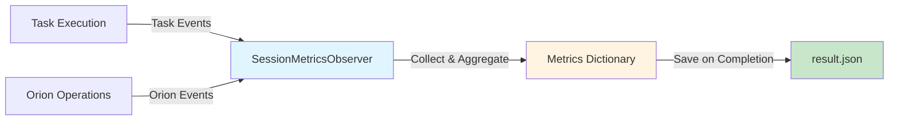

# Performance Metrics and Logging

Network provides comprehensive performance monitoring and metrics collection throughout multi-device workflow execution. The system tracks task execution times, orion modifications, and overall session metrics to enable analysis and optimization of distributed workflows.

## Overview

Network uses an **event-driven observer pattern** to collect real-time performance metrics without impacting execution flow. The `SessionMetricsObserver` automatically captures timing data, task statistics, orion modifications, and parallelism metrics.

### Key Metrics Categories

| Category | Description | Use Cases |
|----------|-------------|-----------|
| **Task Metrics** | Individual task execution times and outcomes | Identify slow tasks, success rates |
| **Orion Metrics** | DAG-level statistics and parallelism analysis | Optimize workflow structure |
| **Modification Metrics** | Dynamic orion editing during execution | Understand adaptability patterns |
| **Session Metrics** | Overall session duration and resource usage | End-to-end performance analysis |

## Metrics Collection System

### SessionMetricsObserver

The `SessionMetricsObserver` is automatically initialized for every Network session and listens to events from the orchestration system.

**Architecture:**



**Event Types Tracked:**

| Event Type | Trigger | Metrics Captured |
|-----------|---------|------------------|
| `TASK_STARTED` | Task begins execution | Start timestamp, task count |
| `TASK_COMPLETED` | Task finishes successfully | Duration, end timestamp |
| `TASK_FAILED` | Task encounters error | Duration, failure count |
| `ORION_STARTED` | New DAG created | Initial statistics, task count |
| `ORION_COMPLETED` | DAG fully executed | Final statistics, total duration |
| `ORION_MODIFIED` | DAG edited during execution | Changes, modification type |

---

## Collected Metrics

### 1. Task Metrics

**Raw Task Data:**

```python
{
    "task_timings": {
        "t1": {
            "start": 1761388508.9484463,
            "duration": 11.852121591567993,
            "end": 1761388520.8005679
        },
        "t2": {
            "start": 1761388508.9494512,
            "duration": 12.128723621368408,
            "end": 1761388521.0781748
        },
        # ... more tasks
    }
}
```

**Computed Task Statistics:**

| Field | Type | Description | Example |
|-------|------|-------------|---------|
| `total_tasks` | int | Total number of tasks created | `5` |
| `completed_tasks` | int | Successfully completed tasks | `5` |
| `failed_tasks` | int | Failed tasks | `0` |
| `success_rate` | float | Completion rate (0.0-1.0) | `1.0` |
| `failure_rate` | float | Failure rate (0.0-1.0) | `0.0` |
| `average_task_duration` | float | Mean task execution time (seconds) | `134.91` |
| `min_task_duration` | float | Fastest task duration | `11.85` |
| `max_task_duration` | float | Slowest task duration | `369.05` |
| `total_task_execution_time` | float | Sum of all task durations | `674.55` |

### 2. Orion Metrics

**Raw Orion Data:**

```python
{
    "orion_timings": {
        "orion_b0864385_20251025_183508": {
            "start_time": 1761388508.9061587,
            "initial_statistics": {
                "total_tasks": 5,
                "total_dependencies": 4,
                "longest_path_length": 2,
                "max_width": 4,
                "parallelism_ratio": 2.5
            },
            "processing_start_time": 1761388493.1049807,
            "processing_end_time": 1761388508.9061587,
            "processing_duration": 15.801177978515625,
            "end_time": 1761389168.8877504,
            "duration": 659.9815917015076,
            "final_statistics": {
                "total_tasks": 5,
                "task_status_counts": {
                    "completed": 5
                },
                "critical_path_length": 638.134632,
                "total_work": 674.4709760000001,
                "parallelism_ratio": 1.0569415013350976
            }
        }
    }
}
```

**Computed Orion Statistics:**

| Field | Type | Description | Example |
|-------|------|-------------|---------|
| `total_orions` | int | Number of DAGs created | `1` |
| `completed_orions` | int | Successfully completed DAGs | `1` |
| `failed_orions` | int | Failed DAGs | `0` |
| `success_rate` | float | Completion rate | `1.0` |
| `average_orion_duration` | float | Mean DAG execution time | `659.98` |
| `min_orion_duration` | float | Fastest DAG completion | `659.98` |
| `max_orion_duration` | float | Slowest DAG completion | `659.98` |
| `average_tasks_per_orion` | float | Mean tasks per DAG | `5.0` |

**Key Orion Metrics:**

| Metric | Description | Formula | Interpretation |
|--------|-------------|---------|----------------|
| **Critical Path Length** | Duration of longest task chain | `max(path_durations)` | Minimum possible execution time |
| **Total Work** | Sum of all task durations | `Σ task_durations` | Total computational effort |
| **Parallelism Ratio** | Efficiency of parallel execution | `total_work / critical_path_length` | >1.0 indicates parallelism benefit |
| **Max Width** | Maximum concurrent tasks | `max(concurrent_tasks_at_time_t)` | Peak resource utilization |

!!! note "Parallelism Calculation Modes"
    The system uses two calculation modes:
    
    - **`node_count`**: Used when tasks are incomplete. Uses task count and path length.
    - **`actual_time`**: Used when all tasks are completed. Uses real execution times for accurate parallelism analysis.

**Example from result.json:**

```json
{
    "critical_path_length": 638.134632,
    "total_work": 674.4709760000001,
    "parallelism_ratio": 1.0569415013350976
}
```

**Analysis:** Parallelism ratio of `1.057` indicates minimal parallelism benefit (5.7% reduction in execution time). This suggests most tasks executed sequentially due to dependencies.

### 3. Orion Modification Metrics

**Modification Records:**

```python
{
    "orion_modifications": {
        "orion_b0864385_20251025_183508": [
            {
                "timestamp": 1761388539.3350308,
                "modification_type": "Edited by orion_agent",
                "on_task_id": ["t1"],
                "changes": {
                    "modification_type": "task_properties_updated",
                    "added_tasks": [],
                    "removed_tasks": [],
                    "modified_tasks": ["t5", "t3"],
                    "added_dependencies": [],
                    "removed_dependencies": []
                },
                "new_statistics": {
                    "total_tasks": 5,
                    "task_status_counts": {
                        "completed": 2,
                        "running": 2,
                        "pending": 1
                    }
                },
                "processing_start_time": 1761388521.482895,
                "processing_end_time": 1761388537.9989598,
                "processing_duration": 16.516064882278442
            }
            # ... more modifications
        ]
    }
}
```

**Computed Modification Statistics:**

| Field | Type | Description | Example |
|-------|------|-------------|---------|
| `total_modifications` | int | Total orion edits | `4` |
| `orions_modified` | int | Number of DAGs modified | `1` |
| `average_modifications_per_orion` | float | Mean edits per DAG | `4.0` |
| `max_modifications_for_single_orion` | int | Most edits to one DAG | `4` |
| `most_modified_orion` | str | Orion ID with most edits | `orion_...` |
| `modifications_per_orion` | dict | Edit count per DAG | `{"orion_...": 4}` |
| `modification_types_breakdown` | dict | Count by modification type | `{"Edited by orion_agent": 4}` |

**Modification Types:**

| Type | Description | Trigger |
|------|-------------|---------|
| `Edited by orion_agent` | OrionAgent refined DAG | Task completion, feedback |
| `task_properties_updated` | Task details modified | Result refinement |
| `orion_updated` | DAG structure changed | Dependency updates |
| `tasks_added` | New tasks inserted | Workflow expansion |
| `tasks_removed` | Tasks deleted | Optimization |

## Session Results Structure

The complete session results are saved to `logs/network/<task_name>/result.json` with the following structure:

```json
{
    "session_name": "network_session_20251025_183449",
    "request": "User's original request text",
    "task_name": "task_32",
    "status": "completed",
    "execution_time": 684.864645,
    "rounds": 1,
    "start_time": "2025-10-25T18:34:52.641877",
    "end_time": "2025-10-25T18:46:17.506522",
    "trajectory_path": "logs/network/task_32/",
    
    "session_results": {
        "total_execution_time": 684.8532314300537,
        "final_orion_stats": { /* ... */ },
        "status": "FINISH",
        "final_results": [ /* ... */ ],
        "metrics": { /* ... */ }
    },
    
    "orion": {
        "id": "orion_b0864385_20251025_183508",
        "name": "orion_b0864385_20251025_183508",
        "task_count": 5,
        "dependency_count": 4,
        "state": "completed"
    }
}
```

**Top-Level Fields:**

| Field | Type | Description |
|-------|------|-------------|
| `session_name` | str | Unique session identifier |
| `request` | str | Original user request |
| `task_name` | str | Task identifier |
| `status` | str | Session outcome: `"completed"`, `"failed"`, `"timeout"` |
| `execution_time` | float | Total session duration (seconds) |
| `rounds` | int | Number of orchestration rounds |
| `start_time` | str | ISO 8601 session start timestamp |
| `end_time` | str | ISO 8601 session end timestamp |
| `trajectory_path` | str | Path to session logs |

## Performance Analysis

### Reading Metrics Programmatically

```python
import json
from pathlib import Path

def analyze_session_performance(result_path: str):
    """
    Analyze Network session performance from result.json.
    
    :param result_path: Path to result.json file
    """
    with open(result_path, 'r', encoding='utf-8') as f:
        result = json.load(f)
    
    metrics = result["session_results"]["metrics"]
    
    # Task performance
    task_stats = metrics["task_statistics"]
    print(f"[OK] Tasks completed: {task_stats['completed_tasks']}/{task_stats['total_tasks']}")
    print(f"⏱️  Average task duration: {task_stats['average_task_duration']:.2f}s")
    print(f"[STATUS] Success rate: {task_stats['success_rate'] * 100:.1f}%")
    
    # Orion performance
    const_stats = metrics["orion_statistics"]
    print(f"\n[ORION] Orions: {const_stats['completed_orions']}/{const_stats['total_orions']}")
    print(f"⏱️  Average orion duration: {const_stats['average_orion_duration']:.2f}s")
    
    # Parallelism analysis
    final_stats = result["session_results"]["final_orion_stats"]
    parallelism = final_stats.get("parallelism_ratio", 1.0)
    print(f"\n Parallelism ratio: {parallelism:.2f}")
    
    if parallelism > 1.5:
        print("   → High parallelism: tasks executed concurrently")
    elif parallelism > 1.0:
        print("   → Moderate parallelism: some concurrent execution")
    else:
        print("   → Sequential execution: limited parallelism")
    
    # Modification analysis
    mod_stats = metrics["modification_statistics"]
    print(f"\n️  Total modifications: {mod_stats['total_modifications']}")
    print(f"   Average per orion: {mod_stats['average_modifications_per_orion']:.1f}")
    
    return metrics

# Example usage
metrics = analyze_session_performance("logs/network/task_32/result.json")
```

**Expected Output:**

```
[OK] Tasks completed: 5/5
⏱️  Average task duration: 134.91s
[STATUS] Success rate: 100.0%

[ORION] Orions: 1/1
⏱️  Average orion duration: 659.98s

 Parallelism ratio: 1.06
   → Sequential execution: limited parallelism

️  Total modifications: 4
   Average per orion: 4.0
```

### Identifying Performance Bottlenecks

```python
def identify_bottlenecks(result_path: str):
    """
    Identify performance bottlenecks from session metrics.
    
    :param result_path: Path to result.json file
    """
    with open(result_path, 'r', encoding='utf-8') as f:
        result = json.load(f)
    
    metrics = result["session_results"]["metrics"]
    task_timings = metrics["task_timings"]
    task_stats = metrics["task_statistics"]
    
    # Find slowest tasks
    avg_duration = task_stats["average_task_duration"]
    threshold = avg_duration * 2  # 2x average = bottleneck
    
    bottlenecks = []
    for task_id, timing in task_timings.items():
        if "duration" in timing and timing["duration"] > threshold:
            bottlenecks.append({
                "task_id": task_id,
                "duration": timing["duration"],
                "factor": timing["duration"] / avg_duration
            })
    
    if bottlenecks:
        print("️  Performance Bottlenecks Detected:")
        for task in sorted(bottlenecks, key=lambda x: x["duration"], reverse=True):
            print(f"   • {task['task_id']}: {task['duration']:.2f}s ({task['factor']:.1f}x average)")
    else:
        print("[OK] No significant bottlenecks detected")
    
    return bottlenecks

# Example usage
bottlenecks = identify_bottlenecks("logs/network/task_32/result.json")
```

**Example Output:**

```
️  Performance Bottlenecks Detected:
   • t5: 369.05s (2.7x average)
   • t4: 269.11s (2.0x average)
```

### Visualizing Task Timeline

```python
import matplotlib.pyplot as plt
from datetime import datetime

def visualize_task_timeline(result_path: str):
    """
    Visualize task execution timeline.
    
    :param result_path: Path to result.json file
    """
    with open(result_path, 'r', encoding='utf-8') as f:
        result = json.load(f)
    
    metrics = result["session_results"]["metrics"]
    task_timings = metrics["task_timings"]
    
    # Prepare data
    tasks = []
    for task_id, timing in task_timings.items():
        if "start" in timing and "end" in timing:
            tasks.append({
                "task_id": task_id,
                "start": timing["start"],
                "end": timing["end"],
                "duration": timing["duration"]
            })
    
    # Sort by start time
    tasks.sort(key=lambda x: x["start"])
    
    # Create Gantt chart
    fig, ax = plt.subplots(figsize=(12, 6))
    
    for i, task in enumerate(tasks):
        start_offset = task["start"] - tasks[0]["start"]
        ax.barh(i, task["duration"], left=start_offset, height=0.5)
        ax.text(start_offset + task["duration"] / 2, i, 
                f"{task['task_id']} ({task['duration']:.1f}s)", 
                ha='center', va='center')
    
    ax.set_yticks(range(len(tasks)))
    ax.set_yticklabels([t["task_id"] for t in tasks])
    ax.set_xlabel("Time (seconds)")
    ax.set_title("Task Execution Timeline")
    ax.grid(axis='x', alpha=0.3)
    
    plt.tight_layout()
    plt.savefig("task_timeline.png")
    print("[STATUS] Timeline saved to task_timeline.png")

# Example usage
visualize_task_timeline("logs/network/task_32/result.json")
```

---

## Optimization Strategies

### 1. Improve Parallelism

**Goal:** Increase parallelism ratio by reducing dependencies

```python
# Analyze dependency structure
def analyze_dependencies(result_path: str):
    with open(result_path, 'r', encoding='utf-8') as f:
        result = json.load(f)
    
    final_stats = result["session_results"]["final_orion_stats"]
    
    max_width = final_stats["max_width"]
    total_tasks = final_stats["total_tasks"]
    parallelism = final_stats["parallelism_ratio"]
    
    print(f"Current parallelism: {parallelism:.2f}")
    print(f"Max concurrent tasks: {max_width}/{total_tasks}")
    
    if parallelism < 1.5:
        print("\n[THOUGHT] Recommendations:")
            print("   • Reduce task dependencies where possible")
            print("   • Break large sequential tasks into parallel subtasks")
            print("   • Use more device agents for concurrent execution")

# Example usage
analyze_dependencies("logs/network/task_32/result.json")
```

### 2. Reduce Task Duration**Goal:** Optimize slow tasks identified as bottlenecks

```python
# Generate optimization report
def generate_optimization_report(result_path: str):
    with open(result_path, 'r', encoding='utf-8') as f:
        result = json.load(f)
    
    metrics = result["session_results"]["metrics"]
    task_stats = metrics["task_statistics"]
    
    avg_duration = task_stats["average_task_duration"]
    max_duration = task_stats["max_task_duration"]
    
    potential_savings = max_duration - avg_duration
    
    print(f" Optimization Potential:")
    print(f"   Current slowest task: {max_duration:.2f}s")
    print(f"   Average task duration: {avg_duration:.2f}s")
    print(f"   Potential time savings: {potential_savings:.2f}s ({potential_savings/max_duration*100:.1f}%)")

# Example usage
generate_optimization_report("logs/network/task_32/result.json")
```

### 3. Reduce Orion Modifications

**Goal:** Minimize dynamic editing overhead

```python
# Analyze modification overhead
def analyze_modification_overhead(result_path: str):
    with open(result_path, 'r', encoding='utf-8') as f:
        result = json.load(f)
    
    metrics = result["session_results"]["metrics"]
    modifications = metrics["orion_modifications"]
    
    total_processing_time = 0
    modification_count = 0
    
    for const_mods in modifications.values():
        for mod in const_mods:
            if "processing_duration" in mod:
                total_processing_time += mod["processing_duration"]
                modification_count += 1
    
    if modification_count > 0:
        avg_overhead = total_processing_time / modification_count
        print(f"️  Modification Overhead:")
        print(f"   Total modifications: {modification_count}")
        print(f"   Total overhead: {total_processing_time:.2f}s")
        print(f"   Average per modification: {avg_overhead:.2f}s")
        
        if modification_count > 10:
            print("\n[THOUGHT] Recommendations:")
            print("   • Provide more detailed initial request")
            print("   • Use device capabilities metadata for better planning")

# Example usage
analyze_modification_overhead("logs/network/task_32/result.json")
```

## Best Practices

### 1. Regular Analysis

Analyze every session to identify trends:

```python
from pathlib import Path

# Analyze every session to identify trends
for session_dir in Path("logs/network").iterdir():
    result_file = session_dir / "result.json"
    if result_file.exists():
        analyze_session_performance(str(result_file))
```

### 2. Baseline Metrics

Establish baseline performance for common task types:

| Task Type | Baseline Duration | Acceptable Range |
|-----------|-------------------|------------------|
| Simple data query | 10-30s | <60s |
| Document generation | 30-60s | <120s |
| Multi-device workflow | 60-180s | <300s |

### 3. Track Trends

Monitor performance over time to detect degradation:

```python
import pandas as pd
from pathlib import Path

def track_performance_trends(log_dir: str):
    """Track performance metrics over time."""
    results = []
    for session_dir in Path(log_dir).iterdir():
        result_file = session_dir / "result.json"
        if result_file.exists():
            with open(result_file, 'r') as f:
                data = json.load(f)
                results.append({
                    "session_name": data["session_name"],
                    "execution_time": data["execution_time"],
                    "task_count": data["session_results"]["metrics"]["task_count"],
                    "parallelism": data["session_results"]["final_orion_stats"].get("parallelism_ratio", 1.0)
                })
    
    df = pd.DataFrame(results)
    print(df.describe())

# Example usage
track_performance_trends("logs/network")
```

## Related Documentation

- **[Result JSON Format](./result_json.md)** - Complete result.json schema reference
- **[Network Overview](../overview.md)** - Main Network framework documentation
- **[Task Orion](../orion/task_orion.md)** - DAG-based task planning and parallelism metrics
- **[Orion Orchestrator](../orion_orchestrator/overview.md)** - Execution coordination and event handling

## Summary

Network's performance metrics system provides comprehensive monitoring capabilities:

- **Real-time monitoring** - Event-driven metrics collection through `SessionMetricsObserver`
- **Comprehensive coverage** - Tasks, orions, and modifications tracking
- **Parallelism analysis** - Critical path and efficiency metrics with two calculation modes
- **Bottleneck identification** - Statistical analysis to find performance outliers
- **Optimization insights** - Data-driven improvement recommendations
- **Programmatic access** - Structured JSON format for automated analysis

Use these metrics to optimize workflow design, analyze task dependencies, and enhance overall system performance.
