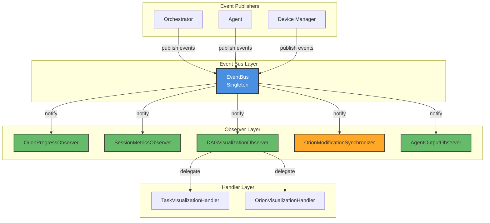
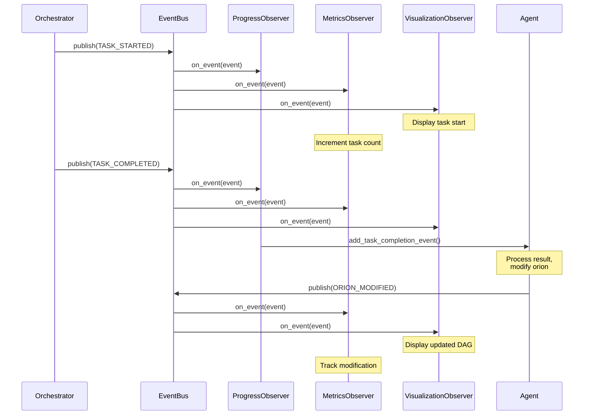

# Observer System — Overview

The **Observer System** in ALIEN Network implements an event-driven architecture that enables real-time monitoring, visualization, and coordination of orion execution. It provides a decoupled, extensible mechanism for components to react to system events without tight coupling.

The system implements the classic **Observer Pattern** (also known as Publish-Subscribe), enabling loose coupling between event producers and consumers. This allows the system to be extended with new observers without modifying existing code.

---

##  Purpose and Design Goals

The observer system serves several critical functions in the Network framework:

1. **Real-time Monitoring** — Track task execution, orion lifecycle, and system events
2. **Visualization** — Provide live updates for DAG topology and execution progress
3. **Metrics Collection** — Gather performance statistics and execution data
4. **Synchronization** — Coordinate between agent modifications and orchestrator execution
5. **Agent Output Handling** — Display agent responses and actions in real-time

---

## ️ Architecture Overview

The observer system consists of three main layers:



**Architecture Layers:**

| Layer | Component | Responsibility |
|-------|-----------|----------------|
| **Event Publishers** | Orchestrator, Agent, Device Manager | Generate events during system operation |
| **Event Bus** | `EventBus` singleton | Central message broker, manages subscriptions and routing |
| **Observers** | 5 specialized observers | React to specific event types and perform actions |
| **Handlers** | Task & Orion handlers | Delegate visualization logic for specific components |

---

## [STATUS] Core Components

### Event System Core

The foundation of the observer system consists of:

| Component | Location | Description |
|-----------|----------|-------------|
| **EventBus** | `network/core/events.py` | Central message broker managing subscriptions |
| **EventType** | `network/core/events.py` | Enumeration of all system event types |
| **Event Classes** | `network/core/events.py` | Base (`Event`) and specialized (`TaskEvent`, `OrionEvent`, `AgentEvent`, `DeviceEvent`) event data structures |
| **Interfaces** | `network/core/events.py` | `IEventObserver`, `IEventPublisher` contracts |

For detailed documentation of the event system core components, see the **[Event System Core](event_system.md)** documentation.

### Observer Implementations

Five specialized observers handle different aspects of system monitoring:

| Observer | File Location | Primary Role | Key Features |
|----------|---------------|--------------|--------------|
| **OrionProgressObserver** | `network/session/observers/base_observer.py` | Task progress tracking | Queues completion events for agent, coordinates task lifecycle |
| **SessionMetricsObserver** | `network/session/observers/base_observer.py` | Performance metrics | Collects timing, success rates, modification statistics |
| **DAGVisualizationObserver** | `network/session/observers/dag_visualization_observer.py` | Real-time visualization | Displays orion topology and execution flow |
| **OrionModificationSynchronizer** | `network/session/observers/orion_sync_observer.py` | Modification coordination | Prevents race conditions between agent and orchestrator |
| **AgentOutputObserver** | `network/session/observers/agent_output_observer.py` | Agent interaction display | Shows agent responses and actions in real-time |

---

## [CONTINUE] Event Flow

The following diagram illustrates how events flow through the system:



The event flow demonstrates how a single action (task completion) triggers multiple observers, each performing their specialized function without interfering with others.

---

## [TASK] Event Types

The system defines the following event types:

### Task Events

Track individual task execution lifecycle:

| Event Type | Trigger | Data Includes |
|------------|---------|---------------|
| `TASK_STARTED` | Task begins execution | task_id, status, orion_id |
| `TASK_COMPLETED` | Task finishes successfully | task_id, result, execution_time, newly_ready_tasks |
| `TASK_FAILED` | Task encounters error | task_id, error, retry_info |

### Orion Events

Monitor orion-level operations:

| Event Type | Trigger | Data Includes |
|------------|---------|---------------|
| `ORION_STARTED` | Orion begins processing | orion, initial_statistics, processing_time |
| `ORION_COMPLETED` | All tasks finished | orion, final_statistics, execution_time |
| `ORION_FAILED` | Orion encounters error | orion, error |
| `ORION_MODIFIED` | Structure changed by agent | old_orion, new_orion, on_task_id, modification_type, changes |

### Agent Events

Display agent interactions:

| Event Type | Trigger | Data Includes |
|------------|---------|---------------|
| `AGENT_RESPONSE` | Agent generates response | agent_name, agent_type, response_data |
| `AGENT_ACTION` | Agent executes action | agent_name, action_type, actions |

### Device Events

Monitor device status (used by client):

| Event Type | Trigger | Data Includes |
|------------|---------|---------------|
| `DEVICE_CONNECTED` | Device joins pool | device_id, device_status, device_info |
| `DEVICE_DISCONNECTED` | Device leaves pool | device_id, device_status |
| `DEVICE_STATUS_CHANGED` | Device state changes | device_id, device_status, all_devices |

---

## [START] Usage Example

Here's a complete example showing how observers are initialized and used in a Network session:

```python
from network.core.events import get_event_bus, EventType
from network.session.observers import (
    OrionProgressObserver,
    SessionMetricsObserver,
    DAGVisualizationObserver,
    OrionModificationSynchronizer,
    AgentOutputObserver
)

# Get the global event bus
event_bus = get_event_bus()

# 1. Create progress observer for agent coordination
progress_observer = OrionProgressObserver(agent=orion_agent)
event_bus.subscribe(progress_observer)

# 2. Create metrics observer for performance tracking
metrics_observer = SessionMetricsObserver(
    session_id="my_session",
    logger=logger
)
event_bus.subscribe(metrics_observer)

# 3. Create visualization observer for real-time display
viz_observer = DAGVisualizationObserver(enable_visualization=True)
event_bus.subscribe(viz_observer)

# 4. Create synchronizer to prevent race conditions
synchronizer = OrionModificationSynchronizer(
    orchestrator=orchestrator,
    logger=logger
)
event_bus.subscribe(synchronizer)

# 5. Create agent output observer for displaying interactions
agent_output_observer = AgentOutputObserver(presenter_type="rich")
event_bus.subscribe(agent_output_observer)

# Execute orion
await orchestrator.execute_orion(orion)

# Retrieve collected metrics
metrics = metrics_observer.get_metrics()
print(f"Tasks completed: {metrics['completed_tasks']}")
print(f"Total execution time: {metrics['total_execution_time']:.2f}s")
print(f"Modifications: {metrics['orion_modifications']}")
```

---

##  Key Benefits

### 1. Decoupling

Events decouple components — publishers don't need to know about observers:

- **Orchestrator** publishes task events without knowing who's listening
- **Agent** publishes modification events without coordinating with orchestrator
- **New observers** can be added without changing existing code

### 2. Extensibility

Add custom observers for new functionality:

```python
from network.core.events import IEventObserver, Event, EventType

class CustomMetricsObserver(IEventObserver):
    """Custom observer for domain-specific metrics."""
    
    def __init__(self):
        self.custom_metrics = {}
    
    async def on_event(self, event: Event) -> None:
        if event.event_type == EventType.TASK_COMPLETED:
            # Collect custom metrics
            task_type = event.data.get("task_type")
            if task_type not in self.custom_metrics:
                self.custom_metrics[task_type] = []
            
            self.custom_metrics[task_type].append({
                "duration": event.data.get("execution_time"),
                "result": event.result
            })

# Subscribe to specific events
event_bus = get_event_bus()
custom_observer = CustomMetricsObserver()
event_bus.subscribe(custom_observer, {EventType.TASK_COMPLETED})
```

### 3. Concurrent Execution

All observers are notified concurrently using `asyncio.gather()`:

- No observer blocks another
- Exceptions in one observer don't affect others
- Efficient parallel processing

### 4. Type-Safe Event Handling

Specialized event classes provide type safety:

```python
async def on_event(self, event: Event) -> None:
    if isinstance(event, TaskEvent):
        # TaskEvent-specific handling
        task_id = event.task_id  # Type-safe access
        status = event.status
        
    elif isinstance(event, OrionEvent):
        # OrionEvent-specific handling
        orion_id = event.orion_id
        state = event.orion_state
```

---

## [PLAN] Component Documentation

Explore detailed documentation for each observer:

- **[Session Metrics Observer](metrics_observer.md)** — Performance metrics and statistics collection
- **[Event System Core](event_system.md)** — Event bus, event types, and interfaces

!!! note "Additional Observers"
    Documentation for `OrionProgressObserver`, `DAGVisualizationObserver`, `OrionModificationSynchronizer`, and `AgentOutputObserver` is available in their source code files. These observers handle task progress tracking, real-time visualization, modification synchronization, and agent output display respectively.

---

## [DEP] Related Documentation

- **[Orion Orchestrator](../orion_orchestrator/overview.md)** — Event publishers for task execution
- **[Orion Agent](../orion_agent/overview.md)** — Event publishers for agent operations
- **[Performance Metrics](../evaluation/performance_metrics.md)** — How metrics are collected and analyzed
- **[Event-Driven Coordination](../orion_orchestrator/event_driven_coordination.md)** — Deep dive into event system architecture

---

## [THOUGHT] Best Practices

### Observer Lifecycle Management

Properly manage observer subscriptions to prevent memory leaks:

```python
# Subscribe observers
observers = [progress_observer, metrics_observer, viz_observer]
for observer in observers:
    event_bus.subscribe(observer)

try:
    # Execute orion
    await orchestrator.execute_orion(orion)
finally:
    # Clean up observers
    for observer in observers:
        event_bus.unsubscribe(observer)
```

### Event-Specific Subscription

Subscribe only to relevant events for efficiency:

```python
# Instead of subscribing to all events
event_bus.subscribe(observer)  # Receives ALL events

# Subscribe to specific event types
event_bus.subscribe(observer, {
    EventType.TASK_COMPLETED,
    EventType.TASK_FAILED,
    EventType.ORION_MODIFIED
})
```

### Error Handling in Observers

Always handle exceptions gracefully:

```python
async def on_event(self, event: Event) -> None:
    try:
        # Process event
        await self._handle_event(event)
    except Exception as e:
        self.logger.error(f"Error processing event: {e}")
        # Don't re-raise - let other observers continue
```

---

##  Summary

The Observer System provides a robust, event-driven foundation for monitoring and coordinating Network's orion execution:

- **Event Bus** acts as central message broker
- **5 specialized observers** handle different aspects of monitoring
- **Loose coupling** enables extensibility and maintainability
- **Concurrent execution** ensures efficient event processing
- **Type-safe events** provide clear contracts and error prevention

For implementation details of specific observers, refer to the individual component documentation pages linked above.
