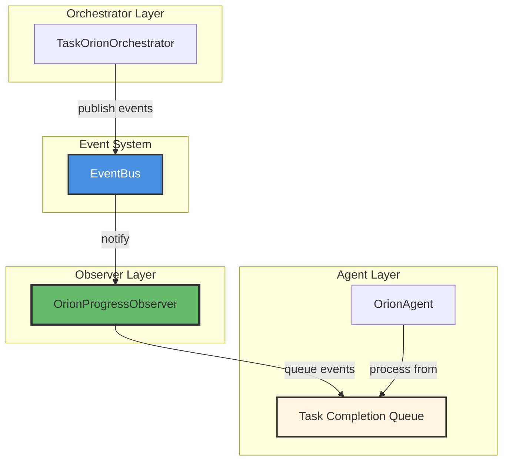
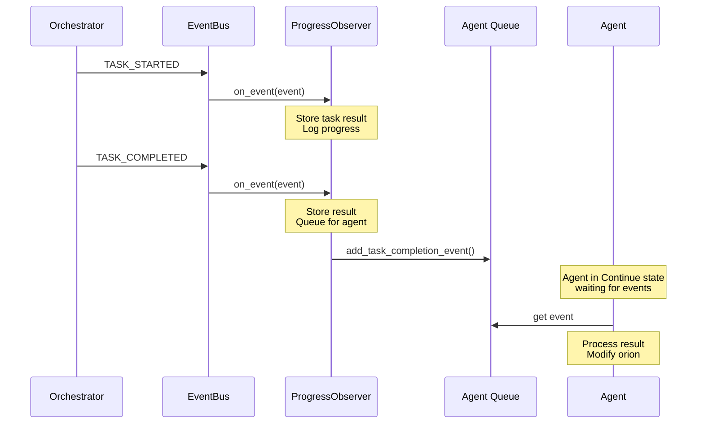
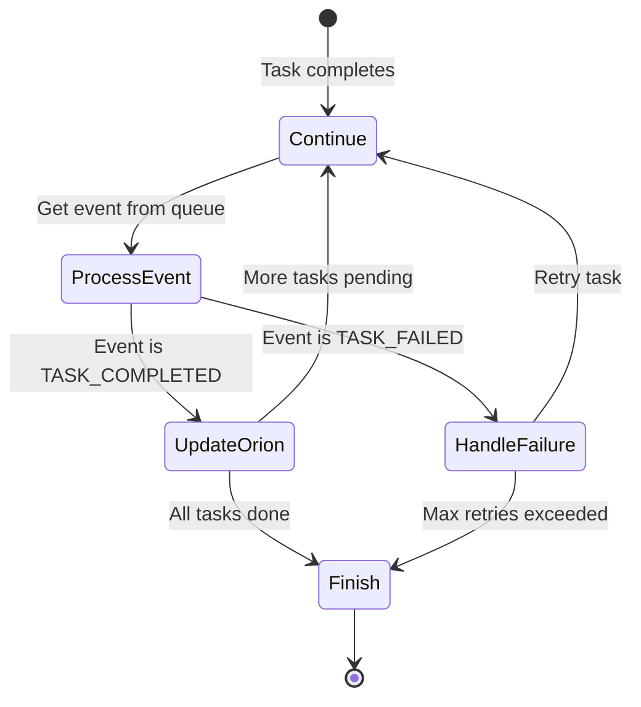

# Orion Progress Observer

The **OrionProgressObserver** is responsible for tracking task execution progress and coordinating between the orchestrator and the agent. It acts as the bridge that enables the agent to react to task completion events and make necessary orion modifications.

**Location:** `network/session/observers/base_observer.py`

## Purpose

The Progress Observer serves two critical functions:

- **Task Completion Coordination** — Queues task completion events for the agent to process
- **Orion Event Handling** — Notifies the agent when orion execution completes

## Architecture



**Component Interaction:**

| Component | Role | Communication |
|-----------|------|---------------|
| **Orchestrator** | Executes tasks, publishes events | → EventBus |
| **EventBus** | Distributes events | → Progress Observer |
| **Progress Observer** | Filters & queues relevant events | → Agent Queue |
| **Agent** | Processes completions, modifies orion | ← Agent Queue |

## Event Handling

The Progress Observer handles two types of events:

### Task Events

Monitors task execution lifecycle and queues completion events:



**Handled Event Types:**

| Event Type | Action | Data Stored |
|------------|--------|-------------|
| `TASK_STARTED` | Store task result placeholder | task_id, status, timestamp |
| `TASK_COMPLETED` | Store result, queue for agent | task_id, status, result, timestamp |
| `TASK_FAILED` | Store error, queue for agent | task_id, status, error, timestamp |

### Orion Events

Handles orion lifecycle events:

| Event Type | Action | Effect |
|------------|--------|--------|
| `ORION_COMPLETED` | Queue completion event for agent | Wakes up agent's Continue state to process final results |

## Implementation

### Initialization

```python
from network.session.observers import OrionProgressObserver
from network.agents import OrionAgent

# Create progress observer with agent reference
agent = OrionAgent(orchestrator=orchestrator)
progress_observer = OrionProgressObserver(agent=agent)

# Subscribe to event bus
from network.core.events import get_event_bus
event_bus = get_event_bus()
event_bus.subscribe(progress_observer)
```

**Constructor Parameters:**

| Parameter | Type | Description |
|-----------|------|-------------|
| `agent` | `OrionAgent` | The agent that will process queued events |

### Internal Data Structures

The observer maintains:

```python
class OrionProgressObserver(IEventObserver):
    def __init__(self, agent: OrionAgent):
        self.agent = agent
        
        # Task results storage: task_id -> result dict
        self.task_results: Dict[str, Dict[str, Any]] = {}
        
        self.logger = logging.getLogger(__name__)
```

**Task Result Structure:**

```python
{
    "task_id": "task_123",
    "status": "COMPLETED",  # or "FAILED"
    "result": {...},         # Task execution result
    "error": None,           # Exception if failed
    "timestamp": 1234567890.123
}
```

## Event Processing Flow

### Task Event Processing

```python
async def _handle_task_event(self, event: TaskEvent) -> None:
    """Handle task progress events and queue them for agent processing."""
    
    try:
        self.logger.info(
            f"Task progress: {event.task_id} -> {event.status}. "
            f"Event Type: {event.event_type}"
        )
        
        # 1. Store task result for tracking
        self.task_results[event.task_id] = {
            "task_id": event.task_id,
            "status": event.status,
            "result": event.result,
            "error": event.error,
            "timestamp": event.timestamp,
        }
        
        # 2. Queue completion/failure events for agent
        if event.event_type in [EventType.TASK_COMPLETED, EventType.TASK_FAILED]:
            await self.agent.add_task_completion_event(event)
    
    except Exception as e:
        self.logger.error(f"Error handling task event: {e}", exc_info=True)
```

**Processing Steps:**

1. **Log Progress**: Record task status change
2. **Store Result**: Update internal task_results dictionary
3. **Queue for Agent**: If completion/failure, add to agent's queue
4. **Error Handling**: Catch and log any exceptions

### Orion Event Processing

```python
async def _handle_orion_event(self, event: OrionEvent) -> None:
    """Handle orion update events."""
    
    try:
        if event.event_type == EventType.ORION_COMPLETED:
            # Queue completion event for agent
            await self.agent.add_orion_completion_event(event)
    
    except Exception as e:
        self.logger.error(
            f"Error handling orion event: {e}", 
            exc_info=True
        )
```

## API Reference

### Constructor

```python
def __init__(self, agent: OrionAgent)
```

Initialize the progress observer with a reference to the agent.

**Parameters:**

- `agent` — `OrionAgent` instance that will process queued events

**Example:**

```python
from network.agents import OrionAgent
from network.session.observers import OrionProgressObserver

agent = OrionAgent(orchestrator=orchestrator)
progress_observer = OrionProgressObserver(agent=agent)
```

### Event Handler

```python
async def on_event(self, event: Event) -> None
```

Handle orion-related events (TaskEvent or OrionEvent).

**Parameters:**

- `event` — Event instance (TaskEvent or OrionEvent)

**Behavior:**

- Filters events by type (TaskEvent vs OrionEvent)
- Delegates to appropriate handler method
- Logs progress and stores results
- Queues completion events for agent

## Usage Examples

### Example 1: Basic Setup

```python
import asyncio
from network.core.events import get_event_bus
from network.agents import OrionAgent
from network.orion import TaskOrionOrchestrator
from network.session.observers import OrionProgressObserver

async def setup_progress_tracking():
    """Set up progress tracking for orion execution."""
    
    # Create orchestrator and agent
    orchestrator = TaskOrionOrchestrator()
    agent = OrionAgent(orchestrator=orchestrator)
    
    # Create and subscribe progress observer
    progress_observer = OrionProgressObserver(agent=agent)
    event_bus = get_event_bus()
    event_bus.subscribe(progress_observer)
    
    # Now orchestrator events will be tracked and queued for agent
    return agent, orchestrator, progress_observer
```

### Example 2: Monitoring Task Results

```python
async def monitor_task_progress(observer: OrionProgressObserver):
    """Monitor task execution progress."""
    
    # Wait for some tasks to complete
    await asyncio.sleep(5)
    
    # Access stored results
    for task_id, result in observer.task_results.items():
        status = result["status"]
        timestamp = result["timestamp"]
        
        if status == "COMPLETED":
            print(f"✅ Task {task_id} completed at {timestamp}")
            print(f"   Result: {result['result']}")
        elif status == "FAILED":
            print(f"❌ Task {task_id} failed at {timestamp}")
            print(f"   Error: {result['error']}")
```

### Example 3: Custom Progress Observer

```python
from network.core.events import IEventObserver, TaskEvent, EventType

class CustomProgressObserver(IEventObserver):
    """Custom observer with additional progress tracking."""
    
    def __init__(self, agent, on_progress_callback=None):
        self.agent = agent
        self.on_progress_callback = on_progress_callback
        
        # Track progress statistics
        self.total_tasks = 0
        self.completed_tasks = 0
        self.failed_tasks = 0
    
    async def on_event(self, event: Event) -> None:
        if isinstance(event, TaskEvent):
            # Update statistics
            if event.event_type == EventType.TASK_STARTED:
                self.total_tasks += 1
            elif event.event_type == EventType.TASK_COMPLETED:
                self.completed_tasks += 1
            elif event.event_type == EventType.TASK_FAILED:
                self.failed_tasks += 1
            
            # Call custom callback
            if self.on_progress_callback:
                progress = self.completed_tasks / self.total_tasks if self.total_tasks > 0 else 0
                self.on_progress_callback(progress, event)
            
            # Queue for agent
            if event.event_type in [EventType.TASK_COMPLETED, EventType.TASK_FAILED]:
                await self.agent.add_task_completion_event(event)

# Usage
def progress_callback(progress, event):
    print(f"Progress: {progress*100:.1f}% - {event.task_id} {event.status}")

custom_observer = CustomProgressObserver(
    agent=agent,
    on_progress_callback=progress_callback
)
event_bus.subscribe(custom_observer)
```

## Integration with Agent

The Progress Observer integrates tightly with the OrionAgent's state machine:

### Agent Queue Interface

The observer calls these agent methods:

```python
# Queue task completion event
await self.agent.add_task_completion_event(task_event)

# Queue orion completion event
await self.agent.add_orion_completion_event(orion_event)
```

### Agent Processing

The agent processes queued events in its `Continue` state:



**Agent State Machine States:**

| State | Description | Trigger |
|-------|-------------|---------|
| **Continue** | Wait for task completion events | Events queued by Progress Observer |
| **ProcessEvent** | Extract event from queue | Event available |
| **UpdateOrion** | Modify orion based on result | Task completed successfully |
| **HandleFailure** | Handle task failure, retry if needed | Task failed |
| **Finish** | Complete orion execution | All tasks done or unrecoverable error |

## Performance Considerations

### Memory Management

The observer stores all task results in memory:

```python
self.task_results: Dict[str, Dict[str, Any]] = {}
```

**Best Practices:**

- **Clear results** after orion completion to free memory
- **Limit result size** by storing only essential data
- **Use weak references** for large result objects if needed

### Queue Management

Events are queued to the agent's asyncio queue:

```python
await self.agent.add_task_completion_event(event)
```

**Considerations:**

- **Queue size** is unbounded by default
- **Back pressure** may occur if agent processes slowly
- **Memory growth** possible with many rapid completions

!!! warning "Memory Usage"
    For long-running sessions with many tasks, consider periodically clearing the `task_results` dictionary to prevent memory growth.

## Best Practices

### 1. Clean Up After Completion

Clear task results after orion execution:

```python
async def execute_with_cleanup(orchestrator, orion, progress_observer):
    """Execute orion and clean up observer."""
    
    try:
        await orchestrator.execute_orion(orion)
    finally:
        # Clear stored results
        progress_observer.task_results.clear()
```

### 2. Handle Errors Gracefully

The observer includes comprehensive error handling:

```python
try:
    # Process event
    await self._handle_task_event(event)
except AttributeError as e:
    self.logger.error(f"Attribute error: {e}", exc_info=True)
except KeyError as e:
    self.logger.error(f"Missing key: {e}", exc_info=True)
except Exception as e:
    self.logger.error(f"Unexpected error: {e}", exc_info=True)
```

### 3. Monitor Queue Size

Check agent queue size periodically:

```python
# Access agent's internal queue
queue_size = self.agent.task_completion_queue.qsize()
if queue_size > 100:
    logger.warning(f"Task completion queue growing large: {queue_size}")
```

## Related Documentation

- **[Observer System Overview](overview.md)** — Architecture and design principles
- **[Agent Output Observer](agent_output_observer.md)** — Agent response and action display
- **[Orion Agent](../orion_agent/overview.md)** — Agent state machine and event processing
- **[Orion Modification Synchronizer](synchronizer.md)** — Coordination between agent and orchestrator

## Summary

The Orion Progress Observer:

- **Tracks** task execution progress
- **Stores** task results for historical reference
- **Queues** completion events for agent processing
- **Coordinates** between orchestrator and agent
- **Enables** event-driven orion modification

This observer is essential for the agent-orchestrator coordination pattern in Network, replacing complex callback mechanisms with a clean event-driven interface.
