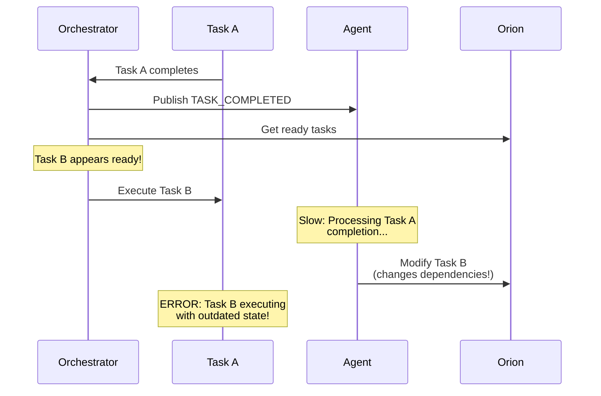
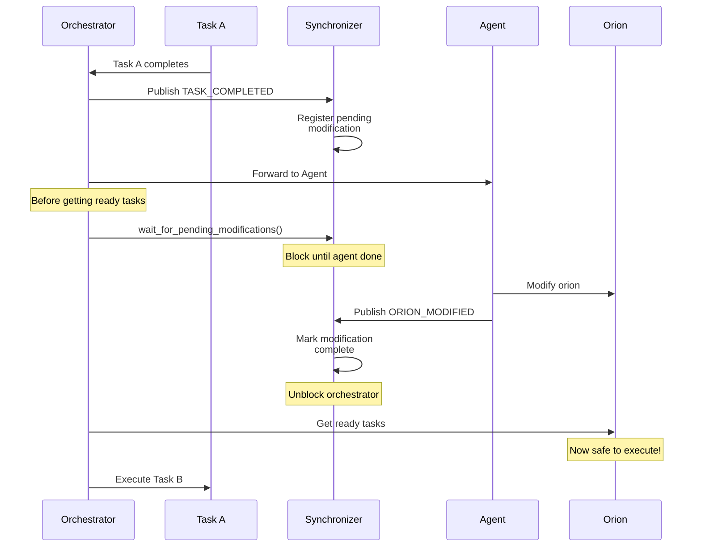
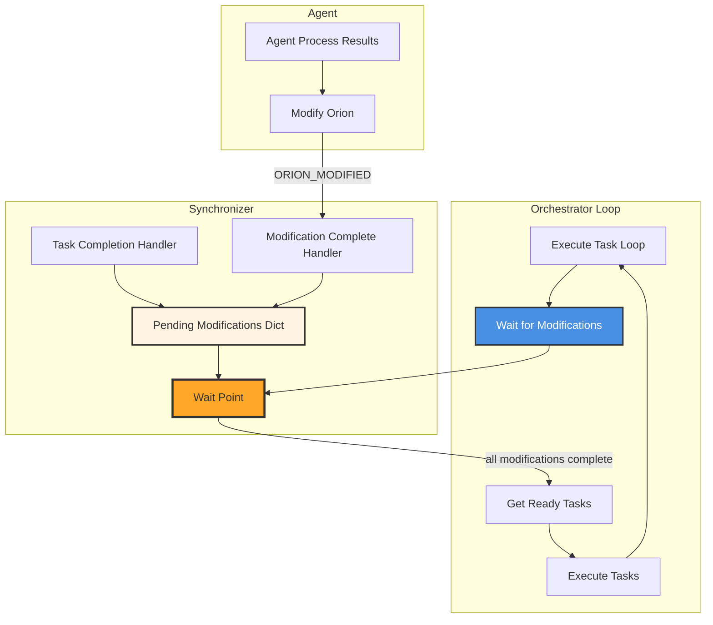
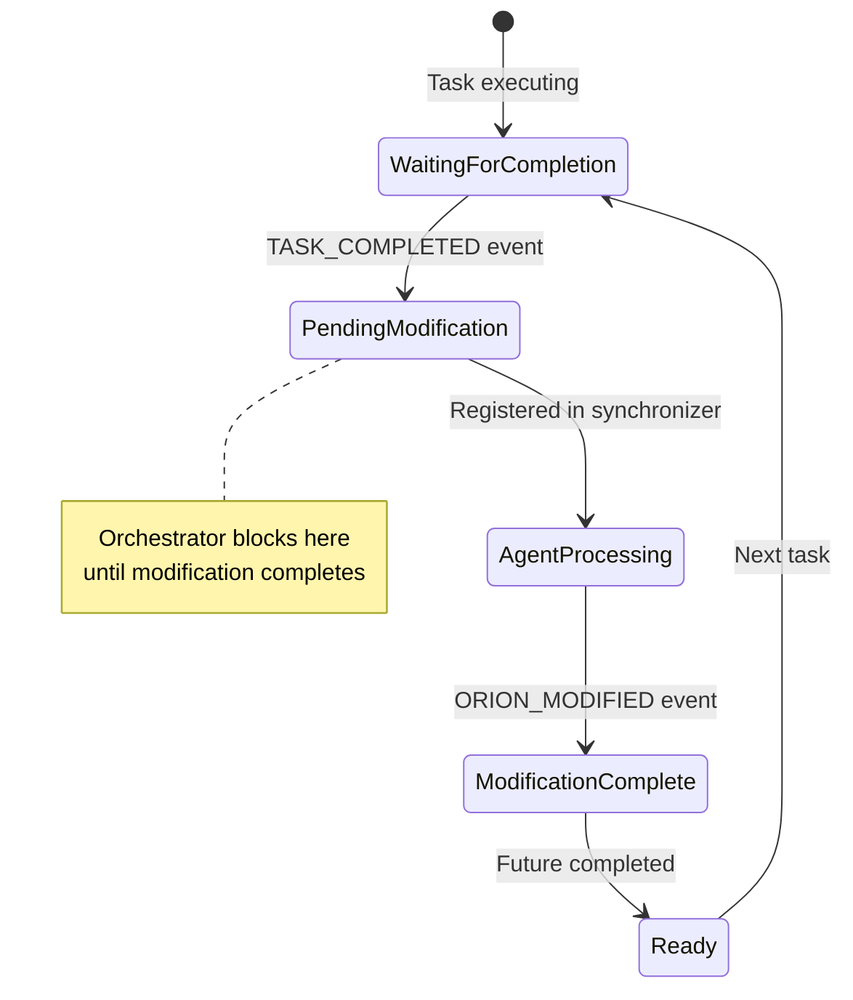

# Orion Modification Synchronizer

The **OrionModificationSynchronizer** prevents race conditions between orion modifications by the agent and task execution by the orchestrator. It ensures proper synchronization so the orchestrator doesn't execute newly ready tasks before the agent finishes updating the orion structure.

**Location:** `network/session/observers/orion_sync_observer.py`

## Problem Statement

Without synchronization, the following race condition can occur:



**The Race Condition:**

- **Task A completes** → triggers orion update
- **Orchestrator immediately** gets ready tasks → might execute Task B
- **Agent is still** modifying Task B or its dependencies
- **Result**: Task B executes with outdated/incorrect configuration

!!! danger "Critical Issue"
    Executing tasks with outdated orion state can lead to incorrect task parameters, wrong dependency chains, data inconsistencies, and unpredictable workflow behavior.

## Solution: Synchronization Pattern

The Synchronizer implements a **wait-before-execute** pattern:



## Architecture



## Synchronization Flow

### Step-by-Step Process

1. **Task Completes** → `TASK_COMPLETED` event published
2. **Synchronizer Registers** → Creates pending modification Future
3. **Orchestrator Waits** → Calls `wait_for_pending_modifications()`
4. **Agent Processes** → Modifies orion structure
5. **Agent Publishes** → `ORION_MODIFIED` event published
6. **Synchronizer Completes** → Sets Future result, unblocks orchestrator
7. **Orchestrator Continues** → Gets ready tasks with updated orion

### Event Flow



## Implementation

### Initialization

```python
from network.session.observers import OrionModificationSynchronizer
from network.orion import TaskOrionOrchestrator

# Create synchronizer with orchestrator reference
synchronizer = OrionModificationSynchronizer(
    orchestrator=orchestrator,
    logger=logger
)

# Subscribe to event bus
from network.core.events import get_event_bus
event_bus = get_event_bus()
event_bus.subscribe(synchronizer)

# Attach to orchestrator (for easy access)
orchestrator.set_modification_synchronizer(synchronizer)
```

### Constructor Parameters

| Parameter | Type | Description |
|-----------|------|-------------|
| `orchestrator` | `TaskOrionOrchestrator` | Orchestrator to synchronize with |
| `logger` | `logging.Logger` | Optional logger instance |

### Internal State

The synchronizer maintains:

```python
class OrionModificationSynchronizer(IEventObserver):
    def __init__(self, orchestrator, logger=None):
        self.orchestrator = orchestrator
        
        # Pending modifications: task_id -> asyncio.Future
        self._pending_modifications: Dict[str, asyncio.Future] = {}
        
        # Current orion being modified
        self._current_orion_id: Optional[str] = None
        self._current_orion: Optional[TaskOrion] = None
        
        # Timeout for modifications (safety measure)
        self._modification_timeout = 600.0  # 10 minutes
        
        # Statistics
        self._stats = {
            "total_modifications": 0,
            "completed_modifications": 0,
            "timeout_modifications": 0,
        }
```

## API Reference

### Main Wait Point

#### wait_for_pending_modifications()

Wait for all pending modifications to complete before proceeding.

```python
async def wait_for_pending_modifications(
    self, 
    timeout: Optional[float] = None
) -> bool
```

**Parameters:**

- `timeout` — Optional timeout in seconds (uses default 600s if None)

**Returns:**

- `True` if all modifications completed successfully
- `False` if timeout occurred

**Usage in Orchestrator:**

```python
async def execute_orion(self, orion):
    """Execute orion with synchronized modifications."""
    
    while True:
        # Wait for any pending modifications
        await self.synchronizer.wait_for_pending_modifications()
        
        # Now safe to get ready tasks
        ready_tasks = orion.get_ready_tasks()
        
        if not ready_tasks:
            break  # All tasks complete
        
        # Execute ready tasks
        await self._execute_tasks(ready_tasks)
```

### State Management Methods

#### get_current_orion()

Get the most recent orion state after modifications.

```python
def get_current_orion(self) -> Optional[TaskOrion]
```

**Returns:** Latest orion instance or None

#### has_pending_modifications()

Check if any modifications are pending.

```python
def has_pending_modifications(self) -> bool
```

**Returns:** `True` if modifications pending, `False` otherwise

#### get_pending_count()

Get number of pending modifications.

```python
def get_pending_count(self) -> int
```

**Returns:** Count of pending modifications

### Orion State Merging

#### merge_and_sync_orion_states()

Merge orion states to preserve both structural changes and execution state.

```python
def merge_and_sync_orion_states(
    self,
    orchestrator_orion: TaskOrion
) -> TaskOrion
```

**Purpose:** Prevents loss of execution state when agent modifies orion structure.

**Merge Strategy:**

1. **Use agent's orion as base** (has structural modifications)
2. **Preserve orchestrator's execution state** for existing tasks
3. **Priority rule**: More advanced state wins (COMPLETED > RUNNING > PENDING)
4. **Update orion state** after merging

**Example Scenario:**

```
Before Merge:
- Orchestrator's Task A: COMPLETED (execution state)
- Agent's Task A: RUNNING (structural changes applied)

After Merge:
- Task A: COMPLETED (preserved from orchestrator)
         + structural changes from agent
```

## Usage Examples

### Example 1: Basic Integration

```python
from network.core.events import get_event_bus
from network.session.observers import OrionModificationSynchronizer

async def setup_synchronized_execution():
    """Set up synchronized orion execution."""
    
    # Create orchestrator
    orchestrator = TaskOrionOrchestrator()
    
    # Create and attach synchronizer
    synchronizer = OrionModificationSynchronizer(
        orchestrator=orchestrator,
        logger=logger
    )
    
    # Subscribe to events
    event_bus = get_event_bus()
    event_bus.subscribe(synchronizer)
    
    # Attach to orchestrator
    orchestrator.set_modification_synchronizer(synchronizer)
    
    # Execute orion (now synchronized)
    await orchestrator.execute_orion(orion)
```

### Example 2: Monitor Synchronization

```python
async def monitor_synchronization(synchronizer):
    """Monitor synchronization status during execution."""
    
    while True:
        await asyncio.sleep(1)
        
        if synchronizer.has_pending_modifications():
            count = synchronizer.get_pending_count()
            pending = synchronizer.get_pending_task_ids()
            print(f"⏳ Waiting for {count} modifications: {pending}")
        else:
            print("✅ No pending modifications")
        
        # Check statistics
        stats = synchronizer.get_statistics()
        print(f"Stats: {stats['completed_modifications']} completed, "
              f"{stats['timeout_modifications']} timeouts")
```

### Example 3: Custom Timeout Handling

```python
# Set custom timeout (default is 600 seconds)
synchronizer.set_modification_timeout(300.0)  # 5 minutes

# Wait with custom timeout
success = await synchronizer.wait_for_pending_modifications(timeout=120.0)

if not success:
    print("⚠️ Modifications timed out, proceeding anyway")
    # Handle timeout scenario
    synchronizer.clear_pending_modifications()  # Emergency cleanup
```

## Advanced Features

### Automatic Timeout Handling

The synchronizer automatically times out stuck modifications:

```python
async def _auto_complete_on_timeout(
    self, 
    task_id: str, 
    future: asyncio.Future
) -> None:
    """Auto-complete a pending modification if it times out."""
    
    await asyncio.sleep(self._modification_timeout)
    
    if not future.done():
        self._stats["timeout_modifications"] += 1
        self.logger.warning(
            f"⚠️ Modification for task '{task_id}' timed out after "
            f"{self._modification_timeout}s. Auto-completing to prevent deadlock."
        )
        future.set_result(False)
        del self._pending_modifications[task_id]
```

**Timeout Benefits:**

- Prevents deadlocks if agent fails
- Allows execution to continue
- Logs timeout for debugging
- Tracks timeout statistics

### Dynamic Modification Tracking

Handles new modifications registered during wait:

```python
async def wait_for_pending_modifications(self, timeout=None) -> bool:
    """Wait for all pending modifications, including those added during wait."""
    
    while self._pending_modifications:
        # Get snapshot of current pending modifications
        pending_tasks = list(self._pending_modifications.keys())
        pending_futures = list(self._pending_modifications.values())
        
        # Wait for current batch
        await asyncio.wait_for(
            asyncio.gather(*pending_futures, return_exceptions=True),
            timeout=remaining_timeout
        )
        
        # Check if new modifications were added during wait
        # If yes, loop again; if no, we're done
        if not self._pending_modifications:
            break
    
    return True
```

## Statistics and Monitoring

### Available Statistics

```python
stats = synchronizer.get_statistics()

{
    "total_modifications": 10,      # Total registered
    "completed_modifications": 9,    # Successfully completed
    "timeout_modifications": 1       # Timed out
}
```

### Monitoring Points

| Metric | Method | Description |
|--------|--------|-------------|
| Pending count | `get_pending_count()` | Number of pending modifications |
| Pending tasks | `get_pending_task_ids()` | List of task IDs with pending modifications |
| Has pending | `has_pending_modifications()` | Boolean check |
| Statistics | `get_statistics()` | Complete stats dictionary |

## Performance Considerations

### Memory Usage

The synchronizer stores futures for each pending modification:

```python
self._pending_modifications: Dict[str, asyncio.Future] = {}
```

**Memory Impact:**

- **Low overhead**: Only stores Future objects (small)
- **Temporary**: Cleared after completion
- **Bounded**: Limited by concurrent task completions

### Timeout Configuration

Choose appropriate timeout based on orion complexity:

```python
# Simple orions
synchronizer.set_modification_timeout(60.0)  # 1 minute

# Complex orions with slow LLM
synchronizer.set_modification_timeout(600.0)  # 10 minutes

# Very complex multi-device scenarios
synchronizer.set_modification_timeout(1800.0)  # 30 minutes
```

## Best Practices

### 1. Always Attach to Orchestrator

The orchestrator needs to call `wait_for_pending_modifications()`:

```python
# ✅ Good: Orchestrator can access synchronizer
orchestrator.set_modification_synchronizer(synchronizer)

# ❌ Bad: No way for orchestrator to wait
# synchronizer exists but orchestrator doesn't use it
```

### 2. Handle Timeouts Gracefully

```python
success = await synchronizer.wait_for_pending_modifications()

if not success:
    # Log timeout
    logger.warning("Modifications timed out")
    
    # Get current state anyway (may be partially updated)
    orion = synchronizer.get_current_orion()
    
    # Continue execution (with caution)
```

### 3. Monitor Statistics

Track synchronization health:

```python
stats = synchronizer.get_statistics()

timeout_rate = (
    stats["timeout_modifications"] / stats["total_modifications"]
    if stats["total_modifications"] > 0
    else 0
)

if timeout_rate > 0.1:  # More than 10% timing out
    logger.warning(f"High timeout rate: {timeout_rate:.1%}")
    # Consider increasing timeout or investigating agent performance
```

## Related Documentation

- **[Observer System Overview](overview.md)** — Architecture and design
- **[Orion Progress Observer](progress_observer.md)** — Task completion events
- **[Orion Agent](../orion_agent/overview.md)** — Agent modification process

## Summary

The Orion Modification Synchronizer:

- **Prevents** race conditions between agent and orchestrator
- **Synchronizes** orion modifications with task execution
- **Blocks** orchestrator until modifications complete
- **Handles** timeouts to prevent deadlocks
- **Merges** orion states to preserve execution data

This observer is critical for ensuring correct orion execution when the agent dynamically modifies workflow structure during execution.
