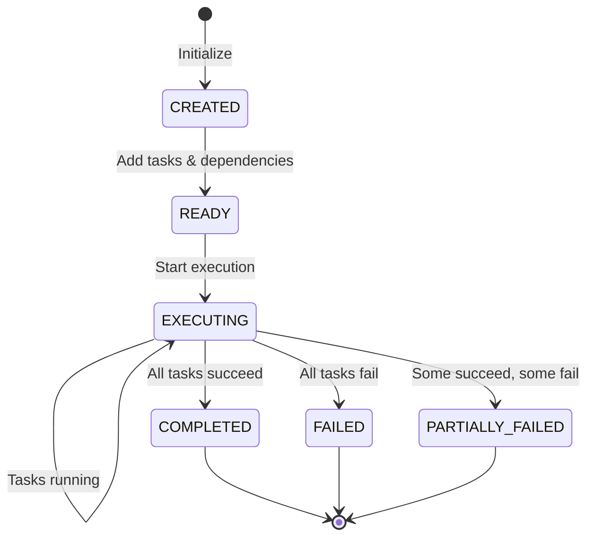
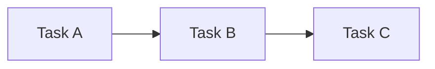
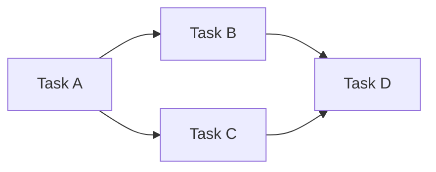
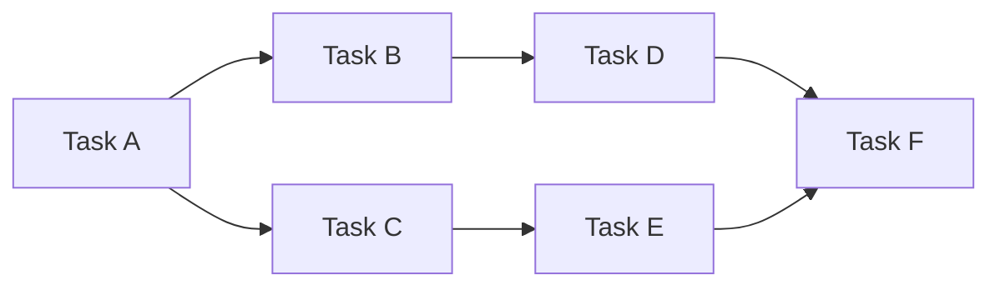

# Task Orion — Overview

<div align="center">
  
  <p><em>Example of a Task Orion illustrating both sequential and parallel dependencies</em></p>
</div>

---

## [ORION] Introduction

The **Task Orion** is the central abstraction in Network that captures the concurrent and asynchronous structure of distributed task execution. It provides a formal, directed acyclic graph (DAG) representation of complex workflows, enabling consistent scheduling, fault-tolerant orchestration, and runtime dynamism across heterogeneous devices.

At its core, a Task Orion decomposes complex user requests into interdependent subtasks connected through explicit dependency edges. This formalism not only enables correct distributed execution but also supports runtime adaptation—allowing new tasks or dependencies to be introduced as the workflow evolves.

For information on how Task Orions are orchestrated and scheduled, see the [Orion Orchestrator](../orion_orchestrator/overview.md) documentation. To understand how agents interact with orions, refer to the [Orion Agent](../orion_agent/overview.md) guide.

---

##  Core Components

The Task Orion framework consists of four primary components:

| Component | Purpose | Key Features |
|-----------|---------|--------------|
| **[TaskStar](task_star.md)** | Atomic execution unit | Self-contained task with description, device assignment, execution state, dependencies |
| **[TaskStarLine](task_star_line.md)** | Dependency relationship | Directed edge with conditional logic, success-only, completion-only, or unconditional execution |
| **[TaskOrion](task_orion.md)** | DAG orchestrator | Complete workflow graph with validation, scheduling, and dynamic modification |
| **[OrionEditor](orion_editor.md)** | Interactive editor | Command pattern-based interface with undo/redo for safe orion manipulation |

---

##  Formal Model

### Mathematical Foundation

A Task Orion $\mathcal{C}$ is formally defined as a directed acyclic graph (DAG):

$$
\mathcal{C} = (\mathcal{T}, \mathcal{E})
$$

where:
- $\mathcal{T}$ is the set of all **TaskStars** (task nodes)
- $\mathcal{E}$ is the set of **TaskStarLines** (dependency edges)

### TaskStar Representation

Each TaskStar $t_i \in \mathcal{T}$ encapsulates a complete task specification:

$$
t_i = (\text{name}_ i, \text{description}_ i, \text{target\_device\_id}_ i, \text{tips}_ i, \text{status}_ i, \text{dependencies}_ i)
$$

**Components:**
- **name**: Short name for the task
- **description**: Natural-language specification sent to the device agent
- **target_device_id**: ID of the device agent responsible for execution
- **tips**: List of guidance hints to help the device agent complete the task
- **status**: Current execution state (pending, running, completed, failed, cancelled, waiting_dependency)
- **dependencies**: Set of prerequisite task IDs that must complete first

### TaskStarLine Representation

Each TaskStarLine $e_{i \rightarrow j} \in \mathcal{E}$ represents a dependency from task $t_i$ to task $t_j$.

**Dependency Types:**

| Type | Behavior |
|------|----------|
| **Unconditional** | $t_j$ always waits for $t_i$ to complete |
| **Success-only** | $t_j$ proceeds only if $t_i$ succeeds |
| **Completion-only** | $t_j$ proceeds when $t_i$ completes (regardless of success/failure) |
| **Conditional** | $t_j$ proceeds based on a user-defined or runtime condition |

---

## [NEW] Key Advantages

### 1. Explicit Task Ordering
Task dependencies are explicitly captured in the DAG structure, ensuring correctness across distributed execution without ambiguity.

### 2. Natural Parallelism
The DAG topology naturally exposes parallelizable tasks, enabling efficient concurrent execution across heterogeneous devices.

### 3. Runtime Dynamism
Unlike static DAG schedulers, Task Orions are **mutable objects**. Tasks and dependency edges can be:
- **Added**: Introduce new subtasks or diagnostic tasks
- **Removed**: Prune completed or redundant nodes
- **Modified**: Rewire dependencies, update conditions, change device assignments

This enables adaptive execution without restarting the entire workflow.

### 4. Formal Guarantees
The DAG representation provides formal properties:
- **Acyclicity**: No circular dependencies
- **Causal consistency**: Execution respects logical ordering
- **Safe concurrency**: Parallel execution without race conditions

---

## [CONTINUE] Lifecycle States

The Task Orion progresses through several states during its lifecycle:



| State | Description |
|-------|-------------|
| **CREATED** | Orion initialized, no tasks added |
| **READY** | Tasks and dependencies configured, ready to execute |
| **EXECUTING** | At least one task is running or completed |
| **COMPLETED** | All tasks completed successfully |
| **FAILED** | All tasks failed |
| **PARTIALLY_FAILED** | Some tasks succeeded, some failed |

---

## [STATUS] DAG Metrics

### Parallelism Analysis

The Task Orion provides several metrics to analyze workflow parallelism:

#### Critical Path Length ($L$)
The longest serial dependency chain in the orion:

$$
L = \max_{p \in \text{paths}} |p|
$$

where $|p|$ is the length of path $p$ from any root to any leaf node.

#### Total Work ($W$)
Sum of all task execution durations:

$$
W = \sum_{t_i \in \mathcal{T}} \text{duration}(t_i)
$$

#### Parallelism Ratio ($P$)
Measure of achievable parallelism:

$$
P = \frac{W}{L}
$$

- $P = 1$: Completely serial execution
- $P > 1$: Parallel execution possible
- Higher $P$ indicates more parallelism

#### Maximum Width
Maximum number of tasks that can execute concurrently:

$$
\text{MaxWidth} = \max_{\text{level}} |\text{tasks at level}|
$$

!!!info "Calculation Modes"
    The orion supports two calculation modes:
    
    - **Node Count Mode**: Uses task counts when execution is incomplete
    - **Actual Time Mode**: Uses real execution durations when all tasks are terminal

---

## ️ Core Operations

### DAG Construction

```python
from network.orion import TaskOrion, TaskStar, TaskStarLine

# Create orion
orion = TaskOrion(name="my_workflow")

# Add tasks
task_a = TaskStar(name="task_a", description="Checkout code on laptop")
task_b = TaskStar(name="task_b", description="Build on GPU server")
task_c = TaskStar(name="task_c", description="Deploy to staging")

orion.add_task(task_a)
orion.add_task(task_b)
orion.add_task(task_c)

# Add dependencies
dep_ab = TaskStarLine.create_success_only(
    from_task_id=task_a.task_id,
    to_task_id=task_b.task_id,
    description="Build depends on successful checkout"
)

dep_bc = TaskStarLine.create_unconditional(
    from_task_id=task_b.task_id,
    to_task_id=task_c.task_id,
    description="Deploy after build"
)

orion.add_dependency(dep_ab)
orion.add_dependency(dep_bc)
```

### DAG Validation

```python
# Validate structure
is_valid, errors = orion.validate_dag()
if not is_valid:
    print(f"Validation errors: {errors}")

# Check for cycles
has_cycles = orion.has_cycle()

# Get topological order
order = orion.get_topological_order()
print(f"Execution order: {order}")
```

### Parallelism Analysis

```python
# Get parallelism metrics
metrics = orion.get_parallelism_metrics()

print(f"Critical Path Length: {metrics['critical_path_length']}")
print(f"Total Work: {metrics['total_work']}")
print(f"Parallelism Ratio: {metrics['parallelism_ratio']}")
print(f"Critical Path: {metrics['critical_path_tasks']}")

# Get maximum width
max_width = orion.get_max_width()
print(f"Maximum concurrent tasks: {max_width}")
```

---

## [CONFIG] Dynamic Modification

### Safe Editing with OrionEditor

```python
from network.orion.editor import OrionEditor

# Create editor with undo/redo support
editor = OrionEditor(orion)

# Add a new diagnostic task
diagnostic_task = editor.create_and_add_task(
    task_id="diag_1",
    description="Check server health",
    name="Server Health Check"
)

# Add conditional dependency
editor.create_and_add_dependency(
    from_task_id=task_b.task_id,
    to_task_id=diagnostic_task.task_id,
    dependency_type="CONDITIONAL",
    condition_description="Run diagnostic if build fails"
)

# Undo if needed
if something_wrong:
    editor.undo()

# Get modifiable components
modifiable_tasks = orion.get_modifiable_tasks()
modifiable_deps = orion.get_modifiable_dependencies()
```

!!!warning "Modification Safety"
    Tasks and dependencies can only be modified if they are in `PENDING` or `WAITING_DEPENDENCY` status. Running or completed tasks cannot be modified to ensure execution consistency.

---

##  Example Workflows

### Sequential Workflow



- **Parallelism Ratio**: 1.0 (completely serial)
- **Maximum Width**: 1

### Parallel Workflow



- **Parallelism Ratio**: 2.0 (B and C can run in parallel)
- **Maximum Width**: 2

### Complex Workflow



- **Parallelism Ratio**: ~1.67
- **Maximum Width**: 3 (B, C, E can run concurrently after A completes)

---

##  Visualization

The Task Orion provides multiple visualization modes for monitoring and debugging:

### Overview Mode
High-level orion structure with task counts and state

### Topology Mode
DAG graph showing task relationships and dependencies

### Details Mode
Detailed task information including execution times and status

### Execution Mode
Real-time execution flow with progress tracking

```python
# Display orion
orion.display_dag(mode="overview")  # or "topology", "details", "execution"
```

For interactive web-based visualization, check out the [Network WebUI](../webui.md).

---

## [PLAN] Component Documentation

Explore detailed documentation for each component:

- **[TaskStar](task_star.md)** — Atomic execution units representing individual tasks in the orion
- **[TaskStarLine](task_star_line.md)** — Dependency relationships connecting tasks with conditional logic
- **[TaskOrion](task_orion.md)** — Complete DAG orchestrator managing workflow execution and coordination
- **[OrionEditor](orion_editor.md)** — Interactive editor with command pattern and undo/redo capabilities

### Related Documentation

- **[Orion Orchestrator](../orion_orchestrator/overview.md)** — Learn how orions are scheduled and executed across devices
- **[Orion Agent](../orion_agent/overview.md)** — Understand how agents plan and manage orion lifecycles
- **[Evaluation & Metrics](../evaluation/performance_metrics.md)** — Monitor orion performance and analyze execution patterns

---

##  Research Background

The Task Orion model is grounded in formal DAG theory and distributed systems research. Key properties include:

- **Acyclicity guarantees** through Kahn's algorithm for topological sorting
- **Topological ordering** for consistent execution
- **Critical path analysis** for performance optimization
- **Dynamic graph evolution** without compromising consistency

For more on Network's architecture and design principles, see the [Network Overview](../overview.md).

---

## [THOUGHT] Best Practices

!!!tip "Designing Effective Orions"
    1. **Keep tasks atomic**: Each TaskStar should represent a single, well-defined operation
    2. **Minimize dependencies**: Reduce unnecessary dependencies to maximize parallelism
    3. **Use appropriate dependency types**: Choose conditional dependencies for error handling
    4. **Validate early**: Run `validate_dag()` before execution
    5. **Monitor metrics**: Track parallelism ratio to optimize workflow design

**Common Patterns:**

- **Fan-out**: One task spawns multiple independent parallel tasks
- **Fan-in**: Multiple parallel tasks converge to a single task
- **Pipeline**: Sequential stages with parallel tasks within each stage
- **Conditional branching**: Use conditional dependencies for error handling paths

---

## [START] Next Steps

- Learn about **[TaskStar](task_star.md)** — Atomic task execution units
- Explore **[TaskStarLine](task_star_line.md)** — Dependency relationships
- Master **[TaskOrion](task_orion.md)** — DAG orchestration
- Try **[OrionEditor](orion_editor.md)** — Interactive editing
