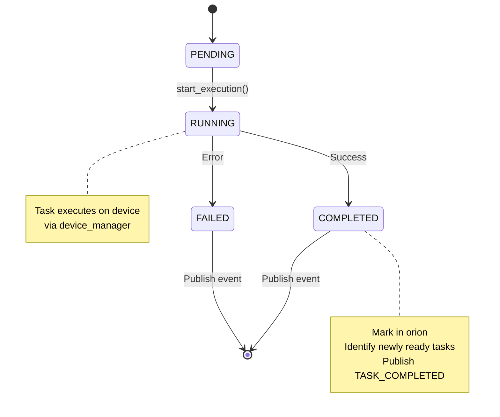
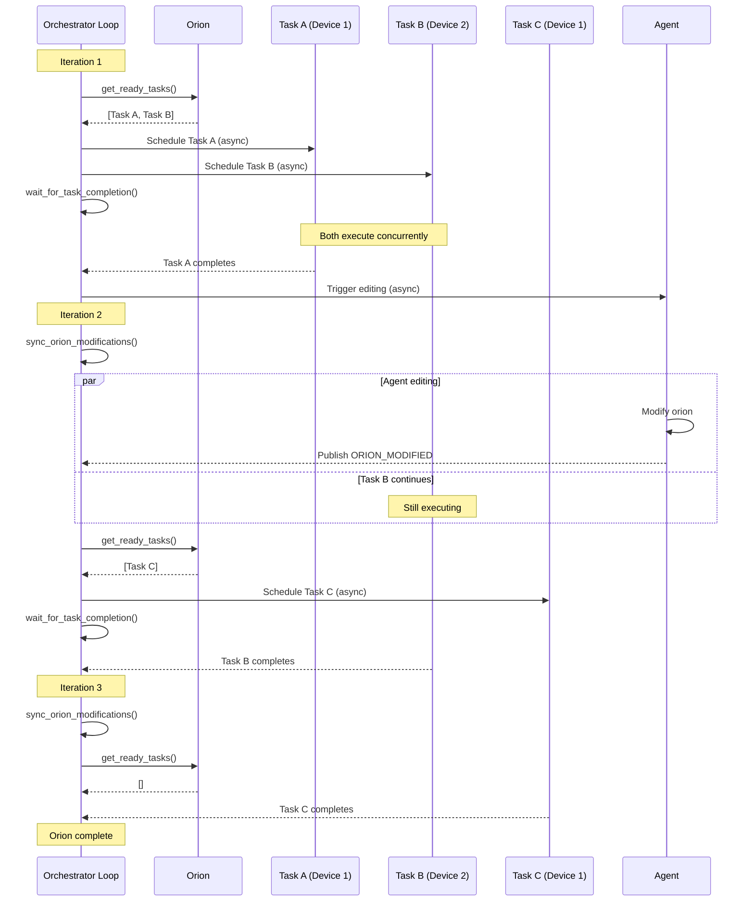

# Asynchronous Scheduling

## Overview

At the core of the Orion Orchestrator lies a fully **asynchronous scheduling loop** that maximizes parallelism across heterogeneous devices. Unlike traditional schedulers that alternate between discrete planning and execution phases, the orchestrator continuously monitors the evolving DAG to identify ready tasks and dispatches them concurrently.

Most critically, **task execution and orion editing can proceed concurrently**, allowing the system to adapt in real-time as results stream in while computation continues uninterrupted.

For more on the DAG structure being scheduled, see the [TaskOrion documentation](../orion/task_orion.md).


*Illustration of asynchronous scheduling and concurrent orion editing. Task execution overlaps with DAG modifications, reducing end-to-end latency.*

## Core Scheduling Loop

The orchestration workflow is driven by a continuous asynchronous loop that coordinates task execution, orion synchronization, and event handling:

```python
async def _run_execution_loop(self, orion: TaskOrion) -> None:
    """Main execution loop for processing orion tasks."""
    
    while not orion.is_complete():
        # 1. Wait for pending modifications and refresh orion
        orion = await self._sync_orion_modifications(orion)
        
        # 2. Validate device assignments
        self._validate_existing_device_assignments(orion)
        
        # 3. Get ready tasks and schedule them
        ready_tasks = orion.get_ready_tasks()
        await self._schedule_ready_tasks(ready_tasks, orion)
        
        # 4. Wait for task completion
        await self._wait_for_task_completion()
    
    # Wait for all remaining tasks
    await self._wait_for_all_tasks()
```

This loop embodies several key design principles:

### 1. Continuous Monitoring

The loop runs continuously until all tasks reach terminal states (`COMPLETED`, `FAILED`, or `CANCELLED`). Each iteration:

- Checks for orion modifications from the agent
- Identifies newly ready tasks (dependencies satisfied)
- Dispatches tasks to devices
- Waits for at least one task to complete before repeating

### 2. Non-Blocking Execution

All operations use `async/await` to avoid blocking:

```python
# Schedule tasks without waiting for completion
await self._schedule_ready_tasks(ready_tasks, orion)

# Wait for ANY task to complete (not all)
await self._wait_for_task_completion()
```

This enables maximum concurrency - new tasks can be scheduled while others are still executing.

### 3. Dynamic Adaptation

The orion can be modified during execution:

```python
# Synchronization point: merge agent's edits with runtime progress
orion = await self._sync_orion_modifications(orion)
```

After synchronization, the orchestrator immediately identifies and schedules newly ready tasks based on the updated DAG structure.

The orchestrator treats the TaskOrion as a **living data structure** that evolves during execution, not a static plan fixed at the start.

## Task Scheduling Mechanism

### Ready Task Identification

Tasks become "ready" when all their dependencies are satisfied:

```python
ready_tasks = orion.get_ready_tasks()
```

The `TaskOrion` determines readiness by checking:

1. **Status**: Task must be in `PENDING` state
2. **Dependencies**: All prerequisite tasks must be completed
3. **Conditions**: Any conditional dependencies must evaluate to `True`

**Implementation in TaskOrion:**

```python
def get_ready_tasks(self) -> List[TaskStar]:
    """Get all tasks ready to execute."""
    ready_tasks = []
    for task in self._tasks.values():
        if task.is_ready_to_execute:
            # Double-check dependencies satisfied
            if self._are_dependencies_satisfied(task.task_id):
                ready_tasks.append(task)
    
    # Sort by priority (higher first)
    ready_tasks.sort(key=lambda t: t.priority.value, reverse=True)
    return ready_tasks
```

!!!tip "Priority Scheduling"
    Ready tasks are sorted by priority before dispatching, ensuring critical tasks execute first when multiple tasks are ready simultaneously.

### Asynchronous Task Dispatch

Once ready tasks are identified, they're dispatched concurrently:

```python
async def _schedule_ready_tasks(
    self, ready_tasks: List[TaskStar], orion: TaskOrion
) -> None:
    """Schedule ready tasks for execution."""
    
    for task in ready_tasks:
        if task.task_id not in self._execution_tasks:
            # Create async task (non-blocking)
            task_future = asyncio.create_task(
                self._execute_task_with_events(task, orion)
            )
            self._execution_tasks[task.task_id] = task_future
```

**Key aspects:**

- **Non-blocking dispatch**: `asyncio.create_task()` schedules the task without waiting
- **Deduplication**: Only schedule if not already in `_execution_tasks` dict
- **Tracking**: Store task futures for later completion detection

### Task Execution Lifecycle

Each task executes within its own coroutine that encapsulates the full lifecycle:



**Execution implementation:**

```python
async def _execute_task_with_events(
    self, task: TaskStar, orion: TaskOrion
) -> None:
    """Execute a single task and publish events."""
    
    try:
        # Publish TASK_STARTED event
        start_event = TaskEvent(
            event_type=EventType.TASK_STARTED,
            source_id=f"orchestrator_{id(self)}",
            timestamp=time.time(),
            data={"orion_id": orion.orion_id},
            task_id=task.task_id,
            status=TaskStatus.RUNNING.value,
        )
        await self._event_bus.publish_event(start_event)
        
        # Mark task as started
        task.start_execution()
        
        # Execute on device
        result = await task.execute(self._device_manager)
        
        is_success = result.status == TaskStatus.COMPLETED.value
        
        # Mark task as completed in orion
        newly_ready = orion.mark_task_completed(
            task.task_id, success=is_success, result=result
        )
        
        # Publish TASK_COMPLETED or TASK_FAILED event
        completed_event = TaskEvent(
            event_type=(
                EventType.TASK_COMPLETED if is_success 
                else EventType.TASK_FAILED
            ),
            source_id=f"orchestrator_{id(self)}",
            timestamp=time.time(),
            data={
                "orion_id": orion.orion_id,
                "newly_ready_tasks": [t.task_id for t in newly_ready],
                "orion": orion,
            },
            task_id=task.task_id,
            status=result.status,
            result=result,
        )
        await self._event_bus.publish_event(completed_event)
        
    except Exception as e:
        # Handle failure (mark task failed, publish event)
        newly_ready = orion.mark_task_completed(
            task.task_id, success=False, error=e
        )
        
        failed_event = TaskEvent(
            event_type=EventType.TASK_FAILED,
            source_id=f"orchestrator_{id(self)}",
            timestamp=time.time(),
            data={
                "orion_id": orion.orion_id,
                "newly_ready_tasks": [t.task_id for t in newly_ready],
            },
            task_id=task.task_id,
            status=TaskStatus.FAILED.value,
            error=e,
        )
        await self._event_bus.publish_event(failed_event)
        raise
```

## Concurrent Execution Model

### Parallel Task Execution

Multiple tasks execute concurrently across devices:

```python
# Track active execution tasks
self._execution_tasks: Dict[str, asyncio.Task] = {}

# Schedule multiple ready tasks at once
for task in ready_tasks:
    task_future = asyncio.create_task(
        self._execute_task_with_events(task, orion)
    )
    self._execution_tasks[task.task_id] = task_future
```

**Concurrency characteristics:**

| Aspect | Behavior | Benefit |
|--------|----------|---------|
| **Device parallelism** | Independent devices execute tasks simultaneously | Maximize resource utilization |
| **Dependency-based** | Only independent tasks (no dependency path) run concurrently | Maintain correctness |
| **Heterogeneous** | Different device types (Windows, Android, iOS, etc.) in parallel | Cross-platform orchestration |
| **Unbounded** | No artificial limit on concurrent tasks | Scale with available devices |

### Completion Detection

The orchestrator waits for at least one task to complete before continuing:

```python
async def _wait_for_task_completion(self) -> None:
    """Wait for at least one task to complete and clean up."""
    
    if self._execution_tasks:
        # Wait for first completion
        done, _ = await asyncio.wait(
            self._execution_tasks.values(), 
            return_when=asyncio.FIRST_COMPLETED
        )
        
        # Clean up completed tasks
        await self._cleanup_completed_tasks(done)
    else:
        # No running tasks, wait briefly
        await asyncio.sleep(0.1)
```

**Why wait for first completion?**

1. **Responsiveness**: React immediately to any task completion
2. **Event publishing**: Trigger orion modifications as soon as possible
3. **Resource efficiency**: Avoid busy-waiting when no tasks are running
4. **Fairness**: Give equal opportunity for any task to trigger next iteration

### Task Cleanup

Completed tasks are removed from tracking:

```python
async def _cleanup_completed_tasks(self, done_futures: set) -> None:
    """Clean up completed task futures from tracking."""
    
    completed_task_ids = []
    for task_future in done_futures:
        for task_id, future in self._execution_tasks.items():
            if future == task_future:
                completed_task_ids.append(task_id)
                break
    
    for task_id in completed_task_ids:
        del self._execution_tasks[task_id]
```

This prevents memory leaks and ensures `_execution_tasks` reflects only actively running tasks.

## Concurrent Orion Editing

### The Challenge

Traditional schedulers treat DAG structure as **immutable** during execution. But in ALIEN, the LLM-based Orion Agent can modify the DAG based on task results:

- Add new tasks when decomposition is needed
- Remove unnecessary tasks when shortcuts are found
- Modify dependencies when task relationships change
- Update task descriptions or parameters

This creates a **race condition**: tasks may be executing while the agent modifies the orion.

### The Solution: Overlapping Execution and Editing

The orchestrator allows task execution and orion editing to **proceed concurrently**:

```mermaid
gantt
    title Concurrent Execution and Editing Timeline
    dateFormat X
    axisFormat %L
    
    section Tasks
    Task A executes     :a1, 0, 100
    Task B executes     :b1, 50, 150
    Task C executes     :c1, 100, 200
    
    section Editing
    Edit on A completion :e1, 100, 130
    Edit on B completion :e2, 150, 180
    
    section Sync
    Sync after Edit A   :s1, 130, 135
    Sync after Edit B   :s2, 180, 185
```



In the diagram:

- **Task A** completes at t=100, triggering an edit
- **Task B** continues executing during the edit (100-130)
- Edit completes and syncs at t=135
- **Task C** starts at t=135 based on updated orion
- **Task B** completes at t=150, triggering another edit
- **Task C** continues executing during this second edit

By overlapping execution and editing, end-to-end latency is reduced by up to 30% compared to sequential edit-then-execute approaches.

### Synchronization Points

The orchestrator synchronizes orion state at the start of each scheduling iteration:

```python
async def _sync_orion_modifications(
    self, orion: TaskOrion
) -> TaskOrion:
    """Synchronize pending orion modifications."""
    
    if self._modification_synchronizer:
        # Wait for agent to finish any pending edits
        await self._modification_synchronizer.wait_for_pending_modifications()
        
        # Merge agent's structural changes with orchestrator's execution state
        orion = self._modification_synchronizer \
            .merge_and_sync_orion_states(
                orchestrator_orion=orion,
            )
    
    return orion
```

**What gets synchronized:**

1. **Structural changes** from agent (new tasks, dependencies, modifications)
2. **Execution state** from orchestrator (task statuses, results, errors)
3. **Consistency validation** (check invariants I1-I3)

The `merge_and_sync_orion_states` method ensures:

- Agent's orion has latest structural modifications
- Orchestrator's execution progress is preserved
- More advanced task states (e.g., COMPLETED) take precedence over stale states (e.g., RUNNING)

[Learn more about synchronization →](safe_assignment_locking.md#orion-state-merging)

## Performance Optimizations

### 1. Lazy Evaluation

Ready tasks are computed only when needed:

```python
# Only compute when scheduling
ready_tasks = orion.get_ready_tasks()
```

Avoids repeated expensive graph traversals when no tasks complete.

### 2. Priority-Based Scheduling

Higher priority tasks execute first:

```python
# Sort by priority before dispatching
ready_tasks.sort(key=lambda t: t.priority.value, reverse=True)
```

Ensures critical-path tasks don't wait behind low-priority tasks.

### 3. Incremental Completion Detection

Use `asyncio.wait(..., return_when=FIRST_COMPLETED)` instead of waiting for all:

```python
done, pending = await asyncio.wait(
    self._execution_tasks.values(), 
    return_when=asyncio.FIRST_COMPLETED
)
```

Minimizes latency between task completion and next scheduling iteration.

### 4. Batched Synchronization

Modifications are batched during agent editing:

```python
# Agent may modify multiple tasks before publishing ORION_MODIFIED
# Orchestrator waits once for all modifications
await self._modification_synchronizer.wait_for_pending_modifications()
```

Reduces synchronization overhead from O(N) to O(1) per editing cycle.

[Learn more about batching →](batched_editing.md)

## Execution Timeline Example

Here's a concrete example showing how asynchronous scheduling works:



**Key observations:**

1. **Iteration 1**: Tasks A and B scheduled concurrently
2. **Concurrent editing**: Agent modifies orion while Task B executes
3. **Iteration 2**: Task C scheduled immediately after sync, Task B still running
4. **No blocking**: Orchestrator never waits idle; always scheduling or executing

## Error Handling

### Task Failure

When a task fails, the orchestrator:

1. Publishes `TASK_FAILED` event
2. Marks task as failed in orion
3. Identifies newly ready tasks (if any dependencies allow failure)
4. Continues scheduling remaining tasks

```python
except Exception as e:
    newly_ready = orion.mark_task_completed(
        task.task_id, success=False, error=e
    )
    
    failed_event = TaskEvent(
        event_type=EventType.TASK_FAILED,
        ...
        error=e,
    )
    await self._event_bus.publish_event(failed_event)
```

### Cancellation

If orchestration is cancelled:

```python
except asyncio.CancelledError:
    if self._logger:
        self._logger.info(
            f"Orchestration cancelled for orion {orion.orion_id}"
        )
    raise
```

All running tasks are automatically cancelled via `asyncio` cancellation propagation.

### Cleanup

Cleanup always happens, even on error:

```python
finally:
    await self._cleanup_orion(orion)
```

## Usage Patterns

### Basic Orchestration

```python
orchestrator = TaskOrionOrchestrator(device_manager)

results = await orchestrator.orchestrate_orion(
    orion=my_orion,
    assignment_strategy="round_robin"
)
```

### With Custom Event Handlers

```python
class ProgressTracker(IEventObserver):
    async def on_event(self, event: Event):
        if event.event_type == EventType.TASK_COMPLETED:
            print(f"✓ Task {event.task_id} completed")

event_bus.subscribe(ProgressTracker())

results = await orchestrator.orchestrate_orion(orion)
```

### With Modification Synchronizer

```python
synchronizer = OrionModificationSynchronizer(orchestrator)
orchestrator.set_modification_synchronizer(synchronizer)
event_bus.subscribe(synchronizer)

# Now edits are synchronized automatically
results = await orchestrator.orchestrate_orion(orion)
```

## Performance Characteristics

| Metric | Typical Value | Notes |
|--------|--------------|-------|
| **Scheduling latency** | < 10ms | Time from task ready to dispatch |
| **Completion detection** | < 5ms | Time from task done to next iteration |
| **Sync overhead** | 10-50ms | Per orion modification |
| **Max concurrent tasks** | Limited by devices | No artificial orchestrator limit |
| **Throughput** | 10-100 tasks/sec | Depends on task duration |

*Performance measured on: Intel i7, 16GB RAM, 5 connected devices, tasks averaging 2-5 seconds each*

## Related Documentation

- **[Event-Driven Coordination](event_driven_coordination.md)** - Event system enabling async scheduling
- **[Safe Assignment Locking](safe_assignment_locking.md)** - How editing synchronizes with execution
- **[Consistency Guarantees](consistency_guarantees.md)** - Invariants preserved during async execution
- **[API Reference](api_reference.md)** - Orchestrator API details

---

!!!tip "Next Steps"
    To understand how concurrent editing is made safe, continue to [Safe Assignment Locking](safe_assignment_locking.md).
