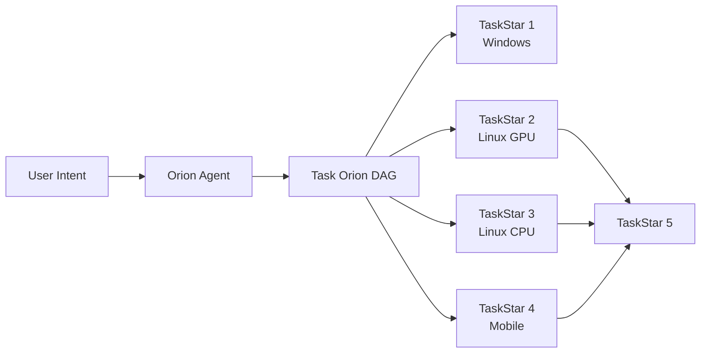
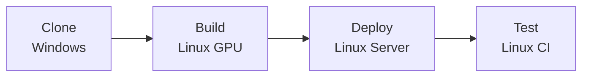
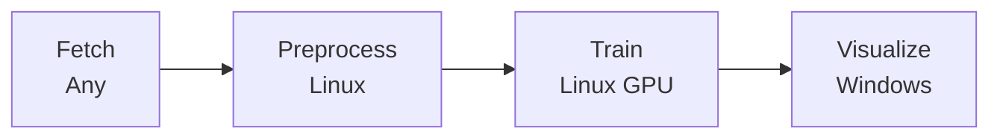
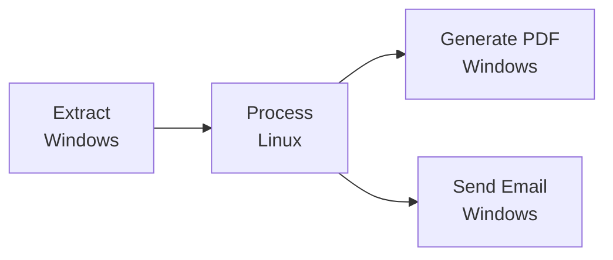
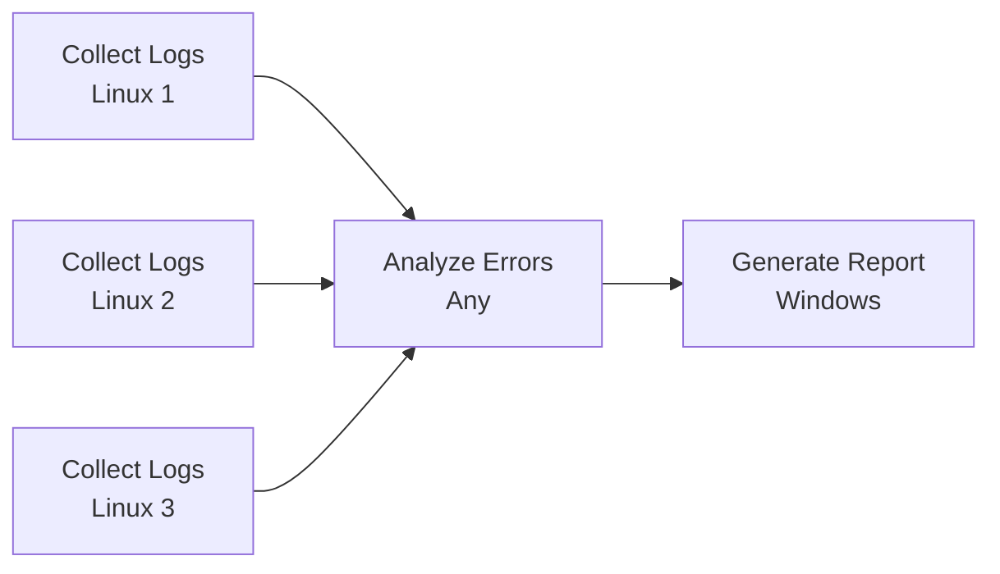
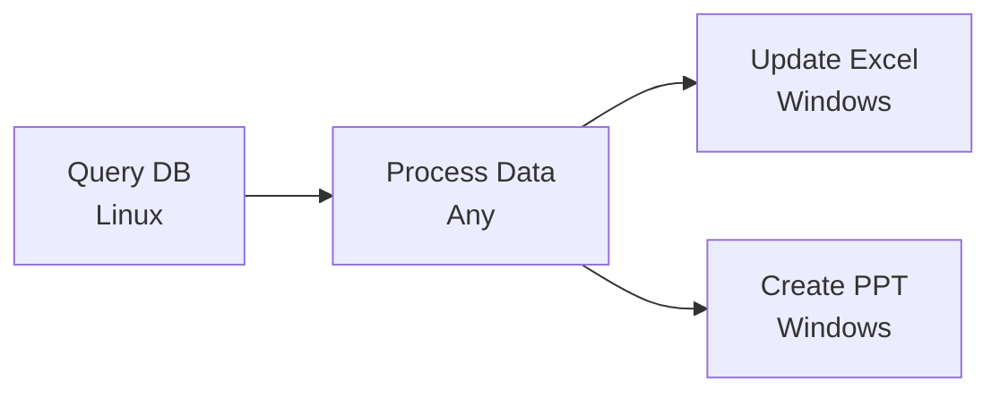

# ALIEN³ — Weaving the Digital Agent Network

<div align="center">
  
  <p><em>From isolated device agents to interconnected orions — Building the Digital Agent Network</em></p>
</div>

---

## [START] What is ALIEN³ Network?

**ALIEN³ Network** is a revolutionary **cross-device orchestration framework** that transforms isolated device agents into a unified digital ecosystem. It models complex user requests as **Task Orions** (星座) — dynamic distributed DAGs where nodes represent executable subtasks and edges capture dependencies across heterogeneous devices.

###  The Vision

Building truly ubiquitous intelligent agents requires moving beyond single-device automation. ALIEN³ Network addresses four fundamental challenges in cross-device agent orchestration:

**[CONTINUE] Asynchronous Parallelism**  
Enabling concurrent task execution across multiple devices while maintaining correctness through event-driven coordination and safe concurrency control

** Dynamic Adaptation**  
Real-time workflow evolution in response to intermediate results, transient failures, and runtime observations without workflow abortion

**[WEB] Distributed Coordination**  
Reliable, low-latency communication across heterogeneous devices via WebSocket-based Agent Interaction Protocol with fault tolerance

**️ Safety Guarantees**  
Formal invariants ensuring DAG consistency during concurrent modifications and parallel execution, verified through rigorous proofs

---

## ️ Architecture

<div align="center">
  
  <p><em>ALIEN³ Network Layered Architecture — From natural language to distributed execution</em></p>
</div>


### Layered Design

ALIEN³ Network follows a **hierarchical orchestration model** that separates global coordination from local execution. This architecture enables scalable cross-device orchestration while maintaining consistent control and responsiveness across diverse operating systems and network environments.

#### ️ Hierarchical Control Plane

**OrionClient** serves as the **global control plane**, maintaining a live registry of all connected device agents with their:
- Capability profiles and system specifications
- Runtime health metrics and availability status
- Current load and resource utilization

This registry enables intelligent task placement based on device capabilities, avoiding mismatches between task requirements and device capacity.

Each device hosts a **device agent server** that manages local orchestration through persistent WebSocket sessions with OrionClient. The server:
- Maintains execution contexts on the host
- Provides unified interface to underlying tools via MCP servers
- Handles task execution, telemetry streaming, and resource monitoring

**Clean separation**: Global orchestration policies are decoupled from device-specific heterogeneity, providing consistent abstraction across endpoints with different OS, hardware, or network conditions.

#### [CONTINUE] Orchestration Flow

1. **DAG Synthesis**: OrionClient invokes the **Orion Agent** to construct a TaskOrion—a dynamic DAG encoding task decomposition, dependencies, and device mappings
2. **Device Assignment**: Each TaskStar (DAG node) is assigned to suitable device agents based on capability profiles and system load
3. **Asynchronous Execution**: The **Orion Orchestrator** executes the DAG in an event-driven manner:
   - Task completions trigger dependent nodes
   - Failures prompt retry, migration, or partial DAG rewrites
   - Workflows adapt to real-time system dynamics (device churn, network variability)

**Result**: Highly parallel and resilient execution that sustains workflow completion even as subsets of devices fail or reconnect.

####  Cross-Agent Communication

The **Agent Interaction Protocol (AIP)** handles all cross-agent interactions:
- Agent registration and capability synchronization
- Task dispatch and progress reporting  
- Result aggregation and telemetry streaming

Built on persistent WebSocket channels, AIP provides:
- **Lightweight**: Minimal overhead for control messages
- **Bidirectional**: Full-duplex communication between client and agents
- **Multiplexed**: Concurrent message streams over single connection
- **Low-latency**: Fast propagation of control signals and state updates
- **Resilient**: Maintains global consistency despite intermittent connectivity

Together, these design elements form a cohesive foundation for orchestrating large-scale, heterogeneous, and adaptive workflows across a resilient multi-device execution fabric.

---

## [NEW] Core Design Principles

ALIEN³ Network realizes cross-device orchestration through **five tightly integrated design principles**:

### 1.  Declarative Decomposition into Dynamic DAG (Task Orion)

Natural-language or programmatic requests are decomposed by the **Orion Agent** into a structured DAG of **TaskStars** (nodes) and **TaskStarLines** (edges) that encode workflow logic, dependencies, and device assignments. This declarative structure is amenable to automated scheduling, introspection, and dynamic modification throughout execution.

**Key Benefits:**
- [TASK] **Declarative structure** for automated scheduling
-  **Runtime introspection** for workflow visibility
- ️ **Dynamic rewriting** throughout execution
- [CONTINUE] **Automated orchestration** across heterogeneous devices



[Learn more →](orion/overview.md)

### 2. [CONTINUE] Continuous, Result-Driven Graph Evolution

The **Task Orion** is a **living data structure** that evolves in response to execution feedback. Intermediate outputs, transient failures, and new observations trigger controlled rewrites—adding diagnostic TaskStars, creating fallbacks, rewiring dependencies, or pruning completed nodes—so the system adapts dynamically instead of aborting on errors.

**Adaptation Mechanisms:**
- 🩺 **Diagnostic TaskStars** added for debugging
- ️ **Fallback creation** for error recovery
- [DEP] **Dependency rewiring** for workflow optimization
- ️ **Node pruning** after completion

The **Orion Agent** operates in two modes:
- **Creation Mode**: Synthesizes initial DAG from user request with device-aware task decomposition
- **Editing Mode**: Incrementally refines orion based on task completion events and runtime feedback

[Learn more →](orion_agent/overview.md)

### 3.  Heterogeneous, Asynchronous, and Safe Orchestration

Each **Task Star** is matched to the most suitable device agent via rich **Agent Profiles** reflecting OS, hardware capabilities, and installed tools. The **Orion Orchestrator** executes tasks asynchronously, allowing multiple TaskStars to progress in parallel.

**Safety Guarantees:**
-  **Safe assignment locking** prevents race conditions
- [DATE] **Event-driven scheduling** monitors DAG readiness
- [OK] **DAG consistency checks** maintain structural integrity
- [CONTINUE] **Batched edits** ensure atomicity
-  **Formal verification** reinforces correctness
- ⏱️ **Timeout protection** prevents deadlocks

These mechanisms collectively ensure **high efficiency without compromising reliability**.

[Learn more →](orion_orchestrator/overview.md)

### 4.  Unified Agent Interaction Protocol (AIP)

Built atop persistent **WebSocket channels**, AIP provides a unified, secure, and fault-tolerant layer for the entire agent ecosystem.

**Core Capabilities:**
-  **Agent registry** with capability profiles
-  **Session management** for secure communication
-  **Task dispatch** with intelligent routing
-  **Coordination primitives** for distributed workflows
-  **Heartbeat monitoring** for health tracking
-  **Automatic reconnection** under network fluctuations
- [CONTINUE] **Retry mechanisms** for reliability

**Architecture Benefits:**
- 🪶 **Lightweight interface** for easy integration
-  **Extensible design** supports new agent types
- ️ **Fault tolerance** ensures continuous operation

This protocol **abstracts OS and network heterogeneity**, enabling seamless collaboration among agents across desktops, servers, and edge devices, while allowing new agents to integrate seamlessly into the ALIEN³ ecosystem.

[Learn more →](../aip/overview.md)

### 5. ️ Template-Driven Framework for Device Agents

To **democratize agent creation**, ALIEN³ provides a **lightweight development template and toolkit** for rapidly building new device agents.

**Development Framework:**
- [DOC] **Capability declaration** defines agent profiles
- [DEP] **Environment binding** connects to local systems
-  **MCP server integration** for tool augmentation
- [CONFIG] **Modular design** accelerates development

**Model Context Protocol (MCP) Integration:**
-  **Tool packages** via MCP servers
-  **Plug-and-play** capability extension
- [WEB] **Cross-platform** tool standardization
- [START] **Rapid prototyping** of new agents

This modular architecture maintains consistency across the orion while enabling developers to extend ALIEN³ to new platforms (mobile, web, IoT, embedded systems, etc.) with minimal effort.

** Extensibility:** ALIEN³ is designed as a **universal framework** that supports developing new device agents for different platforms (mobile, web, IoT, embedded systems, etc.) and applications. Through the **Agent Interaction Protocol (AIP)**, custom device agents can seamlessly integrate into ALIEN³ Network for coordinated multi-device automation. **Want to build your own device agent?** See our [Creating Custom Device Agents tutorial](../tutorials/creating_device_agent/overview.md) to learn how to extend ALIEN³ to new platforms.

[Learn more →](agent_registration/overview.md) | [MCP Integration →](../mcp/overview.md)

---

##  Key Capabilities

### [WEB] Cross-Device Collaboration
Execute workflows that span Windows desktops, Linux servers, GPU clusters, mobile devices, and edge nodes—all from a single natural language request.

###  Asynchronous Parallelism
Automatically identify parallelizable subtasks and execute them concurrently across devices through:
- **Event-driven scheduling** that continuously monitors DAG topology for ready tasks
- **Non-blocking execution** with Python `asyncio` for maximum concurrency
- **Dynamic adaptation** that integrates new tasks without interrupting running execution

Result: Dramatically reduced end-to-end latency compared to sequential execution.

### ️ Safety & Consistency
- **Three formal invariants** (I1-I3) enforced at runtime for DAG correctness
- **Safe assignment locking** prevents race conditions during concurrent modifications
- **Acyclicity validation** ensures no circular dependencies
- **State merging** algorithm preserves execution progress during dynamic edits
- **Timeout protection** prevents deadlocks from agent failures

### [CONTINUE] Dynamic Workflow Evolution
- **Dual-mode operation**: Separate creation and editing phases with controlled transitions
- **Feedback-driven adaptation**: Task completion events trigger intelligent orion refinement
- **LLM-powered reasoning**: ReAct architecture for context-aware DAG modifications
- **Undo/redo support**: OrionEditor with command pattern for safe interactive editing

### ️ Rich Observability
- Real-time orion visualization with DAG topology updates
- Event bus with publish-subscribe pattern for monitoring task progress
- Detailed execution logs with markdown trajectory support
- Task status tracking (pending, running, completed, failed, cancelled)
- Dependency graph inspection and validation tools

---

##  Use Cases

### ️ Software Development & Deployment
*"Clone the repo on my laptop, build the Docker image on the GPU server, deploy to staging, and run the test suite on the CI cluster."*

**Workflow DAG:**


### [STATUS] Data Science Workflows
*"Fetch the dataset from cloud storage, preprocess on the Linux workstation, train the model on the A100 node, and generate a visualization dashboard on my Windows machine."*

**Workflow DAG:**


###  Cross-Platform Document Processing
*"Extract data from Excel on Windows, process with Python scripts on Linux, generate PDF reports, and send summary emails."*

**Workflow DAG:**


###  Distributed System Monitoring
*"Collect server logs from all Linux machines, analyze for errors, generate alerts, and create a consolidated report."*

**Workflow DAG:**


###  Enterprise Automation
*"Query the database on the server, process the results, update Excel spreadsheets on Windows, and generate PowerPoint presentations."*

**Workflow DAG:**


---

## ️ Documentation Structure

### [START] [Quick Start](../getting_started/quick_start_network.md)
Get ALIEN³ Network up and running in minutes with our step-by-step guide

###  [Network Client](client/overview.md)
Device coordination, connection management, and OrionClient API

### [BRAIN] [Orion Agent](orion_agent/overview.md)
LLM-driven task decomposition, DAG creation, and dynamic workflow evolution

### ️ [Orion Orchestrator](orion_orchestrator/overview.md)
Asynchronous execution engine, event-driven coordination, and safety guarantees

### [STATUS] [Task Orion](orion/overview.md)
DAG structure, TaskStar nodes, TaskStarLine edges, and orion editor

###  [Agent Registration](agent_registration/overview.md)
Device registry, agent profiles, and registration flow

### [WEB] [Agent Interaction Protocol](../aip/overview.md)
WebSocket messaging, protocol specification, and communication patterns

### ️ [Configuration](../configuration/system/network_devices.md)
Device pools, capabilities, and orchestration policies

---

##  Getting Started

Ready to build your Digital Agent Network? Follow these steps:

### 1. Install ALIEN³
```bash
# Clone the repository
git clone https://github.com/DEVELOPER-DEEVEN/alien-project.git
cd ALIEN

# Install dependencies
pip install -r requirements.txt
```

### 2. Configure Device Pool

Create configuration files in `config/network/`:

**`config/network/devices.yaml`** - Define your devices:

```yaml
devices:
  - device_id: "windowsagent"
    server_url: "ws://localhost:5005/ws"
    os: "windows"
    capabilities:
      - "web_browsing"
      - "office_applications"
      - "file_management"
    metadata:
      location: "home_office"
      os: "windows"
      performance: "medium"
    max_retries: 5
    
  - device_id: "linux_agent_1"
    server_url: "ws://localhost:5001/ws"
    os: "linux"
    capabilities:
      - "server"
      - "python"
      - "docker"
    metadata:
      os: "linux"
      performance: "high"
      logs_file_path: "/root/log/log1.txt"
    auto_connect: true
    max_retries: 5
    
  - device_id: "mobile_agent_1"
    server_url: "ws://localhost:5002/ws"
    os: "android"
    capabilities:
      - "mobile"
      - "adb"
      - "ui_automation"
    metadata:
      os: "android"
      performance: "medium"
      device_type: "smartphone"
    auto_connect: true
    max_retries: 5
```

**`config/network/orion.yaml`** - Configure runtime settings:

```yaml
# Orion Runtime Settings
ORION_ID: "my_orion"
HEARTBEAT_INTERVAL: 30.0  # Heartbeat interval in seconds
RECONNECT_DELAY: 5.0  # Delay before reconnecting in seconds
MAX_CONCURRENT_TASKS: 6  # Maximum concurrent tasks
MAX_STEP: 15  # Maximum steps per session

# Device Configuration
DEVICE_INFO: "config/network/devices.yaml"

# Logging Configuration
LOG_TO_MARKDOWN: true
```

See [Network Configuration](../configuration/system/network_devices.md) for complete documentation.

### 3. Start Device Agents

On each device, launch the Agent Server. For detailed setup instructions, see the respective quick start guides:

**On Windows:**

See [Windows Agent (ALIEN²) Quick Start →](../getting_started/quick_start_alien2.md)

**On Linux:**

See [Linux Agent Quick Start →](../getting_started/quick_start_linux.md)

**On Mobile (Android):**

See [Mobile Agent Quick Start →](../getting_started/quick_start_mobile.md)

### 4. Launch Network Client

**Interactive Mode:**
```bash
python -m network --interactive
```

**Direct Request:**
```bash
python -m network "Your cross-device task here"
```

**Programmatic API:**
```python
from network.network_client import NetworkClient

async def main():
    client = NetworkClient(session_name="my_session")
    await client.initialize()
    result = await client.process_request("Your task request")
    await client.shutdown()
```

For detailed instructions, see the [Quick Start Guide](../getting_started/quick_start_network.md).

---

## [CONFIG] System Components

ALIEN³ Network consists of several integrated components working together:

### Core Components

| Component | Location | Responsibility |
|-----------|----------|----------------|
| **NetworkClient** | `network/network_client.py` | Session management, user interaction, orchestration coordination |
| **OrionClient** | `network/client/orion_client.py` | Device management, connection lifecycle, task assignment |
| **OrionAgent** | `network/agents/orion_agent.py` | LLM-driven DAG synthesis and evolution, state machine control |
| **TaskOrionOrchestrator** | `network/orion/orchestrator/` | Asynchronous execution, event coordination, safety enforcement |
| **TaskOrion** | `network/orion/task_orion.py` | DAG data structure, validation, and modification APIs |
| **DeviceManager** | `network/client/device_manager.py` | WebSocket connections, heartbeat monitoring, message routing |

### Supporting Infrastructure

| Component | Purpose |
|-----------|---------|
| **Event Bus** | Publish-subscribe system for orion events |
| **Observer Pattern** | Event listeners for visualization and synchronization |
| **Device Registry** | Centralized device information and capability tracking |
| **Agent Profile** | Device metadata and capability declarations |
| **MCP Servers** | Tool augmentation via Model Context Protocol |

For detailed component documentation, see the respective sections in [Documentation Structure](#documentation-structure).

### Technology Stack

| Layer | Technologies |
|-------|-------------|
| **Programming** | Python 3.10+, asyncio, dataclasses |
| **Communication** | WebSockets, JSON-RPC |
| **LLM Integration** | OpenAI API, Azure OpenAI, Gemini, Claude, Custom Models |
| **Tool Augmentation** | Model Context Protocol (MCP) |
| **Configuration** | YAML, Pydantic models |
| **Logging** | Python logging, Rich console, Markdown trajectory |
| **Testing** | pytest, mock agents |

---

##  From Devices to Orions to Network

ALIEN³ represents a paradigm shift in intelligent automation:

- **Single Device** → Isolated agents operating within one OS
- **Task Orion** → Coordinated multi-device workflows for one task
- **Digital Agent Network** → Interconnected orions spanning your entire digital estate

Over time, multiple orions can interconnect, weaving together agents, devices, and capabilities into a self-organizing **Digital Agent Network**. This design elevates cross-device automation from a brittle engineering challenge to a unified orchestration paradigm, where multi-device workflows become naturally expressive, paving the way for large-scale, adaptive, and resilient intelligent ubiquitous computing systems.

---

## [STATUS] Performance Monitoring & Evaluation

ALIEN³ Network provides comprehensive performance monitoring and evaluation tools to analyze multi-device workflow execution:

### Automated Metrics Collection

Network automatically collects detailed performance metrics during execution through an event-driven observer pattern:

- **Task Metrics**: Execution times, success rates, bottleneck identification
- **Orion Metrics**: DAG statistics, parallelism analysis, critical path computation
- **Modification Metrics**: Dynamic editing patterns and adaptation frequency
- **Device Metrics**: Per-device performance and resource utilization

All metrics are captured in real-time without impacting execution performance and saved to structured JSON files for programmatic analysis.

### Trajectory Report

Network automatically generates a comprehensive Markdown trajectory report (`output.md`) documenting the complete execution lifecycle:

```
logs/network/<task_name>/output.md
```

This human-readable report includes:
- Step-by-step execution timeline with agent actions
- Interactive DAG topology visualizations showing orion evolution
- Detailed task execution logs with results and errors
- Device connection status and coordination events
- Complete before/after orion states at each step

The trajectory report provides visual debugging and workflow understanding, complementing the quantitative `result.json` metrics.

### Result JSON Format

After each session, Network also generates a comprehensive `result.json` file containing:

```
logs/network/<task_name>/result.json
```

This file includes:
- Complete session metadata and execution timeline
- Task-by-task performance breakdown
- Orion statistics (parallelism ratio, critical path, max concurrency)
- Modification history showing DAG evolution
- Final results and outcomes

**Example Key Metrics:**

| Metric | Description | Use Case |
|--------|-------------|----------|
| `parallelism_ratio` | Efficiency of parallel execution (total_work / critical_path) | Optimization target |
| `critical_path_length` | Minimum possible execution time | Theoretical performance limit |
| `average_task_duration` | Mean task execution time | Baseline performance |
| `modification_count` | Number of dynamic DAG edits | Adaptability analysis |

### Performance Analysis Tools

```python
import json

# Load session results
with open("logs/network/task_32/result.json", 'r') as f:
    result = json.load(f)

# Extract key metrics
metrics = result["session_results"]["metrics"]
task_stats = metrics["task_statistics"]
const_stats = result["session_results"]["final_orion_stats"]

print(f"[OK] Success Rate: {task_stats['success_rate'] * 100:.1f}%")
print(f"⏱️  Avg Task Duration: {task_stats['average_task_duration']:.2f}s")
print(f" Parallelism Ratio: {const_stats['parallelism_ratio']:.2f}")
```

**Documentation:**

- **[Trajectory Report Guide](./evaluation/trajectory_report.md)** - Complete guide to the human-readable execution log with DAG visualizations
- **[Performance Metrics Guide](./evaluation/performance_metrics.md)** - Comprehensive metrics documentation with analysis examples
- **[Result JSON Reference](./evaluation/result_json.md)** - Complete schema reference and programmatic access guide

---

## [PLAN] Learn More

- **Research Paper**: [ALIEN³: Weaving the Digital Agent Network](https://arxiv.org/) *(Coming Soon)*
- **ALIEN² (Desktop AgentOS)**: [Documentation](../alien2/overview.md)
- **ALIEN (Original)**: [GitHub Repository](https://github.com/DEVELOPER-DEEVEN/alien-project)

---

##  Contributing

We welcome contributions! Whether you're building new device agents, improving orchestration algorithms, or enhancing the protocol, check out our Contributing Guide on GitHub.

---

## [DOC] License

ALIEN³ Network is released under the MIT License.

---

<div align="center">
  <p><strong>Transform your distributed devices into a unified digital collective.</strong></p>
  <p><em>ALIEN³ Network — Where every device is a star, and every task is a orion.</em></p>
</div>
