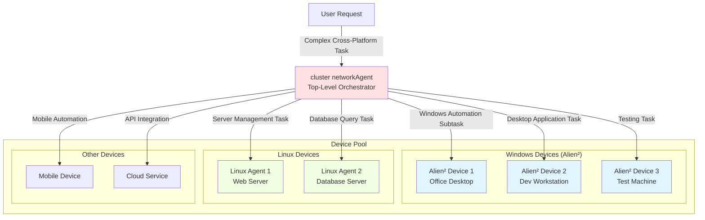
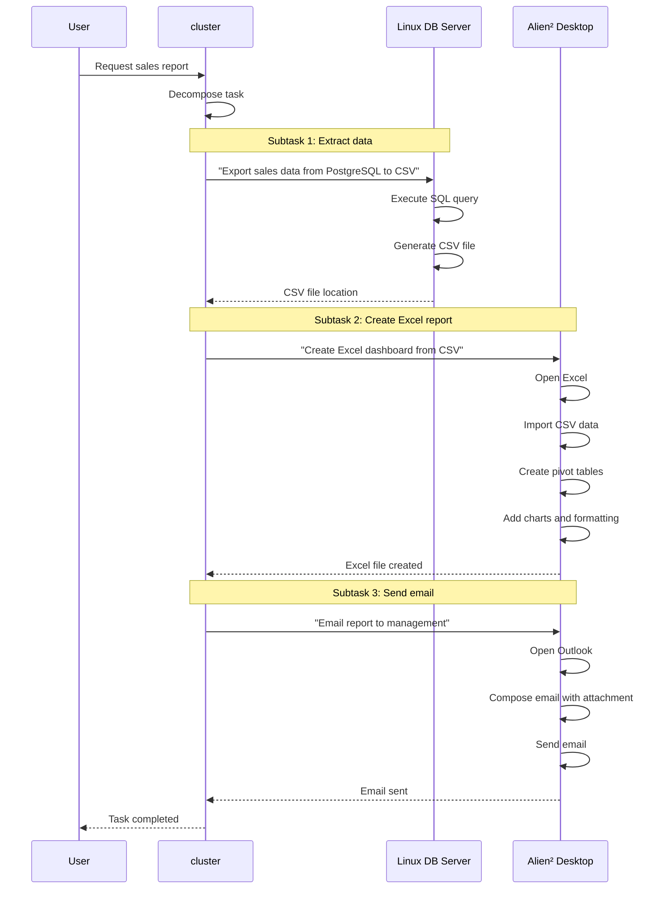

# Alien² as Alien³ cluster Device

Integrate **Alien² (Windows Desktop Automation Agent)** into the **Alien³ cluster framework** as a managed sub-agent device. This enables cluster to orchestrate complex cross-platform workflows combining Windows desktop automation with Linux server operations and other heterogeneous devices.

## Overview

Alien² can function as a **device agent** within the Alien³ cluster multi-tier orchestration framework. When configured as a cluster device, Alien² operates in **server-client mode**, allowing the cluster networkAgent to:

- Dispatch Windows automation subtasks to Alien² devices
- Coordinate cross-platform workflows (Windows desktop + Linux servers)
- Leverage Alien²'s HostAgent and AppAgent capabilities at scale
- Manage multiple Windows devices from a unified control plane
- Dynamically select devices based on capabilities and installed applications

Alien² integration follows the **server-client architecture** pattern where the Alien² Server manages task orchestration and state machines, the Alien² Client executes Windows automation commands via MCP tools, and the cluster networkAgent acts as the top-level orchestrator. Communication is enabled through the Agent Interaction Protocol (AIP). For detailed architecture information, see [Server-Client Architecture](../infrastructure/agents/server_client_architecture.md).

## cluster Integration Architecture



**Example Multi-Device Workflow:**

> **User Request:** "Generate a sales report from the database, create an Excel dashboard, and email it to the team"

**cluster orchestrates:**

1. **Linux DB Server**: Extract sales data from PostgreSQL → CSV export
2. **Alien² Desktop**: Open Excel, import CSV, create visualizations and pivot tables
3. **Alien² Desktop**: Open Outlook, compose email with Excel attachment
4. **Alien² Desktop**: Send email to distribution list

## Prerequisites

Before configuring Alien² as a cluster device, ensure you have:

| Component | Requirement | Verification |
|-----------|-------------|--------------|
| **Alien Repository** | Cloned and up-to-date | `git pull origin main` |
| **Python** | 3.10+ installed | `python --version` |
| **Dependencies** | All packages installed | `pip install -r requirements.txt` |
| **LLM Configuration** | API keys configured | Check `config/Alien/agents.yaml` |
| **Network** | Server-client connectivity | `ping <server-ip>` |
| **Windows Machine** | Alien² will run here | Windows 10/11 |

### Configure Agent Configuration

**Before proceeding with cluster integration**, you must configure your agent settings in `config/Alien/agents.yaml`:

1. Copy the template file:
   ```powershell
   Copy-Item config\Alien\agents.yaml.template config\Alien\agents.yaml
   ```

2. Configure your LLM provider (OpenAI, Azure OpenAI, etc.) and add API keys

Without proper agent configuration, Alien² cannot function as a cluster device. See [Agents Configuration Guide](../configuration/system/agents_config.md) for detailed setup instructions.

## Server-Client Mode Setup

Alien² **must** operate in **server-client mode** when integrated into cluster. This architecture separates orchestration (server) from execution (client), enabling cluster to manage multiple Alien² devices efficiently. Unlike standalone Alien² usage (local mode), cluster integration requires running Alien² in distributed server-client mode to ensure cluster can communicate with Alien² via Agent Interaction Protocol (AIP), multiple Alien² clients can be managed by a single server, task state is managed server-side for reliability, and clients remain stateless execution endpoints.

## Step 1: Start Alien² Server

The **Alien² Server** handles task orchestration, state management, and LLM-driven decision-making. It communicates with cluster and dispatches commands to Alien² clients.

### Basic Server Startup

Launch Alien² Server on the machine that will host the server (can be any Windows/Linux machine):

```powershell
python -m Alien.server.app --port 5000
```

**Expected Output:**

```console
2025-11-06 10:30:22 - Alien.server.app - INFO - Starting Alien Server on 0.0.0.0:5000
INFO:     Started server process [12345]
INFO:     Waiting for application startup.
INFO:     Application startup complete.
INFO:     Uvicorn running on http://0.0.0.0:5000 (Press CTRL+C to quit)
```

Once you see "Uvicorn running", the server is ready at `ws://0.0.0.0:5000/ws`.

### Server Configuration Options

| Argument | Default | Description | Example |
|----------|---------|-------------|---------|
| `--port` | `5000` | Server listening port | `--port 5000` |
| `--host` | `0.0.0.0` | Bind address (0.0.0.0 = all interfaces) | `--host 192.168.1.100` |
| `--log-level` | `WARNING` | Logging verbosity | `--log-level DEBUG` |
| `--local` | `False` | Run server in local mode | `--local` |

**Examples:**

Specific port:
```powershell
python -m Alien.server.app --port 5000
```

Specific IP binding:
```powershell
python -m Alien.server.app --host 192.168.1.100 --port 5000
```

Debug mode:
```powershell
python -m Alien.server.app --port 5000 --log-level DEBUG
```

### Verify Server Health

```powershell
# Test server health endpoint
curl http://localhost:5000/api/health
```

**Expected Response:**

```json
{
  "status": "healthy",
  "online_clients": []
}
```

## Step 2: Start Alien² Client (Windows Machine)

The **Alien² Client** runs on the Windows machine where you want to perform desktop automation. It connects to the Alien² server via WebSocket and executes automation commands through MCP tools.

### Basic Client Startup

Connect Alien² Client to Server on the **Windows machine** where you want to run desktop automation:

```powershell
python -m Alien.client.client `
  --ws `
  --ws-server ws://192.168.1.100:5000/ws `
  --client-id Alien-Unis_desktop_1 `
  --platform windows
```

**Note:** In PowerShell, use backtick `` ` `` for line continuation. In Command Prompt, use `^`.

### Client Parameters Explained

| Parameter | Required | Description | Example |
|-----------|----------|-------------|---------|
| `--ws` | ✅ Yes | Enable WebSocket mode | `--ws` |
| `--ws-server` | ✅ Yes | Server WebSocket URL | `ws://192.168.1.100:5000/ws` |
| `--client-id` | ✅ Yes | **Unique** device identifier | `Alien-Unis_desktop_1` |
| `--platform` | ✅ Yes | Platform type (must be `windows` for Alien²) | `--platform windows` |

**Important:**
- `--client-id` must be globally unique - No two devices can share the same ID
- `--platform windows` is mandatory - Without this flag, Alien² won't work correctly
- Server address must be correct - Replace `192.168.1.100:5000` with your actual server IP and port

### Understanding the WebSocket URL

The `--ws-server` parameter format is:

```
ws://<server-ip>:<server-port>/ws
```

Examples:

| Scenario | WebSocket URL | Description |
|----------|---------------|-------------|
| **Localhost** | `ws://localhost:5000/ws` | Server and client on same machine |
| **Same Network** | `ws://192.168.1.100:5000/ws` | Server on local network |
| **Remote Server** | `ws://203.0.113.50:5000/ws` | Server on internet (public IP) |

### Connection Success Indicators

**Client Logs:**

```log
INFO - Platform detected/specified: windows
INFO - Alien Client initialized for platform: windows
INFO - [WS] Connecting to ws://192.168.1.100:5000/ws (attempt 1/5)
INFO - [WS] [AIP] Successfully registered as Alien-Unis_desktop_1
INFO - [WS] Heartbeat loop started (interval: 30s)
```

**Server Logs:**

```log
INFO - [WS] ✅ Registered device client: Alien-Unis_desktop_1
INFO - [WS] Device Alien-Unis_desktop_1 platform: windows
```

When you see "Successfully registered", the Alien² client is connected and ready to receive tasks.

### Verify Connection

```powershell
# Check connected clients on server
curl http://192.168.1.100:5000/api/clients
```

**Expected Response:**

```json
{
  "clients": [
    {
      "client_id": "Alien-Unis_desktop_1",
      "type": "device",
      "platform": "windows",
      "connected_at": 1730899822.0,
      "uptime_seconds": 45
    }
  ]
}
```

## Step 3: Configure MCP Services

Alien² relies on **MCP (Model Context Protocol) servers** to provide Windows automation capabilities. Unlike Linux agents that may require separate HTTP MCP servers, Alien² MCP servers are primarily **local** and start automatically with the client.

Alien² uses **local MCP servers** that run in-process with the client:

- **UI Automation MCP**: Click, type, screenshot, control detection
- **File Operations MCP**: Read, write, copy, delete files
- **Application Control MCP**: Launch apps, switch windows, close processes

These are **automatically initialized** when the Alien² client starts.

### Default MCP Configuration

By default, Alien² client automatically starts all necessary **local MCP servers**. No additional configuration is required for standard Windows automation.

When you start the Alien² client, it automatically initializes UI automation tools, registers file operation handlers, configures application control interfaces, and sets up screenshot and OCR capabilities.

### Optional: HTTP MCP Server (Advanced)

For specialized scenarios requiring **remote MCP access** (e.g., hardware automation via external tools), you can optionally start HTTP-based MCP servers. However, note that there is no `windows_mcp_server.py` in the codebase. Available HTTP MCP servers are:

- `hardware_mcp_server.py` - For hardware-level operations
- `linux_mcp_server.py` - For Linux-specific operations

Start an HTTP MCP server if needed:

```powershell
python -m Alien.client.mcp.http_servers.hardware_mcp_server
```

**Note:** For standard cluster integration with Alien², local MCP servers are sufficient and HTTP MCP servers are not required.

## Step 4: Configure as cluster Device

To integrate Alien² into the cluster framework, register it in the cluster device configuration file.

### Device Configuration File

The cluster device pool is configured in `config/cluster/devices.yaml`.

### Add Alien² Device Configuration

Edit `config/cluster/devices.yaml` and add your Alien² device(s) under the `devices` section:

```yaml
devices:
  - device_id: "Alien-Unis_desktop_1"
    server_url: "ws://192.168.1.100:5000/ws"
    os: "windows"
    capabilities:
      - "desktop_automation"
      - "office_applications"
      - "web_browsing"
      - "email"
      - "file_management"
    metadata:
      os: "windows"
      version: "11"
      performance: "high"
      installed_apps:
        - "Microsoft Excel"
        - "Microsoft Word"
        - "Microsoft PowerPoint"
        - "Microsoft Outlook"
        - "Google Chrome"
        - "Adobe Acrobat"
      description: "Primary office workstation for document automation"
    auto_connect: true
    max_retries: 5
```

### Configuration Fields Explained

| Field | Required | Type | Description | Example |
|-------|----------|------|-------------|---------|
| `device_id` | ✅ Yes | string | **Must match client `--client-id`** | `"Alien-Unis_desktop_1"` |
| `server_url` | ✅ Yes | string | **Must match server WebSocket URL** | `"ws://192.168.1.100:5000/ws"` |
| `os` | ✅ Yes | string | Operating system | `"windows"` |
| `capabilities` | ❌ Optional | list | Device capabilities (for task routing) | `["desktop_automation", "office"]` |
| `metadata` | ❌ Optional | dict | Custom metadata for task context | See below |
| `auto_connect` | ❌ Optional | boolean | Auto-connect on cluster startup | `true` |
| `max_retries` | ❌ Optional | integer | Connection retry attempts | `5` |

### Capabilities-Based Task Routing

cluster uses the `capabilities` field to intelligently route subtasks to appropriate Alien² devices. Define capabilities based on application categories (e.g., `"office_applications"`, `"web_browsing"`), task types (e.g., `"desktop_automation"`, `"data_entry"`), specific software (e.g., `"excel"`, `"outlook"`), and user workflows (e.g., `"email"`, `"reporting"`).

**Example capability configurations:**

**Office Workstation:**
```yaml
capabilities:
  - "desktop_automation"
  - "office_applications"
  - "excel"
  - "word"
  - "powerpoint"
  - "outlook"
  - "email"
  - "reporting"
```

**Web Development Machine:**
```yaml
capabilities:
  - "desktop_automation"
  - "web_browsing"
  - "chrome"
  - "visual_studio_code"
  - "git"
  - "development"
```

**Testing Workstation:**
```yaml
capabilities:
  - "desktop_automation"
  - "ui_testing"
  - "web_browsing"
  - "screenshot_comparison"
  - "quality_assurance"
```

**Media Production:**
```yaml
capabilities:
  - "desktop_automation"
  - "media_editing"
  - "photoshop"
  - "premiere"
  - "video_processing"
  - "image_manipulation"
```

The `metadata` field provides **contextual information** that the LLM can use when generating automation commands.

**Metadata Examples:**

**Office Workstation Metadata:**
```yaml
metadata:
  os: "windows"
  version: "11"
  performance: "high"
  installed_apps:
    - "Microsoft Excel"
    - "Microsoft Word"
    - "Microsoft Outlook"
    - "Adobe Acrobat Reader"
  default_paths:
    documents: "C:\\Users\\user\\Documents"
    downloads: "C:\\Users\\user\\Downloads"
    desktop: "C:\\Users\\user\\Desktop"
  email_account: "user@company.com"
  description: "Primary office workstation"
```

**Development Workstation Metadata:**
```yaml
metadata:
  os: "windows"
  version: "11"
  performance: "high"
  installed_apps:
    - "Visual Studio Code"
    - "Google Chrome"
    - "Git"
    - "Node.js"
    - "Python"
  default_paths:
    projects: "C:\\Users\\dev\\Projects"
    repos: "C:\\Users\\dev\\Repos"
  git_username: "developer"
  description: "Development environment"
```

**Testing Workstation Metadata:**
```yaml
metadata:
  os: "windows"
  version: "10"
  performance: "medium"
  installed_apps:
    - "Google Chrome"
    - "Microsoft Edge"
    - "Firefox"
    - "Selenium"
  test_data_path: "C:\\TestData"
  screenshot_path: "C:\\Screenshots"
  description: "Automated testing environment"
```

**How Metadata is Used:**

The LLM receives metadata in the system prompt, enabling context-aware automation:

```
System Context:
- Device: Alien-Unis_desktop_1
- OS: Windows 11
- Installed Apps: Microsoft Excel, Microsoft Word, Microsoft Outlook
- Documents Path: C:\Users\user\Documents

User Request: "Create a new Excel spreadsheet and save it as Q4_Report.xlsx"

Alien² Output: 
1. Launch Microsoft Excel
2. Create new workbook
3. Save as C:\Users\user\Documents\Q4_Report.xlsx
```

## Step 5: Multiple Alien² Devices Configuration

cluster can manage **multiple Alien² devices** simultaneously, enabling parallel Windows automation across different machines.

**Multi-Device cluster Configuration Example:**

```yaml
devices:
  # Alien² Office Desktop 1
  - device_id: "Alien-Unis_office_1"
    server_url: "ws://192.168.1.100:5000/ws"
    os: "windows"
    capabilities:
      - "desktop_automation"
      - "office_applications"
      - "excel"
      - "word"
      - "outlook"
      - "email"
    metadata:
      os: "windows"
      version: "11"
      installed_apps: ["Microsoft Excel", "Microsoft Word", "Microsoft Outlook"]
      description: "Primary office desktop"
    auto_connect: true
    max_retries: 5
  
  # Alien² Office Desktop 2
  - device_id: "Alien-Unis_office_2"
    server_url: "ws://192.168.1.101:5001/ws"
    os: "windows"
    capabilities:
      - "desktop_automation"
      - "office_applications"
      - "excel"
      - "powerpoint"
      - "web_browsing"
    metadata:
      os: "windows"
      version: "11"
      installed_apps: ["Microsoft Excel", "Microsoft PowerPoint", "Google Chrome"]
      description: "Secondary office desktop"
    auto_connect: true
    max_retries: 5
  
  # Alien² Development Workstation
  - device_id: "Alien-Unis_dev_1"
    server_url: "ws://192.168.1.102:5002/ws"
    os: "windows"
    capabilities:
      - "desktop_automation"
      - "development"
      - "web_browsing"
      - "code_editing"
    metadata:
      os: "windows"
      version: "11"
      installed_apps: ["Visual Studio Code", "Google Chrome", "Git"]
      description: "Development workstation"
    auto_connect: true
    max_retries: 5
  
  # Linux Database Server (for cross-platform workflows)
  - device_id: "linux_db_server"
    server_url: "ws://192.168.1.200:5010/ws"
    os: "linux"
    capabilities:
      - "database_server"
      - "postgresql"
      - "data_export"
    metadata:
      os: "linux"
      logs_file_path: "/var/log/postgresql/postgresql.log"
      description: "Production database server"
    auto_connect: true
    max_retries: 5
```

## Step 6: Launch cluster with Alien² Devices

Once all components are configured, launch cluster to begin orchestrating multi-device workflows.

### Prerequisites Checklist

Ensure all components are running **before** starting cluster:

1. ✅ **Alien² Server(s)** running on configured ports
2. ✅ **Alien² Client(s)** connected to their respective servers
3. ✅ **MCP Services** initialized (automatic with Alien² client)
4. ✅ **LLM configured** in `config/Alien/agents.yaml`
5. ✅ **Network connectivity** between all components

### Launch Sequence

**Step 1: Start all Alien² Servers**

```powershell
# On first Windows machine (192.168.1.100)
python -m Alien.server.app --port 5000

# On second Windows machine (192.168.1.101)
python -m Alien.server.app --port 5001

# On third Windows machine (192.168.1.102)
python -m Alien.server.app --port 5002
```

**Step 2: Start all Alien² Clients**

```powershell
# On first Windows desktop
python -m Alien.client.client `
  --ws `
  --ws-server ws://192.168.1.100:5000/ws `
  --client-id Alien-Unis_office_1 `
  --platform windows

# On second Windows desktop
python -m Alien.client.client `
  --ws `
  --ws-server ws://192.168.1.101:5001/ws `
  --client-id Alien-Unis_office_2 `
  --platform windows

# On development workstation
python -m Alien.client.client `
  --ws `
  --ws-server ws://192.168.1.102:5002/ws `
  --client-id Alien-Unis_dev_1 `
  --platform windows
```

**Step 3: Launch cluster**

```powershell
# On your control machine (interactive mode)
python -m cluster --interactive
```

**Or launch with a specific request:**

```powershell
python -m cluster "Your task description here"
```

cluster will automatically connect to all configured Alien² devices (based on `config/cluster/devices.yaml`) and display the orchestration interface.

## Example Multi-Device Workflows

### Workflow 1: Cross-Platform Report Generation

**User Request:**
> "Generate a weekly sales report: extract data from PostgreSQL, create Excel dashboard, and email to management"

**cluster Orchestration:**



### Workflow 2: Parallel Document Processing

**User Request:**
> "Process all invoices in the shared folder: convert PDFs to Excel, categorize by vendor, and summarize totals"

**cluster Orchestration:**

1. **Alien² Desktop 1**: Process invoices A-M (parallel batch 1)
2. **Alien² Desktop 2**: Process invoices N-Z (parallel batch 2)
3. **Alien² Desktop 1**: Consolidate results into master Excel file
4. **Alien² Desktop 1**: Generate summary report
5. **Alien² Desktop 1**: Send notification email

### Workflow 3: Development Workflow Automation

**User Request:**
> "Pull latest code, run tests, and create deployment package"

**cluster Orchestration:**

1. **Alien² Dev Workstation**: Open VS Code, pull from Git repository
2. **Alien² Dev Workstation**: Run automated tests, capture results
3. **Linux Build Server**: Build deployment package
4. **Alien² Dev Workstation**: Open browser, upload to staging server
5. **Alien² Desktop**: Send deployment notification email

---

## Task Assignment Behavior

### How cluster Routes Tasks to Alien² Devices

cluster's networkAgent uses several factors to select the appropriate Alien² device for each subtask:

| Factor | Description | Example |
|--------|-------------|---------|
| **Capabilities** | Match subtask requirements to device capabilities | `"excel"` → Office workstation |
| **OS Requirement** | Platform-specific tasks routed to correct OS | Windows automation → Alien² devices |
| **Metadata Context** | Use device-specific apps and configurations | Email task → device with Outlook |
| **Device Status** | Only assign to online, healthy devices | Skip offline or failing devices |
| **Load Balancing** | Distribute tasks across similar devices | Round-robin across office desktops |

### Example Task Decomposition

**User Request:**
> "Prepare quarterly financial reports and distribute to stakeholders"

**cluster Decomposition:**

```yaml
Task 1:
  Description: "Extract financial data from database"
  Target: linux_db_server
  Reason: Has "database_server" capability
  
Task 2:
  Description: "Create Excel financial dashboard"
  Target: Alien-Unis_office_1
  Reason: Has "excel" capability, device is idle
  
Task 3:
  Description: "Generate PowerPoint presentation"
  Target: Alien-Unis_office_2
  Reason: Has "powerpoint" capability
  
Task 4:
  Description: "Email reports to stakeholders"
  Target: Alien-Unis_office_1
  Reason: Has "outlook" and "email" capabilities
```

## Critical Configuration Requirements

!!!danger "Configuration Validation Checklist"
    Ensure these match **exactly** or cluster cannot control the Alien² device:
    
    **Device ID Match:**
    - In `devices.yaml`: `device_id: "Alien-Unis_desktop_1"`
    - In client command: `--client-id Alien-Unis_desktop_1`
    
    **Server URL Match:**
    - In `devices.yaml`: `server_url: "ws://192.168.1.100:5000/ws"`
    - In client command: `--ws-server ws://192.168.1.100:5000/ws`
    
    **Platform Specification:**
    - Must include `--platform windows` for Alien² devices

## Monitoring & Debugging

### Verify Device Registration

Check if clients are connected to Alien² server:

```powershell
curl http://192.168.1.100:5000/api/clients
```

**Expected response:**

```json
{
  "online_clients": [
    {
      "client_id": "Alien-Unis_office_1",
      "type": "device",
      "platform": "windows",
      "connected_at": 1730899822.0,
      "uptime_seconds": 45
    },
    {
      "client_id": "Alien-Unis_office_2",
      "type": "device",
      "platform": "windows",
      "connected_at": 1730899850.0,
      "uptime_seconds": 17
    }
  ]
}
```

### View Task Assignments

cluster logs show task routing decisions:

```log
INFO - [cluster] Task decomposition: 3 subtasks created
INFO - [cluster] Subtask 1 → linux_db_server (capability match: database_server)
INFO - [cluster] Subtask 2 → Alien-Unis_office_1 (capability match: excel)
INFO - [cluster] Subtask 3 → Alien-Unis_office_1 (capability match: email)
```

### Troubleshooting Device Connection

**Issue**: Alien² device not appearing in cluster device pool

**Diagnosis:**

1. Check if client is connected to server:
   ```powershell
   curl http://192.168.1.100:5000/api/clients
   ```

2. Verify `devices.yaml` configuration matches client parameters

3. Check cluster logs for connection errors

4. Ensure `auto_connect: true` in `devices.yaml`

5. Verify Alien² server is running and accessible

## Common Issues & Troubleshooting

### Issue 1: Alien² Client Cannot Connect to Server

!!!bug "Error: Connection Refused"
    **Symptoms:**
    ```log
    ERROR - [WS] Failed to connect to ws://192.168.1.100:5000/ws
    Connection refused
    ```
    
    **Diagnosis Checklist:**
    
    - [ ] Is the Alien² server running? (`curl http://192.168.1.100:5000/api/health`)
    - [ ] Is the port correct? (Check server startup logs)
    - [ ] Can client reach server IP? (`ping 192.168.1.100`)
    - [ ] Is Windows Firewall blocking port 5000?
    - [ ] Is the WebSocket URL correct? (should start with `ws://`)
    
    **Solutions:**
    
    **Verify Server:**
    ```powershell
    # On server machine
    curl http://localhost:5000/api/health
        
    # From client machine
    curl http://192.168.1.100:5000/api/health
    ```
    
    **Check Network:**
    ```powershell
    # Test connectivity
    ping 192.168.1.100
        
    # Test port accessibility (requires telnet client)
    Test-NetConnection -ComputerName 192.168.1.100 -Port 5000
    ```
    
    **Check Windows Firewall:**
    ```powershell
    # Allow port through firewall
    New-NetFirewallRule -DisplayName "Alien Server" `
      -Direction Inbound `
      -LocalPort 5000 `
      -Protocol TCP `
      -Action Allow
    ```

### Issue 2: Missing `--platform windows` Flag

!!!bug "Error: Incorrect Agent Type"
    **Symptoms:**
    - Client connects but cannot execute Windows automation
    - Server logs show wrong platform type
    - Tasks fail with "unsupported operation" errors
    
    **Cause:**
    Forgot to add `--platform windows` flag when starting the client.
    
    **Solution:**
    ```powershell
    # Wrong (missing platform)
    python -m Alien.client.client --ws --client-id Alien-Unis_desktop_1
    
    # Correct
    python -m Alien.client.client `
      --ws `
      --client-id Alien-Unis_desktop_1 `
      --platform windows
    ```

### Issue 3: Duplicate Client ID

!!!bug "Error: Registration Failed"
    **Symptoms:**
    ```log
    ERROR - [WS] Registration failed: client_id already exists
    ERROR - Another device is using ID 'Alien-Unis_desktop_1'
    ```
    
    **Cause:**
    Multiple Alien² clients trying to use the same `client_id`.
    
    **Solutions:**
    
    1. **Use unique client IDs:**
        ```powershell
        # Device 1
        --client-id Alien-Unis_desktop_1
        
        # Device 2
        --client-id Alien-Unis_desktop_2
        
        # Device 3
        --client-id Alien-Unis_dev_1
        ```
    
    2. **Check currently connected clients:**
        ```powershell
        curl http://192.168.1.100:5000/api/clients
        ```

### Issue 4: cluster Cannot Find Alien² Device

!!!bug "Error: Device Not Configured"
    **Symptoms:**
    ```log
    ERROR - Device 'Alien-Unis_desktop_1' not found in configuration
    WARNING - Cannot dispatch task to unknown device
    ```
    
    **Cause:**
    Mismatch between `devices.yaml` configuration and actual client setup.
    
    **Diagnosis:**
    
    Check that these match **exactly**:
    
    | Location | Field | Example |
    |----------|-------|---------|
    | `devices.yaml` | `device_id` | `"Alien-Unis_desktop_1"` |
    | Client command | `--client-id` | `Alien-Unis_desktop_1` |
    | `devices.yaml` | `server_url` | `"ws://192.168.1.100:5000/ws"` |
    | Client command | `--ws-server` | `ws://192.168.1.100:5000/ws` |
    
    **Solution:**
    
    Update `devices.yaml` to match your client configuration, or vice versa.

### Issue 5: MCP Tools Not Available

!!!bug "Error: Tool Execution Failed"
    **Symptoms:**
    ```log
    ERROR - MCP tool 'click' not found
    ERROR - Cannot execute Windows automation command
    ```
    
    **Diagnosis:**
    
    - [ ] Is Alien² client running properly?
    - [ ] Are local MCP servers initialized?
    - [ ] Check client startup logs for MCP initialization errors
    
    **Solution:**
    
    Restart Alien² client and verify MCP initialization:
    
    ```powershell
    python -m Alien.client.client `
      --ws `
      --ws-server ws://192.168.1.100:5000/ws `
      --client-id Alien-Unis_desktop_1 `
      --platform windows
    ```
    
    Look for:
    ```log
    INFO - MCP servers initialized: ui_automation, file_operations, app_control
    INFO - Alien Client ready with 15 available tools
    ```

---

## Comparison with Standalone Alien²

| Aspect | Standalone Alien² | Alien² as cluster Device |
|--------|----------------|----------------------|
| **Architecture** | Local mode (single process) | Server-client mode (distributed) |
| **Control** | Direct user interaction | cluster orchestration |
| **Multi-Device** | Single device only | Multiple Alien² devices |
| **Cross-Platform** | Windows only | Windows + Linux + others |
| **Task Distribution** | Manual | Automatic (capabilities-based) |
| **Scalability** | Limited to one machine | Scales to device pool |
| **Use Case** | Individual automation tasks | Enterprise multi-tier workflows |
| **Configuration** | Simple (no server/client setup) | Requires server-client + cluster config |

**When to use Standalone Alien²:**

- Simple, single-device Windows automation
- Development and testing
- Personal productivity tasks
- No need for cross-platform workflows

**When to use Alien² as cluster Device:**

- Enterprise-scale automation
- Multi-device orchestration
- Cross-platform workflows (Windows + Linux)
- Centralized management and monitoring
- Parallel task execution across multiple machines

## Related Documentation

- **[Alien² Overview](overview.md)** - Architecture and core concepts
- **[HostAgent](host_agent/overview.md)** - Desktop-level automation
- **[AppAgent](app_agent/overview.md)** - Application-specific automation
- **[cluster Overview](../cluster/overview.md)** - Multi-tier orchestration framework
- **[Server-Client Architecture](../infrastructure/agents/server_client_architecture.md)** - Distributed agent design
- **[Linux as cluster Device](../linux/as_cluster_device.md)** - Linux agent integration (similar pattern)
- **[Quick Start Linux](../getting_started/quick_start_linux.md)** - Similar server-client setup for Linux

## Summary

Integrating Alien² into Alien³ cluster enables:

- **Multi-tier orchestration** - cluster coordinates Alien² + Linux + other devices
- **Cross-platform workflows** - Seamlessly combine Windows desktop + Linux servers
- **Capability-based routing** - Intelligent task assignment to appropriate devices
- **Scalable automation** - Manage multiple Alien² devices from unified control plane
- **Enterprise-ready** - Centralized monitoring, fault isolation, load balancing
- **Server-client architecture** - Separation of orchestration and execution
- **Local MCP services** - Automatic initialization, no manual setup required

**Next Steps:**

1. Start with a single Alien² device to verify the setup
2. Add more Alien² devices as needed for parallel execution
3. Integrate Linux agents for cross-platform workflows
4. Define custom capabilities for your specific use cases
5. Monitor cluster logs to understand task routing decisions
