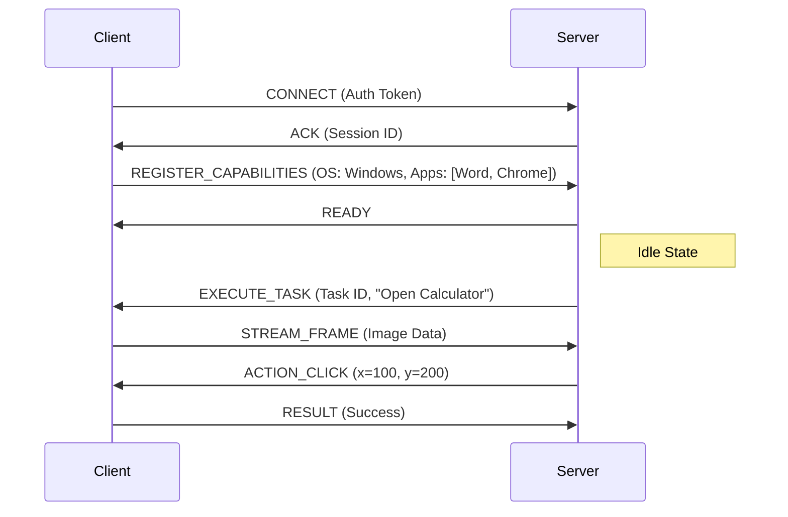

# ALIEN3 Network: Distributed Agent Orchestration

[](https://opensource.org/licenses/MIT)
[]()
[]()

**Architect: Deeven Seru**

---

## 📑 Table of Contents

1.  [Overview](#overview)
2.  [Network Topology](#network-topology)
3.  [Communication Protocol](#communication-protocol)
4.  [The Orion DAG](#the-orion-dag)
5.  [Deployment](#deployment)

---

## 1. Overview

The `network/` module transforms the standalone ALIEN2 engine into **ALIEN3**, a distributed system capable of orchestrating tasks across multiple physical devices.

In a single-device setup, the HostAgent and AppAgent live on the same machine. In the ALIEN3 Network, the logic is decoupled:
*   **The Brain (Server)**: A central node running the heavy LLM inference and state management.
*   **The Body (Client)**: Lightweight agents running on edge devices (laptops, VMs) that execute actions and stream video back to the Brain.

---

## 2. Network Topology

The architecture implements a **Star Topology** where multiple clients connect to a central signaling server.

```mermaid
graph TD
    Server[Central Server (The Brain)]
    ClientA[Client A (Windows Laptop)]
    ClientB[Client B (Linux Server)]
    ClientC[Client C (Mobile Device)]

    Server <-->|WebSocket Stream| ClientA
    Server <-->|WebSocket Stream| ClientB
    Server <-->|WebSocket Stream| ClientC
```

### Components
1.  **Janus Server**: The gateway that manages WebSocket connections. It handles authentication, heartbeat monitoring, and message routing.
2.  **Orion Scheduler**: The distributed task manager. It holds the global state of the "World" and assigns sub-tasks to the most appropriate connected client.

---

## 3. Communication Protocol

We utilize a custom binary protocol over Secure WebSockets (WSS).

### Message Structure
Every packet contains a header and a payload.

*   **Header**: `[Type: 1 byte] [Length: 4 bytes] [Timestamp: 8 bytes]`
*   **Payload**: JSON-serialized command or Binary blob (screenshot).

### Handshake Sequence



---

## 4. The Orion DAG

Tasks in the network are represented as **Directed Acyclic Graphs (DAGs)**.

Example: "Download report from Server A and upload to Server B."

*   **Node 1 (Client A)**: Open Browser -> Download File.
*   **Node 2 (Server)**: Wait for file transfer (simulated or real).
*   **Node 3 (Client B)**: Open FTP -> Upload File.

The Orion Scheduler ensures Node 3 does not start until Node 1 passes. Dependencies are enforced strictly to prevent race conditions in the physical world.

---

## 5. Deployment

### Server Side
```bash
# Start the central orchestrator
python -m network.server.main --port 8080
```

### Client Side
```bash
# Join the network
python -m network.client.main --connect wss://alien-server.com:8080 --key <YOUR_KEY>
```

---
*© 2026 Deeven Seru. All Rights Reserved.*
