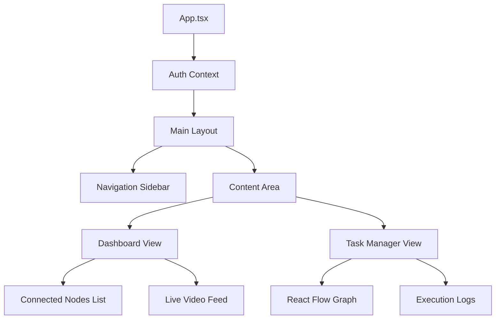

# Network Dashboard: Frontend Architecture

[](https://opensource.org/licenses/MIT)
[]()
[]()

**Architect: Deeven Seru**

---

## 📑 Table of Contents

1.  [Overview](#overview)
2.  [Component Hierarchy](#component-hierarchy)
3.  [State Management](#state-management)
4.  [Development Guide](#development-guide)

---

## 1. Overview

The `webui/frontend` is a Single Page Application (SPA) built with React. It provides a real-time command center for the ALIEN3 Network.

**Key Features:**
*   **Live DAG Visualization**: Watch the Orion Scheduler build and execute task graphs in real-time.
*   **Video Streaming**: Low-latency MJPEG/WebRTC streams from connected "Body" agents.
*   **Interactive Chat**: Operator intervention channel to textually guide the agents.

---

## 2. Component Hierarchy

The application determines the layout based on the connection status.



---

## 3. State Management

We utilize **Zustand** or **Redux Toolkit** (depending on version) for global state.

*   `useSocketStore`: Manages the active WebSocket connection to the Janus Server.
*   `useGraphStore`: Maintains the topology of the current task DAG.
*   `useAgentStore`: Tracks the heartbeat and status of all connected worker nodes.

---

## 4. Development Guide

### Prerequisites
*   Node.js 18+
*   npm / yarn

### Commands
```bash
# Install deps
npm install

# Start Dev Server (Hot Reload)
npm run dev

# Build for Production
npm run build
```

---
*© 2026 Deeven Seru. All Rights Reserved.*
