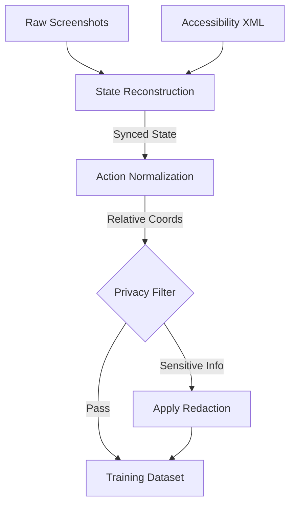

# Record Processor: Learning from Demonstration (LfD)

[](https://opensource.org/licenses/MIT)
[]()

**Architect: Deeven Seru**

---

## 📑 Table of Contents

1.  [Concept](#concept)
2.  [The Processing Pipeline](#the-processing-pipeline)
3.  [Output Formats](#output-formats)
4.  [Usage](#usage)

---

## 1. Concept

The `record_processor/` is the bridge between **Human Action** and **Machine Learning**. It takes raw session logs (screenshots + JSON events) and converts them into structured datasets suitable for fine-tuning Large Action Models (LAMs).

This enables the **"Show, Don't Tell"** workflow:
1.  A human performs a task (e.g., "Submit Expense Report").
2.  ALIEN2 records the session.
3.  `record_processor` converts it into a training example.
4.  The model learns to replicate the behavior.

---

## 2. The Processing Pipeline

The processor performs three critical transformations:



1.  **State Reconstruction**: Aligns asynchronous screenshots with XML accessibility tree dumps to create a synchronized "State" object.
2.  **Action Normalization**: Converts raw coordinates `(x, y)` into element-relative references `(Element Name, Offset)`. This ensures robustness against resolution changes.
3.  **Trace Annotation**: (Optional) Uses GPT-4 to retrospectively generate "Thought" chains explaining *why* the user took a specific action.

---

## 3. Output Formats

The processor supports multiple export targets:

| Format | Extension | Purpose |
| :--- | :--- | :--- |
| **JSONL (Generic)** | `.jsonl` | General purpose data analaysis. |
| **ShareGPT** | `.json` | Instruction tuning for LLaMA/Mistral models. |
| **RAG Vector** | `.pkl` | Ingestion into the `learner/` vector database. |

---

## 4. Usage

To process a batch of sessions:

```bash
python -m record_processor.main --input_dir logs/raw_sessions/ --output_dir datasets/version_1/ --format sharegpt
```

**Common Flags:**
*   `--scrub_pii`: Enable automated redaction of sensitive text.
*   `--annotate`: Use GPT-4 to generate synthetic reasoning traces.

---
*© 2026 Deeven Seru. All Rights Reserved.*
