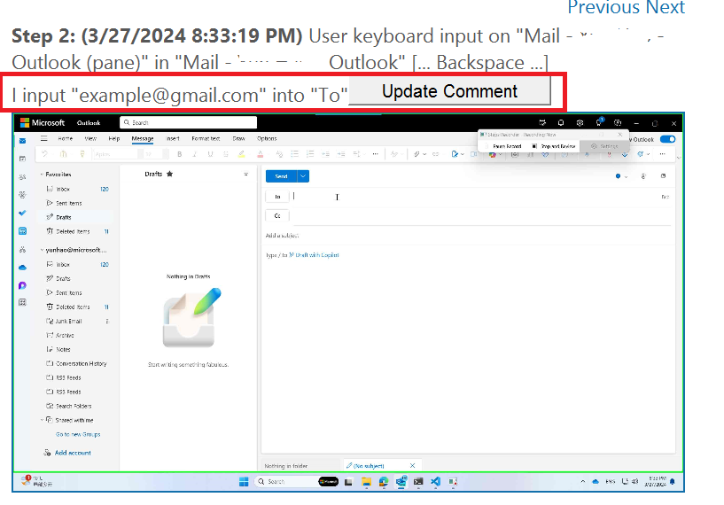

# Enhancing Alien with RAG using User Demonstration

Alien can learn from user-provided demonstrations for specific requests and use them as references in the future when encountering similar tasks. Providing clear demonstrations along with precise requests can significantly enhance Alien's performance.

## Demo ❗
Here's a demo of using user demonstrations to enhance Alien's understanding of user requests. Alien currently could assist users with a wide range of tasks. However, like any AI system, Alien may encounter challenges in accurately interpreting complex user requests.To address this, we demonstrate how Alien leverages user demonstrations to improve its performance over time. By observing and analyzing user interactions, Alien adapts and refines its understanding of user requests, leading to more accurate and efficient assistance.


## How to Enable and Config this Function ❓
You can enable this function by setting the following configuration in the ```Alien/config/config.yaml``` file:
```bash
## RAG Configuration for demonstration
RAG_DEMONSTRATION: True  # Whether to use the RAG from its user demonstration.
RAG_DEMONSTRATION_RETRIEVED_TOPK: 5  # The topk for the offline retrieved documents
RAG_DEMONSTRATION_COMPLETION_N: 3  # The number of completion choices for the demonstration result
```

## How to Prepare Your Demostration  ❓

### Record your steps by Microsoft Steps Recorder

Alien currently support study user trajectories recorded by Steps Recorder app integrated within the Windows. More tools will be supported in the future. 

**Step 1: Record your steps**

You can follow this official guidance to record your steps for a specific request.


**Step 2: Add comments in each step if needed**

Feel free to add any specific details or instructions for Alien to notice by including them in comments. Additionally, since Steps Recorder doesn't capture typed text, if you need to convey any typed content to Alien, please ensure to include it in the comment as well.
<h1 align="center">
     
</h1>


**Step 3: Review and save**

Examine the steps and save them to a ZIP file. You can refer to the [sample_record.zip](./example/sample_record.zip) as an illustration of the recorded steps for a specific request: "sending an email to example@gmail.com to say hi."


## How to Let Alien Study the User Demonstration ❓


Once you have your demonstration record ZIP file ready, you can easily parse it as an example to support RAG for Alien. Follow these steps:

```console
# assume you are in the cloned Alien folder
 python -m record_processor -r <your request for the demonstration> -p <record ZIP file path>
```
Replace `your request for the demonstration` with the specific request, such as "sending an email to example@gmail.com to say hi."
Replace `record ZIP file path` with the full path to the ZIP file you just created.

This command will parse the record and summarize to an execution plan. You'll see the confirmation message as follow:
```
Here are the plans summarized from your demonstration:
Plan [1]
(1) Input the email address 'example@gmail.com' in the 'To' field.
(2) Input the subject of the email. I need to input 'Greetings'.
(3) Input the content of the email. I need to input 'Hello,\nI hope this message finds you well. I am writing to send you a warm greeting and to wish you a great day.\nBest regards.'
(4) Click the Send button to send the email.
Plan [2]
(1) ***
(2) ***
(3) ***
Plan [3]
(1) ***
(2) ***
(3) ***
Would you like to save any one of them as future reference by the agent? press [1] [2] [3] to save the corresponding plan, or press any other key to skip.
```
Press `1` to save it into its memory for furture reference. A sample could be find [here](../vectordb/demonstration/example.yaml).

