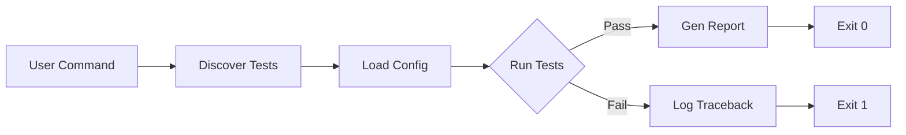

# Configuration Subsystem Tests

[](https://opensource.org/licenses/MIT)
[]()

**Architect: Deeven Seru**

---

## 📑 Table of Contents

1.  [Objective](#objective)
2.  [Test Matrix](#test-matrix)
3.  [Running the Suite](#running-the-suite)

---

## 1. Objective

The configuration subsystem is the backbone of ALIEN2. These tests ensure that:
1.  **Robustness**: The system gracefully handles missing files or malformed YAML.
2.  **Type Safety**: Numeric values are strictly parsed (e.g., `Port: "8080"` -> `8080`).
3.  **Backwards Compatibility**: Migration scripts correctly transform v1 configs to v2.

---

## 2. Test Matrix

| Test Case | ID | Description |
| :--- | :--- | :--- |
| **Loader** | `test_valid_load` | Loads a standard `config.yaml` and asserts values match. |
| **Loader** | `test_missing_file` | Asserts `FileNotFoundError` is raised with helpful message. |
| **Validator** | `test_invalid_types` | Injects string into integer field; asserts validation failure. |
| **Migration** | `test_v1_to_v2` | Inputs legacy config structure; asserts output matches v2 schema. |

---

## 3. Running the Suite

The suite executes following this path:



```bash
# Run only config tests
python -m unittest discover tests/config

# Run with coverage report
coverage run -m unittest discover tests/config
coverage report -m
```

---
*© 2026 Deeven Seru. All Rights Reserved.*
